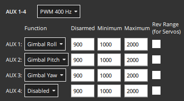

# Конфігурація Gimbal(стабілізатора)

Ця сторінка пояснює, як налаштувати та контролювати стабілізатор, що має приєднану камеру (або будь-який інший вантаж).

## Загальний огляд

PX4 містить універсальний драйвер керування кріпленням/гімбалем, який підтримує різні методи введення та виведення:

- Метод введення визначає протокол, який використовується для керування gimbal mount який керується PX4.
  Це може бути контролер RC, команда MAVLink, надіслана GCS, або обидва — автоматичне перемикання між ними.
- Метод виведення визначає, як PX4 взаємодіє з підключеним гімбалем.
  Рекомендований протокол — MAVLink v2, але ви також можете підключитися безпосередньо до виходного порту шим контролера польоту.

PX4 приймає вхідний сигнал і маршрутизує/перекладає його для відправлення на вивід.
Будь-який метод введення може бути обраний для керування будь-яким виводом.

Як вхід, так і вихід налаштовуються за допомогою параметрів.
The input is set using the parameter [MNT_MODE_IN](../advanced_config/parameter_reference.md#MNT_MODE_IN).
By default this is set to `Disabled (-1)` and the driver does not run.
Після вибору режиму введення перезавантажте транспортний засіб, щоб запустити драйвер кріплення.

You should set `MNT_MODE_IN` to one of: `RC (1)`, `MAVlink gimbal protocol v2 (4)` or `Auto (0)` (the other options are deprecated).
If you select `Auto (0)`, the gimbal will automatically select either RC or or MAVLink input based on the latest input.
Зверніть увагу, що для автоматичного перемикання з MAVLink на RC потрібен великий рух ручкою!

The output is set using the [MNT_MODE_OUT](../advanced_config/parameter_reference.md#MNT_MODE_OUT) parameter.
By default the output is set to a PXM port (`AUX (0)`).
If the [MAVLink Gimbal Protocol v2](https://mavlink.io/en/services/gimbal_v2.html) is supported by your gimbal, you should instead select `MAVLink gimbal protocol v2 (2)`.

The full list of parameters for setting up the mount driver can be found in [Parameter Reference > Mount](../advanced_config/parameter_reference.md#mount).
Нижче наведено відповідні налаштування для декількох поширених конфігурацій гімбалів.

## MAVLink Gimbal (MNT_MODE_OUT=MAVLINK)

Кожен фізичний пристрій гімбала в системі повинен мати свій власний високорівневий менеджер гімбала, який може бути виявлений наземною станцією за допомогою протоколу MAVLink для гімбалів.
The ground station sends high level [MAVLink Gimbal Manager](https://mavlink.io/en/services/gimbal_v2.html#gimbal-manager-messages) commands to the manager of the gimbal it wants to control, and the manager will in turn send appropriate lower level "gimbal device" commands to control the gimbal.

PX4 can be configured as the gimbal manager to control a single gimbal device (which can either be physically connected or be a MAVLink gimbal that implements the [gimbal device interface](https://mavlink.io/en/services/gimbal_v2.html#gimbal-device-messages)).

To enable a MAVLink gimbal, first set parameter [MNT_MODE_IN](../advanced_config/parameter_reference.md#MNT_MODE_IN) to `MAVlink gimbal protocol v2` and [MNT_MODE_OUT](../advanced_config/parameter_reference.md#MNT_MODE_OUT) to `MAVLink gimbal protocol v2`.

The gimbal can be connected to _any free serial port_ using the instructions in [MAVLink Peripherals (GCS/OSD/Companion)](../peripherals/mavlink_peripherals.md) (also see [Serial Port Configuration](../peripherals/serial_configuration.md#serial-port-configuration)).
For example, if the `TELEM2` port on the flight controller is unused you can connect it to the gimbal and set the following PX4 parameters:

- [MAV_1_CONFIG](../advanced_config/parameter_reference.md#MAV_1_CONFIG) to **TELEM2** (if `MAV_1_CONFIG` is already used for a companion computer (say), use `MAV_2_CONFIG`).
- [MAV_1_MODE](../advanced_config/parameter_reference.md#MAV_1_MODE) to **NORMAL**
- [SER_TEL2_BAUD](../advanced_config/parameter_reference.md#SER_TEL2_BAUD) to manufacturer recommended baud rate.

### Підтримка декількох Gimbal

PX4 може автоматично створити менеджер гімбала для підключеного гімбала з PWM або першого пристрою гімбала MAVLink з тим самим ідентифікатором системи, який виявляється на будь-якому інтерфейсі.
Він не автоматично створює менеджер гімбала для будь-яких інших пристроїв гімбала MAVLink, які виявляються.

Ви можете підтримувати додаткові гімбали, забезпечивши, що вони:

- implement the gimbal _manager_ protocol
- Становлять видимими для наземної станції та PX4 у мережі MAVLink.
  Це може вимагати налаштування пересилання трафіку між PX4, НЗП та гімбалем.
- Кожен гімбал повинен мати унікальний ідентифікатор компонента.
  Для гімбала, підключеного за допомогою PWM, це буде ідентифікатор компонента автопілота.

## Gimbal з FC PWM Output (MNT_MODE_OUT=AUX)

The gimbal can also be controlled by connecting it to up to three flight controller PWM ports and setting the output mode to `MNT_MODE_OUT=AUX`.

The output pins that are used to control the gimbal are set in the [Acuator Configuration > Outputs](../config/actuators.md#actuator-outputs) by selecting any three unused Actuator Outputs and assigning them the following output functions:

- `Gimbal Roll`: Output controls gimbal roll.
- `Gimbal Pitch`: Output controls Gimbal pitch.
- `Gimbal Yaw`: Output controls Gimbal yaw.

Наприклад, у вас можуть бути наступні налаштування для призначення кочення, тангажу та рида гімбала на виведення AUX1-3.



The PWM values to use for the disarmed, maximum and minimum values can be determined in the same way as other servo, using the [Actuator Test sliders](../config/actuators.md#actuator-testing) to confirm that each slider moves the appropriate axis, and changing the values so that the gimbal is in the appropriate position at the disarmed, low and high position in the slider.
Значення також можуть бути наведені у документації гімбала.

## SITL

The [Gazebo Classic](../sim_gazebo_classic/index.md) simulation [Typhoon H480 model](../sim_gazebo_classic/vehicles.md#typhoon-h480-hexrotor) comes with a preconfigured simulated gimbal.

Щоб запустити, використовуйте:

```sh
make px4_sitl gazebo-classic_typhoon_h480
```

To just test the [gimbal driver](../modules/modules_driver.md#gimbal) on other models or simulators, make sure the driver runs (using `gimbal start`), then configure its parameters.

## Тестування

Водій забезпечує просту тестову команду.
Наступне описує тестування в SITL, але команди також працюють на реальних пристроях.

Почніть симуляцію з (для цього не потрібно змінювати параметри):

```sh
make px4_sitl gazebo-classic_typhoon_h480
```

Make sure it's armed, eg. with `commander takeoff`, then use the following command to control the gimbal (for example):

```sh
gimbal test yaw 30
```

Note that the simulated gimbal stabilizes itself, so if you send MAVLink commands, set the `stabilize` flags to `false`.


