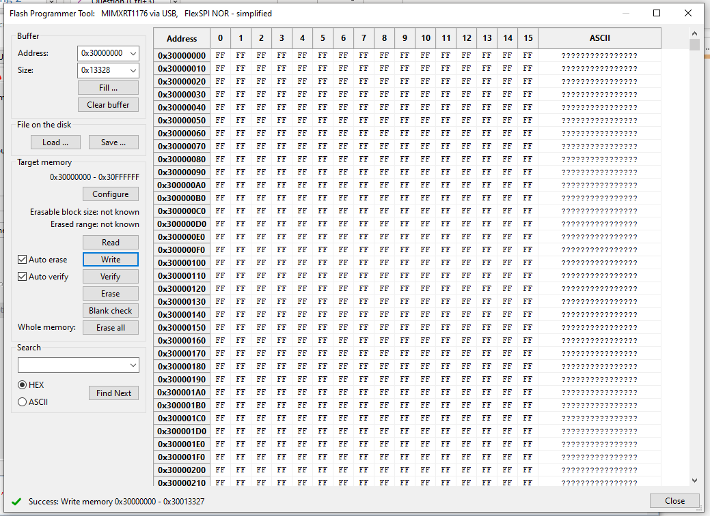

# Bootloader Update Pixhawk V6X-RT via USB

У цій темі пояснюється флеш-завантажувач [Pixhawk FMUv6X-RT](../flight_controller/pixhawk6x-rt.md) через USB _без необхідності перевірки налагодження_.

## Загальний огляд

The _PX4 Bootloader_ is used to load firmware for [Pixhawk boards](../flight_controller/pixhawk_series.md) (PX4FMU, PX4IO).

Контролери Pixhawk зазвичай постачаються з попередньо встановленою відповідною версією завантажувача.
Однак у деяких випадках він може бути відсутнім або може бути присутня старіша версія, яку потрібно оновити.
Також можливо, що пристрій заблоковано, тому пристрій потрібно стерти та встановити новий завантажувач.

Most flight controllers require a Debug probe in order to update the bootloader, as discussed in [Bootloader Update > Debug Probe Bootloader Update](../advanced_config/bootloader_update.md#debug-probe-bootloader-update).
Ви можете використовувати цей підхід для Pixhawk FMUv6X-RT, але якщо у вас немає зонда для налагодження, ви можете скористатися інструкціями, викладеними в цьому розділі.

## Building the PX4 FMUv6X-RT Bootloader

Це можна створити з папки PX4-Autopilot за допомогою команди `make` і спеціальної цілі плати з суфіксом `_bootloader`.
For FMUv6X-RT the command is:

```sh
make px4_fmu-v6xrt_bootloader
```

Це створить двійковий файл завантажувача як `build/px4_fmu-v6xrt_bootloader/px4_fmu-v6xrt_bootloader.bin`, який можна завантажувати через SWD або ISP.
Якщо ви створюєте завантажувач, ви вже повинні бути знайомі з одним із цих варіантів.

Якщо вам потрібен файл HEX замість файлу ELF, використовуйте objcopy:

```sh
arm-none-eabi-objcopy -O ihex build/px4_fmu-v6xrt_bootloader/px4_fmu-v6xrt_bootloader.elf px4_fmu-v6xrt_bootloader.hex
```

## Flashing the bootloader through USB

The Pixhawk V6X-RT comes with a build-in bootloader located on the ROM.
To flash a new bootloader through USB you've got to download the [NXP MCUXpresso Secure Provisioning tool](https://www.nxp.com/design/design-center/software/development-software/mcuxpresso-software-and-tools-/mcuxpresso-secure-provisioning-tool:MCUXPRESSO-SECURE-PROVISIONING).
The tool is available for Windows, Linux and macOS.

1. Install the _MCUXpresso Secure Provisioning_ application and launch the application:

   

2. On first start you have to create a "New Workspace".
   Select `i.mX RT11xx` and then select `MIMXRT1176`

   

3. After creating a "New Workspace" click on the **FlexSPI NOR - simplified** button

   

4. On the _Boot Memory Configuration_ window change the "Device type" to `Macronix Octal DDR` and press **OK**.


1. On the menu bar select **Tools > Flash Programmer**:

   

2. You should get this pop-up indicating the Pixhawk V6X-RT is not in the "ISP bootloader mode".

   

   To get the Pixhawk V6X-RT into "ISP bootloader mode" there are 2 options:

   1. Launch QGC connect the Pixhawk select **Analayze Tools** and then **MAVLINK Console**.
      On the console type `reboot -i`.
      This will put the Pixhawk V6X-RT into "ISP bootloader mode"

      

   2. If the board is bricked and connecting to QGC is not possible you've open the FMUM module and press the BOOT button (circled in red in the picture below) while powering the board.

      

      Press **YES** to launch the _Flash Programmer Tool_.

3. When the Flash Programming has started you get a popup to configure the target memory press **Yes**

   

4. When the Target Memory configuration is succesful you can press the the **Erase All** button

   

5. After erasing the flash press the **Load ...** button and then press the **Browse** button

   

6. Locate the `px4_fmu-v6xrt_bootloader.bin` file and press **Open** and then press on **Load**.

   

7. If the load is successful you should see the "Success: load from file" at the bottom right

   

8. Press the **Write** button to flash the PX4 bootloader


1. On success it should show "Success: Write memory 0x30000000 - 0x3XXXXXXX" Note: values might differ due to bootloader changes.

   

Now unplug the Pixhawk V6X-RT and re-power the board.
Після оновлення завантажувача ви можете [завантажити прошивку PX4](../config/firmware.md) за допомогою _QGroundControl_.
