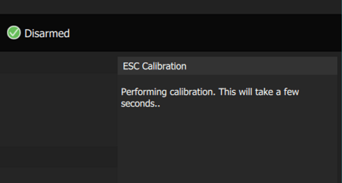

# Калібрування ESC

:::note
Ці інструкції мають значення лише для  [PWM ESCs](../peripherals/pwm_escs_and_servo.md) та  [OneShot ESCs](../peripherals/oneshot.md). [DShot](../peripherals/dshot.md) та [CAN](../can/README.md) ЕР ([DroneCAN](../dronecan/escs.md)/Cyphal) не потребують такої калібрування.
:::

Електронні регулятори обертів (ЕР) регулюють швидкість (і напрямок) обертання моторів на основі вхідної команди від керуючого пристрою політів (КП). Діапазон вхідних команд, на які відповідає ЕР, часто може бути налаштований, і типовий діапазон може відрізнятися навіть між ЕР одного й того ж моделі.

Ця калібрування оновлює всі ЕР з фіксованим максимальним (2000us) та мінімальним (1000us) вхідним сигналом PWM від керуючого пристрою. Після цього всі ЕР/мотори на літальному апараті будуть реагувати на вхід від керуючого пристрою однаковим чином по всьому діапазону вхідних сигналів.

Калібрування за допомогою цього інструменту рекомендується для всіх ЕР, що підтримують цей метод, які використовують PWM або OneShot.

:::note
Калібрування особливо важливе для недорогих ЕР, оскільки вони часто мають значні відмінності в реакції на вхідні сигнали.

Проте його також рекомендується для високоякісних контролерів. Незважаючи на те, що вони заводськи калібруються і всі мають відреагувати однаково, на практиці діапазон вхідних сигналів може відрізнятися. Наприклад, якщо контролер було калібровано вручну після виходу з заводу, він може вже не працювати так само.
:::

:::warning
Якщо ви хочете використовувати ESC, який не підтримує цю калібровку, то він повинен бути заводсько налаштований і реагувати послідовно відразу після вилучення з упаковки. Це слід перевірити за допомогою [Тестування приводів](../config/actuators.md#actuator-testing). Перейдіть до кроку [конфігурації приводу (7)](#actuatorconfig_step) (що все ще важливо).
:::

ESC OneShot слід [налаштувати на використання режиму OneShot](../peripherals/oneshot.md#px4-configuration) перед калібруванням. Ви повинні провести калібрування ESC після переключення, навіть якщо ви вже раніше калібрували їх.

## Передумови

Послідовність калібрування передбачає, що ви зможете тримати під напругою контролер польоту під час ручного вимикання та увімкнення ESC.

If using a Pixhawk flight controller, the recommended way to do this is to separately power the flight controller via USB, and connect/disconnect the battery to power the ESCs when needed. Системи керування польотом, які не можуть живити автопілот через USB, потребуватимуть [іншого підходу](#problem_power_module).

Якщо акумулятор підключений через модуль живлення, процедура калібрування може виявити підключення акумулятора та використовувати його для запуску послідовності калібрування. Якщо жодний акумулятор не виявлено, послідовність калібрування виконується на основі таймаутів.

## Кроки

Для калібрування ЕСК виконайте наступні кроки:

1. Видаліть пропелери.

:::warning
Never attempt ESC calibration with propellers on!

   The motors _should_ not spin during ESC calibration. However if calibration starts when the ESC is already powered, or if the ESC doesn't properly support/detect the calibration sequence, then it will respond to the PWM input by running the motor at maximum speed.
:::

1. Map the ESCs you're calibrating as motors in the vehicle's [Actuator Configuration](../config/actuators.md). Only mapped actuators get an output and only ESCs mapped as motors will be calibrated.

1. Unpower the ESCs by unplugging the battery. The flight controller must stay powered, for example, by keeping the USB connected to the ground station.

1. Open the _QGroundControl_ **Settings > Power**, then press the **Calibrate** button.

   

1. After starting the calibration sequence without error, directly power the ESCs (you should be prompted):

   

   The calibration will begin automatically:

   

1. During the calibration you should hear model-specific beeping from the ESC, which indicates the individual steps of the calibration.

   You will be prompted when the calibration completes.
   

1. Go back to the [Actuator Configuration](../config/actuators.md) section.

   Following ESC calibration all motors with the same (re)calibrated ESCs should behave in the same way for the same inputs. The default PWM settings for motor outputs in the actuator configuration should now work out of the box.

   You need to confirm that the motors do indeed work correctly. Since the default configuration values have been set conservatively, you may also wish to tune them for your particular ESCs.

:::note
The steps below are similar to those described in [Actuator Configuration > Motor Configuration](../config/actuators.md#motor-configuration).
:::

   Перевірте наступні значення:

   - Мінімальне значення для мотора (за замовчуванням: 1100 мкс) повинно забезпечувати повільний, але надійний оберт мотора, а також надійно запускати його після зупинки.

     Ви можете підтвердити, що мотор обертається мінімально (проте без пропелерів) у розділі "Тестування виконавчих пристроїв", увімкнувши повзунки, а потім пересуваючи повзунок виходу тесту для мотора до першого фіксатора знизу. Правильне значення має зробити так, що мотор обертається негайно і надійно при пересуванні повзунка зі стану роззброєності до мінімуму.

     Щоб знайти «оптимальне» мінімальне значення, пересуньте повзунок вниз (режим роззброєності). Потім збільшуйте значення PWM-виходу в режимі `роззброєності` невеликими інкрементами (наприклад, 1025 мкс, 1050 мкс і т. д.), доки мотор не почне надійно обертатися (краще бути трохи вище, ніж трохи нижче). Введіть це значення в параметр «мінімум» для всіх вихідних PWM сигналів мотора, а вихідний сигнал `роззброєності` відновіть до `1100 мкс`.

   - Максимальне значення для мотора (за замовчуванням: `1900 мкс`) слід вибрати так, щоб збільшення значення не зробило мотор обертатися швидше.

     Ви можете підтвердити, що мотор обертається швидко при максимальному значенні у режимі [Тестування приводів](../config/actuators.md#actuator-testing), перемістивши пов'язаний слайдер випробування вверх.

     Щоб знайти "оптимальне" максимальне значення, спочатку перемістіть повзунок вниз (роззброєно). Потім збільште налаштування вихідної потужності PWM `вимкненої` близько до максимального значення за замовчуванням (`1900`) - мотори повинні розганятися. Слухайте тон мотора, коли збільшуєте максимальне значення PWM для виводу поетапно (наприклад, 1925 мкс, 1950 мкс і так далі). Оптимальне значення визначається в той момент, коли звук моторів не змінюється при збільшенні значення виводу. Введіть це значення в параметр `максимум` для всіх виводів ШІМ мотора, а також відновіть значення виводу `знято` на `1100 мкс`.

   - Значення виводу «знято» для мотора (за замовчуванням: `1000 мкс`) повинно зупиняти мотор і залишати його зупиненим.

     Ви можете підтвердити це в розділі [Тестування виконавчих механізмів](../config/actuators.md#actuator-testing), перемістивши слайдер виводу тестування до фіксованого положення у нижній частині слайдера і спостерігаючи, що двигун не обертається.

     Якщо ESC обертається за замовчуванням на значенні 1000 мкс, то ESC не правильно калібрується. Якщо використовуєте ESC, який не може бути калібрований, вам слід зменшити значення виведення ШІМ для виводу до значення, коли мотор більше не обертається (наприклад, 950 мкс або 900 мкс).

   :::note
VTOL і мотори планерів не потребують жодної спеціальної конфігурації PWM.
При встановленні стандартної настройки PWM вони автоматично зупиняться під час польоту при наказі автопілотом.
:::

## Вирішення проблем

1. Калібрування може повідомити про успішне завершення, навіть якщо воно фактично не вдалося.

   Це може статися, якщо ви не вмикаєте ESC у відповідний час або ESC не підтримують калібрування. Це стається тому, що PX4 не отримує зворотного зв'язку від ESC, щоб знати, чи було калібрування успішним. Вам потрібно спиратися на інтерпретацію сигналів під час калібрування та наступних тестів моторів, щоб впевнитися, що калібрування пройшло успішно.

   

1. Калібрування не може бути запущено, якщо у вас налаштований і підключений модуль живлення (з міркувань безпеки).

   Спочатку відключіть живлення до регуляторів обертання. Якщо ви заблоковані через те, що потрібний модуль живлення, щоб зберегти працездатність вашого контролера польоту, але ви можете включати або вимикати регулятори обертання окремо, ви можете тимчасово відключити виявлення модуля живлення лише для калібрування ESC, використовуючи параметри [BATn_SOURCE](../advanced_config/parameter_reference.md#BAT1_SOURCE). Коли модуль живлення, який живить автопілот, більше не виявляється як акумулятор, можлива калібрування на основі часу.

1. PX4 перерве калібрування (з міркувань безпеки), якщо система виявить збільшення споживання струму безпосередньо після початку калібрування. Це потребує модуля живлення.
