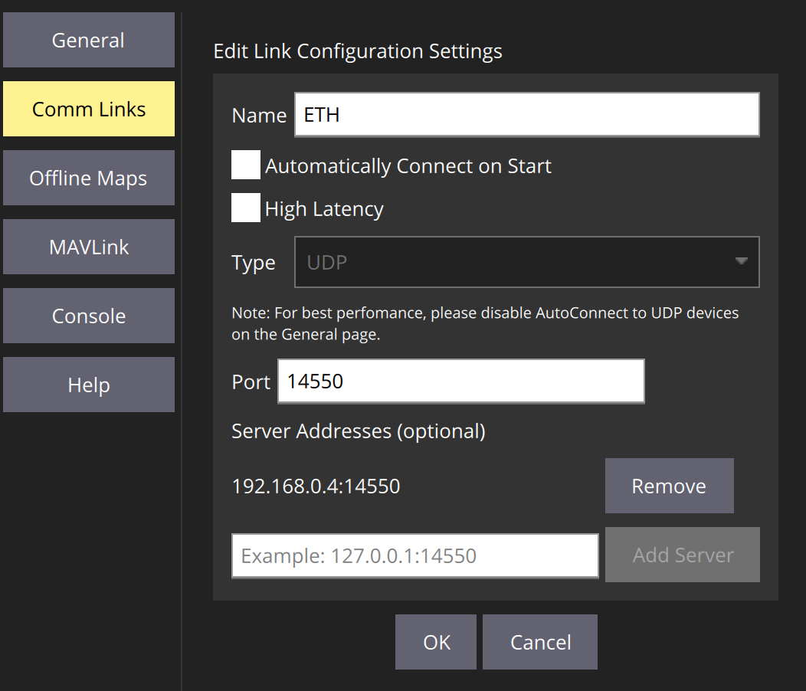

# Налаштування PX4 Ethernet

Підключення через Ethernet надає швидкий, надійний та гнучкий спосіб зв'язку, який може бути альтернативою використанню USB або інших послідовних з'єднань.

Воно може бути використане для підключення до наземних станцій, супутникових комп'ютерів та інших систем MAVLink. Це особливо рекомендується при підключенні до систем, які «природно» використовують Ethernet, наприклад, IP-радіо.

Ця тема охоплює:

- [PX4 Ethernet Налаштування](#px4-ethernet-setup)
  - [Підтримувані контролери польоту](#supported-flight-controllers)
  - [Налаштування мережі Ethernet](#setting-up-the-ethernet-network)
    - [Налаштування мережі PX4 Ethernet](#px4-ethernet-network-setup)
    - [Налаштування мережі Ubuntu Ethernet](#ubuntu-ethernet-network-setup)
    - [Комп’ютер-супутник Налаштування мережі Ethernet](#companion-computer-ethernet-network-setup)
  - [Конфігурація послідовного порту PX4 MAVLink](#px4-mavlink-serial-port-configuration)
  - [Приклад налаштування QGroundControl](#qgroundcontrol-setup-example)
  - [Приклад налаштування MAVSDK-Python](#mavsdk-python-setup-example)
  - [Приклад встановлення ROS 2](#ros-2-setup-example)

## Підтримувані контролери польоту

PX4 підтримує підключення по Ethernet на контролерах польоту [Pixhawk 5X-standard](https://github.com/pixhawk/Pixhawk-Standards/blob/master/DS-011%20Pixhawk%20Autopilot%20v5X%20Standard.pdf) (і пізніше), які мають порт Ethernet. Це також може бути підтримано на інших платах.

Підтримувані автопілоти включають:

- [CUAV Pixhawk V6X](../flight_controller/cuav_pixhawk_v6x.md)
- [Holybro Pixhawk 5X](../flight_controller/pixhawk5x.md)
- [Holybro Pixhawk 6X](../flight_controller/pixhawk6x.md)

## Налаштування мережі Ethernet

Для підключення систем по Ethernet потрібно налаштувати їх на роботу в одній IP-мережі, щоб кожна система мала унікальну IP-адресу та могла знаходити інші системи. Це можна зробити за допомогою DHCP-сервера для призначення адрес або вручну налаштувавши адреси кожної системи в мережі.

Немає єдиної «готової» конфігурації, яку ми можемо надати, яка обов’язково працюватиме у вашій локальній мережі. Therefore as an example of the kind of configuration you might do, below we show how to set up the systems on an IP network with static addresses in the range `10.41.10.Xxx`, where PX4 has a statically allocated address `10.41.10.2` (PX4-default) and the computer has address `10.41.10.1`. Якщо ви хочете підключити компаньйонний комп'ютер або іншу систему до мережі і встановити статичну адресу, ви можете використати подібний підхід.

:::note
Немає нічого «особливого» щодо конфігурації мережі (крім можливо інструментів, які використовуються для зміни налаштувань мережі); вона працює майже так само, як будь-яка домашня або корпоративна мережа.
Тобто, знання про те, як працюють IP-мережі, є дуже бажаним!
:::

### Налаштування мережі PX4 Ethernet

<!-- Information about NuttX network manager: https://github.com/PX4/PX4-Autopilot/pull/16330 -->

PX4 використовує модуль [netman](../modules/modules_system.md#netman) для застосування та оновлення налаштувань мережі.

The default configuration first requests an IP address from DHCP, and if that fails will fallback to the default static address `10.41.10.2`. You can explicitly set any static IP address (including the default address), to bypass the initial DHCP check and make the connection a little faster.

:::note
If you want to use the default static IP address for PX4 you can skip forward to the next section.
:::

Налаштування мережі визначаються у файлі конфігурації `/fs/microsd/net.cfg` на SD-карті. Це текстовий файл, який визначає кожне налаштування на новому рядку у вигляді пари `name=value`. Конфігураційний файл може виглядати так:

```ini
DEVICE=eth0
BOOTPROTO=fallback
IPADDR=10.41.10.2
NETMASK=255.255.255.0
ROUTER=10.41.10.254
DNS=10.41.10.254
```

Де є значення:

- `DEVICE`: Ім'я інтерфейсу. За замовчуванням - `eth0`.
- `BOOTPROTO`: Протокол отримання IP-адреси PX4. Допустимі значення для proto: `dhcp`, `static`, `fallback` (використовуйте DHCP, але переходьте на статичну адресу після певного часу, якщо DHCP не вдалося)
- `IPADDR`: статична IP-адреса (використовується, якщо BOOTPROTO є `статичним` або `резервним`)
- `NETMASK`: Мережна маска
- `ROUTER`: Адреса маршруту за умовчанням.
- `DNS`: Адреса DNS-сервера.

Щоб налаштувати вищезазначену "прикладну" конфігурацію за допомогою _QGroundControl_:

1. Підключіть авіоніку до комп'ютера за допомогою USB-кабелю.
1. Відкрийте **QGroundcontrol > Аналіз інструментів > MAVLink**
1. Введіть команди "like" до наведених нижче у _Консоль MAVLink_ (щоб записати значення у файл конфігурації):

   ```sh
   echo DEVICE=eth0 > /fs/microsd/net.cfg
   echo BOOTPROTO=fallback >> /fs/microsd/net.cfg
   echo IPADDR=10.41.10.2 >> /fs/microsd/net.cfg
   echo NETMASK=255.255.255.0 >>/fs/microsd/net.cfg
   echo ROUTER=10.41.10.254 >>/fs/microsd/net.cfg
   echo DNS=10.41.10.254 >>/fs/microsd/net.cfg
   ```

1. Після встановлення конфігурації мережі можна від’єднати кабель USB.
1. Перезавантажте контролер польоту, щоб застосувати налаштування.

Зверніть увагу, що вищевказана настройка надає контролеру польоту адресу в мережі Ethernet. Вам також потрібно [налаштувати порт Ethernet](#px4-mavlink-serial-port-configuration) для використання MAVLink.

### Налаштування мережі Ubuntu Ethernet

Якщо ви використовуєте Ubuntu для вашої земної станції (або компаньйон-комп'ютера), то ви можете використовувати [netplan](https://netplan.io/) для налаштування мережі.

Нижче ми показуємо, як ви можете записати налаштування у файл конфігурації netplan "`/etc/netplan/01-network-manager-all.yaml`", яке буде працювати в тій же мережі, що і налаштування PX4, наведене вище. Зверніть увагу, що в документації з [netplan](https://netplan.io/) є багато інших [прикладів](https://netplan.io/examples/) та інструкцій.

Для установки Ubuntu комп'ютера:

1. У терміналі створіть та відкрийте конфігураційний файл `netplan`: `/etc/netplan/01-network-manager-all.yaml`. Нижче ми робимо це за допомогою текстового редактора _nano_.

   ```
   sudo nano /etc/netplan/01-network-manager-all.yaml
   ```

1. Скопіюйте та вставте наступну конфігураційну інформацію у файл (зверніть увагу: відступи мають значення!):

   ```
   network:
     version: 2
     renderer: NetworkManager
     ethernets:
         enp2s0:
             addresses:
                 - 10.41.10.1/24
             nameservers:
                 addresses: [10.41.10.1]
             routes:
                 - to: 10.41.10.1
                   via: 10.41.10.1
   ```

   Збережіть і закрийте файл.

1. Застосуйте конфігурацію _netplan_, введіть наступну команду в термінал Ubuntu.

   ```
   sudo netplan apply
   ```

### Комп’ютер-супутник Налаштування мережі Ethernet

Налаштування компаньйонного комп'ютера залежить від операційної системи компаньйонного комп'ютера.

Операційна система Linux може підтримувати `netplan`, у такому разі інструкції будуть такі ж, як вище, але з використанням унікальної IP-адреси.

## Конфігурація послідовного порту PX4 MAVLink

Конфігурація порту Ethernet встановлює властивості _серійного зв'язку_ (яким чином PX4 бачить з'єднання Ethernet). Це включає набір повідомлень MAVLink, які передаються, швидкість передачі даних, UDP-порти, на які може підключатися віддалена система, тощо.

:::info Ви повинні окремо налаштувати IP-адресу PX4 та інші _налаштування мережі_ ([як показано раніше](#px4-ethernet-network-setup)).
:::

PX4 налаштовує серійний порт для підключення до GCS через MAVLink, використовуючи параметри, показані нижче:

| Параметр                                                                         | Значення | Опис                                                              |
| -------------------------------------------------------------------------------- | -------- | ----------------------------------------------------------------- |
| [MAV_2_CONFIG](../advanced_config/parameter_reference.md#MAV_2_CONFIG)         | 1000     | Налаштування Ethernet порту                                       |
| [MAV_2_BROADCAST](../advanced_config/parameter_reference.md#MAV_2_BROADCAST)   | 1        | Трансляція повідомлень `HEARTBEAT`                                |
| [MAV_2_MODE](../advanced_config/parameter_reference.md#MAV_2_MODE)             | 0        | Надіслати «звичайний» набір повідомлень MAVLink (тобто набір GCS) |
| [MAV_2_RADIO_CTL](../advanced_config/parameter_reference.md#MAV_2_RADIO_CTL)   | 0        | Вимкнути програмне регулювання трафіку MAVLink                    |
| [MAV_2_RATE](../advanced_config/parameter_reference.md#MAV_2_RATE)             | 100000   | Налаштування Ethernet порту                                       |
| [MAV_2_REMOTE_PRT](../advanced_config/parameter_reference.md#MAV_2_REMOTE_PRT) | 14550    | Віддалений порт MAVLink 14550 (GCS)                               |
| [MAV_2_UDP_PRT](../advanced_config/parameter_reference.md#MAV_2_UDP_PRT)       | 14550    | Мережевий порт MAVLink 14550 (GCS)                                |

Зазвичай співпрацюючий комп'ютер використовуватиме порт `14540` (замість `14550`) та передаватиме набір повідомлень MAVLink, вказаний у профілі `Onboard`. Ви можете налаштувати це налаштування, змінивши [MAV_2_REMOTE_PRT](../advanced_config/parameter_reference.md#MAV_2_REMOTE_PRT) і [MAV_2_UDP_PRT](../advanced_config/parameter_reference.md#MAV_2_UDP_PRT) на `14540` і [MAV_2_MODE](../advanced_config/parameter_reference.md#MAV_2_MODE) на `2` (На борту). Проте слід зауважити, що це все одно працюватиме, використовуючи профіль GCS.

Для отримання додаткової інформації про налаштування серійного порту MAVLink дивіться [Пристрої MAVLink (GCS/OSD/Супутник)](../peripherals/mavlink_peripherals.md).

## Приклад налаштування QGroundControl

Припускаючи, що ви вже налаштували [мережу Ethernet](#setting-up-the-ethernet-network), щоб ваш комп'ютер земної станції та PX4 працювали в одній мережі, і

Для підключення QGroundControl до PX4 по Ethernet:

1. [Налаштуйте мережу Ethernet](#setting-up-the-ethernet-network)  так, щоб ваш комп'ютер земної станції та PX4 працювали в одній мережі.
1. Підключіть комп'ютер земної станції та PX4 за допомогою кабелю Ethernet.
1. Запустіть QGroundControl та [визначте комунікаційний канал](https://docs.qgroundcontrol.com/master/en/SettingsView/SettingsView.html) (**Налаштування додатка > Канали зв'язку**), вказавши _адресу сервера_ та порт як IP-адресу та порт, призначений в PX4, відповідно.

   Припускаючи, що значення встановлені так, як описано в решті цієї теми, налаштування виглядатиме наступним чином:

   

1. Після цього QGroundControl має підключитися, якщо ви виберете це посилання.

:::info Конфігурація [порту Ethernet PX4](#px4-ethernet-network-setup) не повинна бути потрібною (за замовчуванням вона відповідна для GCS).
:::

## Приклад налаштування MAVSDK-Python

Щоб налаштувати роботу MAVSDK-Python на комп’ютері-супутнику:

1. Щоб налаштувати роботу MAVSDK-Python на комп’ютері-супутнику:
1. Змініть [Конфігурацію порту Ethernet PX4](#px4-ethernet-network-setup) для підключення до комп’ютера-супутника. Ви можете змінити параметри [MAV_2_REMOTE_PRT](../advanced_config/parameter_reference.md#MAV_2_REMOTE_PRT) і [MAV_2_UDP_PRT](../advanced_config/parameter_reference.md#MAV_2_UDP_PRT) на `14540`, а [MAV_2_MODE](../advanced_config/parameter_reference.md#MAV_2_MODE) на `2` (На борту).
1. Дотримуйтесь інструкцій у [MAVSDK-python](https://github.com/mavlink/MAVSDK-Python), щоб установити та використовувати MAVSDK.

   Наприклад, ваш код буде підключатися до PX4 за допомогою:

   ```python
   await drone.connect(system_address="udp://10.41.10.2:14540")
   ```

:::info MAVSDK може підключитися до PX4 за адресою порту `14550`, якщо ви не змінюєте конфігурацію мережевого порту PX4. Проте це не рекомендується, оскільки типова конфігурація оптимізована для зв'язку з наземним контролем (а не компаньйон комп'ютером).
:::

## Приклад встановлення ROS 2

:::info Попередні вимоги:

- У вас є підтримуване апаратне забезпечення автопілота з мікропрограмою PX4, яка включає проміжне програмне забезпечення [uXRCE-DDS](../middleware/uxrce_dds.md). Зауважте, що PX4 версії 1.14 і пізніших за замовчуванням включає необхідний модуль [uxrce_dds_client](../modules/modules_system.md#uxrce-dds-client).
- [ROS 2](../ros2/user_guide.md) has been set up correctly on the companion computer.
- Ви виконали налаштування мережі Ethernet і портів, як описано вгорі цієї сторінки.
:::

Налаштувати ROS 2:

1. Підключіть ваш автопілот і компаньйон комп'ютер за допомогою Ethernet.
2. [Запустіть клієнт uXRCE-DDS на PX4](../middleware/uxrce_dds.md#starting-the-client) вручну або налаштувавши сценарій запуску системи. Note that you must use the IP address of the companion computer and the UDP port on which the agent is listening (the example configuration above sets the companion IP address to `10.41.10.1`, and the agent UDP port is set to `8888` in the next step).
3. [Запустіть агент мікро XRCE-DDS на компаньйонному комп'ютері](../middleware/uxrce_dds.md#starting-the-agent). Наприклад, уведіть наступну команду в термінал, щоб запустити агента, який слухає порт UDP `8888`:

   ```sh
   MicroXRCEAgent udp4 -p 8888
   ```

4. Run a [listener node](../ros2/user_guide.md#running-the-example) in a new terminal to confirm the connection is established:

   ```sh
   source ~/ws_sensor_combined/install/setup.bash
   ros2 launch px4_ros_com sensor_combined_listener.launch.py
   ```

   Якщо все налаштовано правильно, в терміналі повинен відображатися наступний вивід:

   ```sh
   RECEIVED SENSOR COMBINED DATA
   =============================
   ts: 855801598
   gyro_rad[0]: -0.00339938
   gyro_rad[1]: 0.00440091
   gyro_rad[2]: 0.00513893
   gyro_integral_dt: 4997
   accelerometer_timestamp_relative: 0
   accelerometer_m_s2[0]: -0.0324082
   accelerometer_m_s2[1]: 0.0392213
   accelerometer_m_s2[2]: -9.77914
   accelerometer_integral_dt: 4997
   ```

## Дивіться також

- [Отримати базову плату Pixhawk Raspberry Pi CM4 від Holybro, яка спілкується з PX4 ](https://px4.io/get-the-pixhawk-raspberry-pi-cm4-baseboard-by-holybro-talking-with-px4/) (блог px4.io):
  - Урок, який показує, як підключити Pixhawk 6X + Raspberry Pi на базі CM4 через провідний Ethernet.
  - Блог дублює багато матеріалу з цієї теми.
