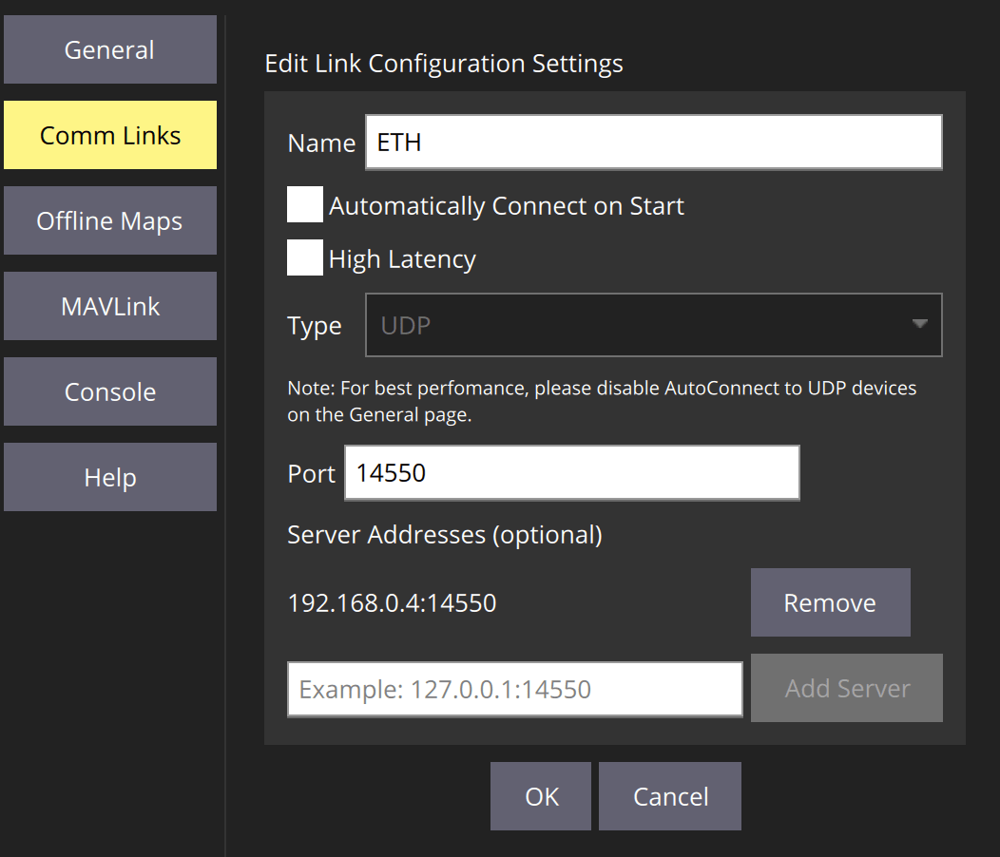

# Налаштування PX4 Ethernet

Підключення через Ethernet надає швидкий, надійний та гнучкий спосіб зв'язку, який може бути альтернативою використанню USB або інших послідовних з'єднань.

Воно може бути використане для підключення до наземних станцій, супутникових комп'ютерів та інших систем MAVLink. Це особливо рекомендується при підключенні до систем, які «природно» використовують Ethernet, наприклад, IP-радіо.

Ця тема охоплює:

- [PX4 Ethernet Setup](#px4-ethernet-setup)
  - [Supported Flight Controllers](#supported-flight-controllers)
  - [Setting up the Ethernet Network](#setting-up-the-ethernet-network)
    - [PX4 Ethernet Network Setup](#px4-ethernet-network-setup)
    - [Ubuntu Ethernet Network Setup](#ubuntu-ethernet-network-setup)
    - [Companion Computer Ethernet Network Setup](#companion-computer-ethernet-network-setup)
  - [PX4 MAVLink Serial Port Configuration](#px4-mavlink-serial-port-configuration)
  - [QGroundControl Setup Example](#qgroundcontrol-setup-example)
  - [MAVSDK-Python Setup Example](#mavsdk-python-setup-example)
  - [ROS 2 Setup Example](#ros-2-setup-example)

## Підтримувані контролери польоту

PX4 підтримує підключення по Ethernet на контролерах польоту [Pixhawk 5X-standard](https://github.com/pixhawk/Pixhawk-Standards/blob/master/DS-011%20Pixhawk%20Autopilot%20v5X%20Standard.pdf) (і пізніше), які мають порт Ethernet. Це також може бути підтримано на інших платах.

Підтримувані автопілоти включають:

- [CUAV Pixhawk V6X](../flight_controller/cuav_pixhawk_v6x.md)
- [Holybro Pixhawk 5X](../flight_controller/pixhawk5x.md)
- [Holybro Pixhawk 6X](../flight_controller/pixhawk6x.md)

## Налаштування мережі Ethernet

Для підключення систем по Ethernet потрібно налаштувати їх на роботу в одній IP-мережі, щоб кожна система мала унікальну IP-адресу та могла знаходити інші системи. Це можна зробити за допомогою DHCP-сервера для призначення адрес або вручну налаштувавши адреси кожної системи в мережі.

There is no single "out of the box configuration" that we can provide that will necessarily work in your local network. Отже, як приклад того, як можна налаштувати системи в IP-мережі зі статичними адресами в діапазоні `192.168.0.Xxx`, де PX4 має статично призначену адресу `192.168.0.4`, а комп'ютер має адресу `192.168.0.1`. If you wanted to connect a companion computer or other system to the network you could use a similar approach to allocate a static address.

:::note
Немає нічого «особливого» щодо конфігурації мережі (крім можливо інструментів, які використовуються для зміни налаштувань мережі); вона працює майже так само, як будь-яка домашня або корпоративна мережа.
Which is to say that a knowledge of how IP networks work is highly desirable!
:::

### PX4 Ethernet Network Setup

<!-- Information about NuttX network manager: https://github.com/PX4/PX4-Autopilot/pull/16330 -->

PX4 використовує модуль [netman](../modules/modules_system.md#netman) для застосування та оновлення налаштувань мережі.

Налаштування мережі визначаються у файлі конфігурації `/fs/microsd/net.cfg` на SD-карті. Це текстовий файл, який визначає кожне налаштування на новому рядку у вигляді пари `name=value`. Конфігураційний файл може виглядати так:

```
DEVICE=eth0
BOOTPROTO=fallback
IPADDR=192.168.0.4
NETMASK=255.255.255.0
ROUTER=192.168.0.254
DNS=192.168.0.254
```

Де є значення:

- `DEVICE`: Interface name. Default is `eth0`.
- `BOOTPROTO`: Protocol for getting PX4 IP address. Valid values for proto are: `dhcp`, `static`, `fallback` (use DHCP but fall back to static address after time, if that fails)
- `IPADDR`: Static IP address (used if BOOTPROTO is `static` or `fallback`)
- `NETMASK`: Network mask
- `ROUTER`: The address of the default route.
- `DNS`: The address of the DNS server.

Щоб налаштувати вищезазначену "прикладну" конфігурацію за допомогою _QGroundControl_:

1. Підключіть авіоніку до комп'ютера за допомогою USB-кабелю.
1. Open **QGroundcontrol > Analyze Tools > MAVLink Console**
1. Enter commands "like" the ones below into the _MAVLink Console_ (to write the values to the configuration file):

   ```sh
   echo DEVICE=eth0 > /fs/microsd/net.cfg
   echo BOOTPROTO=fallback >> /fs/microsd/net.cfg
   echo IPADDR=192.168.0.4 >> /fs/microsd/net.cfg
   echo NETMASK=255.255.255.0 >>/fs/microsd/net.cfg
   echo ROUTER=192.168.0.254 >>/fs/microsd/net.cfg
   echo DNS=192.168.0.254 >>/fs/microsd/net.cfg
   ```

1. Once the network configuration has been set you can disconnect the USB cable.
1. Reboot the flight controller to apply the settings.

Зверніть увагу, що вищевказана настройка надає контролеру польоту адресу в мережі Ethernet. Вам також потрібно [налаштувати порт Ethernet](#px4-mavlink-serial-port-configuration) для використання MAVLink.

### Ubuntu Ethernet Network Setup

Якщо ви використовуєте Ubuntu для вашої земної станції (або компаньйон-комп'ютера), то ви можете використовувати [netplan](https://netplan.io/) для налаштування мережі.

Below we show how you write a setup to the netplan configuration file "`/etc/netplan/01-network-manager-all.yaml`", which would run on the same network as used by the PX4 setup above. Зверніть увагу, що в документації з [netplan](https://netplan.io/) є багато інших [прикладів](https://netplan.io/examples/) та інструкцій.

Для установки Ubuntu комп'ютера:

1. In a terminal, create and open a `netplan` configuration file: `/etc/netplan/01-network-manager-all.yaml` Below we do this using the _nano_ text editor.

   ```
   sudo nano /etc/netplan/01-network-manager-all.yaml
   ```

1. Copy and paste the following configuration information into the file (note: the indentations are important!):

   ```
   network:
     version: 2
     renderer: NetworkManager
     ethernets:
         enp2s0:
             addresses:
                 - 192.168.0.1/24
             nameservers:
                 addresses: [192.168.0.1]
             routes:
                 - to: 192.168.0.1
                   via: 192.168.0.1
   ```

   Збережіть і закрийте файл.

1. Застосуйте конфігурацію _netplan_, введіть наступну команду в термінал Ubuntu.

   ```
   sudo netplan apply
   ```

### Companion Computer Ethernet Network Setup

The setup for a companion computer will depend on the companion computer's operating system.

A Linux operating system may support `netplan`, in which case the instructions would be the same as above, but using a unique IP address.

## PX4 MAVLink Serial Port Configuration

Конфігурація порту Ethernet встановлює властивості _серійного зв'язку_ (яким чином PX4 бачить з'єднання Ethernet). Це включає набір повідомлень MAVLink, які передаються, швидкість передачі даних, UDP-порти, на які може підключатися віддалена система, тощо.

:::note
Ви повинні окремо налаштувати IP-адресу PX4 та інші _налаштування мережі_ ([як показано раніше](#px4-ethernet-network-setup)).
:::

PX4 налаштовує серійний порт для підключення до GCS через MAVLink, використовуючи параметри, показані нижче:

| Параметр                                                                         | Значення | Опис                                                         |
| -------------------------------------------------------------------------------- | -------- | ------------------------------------------------------------ |
| [MAV_2_CONFIG](../advanced_config/parameter_reference.md#MAV_2_CONFIG)         | 1000     | Налаштування Ethernet порту                                  |
| [MAV_2_BROADCAST](../advanced_config/parameter_reference.md#MAV_2_BROADCAST)   | 1        | Broadcast `HEARTBEAT` messages                               |
| [MAV_2_MODE](../advanced_config/parameter_reference.md#MAV_2_MODE)             | 0        | Send the "normal" set of MAVLink messages (i.e. the GCS set) |
| [MAV_2_RADIO_CTL](../advanced_config/parameter_reference.md#MAV_2_RADIO_CTL)   | 0        | Disable software throttling of MAVLink traffic               |
| [MAV_2_RATE](../advanced_config/parameter_reference.md#MAV_2_RATE)             | 100000   | Maximum sending rate                                         |
| [MAV_2_REMOTE_PRT](../advanced_config/parameter_reference.md#MAV_2_REMOTE_PRT) | 14550    | MAVLink Remote Port of 14550 (GCS)                           |
| [MAV_2_UDP_PRT](../advanced_config/parameter_reference.md#MAV_2_UDP_PRT)       | 14550    | MAVLink Network Port of 14550 (GCS)                          |

Зазвичай співпрацюючий комп'ютер використовуватиме порт `14540` (замість `14550`) та передаватиме набір повідомлень MAVLink, вказаний у профілі `Onboard`. You can configure this setup by changing [MAV_2_REMOTE_PRT](../advanced_config/parameter_reference.md#MAV_2_REMOTE_PRT) and [MAV_2_UDP_PRT](../advanced_config/parameter_reference.md#MAV_2_UDP_PRT) to `14540` and [MAV_2_MODE](../advanced_config/parameter_reference.md#MAV_2_MODE) to `2` (Onboard). Проте слід зауважити, що це все одно працюватиме, використовуючи профіль GCS.

Для отримання додаткової інформації про налаштування серійного порту MAVLink дивіться [Пристрої MAVLink (GCS/OSD/Супутник)](../peripherals/mavlink_peripherals.md).

## QGroundControl Setup Example

Припускаючи, що ви вже налаштували [мережу Ethernet](#setting-up-the-ethernet-network), щоб ваш комп'ютер земної станції та PX4 працювали в одній мережі, і

Для підключення QGroundControl до PX4 по Ethernet:

1. [Налаштуйте мережу Ethernet](#setting-up-the-ethernet-network)  так, щоб ваш комп'ютер земної станції та PX4 працювали в одній мережі.
1. Підключіть комп'ютер земної станції та PX4 за допомогою кабелю Ethernet.
1. Запустіть QGroundControl та [визначте комунікаційний канал](https://docs.qgroundcontrol.com/master/en/SettingsView/SettingsView.html) (**Налаштування додатка > Канали зв'язку**), вказавши _адресу сервера_ та порт як IP-адресу та порт, призначений в PX4, відповідно.

   Припускаючи, що значення встановлені так, як описано в решті цієї теми, налаштування виглядатиме наступним чином:

   

1. Після цього QGroundControl має підключитися, якщо ви виберете це посилання.

:::note
Конфігурація [порту Ethernet PX4](#px4-ethernet-network-setup) не повинна бути потрібною (за замовчуванням вона відповідна для GCS).
:::

## MAVSDK-Python Setup Example

To setup MAVSDK-Python running on a companion computer:

1. [Set up the Ethernet Network](#setting-up-the-ethernet-network) so your companion computer and PX4 run on the same network.
1. Modify the [PX4 Ethernet Port Configuration](#px4-ethernet-network-setup) to connect to a companion computer. You might change the parameters [MAV_2_REMOTE_PRT](../advanced_config/parameter_reference.md#MAV_2_REMOTE_PRT) and [MAV_2_UDP_PRT](../advanced_config/parameter_reference.md#MAV_2_UDP_PRT) to `14540`, and [MAV_2_MODE](../advanced_config/parameter_reference.md#MAV_2_MODE) to `2` (Onboard).
1. Follow the instructions in [MAVSDK-python](https://github.com/mavlink/MAVSDK-Python) to install and use MAVSDK.

   Наприклад, ваш код буде підключатися до PX4 за допомогою:

   ```python
   await drone.connect(system_address="udp://192.168.0.4:14540")
   ```

:::note MAVSDK
може підключитися до PX4 за адресою порту `14550`, якщо ви не змінюєте конфігурацію мережевого порту PX4. Проте це не рекомендується, оскільки типова конфігурація оптимізована для зв'язку з наземним контролем (а не компаньйон комп'ютером).
:::

## ROS 2 Setup Example

:::note
Попередні вимоги:

- You have a supported autopilot hardware running PX4 firmware that includes [uXRCE-DDS](../middleware/uxrce_dds.md) middleware. Note that PX4 v1.14 and later include the required [uxrce_dds_client](../modules/modules_system.md#uxrce-dds-client) module by default.
- [ROS 2](../ros/ros2_comm.md) has been set up correctly on the companion computer.
- You have followed the Ethernet network and port setup as discussed at the top of this page.
:::

Налаштувати ROS 2:

1. Підключіть ваш автопілот і компаньйон комп'ютер за допомогою Ethernet.
2. [Start the uXRCE-DDS client on PX4](../middleware/uxrce_dds.md#starting-the-client), either manually or by customizing the system startup script. Note that you must use the IP address of the companion computer and the UDP port on which the agent is listening (the example configuration above sets the companion IP address to `192.168.0.1`, and the agent UDP port is set to `8888` in the next step).
3. [Start the micro XRCE-DDS agent on the companion computer](../middleware/uxrce_dds.md#starting-the-agent). Наприклад, уведіть наступну команду в термінал, щоб запустити агента, який слухає порт UDP `8888`:

   ```sh
   MicroXRCEAgent udp4 -p 8888
   ```

4. Виконайте команду [listener node](../ros/ros2_comm.md#running-the-example) в новому терміналі, щоб підтвердити встановлене з'єднання.

   ```sh
   source ~/ws_sensor_combined/install/setup.bash
   ros2 launch px4_ros_com sensor_combined_listener.launch.py
   ```

   Якщо все налаштовано правильно, в терміналі повинен відображатися наступний вивід:

   ```sh
   RECEIVED SENSOR COMBINED DATA
   =============================
   ts: 855801598
   gyro_rad[0]: -0.00339938
   gyro_rad[1]: 0.00440091
   gyro_rad[2]: 0.00513893
   gyro_integral_dt: 4997
   accelerometer_timestamp_relative: 0
   accelerometer_m_s2[0]: -0.0324082
   accelerometer_m_s2[1]: 0.0392213
   accelerometer_m_s2[2]: -9.77914
   accelerometer_integral_dt: 4997
   ```

## See Also

- [Отримати базову плату Pixhawk Raspberry Pi CM4 від Holybro, яка спілкується з PX4 ](https://px4.io/get-the-pixhawk-raspberry-pi-cm4-baseboard-by-holybro-talking-with-px4/) (блог px4.io):
  - Урок, який показує, як підключити Pixhawk 6X + Raspberry Pi на базі CM4 через провідний Ethernet.
  - Блог дублює багато матеріалу з цієї теми.
