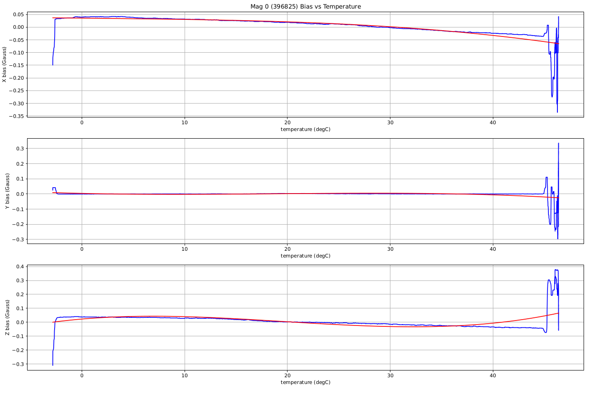

# Термальне калібрування та компенсація

PX4 містить функцію калібрування та компенсації акселерометра, гіроскопа, магнітометра та датчиків барометричного тиску для впливу зміни температури датчика на зміщення датчика.

Ця тема розглядає [середовище тестування](#test_setup) та [процедури калібрування](#calibration_procedures). В кінці надається опис [впровадження](#implementation).

:::note
Після термокалібрування параметри термокалібрування (`TC_*`) використовуються для _всієї_ калібрування/компенсації відповідних датчиків. Отже, будь-яке наступне стандартне калібрування оновить параметри `TC_*`, а не "звичайні" параметри калібрування `SYS_CAL_*` (і в деяких випадках ці параметри можуть бути скинуті).
:::

:::note
Випуски до PX4 v1.14 не підтримують термокалібрування магнітометра.
:::

<a id="test_setup"></a>

## Тестування налаштувань та найкращі практики

[Процедури калібрування](#calibration_procedures), описані в наступних розділах, ідеально виконувати в _камері для навколишнього середовища_ (середовищі з контрольованою температурою та вологістю), оскільки плата нагрівається від найнижчої до найвищої робочої/ температура калібрування. Перед початком калібрування плату спочатку _замочують_ (охолоджують до мінімальної температури та дають їй досягти рівноваги).

:::note
Активні електронагрівальні елементи впливатимуть на значення калібрування магнітометра.
Переконайтеся, що нагрівальні елементи або неактивні, або достатньо далеко від датчика, щоб уникнути введення шуму в калібрування магнітометра.
:::

Для заморожування можна використовувати звичайну домашню морозильну камеру для досягнення температури -20°C, а комерційні морозильні камери можуть досягати температури приблизно -40°C. Дошку слід помістити в пакет з антистатичної плівки або замкнуту у спеціальну сумку з силікагелем, з проводом живлення, який виходить через герметично закриту отвір. Після заморожування пакет можна перемістити до тестового середовища, і тест можна продовжити в тому ж пакеті.

:::note
Мішок / силіка слугує для запобігання конденсації на платі.

:::

Так, можливо провести калібрування без камери комерційного класу. A simple environment container can be created using a styrofoam box with a very small internal volume of air. Це дозволяє автопілоту самостійно нагрівати повітря досить швидко (переконайтеся, що коробка має невелике отвірчик, щоб вирівняти тиск з оточуючим повітрям, але все ж може нагрітися всередині).

За допомогою такого типу установки можна нагріти плату приблизно до 70 °C. Анекдотичні дані свідчать, що багато поширених плат можна нагріти до цієї температури без негативних побічних ефектів. If in doubt, check the safe operating range with your manufacturer.

:::tip
Щоб перевірити статус калібрування вбудованої термічної системи, скористайтеся консоллю MAVlink (або консоллю NuttX), щоб перевірити звітовану внутрішню температуру від датчика.
:::

<a id="calibration_procedures"></a>

## Принципи калібрування

PX4 підтримує два процедури калібрування:

- [onboard](#onboard_calibration) - калібрування запускається на самій платі. Цей метод вимагає знань про те, наскільки можливе підвищення температури з використанням тестового устаткування.
- [offboard](#offboard_calibration) - компенсаційні параметри обчислюються на розробницькому комп'ютері на основі інформації журналу, зібраної під час процедури калібрування. Цей метод дозволяє користувачам візуально перевіряти якість даних та підгонку кривої.

Підхід offboard є складнішим і повільнішим, але вимагає менше знань про тестове обладнання і є легше перевірити.

<a id="onboard_calibration"></a>

### Onboard Calibration Procedure

Онбордне калібрування виконується повністю на пристрої. Для цього потрібно мати уявлення про те, наскільки можна підвищити температуру за допомогою тестового обладнання.

To perform and onboard calibration:

1. Ensure the frame type is set before calibration, otherwise calibration parameters will be lost when the board is setup.
2. Power the board and set the `SYS_CAL_*` parameters to 1 to enable calibration of the required sensors at the next startup. [^1]
3. Set the [SYS_CAL_TDEL](../advanced_config/parameter_reference.md#SYS_CAL_TDEL) parameter to the number of degrees of temperature rise required for the onboard calibrator to complete. If this parameter is too small, then the calibration will complete early and the temperature range for the calibration will not be sufficient to compensate when the board is fully warmed up. If this parameter is set too large, then the onboard calibrator will never complete. allowance should be made for the rise in temperature due to the boards self heating when setting this parameter. If the amount of temperature rise at the sensors is unknown, then the off-board method should be used.
4. Set the [SYS_CAL_TMIN](../advanced_config/parameter_reference.md#SYS_CAL_TMIN) parameter to the lowest temperature data that you want the calibrator to use. This enables a lower cold soak ambient temperature to be used to reduce the cold soak time whilst maintaining control over the calibration minimum temperature. The data for a sensor will not be used by the calibrator if it is below the value set by this parameter.
5. Set the [SYS_CAL_TMAX](../advanced_config/parameter_reference.md#SYS_CAL_TMAX) parameter to the highest starting sensor temperature that should be accepted by the calibrator. If the starting temperature is higher than the value set by this parameter, the calibration will exit with an error. Note that if the variation in measured temperature between different sensors exceeds the gap between `SYS_CAL_TMAX` and `SYS_CAL_TMIN`, then it will be impossible for the calibration to start.
6. Remove power and cold soak the board to below the starting temperature specified by the `SYS_CAL_TMIN` parameter. Note that there is a 10 second delay on startup before calibration starts to allow any sensors to stabilise and the sensors will warm internally during this period.
7. Keeping the board stationary[^2], apply power and warm to a temperature high enough to achieve the temperature rise specified by the `SYS_CAL_TDEL` parameter. The completion percentage is printed to the system console during calibration. [^3]
8. When the calibration completes, remove power, allow the board to cool to a temperature that is within the calibration range before performing the next step.
9. Perform a 6-point accel calibration via the system console using `commander calibrate accel` or via _QGroundControl_. If the board is being set-up for the first time, the gyro and magnetometer calibration will also need to be performed.
10. Після калібрування датчиків до політів завжди потрібно перезавантажити плату, оскільки раптові зміни зміщень від калібрування можуть спотворити навігаційний оцінювач, і деякі параметри не завантажуються алгоритмами, які використовують їх, до наступного запуску.

<a id="offboard_calibration"></a>

### Offboard Calibration Procedure

Виносне калібрування виконується на комп’ютері розробки з використанням даних, зібраних під час випробування калібрування. Виносне калібрування виконується на комп’ютері розробки з використанням даних, зібраних під час випробування калібрування.

To perform an offboard calibration:

1. Ensure the frame type is set before calibration, otherwise calibration parameters will be lost when the board is setup.
1. Power up the board and set the [TC_A_ENABLE](../advanced_config/parameter_reference.md#TC_A_ENABLE), [TC_B_ENABLE](../advanced_config/parameter_reference.md#TC_B_ENABLE), [TC_G_ENABLE](../advanced_config/parameter_reference.md#TC_G_ENABLE), and [TC_M_ENABLE](../advanced_config/parameter_reference.md#TC_M_ENABLE) parameters to `1`.
1. Set all [CAL_ACC\*](../advanced_config/parameter_reference.md#CAL_ACC0_ID), [CAL_GYRO\*](../advanced_config/parameter_reference.md#CAL_GYRO0_ID), [CAL_MAG\*](../advanced_config/parameter_reference.md#CAL_MAG0_ID), and [CAL_BARO\*](../advanced_config/parameter_reference.md#CAL_BARO0_ID) parameters to defaults.
1. Set the [SDLOG_MODE](../advanced_config/parameter_reference.md#SDLOG_MODE) parameter to 2 to enable logging of data from boot.
1. Set the [SDLOG_PROFILE](../advanced_config/parameter_reference.md#SDLOG_PROFILE) checkbox for _thermal calibration_ (bit 2) to log the raw sensor data required for calibration.
1. Cold soak the board to the minimum temperature it will be required to operate in.
1. [^3]
1. Remove power and extract the .ulog file.
1. Open a terminal window in the **Firmware/Tools** directory and run the python calibration script:

   ```sh
   python process_sensor_caldata.py <full path name to .ulog file>
   ```

   This will generate a **.pdf** file showing the measured data and curve fits for each sensor, and a **.params** file containing the calibration parameters.

1. Увімкніть плату, підключіть _QGroundControl_ та завантажте параметри зі створеного файлу **.params** на плату за допомогою _QGroundControl_. Due to the number of parameters, loading them may take some time.
1. After parameters have finished loading, set `SDLOG_MODE` to 1 to re-enable normal logging and remove power.
1. Power the board and perform a normal accelerometer sensor calibration using _QGroundControl_. It is important that this step is performed when board is within the calibration temperature range. Після цього кроку плата повинна бути знову увімкнена перед польотом, оскільки раптові зміни зміщення можуть налякати оцінювач навігації, і деякі параметри не завантажуються алгоритмами, що використовують їх, до наступного запуску.

<a id="implementation"></a>

## Деталі реалізації

Калібрування відноситься до процесу зміни датчиків через діапазон внутрішніх температур, і виконання полінома відповідно до даних для обчислення набору коефіцієнтів (збережених як параметри), що може бути використане для виправлення даних датчика. Компенсація відноситься до процесу використання внутрішньої температури для обчислення зсуву, яке віднімається від читача датчика для виправлення температури

Зміщення датчиків акселерометра, гірометра обчислюється, використовуючи многочлен третього порядку, тоді як зсув з барометричного тиску розраховується з використанням многочлена 5-го порядку. Приклад переходів відображається нижче:





### Calibration Parameter Storage

З існуючою реалізацією системи параметрів ми обмежені збереженням кожного значення в структурі як окремого запису. Щоб обійти це обмеження, для [параметрів теплової компенсації](../advanced_config/parameter_reference.md#thermal-compensation) використовується така логічна домовленість про найменування:

```sh
TC_[type][instance]_[cal_name]_[axis]
```

Де:

- `type`: is a single character indicating the type of sensor where `A` = accelerometer, `G` = rate gyroscope, `M` = magnetometer, and `B` = barometer.
- `instance`: is an integer 0,1 or 2 allowing for calibration of up to three sensors of the same `type`.
- `cal_name`: is a string identifying the calibration value. It has the following possible values:

  - `Xn`: Polynomial coefficient where n is the order of the coefficient, e.g. `X3 * (temperature - reference temperature)**3`.
  - `SCL`: scale factor.
  - `TREF`: reference temperature (deg C).
  - `TMIN`: minimum valid temperature (deg C).
  - `TMAX`: maximum valid temperature (deg C).

- `axis`: is an integer 0,1 or 2 indicating that the calibration data is for X,Y or Z axis in the board frame of reference. For the barometric pressure sensor, the `axis` suffix is omitted.

Examples:

- [TC_A1_TREF](../advanced_config/parameter_reference.md#TC_A1_TREF) is the reference temperature for the second accelerometer.
- [TC_G0_X3_0](../advanced_config/parameter_reference.md#TC_G0_X3_0) is the `^3` coefficient for the first gyro x-axis.

### Calibration Parameter Usage

Корекція теплового зсуву (за допомогою параметрів калібрування) виконується в [модулі датчиків](../modules/modules_system.md#sensors). Еталонна температура віднімається від виміряної температури, щоб отримати дельта-температуру, де:

```
delta = measured_temperature - reference_temperature
```

The delta temperature is then used to calculate a offset, where:

```
offset = X0 + X1*delta + X2*delta**2 + ... + Xn*delta**n
```

Зсув і температурний масштабний коефіцієнт потім використовуються для корекції вимірювання датчика, де:

```
corrected_measurement = (raw_measurement - offset) * scale_factor
```

Якщо температура перевищує тестовий діапазон, установлений параметрами `*_TMIN` і `*_TMAX`, тоді виміряна температура буде обрізана, щоб залишатися в межах.

Корекція даних акселерометра, гіроскопа, магнітометра або барометра вмикається, налаштувавши [TC_A_ENABLE](../advanced_config/parameter_reference.md#TC_A_ENABLE), [TC_G_ENABLE](../advanced_config/parameter_reference.md#TC_G_ENABLE), [TC_M_ENABLE](../advanced_config/parameter_reference.md#TC_M_ENABLE) або [TC_B_ENABLE](../advanced_config/parameter_reference.md#TC_B_ENABLE) параметри до 1 відповідно.

### Compatibility with legacy `CAL_*` parameters and commander controlled calibration

Застаріле калібрування гіроскопа й датчика акселерометра PX4 із температурним агностиком виконується модулем керування та передбачає налаштування зміщення, а у випадку калібрування акселерометра — параметрів калібрування масштабного коефіцієнта. Параметри зсуву та масштабного коефіцієнта застосовуються в драйвері для кожного датчика. Ці параметри знаходяться в [групі параметрів CAL](../advanced_config/parameter_reference.md#sensor-calibration).

Калібрування бортової температури контролюється модулем подій, а виправлення застосовуються в модулі датчиків перед тим, як буде опубліковано тему комбінованого датчика uORB. Це означає, що якщо використовується термокомпенсація, для всіх відповідних попередніх параметрів зміщення та масштабного коефіцієнта потрібно встановити значення за замовчуванням нуль і одиницю перед виконанням теплового калібрування. Якщо виконується вбудоване калібрування температури, це буде зроблено автоматично, однак якщо виконується зовнішнє калібрування, важливо, щоб застарілі параметри `CAL*OFF` і `CAL*SCALE` параметри потрібно скинути перед реєстрацією даних калібрування.

Якщо термокомпенсацію прискорення було ввімкнено шляхом встановлення параметра `TC_A_ENABLE` на 1, тоді контрольоване 6-точковим калібруванням прискорення все ще можна виконати. Однак замість налаштування параметрів `*OFF` і `*SCALE` у групі параметрів `CAL` ці параметри встановлюються за замовчуванням, а теплова компенсація < Натомість налаштовуються параметри `X0` та `SCL`.

Якщо теплову компенсацію гіроскопа було ввімкнено шляхом встановлення параметра `TC_G_ENABLE` на 1, тоді контрольоване калібрування гіроскопа, кероване командиром, усе ще можна виконувати, однак воно використовуватиметься для зміщення кривої компенсації вгору або вниз на необхідну величину до нуля зміщення кутової швидкості. Це досягається шляхом регулювання коефіцієнтів X0.

Якщо термокомпенсацію магнітометра було ввімкнено шляхом установлення параметра `TC_M_ENABLE` на 1, тоді контрольоване 6-точковим калібруванням прискорення все ще можна виконати. Однак замість налаштування параметрів `*OFF` і `*SCALE` у групі параметрів `CAL` ці параметри встановлюються за замовчуванням, а теплова компенсація < Натомість налаштовуються параметри `X0` та `SCL`.

### Обмеження

Припустимо, що масштабні фактори незмінні температури внаслідок труднощів, пов'язаних з вимірюванням їх за різних температур. Це обмежує корисність калібрування акселерометра в цих сенсорних моделях з факторами стабільного масштабу. Виносне калібрування виконується на комп’ютері розробки з використанням даних, зібраних під час випробування калібрування. Через складність інтеграції необхідного руху дошки з алгоритмом калібрування ця можливість не включена.

---

[^1]: Параметри [SYS_CAL_ACCEL](../advanced_config/parameter_reference.md#SYS_CAL_ACCEL), [SYS_CAL_BARO](../advanced_config/parameter_reference.md#SYS_CAL_BARO) та [SYS_CAL_GYRO](../advanced_config/parameter_reference.md#SYS_CAL_GYRO) скидаються до 0 після початку калібрування.
[^2]: Для калібрування зсувів датчика барометричного тиску потрібен стабільний тиск повітря. Тиск повітря змінюватиметься повільно через погоду, а всередині будівель може швидко змінюватися через коливання зовнішнього вітру та роботу системи ОВК.
[^3]: Слід бути обережним під час нагрівання холодної дошки, щоб уникнути утворення конденсату на дошці, який за певних обставин може спричинити її пошкодження.
