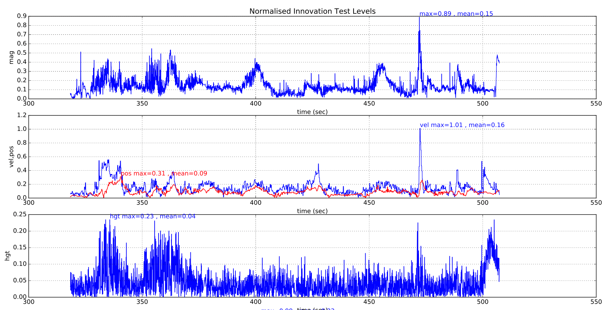
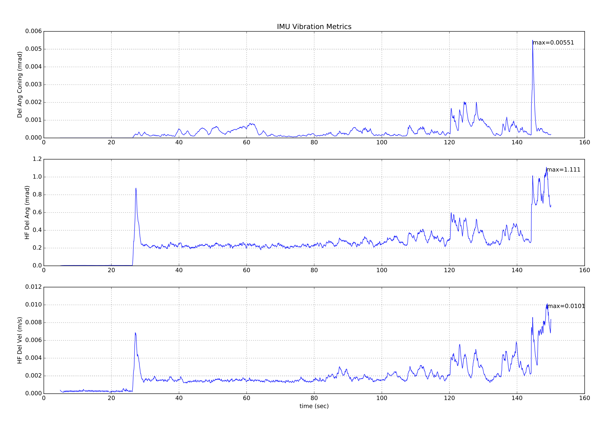
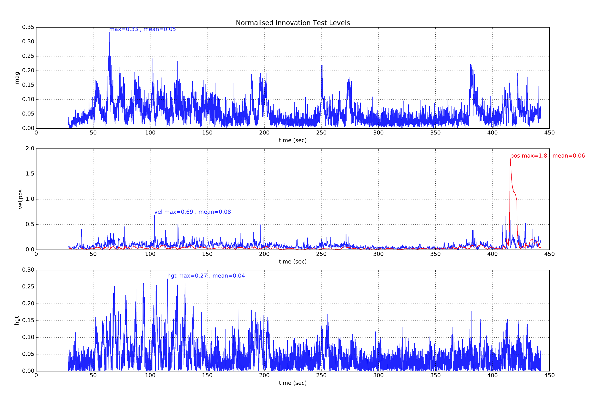
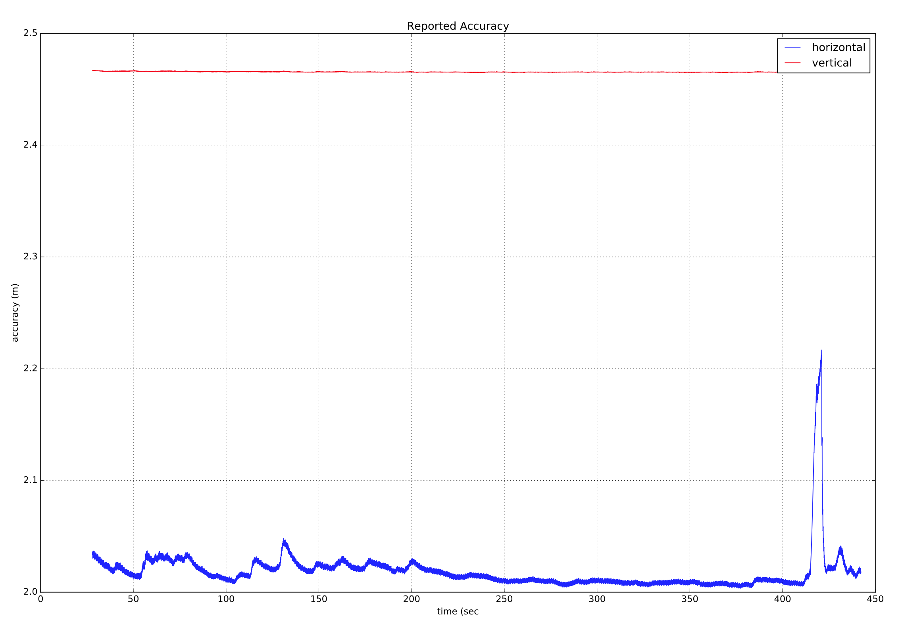
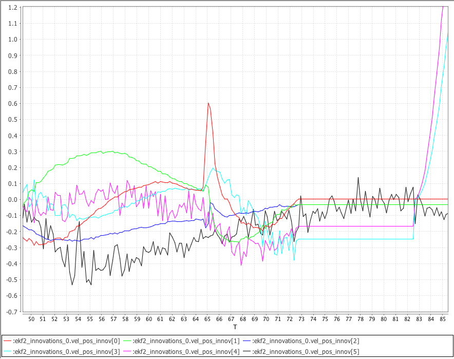

# Використання ECL EKF

Цей підручник відповідає на поширені запитання щодо використання алгоритму ECL EKF.

:::tip
The [PX4 State Estimation Overview](https://youtu.be/HkYRJJoyBwQ) video from the _PX4 Developer Summit 2019_ (Dr. Paul Riseborough) provides an overview of the estimator, and additionally describes both the major changes from 2018/2019, and the expected improvements through 2020.
:::

## Що таке ECL EKF?

Бібліотека оцінок і керування (ECL) використовує алгоритм розширеного фільтра Калмана (EKF) для обробки вимірювань датчиків і надання оцінки таких станів:

- Кватерніон, який визначає обертання від локальної земельної системи координат Північ, Схід, Вниз до тіла в системі координат X, Y, Z
- Швидкість в IMU - Північ, Схід, Вниз (м/с)
- Положення в IMU - Північ, Схід, Вниз (м)
- Оцінки зміщення кута дельти IMU - X, Y, Z (рад)
- Оцінки зміщення швидкості дельти IMU - X, Y, Z (м/с)
- Компоненти земного магнітного поля - Північ, Схід, Вниз (гаусс)
- Зміщення магнітного поля тіла транспортного засобу - X, Y, Z (гаусс)
- Швидкість вітру - північний, східний \(м/с\)

EKF працює зі затримкою 'горизонту злиття часу', щоб дозволити різним затримкам часу для кожного вимірювання відносно ІМП.
Дані для кожного датчика зберігаються у буфері FIFO та забираються з буфера ЕКФ для використання в потрібний час.
The delay compensation for each sensor is controlled by the [EKF2\_\*\_DELAY](../advanced_config/parameter_reference.md#ekf2) parameters.

Для передачі станів від "горизонту злиття" до поточного часу використовується доповнювальний фільтр за допомогою буферизованих даних ІМУ.
The time constant for this filter is controlled by the [EKF2_TAU_VEL](../advanced_config/parameter_reference.md#EKF2_TAU_VEL) and [EKF2_TAU_POS](../advanced_config/parameter_reference.md#EKF2_TAU_POS) parameters.

:::info
The 'fusion time horizon' delay and length of the buffers is determined by the largest of the `EKF2_*_DELAY` parameters.
Якщо датчик не використовується, рекомендується встановити для нього затримку часу на рівні нуля.
Зменшення затримки "горизонту злиття" зменшує помилки в доповнювальному фільтрі, що використовується для передачі станів до поточного часу.
:::

Стани положення та швидкості налаштовуються з урахуванням зсуву між IMU та каркасом тіла перед тим, як вони виводяться на контури керування.
The position of the IMU relative to the body frame is set by the `EKF2_IMU_POS_X,Y,Z` parameters.

ЕКФ використовує дані ІМУ лише для передбачення стану. Дані ІМУ не використовуються як спостереження при похідництві ЕКФ.
The algebraic equations for the covariance prediction, state update and covariance update were derived using the Matlab symbolic toolbox and can be found here: [Matlab Symbolic Derivation](https://github.com/PX4/PX4-ECL/blob/master/EKF/matlab/scripts/Terrain%20Estimator/GenerateEquationsTerrainEstimator.m).

## Запуск одного EKF екземпляра

The _default behaviour_ is to run a single instance of the EKF.
У цьому випадку вибір датчиків та аварійне переключення виконуються до того, як дані надходять до EKF.
Це забезпечує захист від обмеженої кількості несправностей датчиків, таких як втрата даних, але не захищає від ситуацій, коли датчик надає неточні дані, які перевищують можливості ЕКФ та контрольних циклів компенсувати.

Налаштування параметрів для запуску окремого екземпляра EKF:

- [EKF2_MULTI_IMU](../advanced_config/parameter_reference.md#EKF2_MULTI_IMU) = 0
- [EKF2_MULTI_MAG](../advanced_config/parameter_reference.md#EKF2_MULTI_MAG) = 0
- [SENS_IMU_MODE](../advanced_config/parameter_reference.md#SENS_IMU_MODE) = 1
- [SENS_MAG_MODE](../advanced_config/parameter_reference.md#SENS_MAG_MODE) = 1

## Запуск кількох екземплярів EKF

Залежно від кількості ІМП та магнітометрів і потужності ЦП автопілота, може бути запущено декілька екземплярів EKF.
Це забезпечує захист від більш широкого спектру помилок датчиків і досягається за рахунок використання кожним екземпляром EKF різної комбінації датчиків.
Порівнюючи внутрішню узгодженість кожного екземпляра EKF, селектор EKF може визначити комбінацію EKF та датчиків з найкращою узгодженістю даних.
Це дозволяє виявляти та ізолювати несправності, такі як раптові зміни в зміщенні ІМП, насичення або застрягання даних.

The total number of EKF instances is the product of the number of IMU's and number of magnetometers selected by [EKF2_MULTI_IMU](../advanced_config/parameter_reference.md#EKF2_MULTI_IMU) and [EKF2_MULTI_MAG](../advanced_config/parameter_reference.md#EKF2_MULTI_MAG) and is given by the following formula:

> N_instances = MAX([EKF2_MULTI_IMU](../advanced_config/parameter_reference.md#EKF2_MULTI_IMU) , 1) x MAX([EKF2_MULTI_MAG](../advanced_config/parameter_reference.md#EKF2_MULTI_MAG) , 1)

Наприклад, автопілот з 2 ймовірними утилітами та 2 магнітометрами може працювати з EKF2_MULTI_IMU = 2 та EKF2_MULTI_MAG = 2 для загальної кількості 4 екземплярів EKF, де кожен екземпляр використовує наступну комбінацію датчиків:

- Екземпляр EKF 1: IMU 1, магнітометр 1
- Екземпляр EKF 2: IMU 1, магнітометр 2
- Екземпляр EKF 3: IMU 2, магнітометр 1
- Екземпляр EKF 4: IMU 2, магнітометр 2

Максимальна кількість ймовірних утиліт або магнітометрів, які можуть бути оброблені, становить 4 кожен для теоретичного максимуму 4 x 4 = 16 екземплярів EKF.
На практиці це обмежено наявними обчислювальними ресурсами.
Під час розробки цієї функції тестування з центральним процесором STM32F7 показало, що 4 екземпляри EKF мають прийнятне навантаження обробки та використання пам'яті.

:::warning
Ground based testing to check CPU and memory utilisation should be performed before flying.
:::

If [EKF2_MULTI_IMU](../advanced_config/parameter_reference.md#EKF2_MULTI_IMU) >= 3, then the failover time for large rate gyro errors is further reduced because the EKF selector is able to apply a median select strategy for faster isolation of the faulty IMU.

Налаштування для декількох екземплярів EKF контролюються наступними параметрами:

- [SENS_IMU_MODE](../advanced_config/parameter_reference.md#SENS_IMU_MODE):
  Set to 0 if running multiple EKF instances with IMU sensor diversity, ie [EKF2_MULTI_IMU](../advanced_config/parameter_reference.md#EKF2_MULTI_IMU) > 1.

  Коли встановлено на 1 (за замовчуванням для роботи з одним EKF), модуль датчика вибирає дані IMU, що використовуються EKF.
  Це забезпечує захист від втрати даних від датчика, але не захищає від поганих даних датчика.
  Коли встановлено на 0, модуль датчика не робить вибір.

- [SENS_MAG_MODE](../advanced_config/parameter_reference.md#SENS_MAG_MODE):
  Set to 0 if running multiple EKF instances with magnetometer sensor diversity, ie [EKF2_MULTI_MAG](../advanced_config/parameter_reference.md#EKF2_MULTI_MAG) > 1.

  Коли встановлено на 1 (за замовчуванням для роботи з одним EKF), модуль датчика вибирає дані магнітометра, що використовуються EKF.
  Це забезпечує захист від втрати даних від датчика, але не захищає від поганих даних датчика.
  Коли встановлено на 0, модуль датчика не робить вибір.

- [EKF2_MULTI_IMU](../advanced_config/parameter_reference.md#EKF2_MULTI_IMU):
  This parameter specifies the number of IMU sensors used by the multiple EKF's.
  If `EKF2_MULTI_IMU` <= 1, then only the first IMU sensor will be used.
  When [SENS_IMU_MODE](../advanced_config/parameter_reference.md#SENS_IMU_MODE) = 1, this will be the sensor selected by the sensor module.
  If `EKF2_MULTI_IMU` >= 2, then a separate EKF instance will run for the specified number of IMU sensors up to the lesser of 4 or the number of IMU's present.

- [EKF2_MULTI_MAG](../advanced_config/parameter_reference.md#EKF2_MULTI_MAG):
  This parameter specifies the number of magnetometer sensors used by the multiple EKF's
  If `EKF2_MULTI_MAG` <= 1, then only the first magnetometer sensor will be used.
  When [SENS_MAG_MODE](../advanced_config/parameter_reference.md#SENS_MAG_MODE) = 1, this will be the sensor selected by the sensor module.
  If `EKF2_MULTI_MAG` >= 2, then a separate EKF instance will run for the specified number of magnetometer sensors up to the lesser of 4 or the number of magnetometers present.

:::info
The recording and [EKF2 replay](../debug/system_wide_replay.md#ekf2-replay) of flight logs with multiple EKF instances is not supported.
To enable recording for EKF replay you must set the parameters to enable a [single EKF instance](#running-a-single-ekf-instance).
:::

## Які датчики вимірювань він використовує?

EKF має різні режими роботи, які дозволяють використовувати різні комбінації вимірювань датчиків.
Під час запуску фільтр перевіряє мінімально можливу комбінацію датчиків, і після завершення початкового вирівнювання кута нахилу, кута розвороту та висоти, входить у режим, що забезпечує оцінки обертання, вертикальної швидкості, вертикального положення, зміщення кута та швидкості IMU.

Цей режим потребує даних від IMU, джерела кута розвороту (магнітометра або зовнішнього бачення) та джерела даних про висоту.
Цей мінімальний набір даних потрібний для всіх режимів роботи EKF. Інші дані датчика можуть бути використані для оцінки додаткових станів.

### IMU

- Дані з трьох вісей Imu (дельта кута та дельта швидкості), закріплені на тілі, мінімум з частотою 100 Гц.
  Примітка: Корекції конінга мають бути застосовані до даних дельта кута IMU перед їх використанням EKF.

### Магнітометр

Дані магнітометра, закріплені на тілі (або дані положення зовнішньої системи бачення), мінімум з частотою 5 Гц, необхідні.

Дані магнітометра можна використовувати двома способами:

- Вимірювання магнітометра перетворюються в кут розвороту за допомогою оцінки нахилу та магнітного нахилу.
  Кут розвороту потім використовується як спостереження для EKF.
  - Цей метод менш точний і не дозволяє вивчити зміщення поля тіла, однак він більш стійкий до магнітних аномалій і великих початкових зміщень гіроскопа.
  - Це метод, який використовується за замовчуванням під час запуску і на землі.
- Вимірювання магнітометра XYZ використовуються як окремі спостереження.
  - Цей метод більш точний, але вимагає правильної оцінки зміщень магнітометра.
    - Зміщення спостерігаються під час обертання дрону, а справжній кут розвороту спостерігається при прискоренні транспортного засобу (лінійне прискорення).
    - Оскільки зміщення можуть змінюватися і спостерігаються тільки під час руху, безпечніше повернутися до фільтрації кута розвороту, коли транспортний засіб не рухається.
  - Вона передбачає, що навколишнє магнітне поле Землі змінюється повільно і працює менш ефективно, коли є значні зовнішні магнітні аномалії.
  - Це метод, який використовується за замовчуванням, коли транспортний засіб рухається.

The logic used to select these modes is set by the [EKF2_MAG_TYPE](../advanced_config/parameter_reference.md#EKF2_MAG_TYPE) parameter.
The default 'Automatic' mode (`EKF2_MAG_TYPE=0`) is recommended as it uses the more robust magnetometer yaw on the ground, and more accurate 3-axis magnetometer when moving.
Setting '3-axis' mode all the time (`EKF2_MAG_TYPE=2`) is more error-prone, and requires that all the IMUs are well calibrated.

The option is available to operate without a magnetometer, either by replacing it using [yaw from a dual antenna GPS](#yaw-measurements) or using the IMU measurements and GPS velocity data to [estimate yaw from vehicle movement](#yaw-from-gps-velocity).

### Висота

Джерело даних про висоту - GPS, барометричний тиск, дальномір, зовнішнє бачення або комбінація цих джерел, мінімум з частотою 5 Гц, необхідно.

Якщо жодне з вибраних вимірювань не присутнє, EKF не почне працювати.
Коли ці вимірювання будуть виявлені, EKF ініціалізує стани та завершить вирівнювання нахилу та розвороту.
Після завершення вирівнювання нахилу та розвороту EKF може перейти до інших режимів роботи, що дозволяє використовувати додаткові дані датчика:

Кожне джерело висоти можна ввімкнути/вимкнути за допомогою його окремого параметра керування:

- [GNSS/GPS](#gnss-gps): [EKF2_GPS_CTRL](../advanced_config/parameter_reference.md#EKF2_GPS_CTRL)
- [Barometer](#barometer): [EKF2_BARO_CTRL](../advanced_config/parameter_reference.md#EKF2_BARO_CTRL)
- [Range finder](#range-finder): [EKF2_RNG_CTRL](../advanced_config/parameter_reference.md#EKF2_RNG_CTRL)
- [External vision](#external-vision-system): Enabled when [EKF2_HGT_REF](../advanced_config/parameter_reference.md#EKF2_HGT_REF) is set to "Vision"

Надовгий період часу оцінка висоти слідує «джерелу посилання» даних про висоту.
This reference is defined by the [EKF2_HGT_REF](../advanced_config/parameter_reference.md#EKF2_HGT_REF) parameter.

#### Типові конфігурації

|                                                      | [EKF2_GPS_CTRL](../advanced_config/parameter_reference.md#EKF2_GPS_CTRL) | [EKF2_BARO_CTRL](../advanced_config/parameter_reference.md#EKF2_BARO_CTRL) | [EKF2_RNG_CTRL](../advanced_config/parameter_reference.md#EKF2_RNG_CTRL) | [EKF2_HGT_REF](../advanced_config/parameter_reference.md#EKF2_HGT_REF) |
| ---------------------------------------------------- | ------------------------------------------------------------------------------------------------------------------ | -------------------------------------------------------------------------------------------------------------------- | ------------------------------------------------------------------------------------------------------------------ | ---------------------------------------------------------------------------------------------------------------- |
| Вуличне(за замовчуванням)         | 7 (Довгота/Висота/Висота)                                                                       | 1 (увімкнено)                                                                                     | 1 ([conditional](#conditional-range-aiding))                                                    | 1 (GNSS)                                                                                      |
| В приміщенні (нерівна місцевість) | 0 (вимкнено)                                                                                    | 1 (увімкнено)                                                                                     | 1 ([conditional](#conditional-range-aiding))                                                    | 2 (діапазон)                                                                                  |
| Приміщення (рівна місцевість)     | 0 (вимкнено)                                                                                    | 1 (увімкнено)                                                                                     | 2 ([always enabled](#range-height-fusion))                                                      | 2 (діапазон)                                                                                  |
| Зовнішнє бачення                                     | В міру необхідності                                                                                                | В міру необхідності                                                                                                  | В міру необхідності                                                                                                | 3 (бачення)                                                                                   |

### Барометр

Enable/disable using [EKF2_BARO_CTRL](../advanced_config/parameter_reference.md#EKF2_BARO_CTRL) as a source for [Height](#height) data.

Зверніть увагу, що об'єднуються дані лише з одного барометра, навіть якщо доступно кілька барометрів.
The barometer with the highest [CAL_BAROx_PRIO](../advanced_config/parameter_reference.md#CAL_BARO0_PRIO) priority value is selected first, falling back to the next highest priority barometer if a sensor fault is detected.
Якщо барометри мають рівні найвищі пріоритети, використовується перший виявлений.
A barometer can be completely disabled as a possible source by setting its `CAL_BAROx_PRIO` value to `0` (disabled).

See [Height](#height) more details about the configuration of height sources.

#### Виправлення помилки позиції статичного тиску

Висота за барометром піддається помилкам, що виникають від аеродинамічних перешкод, спричинених вітровою швидкістю та орієнтацією транспортного засобу.
This is known in aeronautics as _static pressure position error_.
Модуль EKF2, який використовує бібліотеку оцінювача ECL/EKF2, надає метод компенсації цих помилок, за умови, що оцінка стану швидкості вітру активна.

For vehicles operating in a fixed-wing mode, wind speed state estimation requires either [Airspeed](#airspeed) and/or [Synthetic Sideslip](#synthetic-sideslip) fusion to be enabled.

For multi-rotors, fusion of [Drag Specific Forces](#mc_wind_estimation_using_drag) can be enabled and tuned to provide the required wind velocity state estimates.

Модуль EKF2 моделює помилку у вигляді еліпсоїда, що фіксується в тілі, який визначає частку динамічного тиску, що додається до/віднімається від барометричного тиску - перш ніж він перетворюється у висотну оцінку.

Добре налаштування можна отримати таким чином:

1. Fly once in [Position mode](../flight_modes_mc/position.md) repeatedly forwards/backwards/left/right/up/down between rest and maximum speed (best results are obtained when this testing is conducted in still conditions).

2. Extract the `.ulg` log file using, for example, [QGroundControl: Analyze > Log Download](https://docs.qgroundcontrol.com/master/en/qgc-user-guide/analyze_view/log_download.html)

   ::: info
   The same log file can be used to tune the [multirotor wind estimator](#mc_wind_estimation_using_drag).

:::

3. Use the log with the [baro_static_pressure_compensation_tuning.py](https://github.com/PX4/PX4-Autopilot/tree/main/src/modules/ekf2/EKF/python/tuning_tools/baro_static_pressure_compensation) Python script to obtain the optimal set of parameters.

Параметри налаштування:

- [EKF2_PCOEF_XP](../advanced_config/parameter_reference.md#EKF2_PCOEF_XP)
- [EKF2_PCOEF_XN](../advanced_config/parameter_reference.md#EKF2_PCOEF_XN)
- [EKF2_PCOEF_YP](../advanced_config/parameter_reference.md#EKF2_PCOEF_YP)
- [EKF2_PCOEF_YN](../advanced_config/parameter_reference.md#EKF2_PCOEF_YN)
- [EKF2_PCOEF_Z](../advanced_config/parameter_reference.md#EKF2_PCOEF_Z)

#### Компенсація зміщення барометра

Барометр при постійній висоті піддається дрейфу в своїх вимірюваннях через зміни в оточуючому тисковому середовищі або варіації температури датчика.
Для компенсації цієї помилки вимірювання EKF2 оцінює зміщення за допомогою висоти GNSS (якщо доступно) як "нестійкий" еталон.
Налаштування не потрібні.

### GNSS/GPS

#### Вимірювання позиції та швидкості

Вимірювання GPS використовуватимуться для позиції та швидкості, якщо виконуються такі умови:

- GPS use is enabled via setting of the [EKF2_GPS_CTRL](../advanced_config/parameter_reference.md#EKF2_GPS_CTRL) parameter.
- Перевірка якості GPS пройдена.
  These checks are controlled by the [EKF2_GPS_CHECK](../advanced_config/parameter_reference.md#EKF2_GPS_CHECK) and `EKF2_REQ_*` parameters.

For more details about the configuration of height sources, [click here](#height).

#### Вимірювання повороту

Some GPS receivers such as the [Trimble MB-Two RTK GPS receiver](https://www.trimble.com/Precision-GNSS/MB-Two-Board.aspx) can be used to provide a heading measurement that replaces the use of magnetometer data.
Це може бути значним перевагою при роботі в середовищі, де присутні великі магнітні аномалії, або на широтах, де магнітне поле Землі має високий нахил.
Use of GPS yaw measurements is enabled by setting bit position 3 to 1 (adding 8) in the [EKF2_GPS_CTRL](../advanced_config/parameter_reference.md#EKF2_GPS_CTRL) parameter.

#### Кут курсу від швидкості GPS

EKF запускає додатковий фільтр багатьох гіпотез внутрішньо, який використовує кілька 3-станових розширених калманівських фільтрів (EKF), стани яких є швидкість NE і кут курсу.
Ці індивідуальні оцінки кута курсу потім об'єднуються за допомогою фільтра гаусової суми (GSF).
Індивідуальні 3-станові EKF використовують дані IMU та горизонтальної швидкості GPS (плюс необов'язкові дані про швидкість повітря), і не покладаються на жодні попередні знання про кут курсу або вимірювання магнітометра.
Це надає резервний кут курсу для основного фільтра і використовується для скидання кута курсу для основного EKF 24-станцій, коли після зльоту втрачається навігація, що призводить до того, що оцінка кута курсу від магнітометра є поганою.
This will result in an `Emergency yaw reset - magnetometer use stopped` message information message at the GCS.

Data from this estimator is logged when ekf2 replay logging is enabled and can be viewed in the `yaw_estimator_status` message.
The individual yaw estimates from the individual 3-state EKF yaw estimators are in the `yaw` fields.
The GSF combined yaw estimate is in the `yaw_composite` field.
The variance for the GSF yaw estimate is in the `yaw_variance` field.
Усі кути виражені в радіанах.
Weightings applied by the GSF to the individual 3-state EKF outputs are in the`weight` fields.

Це також робить можливим роботу без даних магнітометра або приймача GPS з подвійною антеною для кута курсу, наданий достатній горизонтальний рух після зльоту, щоб зробити кут курсу спостережним.
To use this feature, set [EKF2_MAG_TYPE](../advanced_config/parameter_reference.md#EKF2_MAG_TYPE) to `none` (5) to disable magnetometer use.
Як тільки транспортний засіб виконає достатньо горизонтального руху, щоб зробити кут спостережним, головний EKF з 24 станами вирівняє свій курс на оцінку GSF та розпочне використання GPS.

#### Подвійні приймачі

Дані з приймачів GPS можуть бути змішані за допомогою алгоритму, який вагує дані на основі звітної точності (це працює найкраще, якщо обидва приймачі виводять дані з однаковою частотою та використовують однакову точність).
Механізм також забезпечує автоматичний перехід на резервний варіант, якщо дані від приймача втрачаються (це дозволяє, наприклад, використовувати стандартний GPS як резервний варіант для більш точного приймача RTK).
This is controlled by the [SENS_GPS_MASK](../advanced_config/parameter_reference.md#SENS_GPS_MASK) parameter.

The [SENS_GPS_MASK](../advanced_config/parameter_reference.md#SENS_GPS_MASK) parameter is set by default to disable blending and always use the first receiver, so it will have to be set to select which receiver accuracy metrics are used to decide how much each receiver output contributes to the blended solution.
Where different receiver models are used, it is important that the [SENS_GPS_MASK](../advanced_config/parameter_reference.md#SENS_GPS_MASK) parameter is set to a value that uses accuracy metrics that are supported by both receivers.
For example do not set bit position 0 to `true` unless the drivers for both receivers publish values in the `s_variance_m_s` field of the `vehicle_gps_position` message that are comparable.
Це може бути складним з приймачами від різних виробників через різний спосіб визначення точності, наприклад, CEP проти 1-сигма і т.д.

Наступні елементи слід перевірити під час налаштування:

- Перевірте, що дані для другого приймача присутні.
  This will be logged as `vehicle_gps_position_1` and can also be checked when connected via the _nsh console_ using the command `listener vehicle_gps_position -i 1`.
  The [GPS_2_CONFIG](../advanced_config/parameter_reference.md#GPS_2_CONFIG) parameter will need to be set correctly.
- Check the `s_variance_m_s`, `eph` and `epv` data from each receiver and decide which accuracy metrics can be used.
  If both receivers output sensible `s_variance_m_s` and `eph` data, and GPS vertical position is not being used directly for navigation, then setting [SENS_GPS_MASK](../advanced_config/parameter_reference.md#SENS_GPS_MASK) to 3 is recommended.
  Where only `eph` data is available and both receivers do not output `s_variance_m_s` data, set [SENS_GPS_MASK](../advanced_config/parameter_reference.md#SENS_GPS_MASK) to 2.
  Bit position 2 would only be set if the GPS had been selected as the reference height source with the [EKF2_HGT_REF](../advanced_config/parameter_reference.md#EKF2_HGT_REF) parameter and both receivers output sensible `epv` data.
- The output from the blended receiver data is logged as `ekf_gps_position`, and can be checked whilst connect via the nsh terminal using the command `listener ekf_gps_position`.
- У випадку, якщо приймачі видають дані на різних швидкостях, вихідне змішане значення буде відповідати швидкості повільнішого приймача.
  Де це можливо, приймачі повинні бути налаштовані на видачу даних з однаковою швидкістю.

#### Вимоги до продуктивності GNSS

For the ECL to accept GNSS data for navigation, certain minimum requirements need to be satisfied over a period of time, defined by [EKF2_REQ_GPS_H](../advanced_config/parameter_reference.md#EKF2_REQ_GPS_H) (10 seconds by default).

Minima are defined in the [EKF2_REQ_\*](../advanced_config/parameter_reference.md#EKF2_REQ_EPH) parameters and each check can be enabled/disabled using the [EKF2_GPS_CHECK](../advanced_config/parameter_reference.md#EKF2_GPS_CHECK) parameter.

Нижче наведена таблиця, яка показує різні метри, які безпосередньо повідомляються або обчислюються на основі даних GNSS, а також мінімальні значення, необхідні для того, щоб ці дані використовувалися ECL.
In addition, the _Average Value_ column shows typical values that might reasonably be obtained from a standard GNSS module (e.g. u-blox M8 series) - i.e. values that are considered good/acceptable.

| Метрика               | Мінімальна вимога                                                                                                                                                                                                       | Середнє значення     | Units | Примітки                                                                                                                                                                                                                                                                                        |
| --------------------- | ----------------------------------------------------------------------------------------------------------------------------------------------------------------------------------------------------------------------- | -------------------- | ----- | ----------------------------------------------------------------------------------------------------------------------------------------------------------------------------------------------------------------------------------------------------------------------------------------------- |
| eph                   | <&amp;nbsp;3 ([EKF2_REQ_EPH](../advanced_config/parameter_reference.md#EKF2_REQ_EPH))                         | 0.8  | m     | Стандартне відхилення помилки горизонтальної позиції                                                                                                                                                                                                                                            |
| epv                   | <&amp;nbsp;5 ([EKF2_REQ_EPV](../advanced_config/parameter_reference.md#EKF2_REQ_EPV))                         | 1.5  | m     | Стандартне відхилення помилки вертикальної позиції                                                                                                                                                                                                                                              |
| Кількість супутників  | ≥6&amp;nbsp;([EKF2_REQ_NSATS](../advanced_config/parameter_reference.md#EKF2_REQ_NSATS))                                               | 14                   | -     |                                                                                                                                                                                                                                                                                                 |
| sacc                  | <&amp;nbsp;0.5 ([EKF2_REQ_SACC](../advanced_config/parameter_reference.md#EKF2_REQ_SACC))     | 0.2  | m/s   | Стандартне відхилення помилки горизонтальної швидкості                                                                                                                                                                                                                                          |
| fix type              | ≥&amp;nbsp;3                                                                                                                                                                                        | 4                    | -     | 0-1: відсутній фікс, 2: 2D фікс, 3: 3D фікс, 4: диференційний код RTCM, 5: кінематика в реальному часі, плаваюча, 6: кінематика в реальному часі, фіксована, 8: екстрапольована |
| PDOP                  | <&amp;nbsp;2.5 ([EKF2_REQ_PDOP](../advanced_config/parameter_reference.md#EKF2_REQ_PDOP))     | 1.0  | -     | Дільник точності положення                                                                                                                                                                                                                                                                      |
| hpos швидкість дрейфу | <&amp;nbsp;0.1 ([EKF2_REQ_HDRIFT](../advanced_config/parameter_reference.md#EKF2_REQ_HDRIFT)) | 0.01 | m/s   | Швидкість дрейфу, обчислена з відомого положення GNSS (при безрухомості).                                                                                                                                                                                    |
| vpos швидкість дрейфу | <&amp;nbsp;0.2 ([EKF2_REQ_VDRIFT](../advanced_config/parameter_reference.md#EKF2_REQ_VDRIFT)) | 0.02 | m/s   | Швидкість дрейфу, обчислена з відомої висоти GNSS (при безрухомості).                                                                                                                                                                                        |
| hspd                  | <&amp;nbsp;0.1 ([EKF2_REQ_HDRIFT](../advanced_config/parameter_reference.md#EKF2_REQ_HDRIFT)) | 0.01 | m/s   | Фільтрована величина звітної горизонтальної швидкості GNSS.                                                                                                                                                                                                                     |
| vspd                  | <&amp;nbsp;0.2 ([EKF2_REQ_VDRIFT](../advanced_config/parameter_reference.md#EKF2_REQ_VDRIFT)) | 0.02 | m/s   | Фільтрована величина звітної вертикальної швидкості GNSS.                                                                                                                                                                                                                       |

:::info
The `hpos_drift_rate`, `vpos_drift_rate` and `hspd` are calculated over a period of 10 seconds and published in the `ekf2_gps_drift` topic.
Note that `ekf2_gps_drift` is not logged!
:::

### Далекомір

[Range finder](../sensor/rangefinders.md) distance to ground is used by a single state filter to estimate the vertical position of the terrain relative to the height datum.

The fusion modes of operation are controlled by [EKF2_RNG_CTRL](../advanced_config/parameter_reference.md#EKF2_RNG_CTRL):

1. [Conditional range aiding](#conditional-range-aiding)
2. [Range height fusion](#range-height-fusion)

For more details about the configuration of height sources, [click here](#height).

#### Умовна допомога зондування

Умовне об'єднання датчика дальності (також відоме як. _Conditional range aid_) activates the range finder fusion for height estimation during low speed/low altitude operation (in addition to the other active height sources).
If the range finder is set as the reference height source (using [EKF2_HGT_REF](../advanced_config/parameter_reference.md#EKF2_HGT_REF)), the other active height sources such as baro and GNSS altitude will adjust their measurement to match the readings of the range finder over time.
Коли умови не виконані для початку допомоги діапазону, автоматично обирається вторинне джерело.

:::info
Switching between height references causes the absolute altitude estimate to drift over time.
Це не проблема при польоті в режимі позиції, але може стати проблемою, якщо дрон має летіти місію на конкретній висоті за ГНСС.
Якщо небажане відхилення абсолютної висоти, рекомендується встановити висоту за ГНСС як джерело висоти, навіть при використанні умовної допомоги діапазону.
:::

It is primarily intended for _takeoff and landing_, in cases where the barometer setup is such that interference from rotor wash is excessive and can corrupt EKF state estimates.

Допомога діапазону також може використовуватися для поліпшення утримання висоти, коли транспортний засіб зупинений.

:::tip
[Terrain Hold](../flying/terrain_following_holding.md#terrain_hold) is recommended over _Range Aid_ for terrain holding.
Це через те, що утримання за допомогою рельєфу використовує звичайний оцінювач ECL/EKF для визначення висоти, і це загалом надійніше, ніж датчик відстані в більшості умов.
:::

_Conditional range aid_ is enabled by setting [EKF2_RNG_CTRL](../advanced_config/parameter_reference.md#EKF2_RNG_CTRL) = "Enabled (conditional mode)" (1).

It is further configured using the `EKF2_RNG_A_` parameters:

- [EKF2_RNG_A_VMAX](../advanced_config/parameter_reference.md#EKF2_RNG_A_VMAX): Maximum horizontal speed, above which range aid is disabled.
- [EKF2_RNG_A_HMAX](../advanced_config/parameter_reference.md#EKF2_RNG_A_HMAX): Maximum height, above which range aid is disabled.
- [EKF2_RNG_A_IGATE](../advanced_config/parameter_reference.md#EKF2_RNG_A_IGATE): Range aid consistency checks "gate" (a measure of the error before range aid is disabled).

#### Об'єднання висоти дальності

PX4 дозволяє постійно об'єднувати дальномер як джерело висоти (у будь-якому режимі польоту/типі транспортного засобу).
This may be useful for applications when the vehicle is _guaranteed_ to only fly over a near-flat surface (e.g. indoors).

При використанні датчика відстані як джерела висоти, літакам слід бути уважними:

- Перельот над перешкодами може призвести до відкидання даних дальномера оцінювачем (через внутрішні перевірки консистентності даних), що може призвести до поганого утримання висоти в той час, коли оцінювач базується виключно на оцінках акселерометра.

  ::: info
  This scenario might occur when a vehicle ascends a slope at a near-constant height above ground, because the rangefinder altitude does not change while that estimated from the accelerometer does.
  ЕКФ виконує перевірки консистентності інновацій, які враховують помилку між виміром і поточним станом, а також оцінену дисперсію стану і дисперсію самого вимірювання.
  If the checks fail the rangefinder data will be rejected, and the altitude will be estimated from the accelerometer and the other selected height sources (GNSS, baro, vision), if enabled and available
  After 5 seconds of inconsistent data if the distance sensor is the active source oh height data, the estimator resets the height state to match the current distance sensor data.
  Якщо одне або кілька інших джерел висоти активні, дальномер визнається несправним, і оцінювач продовжує оцінювати висоту за допомогою інших датчиків.
  Вимірювання також можуть стати знову узгодженими, наприклад, якщо транспортний засіб спускається, або якщо оцінена висота дрейфує для відповідності виміряній висоті дальномера.

:::

- Локальне початкове положення NED буде підніматися та опускатися разом з рівнем ґрунту.

- Продуктивність дальномера над нерівними поверхнями (наприклад, деревами) може бути дуже низькою, що призводить до шумних і неузгоджених даних.
  Це знову призводить до поганого утримання висоти.

The feature is enabled by setting [EKF2_RNG_CTRL](../advanced_config/parameter_reference.md#EKF2_RNG_CTRL) to "Enabled" (2).
To make the range finder the height reference when active, set: [EKF2_HGT_REF](../advanced_config/parameter_reference.md#EKF2_HGT_REF) to "Range sensor".

:::tip
To enable the range finder fusion only when the drone is stationary (in order to benefit from a better altitude estimate during takeoff and landing) but not fuse the range finder the rest of the time, use the [conditional mode](#conditional-range-aiding) (1) of [EKF2_RNG_CTRL](../advanced_config/parameter_reference.md#EKF2_RNG_CTRL).
:::

#### Виявлення перешкод далекоміром

ЕКФ може виявити, чи перешкоджається шлях дальномера до землі (можливо, завдяки вантажу), використовуючи кінематичну перевірку консистентності між оцінкою вертикальної швидкості та числовою похідною даних дальномера.
Якщо дальномер статистично неузгоджений з EKF2, датчик відкидається на решту польоту, якщо тільки статистичний тест не пройшов знову протягом щонайменше 1 секунди при вертикальній швидкості 0,5 м/с або більше.

Перевірка активується лише тоді, коли дальномер не використовується як основне джерело висоти, і активна лише тоді, коли транспортний засіб не рухається горизонтально (оскільки вона припускає статичну висоту ґрунту).

Для ефективного виявлення перешкод необхідно тісно налаштувати параметр шуму дальномера за допомогою даних польоту.
Параметр порогу кінематичної консистентності можна налаштувати для досягнення бажаної чутливості виявлення несправностей.

Параметри налаштування:

- [EKF2_RNG_NOISE](../advanced_config/parameter_reference.md#EKF2_RNG_NOISE)
- [EKF2_RNG_K_GATE](../advanced_config/parameter_reference.md#EKF2_RNG_K_GATE)

### Швидкість повітря

Equivalent Airspeed (EAS) data can be used to estimate wind velocity and reduce drift when GPS is lost by setting [EKF2_ARSP_THR](../advanced_config/parameter_reference.md#EKF2_ARSP_THR) to a positive value.
Airspeed data will be used when it exceeds the threshold set by a positive value for [EKF2_ARSP_THR](../advanced_config/parameter_reference.md#EKF2_ARSP_THR) and the vehicle type is not rotary wing.

### Синтетичний боковий кут нахилу

Фіксованокрилі платформи можуть скористатися припущеною спостереженням дрейфу нульовим, щоб поліпшити оцінку швидкості вітру і також включити оцінку швидкості вітру без датчика повітряної швидкості.
This is enabled by setting the [EKF2_FUSE_BETA](../advanced_config/parameter_reference.md#EKF2_FUSE_BETA) parameter to 1.

<a id="mc_wind_estimation_using_drag"></a>

### Оцінка вітру багатовертольотників за допомогою специфічних сил опору

Багатороторні платформи можуть скористатися взаємозв'язком між повітряною швидкістю та силою опору вздовж осей тіла X та Y для оцінки північної / східної складових швидкості вітру.
This can be enabled using [EKF2_DRAG_CTRL](../advanced_config/parameter_reference.md#EKF2_DRAG_CTRL).

The relationship between airspeed and specific force (IMU accelerometer measurements) along the X and Y body axes is controlled by the [EKF2_BCOEF_X](../advanced_config/parameter_reference.md#EKF2_BCOEF_X), [EKF2_BCOEF_Y](../advanced_config/parameter_reference.md#EKF2_BCOEF_Y) and [EKF2_MCOEF](../advanced_config/parameter_reference.md#EKF2_MCOEF) parameters which set the ballistic coefficients for flight in the X and Y directions, and the momentum drag produced by the propellers, respectively.
The amount of specific force observation noise is set by the [EKF2_DRAG_NOISE](../advanced_config/parameter_reference.md#EKF2_DRAG_NOISE) parameter.

Добре налаштування можна отримати таким чином:

1. Fly once in [Position mode](../flight_modes_mc/position.md) repeatedly forwards/backwards/left/right/up/down between rest and maximum speed (best results are obtained when this testing is conducted in still conditions).
2. Extract the **.ulg** log file using, for example, [QGroundControl: Analyze > Log Download](https://docs.qgroundcontrol.com/master/en/qgc-user-guide/analyze_view/log_download.html)
   ::: info
   The same **.ulg** log file can also be used to tune the [static pressure position error coefficients](#correction-for-static-pressure-position-error).

:::
3. Use the log with the [mc_wind_estimator_tuning.py](https://github.com/PX4/PX4-Autopilot/tree/main/src/modules/ekf2/EKF/python/tuning_tools/mc_wind_estimator) Python script to obtain the optimal set of parameters.

### Оптичний потік(Optical Flow)

[Optical flow](../sensor/optical_flow.md) data will be used if the following conditions are met:

- Доступні дані дальномера відповідно до умов.
- [EKF2_OF_CTRL](../advanced_config/parameter_reference.md#EKF2_OF_CTRL) is set.
- The quality metric returned by the flow sensor is greater than the minimum requirement set by the [EKF2_OF_QMIN](../advanced_config/parameter_reference.md#EKF2_OF_QMIN) parameter.

### Зовнішня система бачення

Дані про положення, швидкість або орієнтацію від зовнішньої системи бачення, наприклад, Vicon, можуть бути використані.

The measurements that are fused are configured by setting the appropriate bits of [EKF2_EV_CTRL](../advanced_config/parameter_reference.md#EKF2_EV_CTRL) to `true`:

- 0: Дані горизонтальної позиції
- `1`: Vertical position data.
  Height sources may additionally be configured using [EKF2_HGT_REF](../advanced_config/parameter_reference.md#EKF2_HGT_REF) (see section [Height](#height)).
- 2: Дані швидкості
- 3: Дані кута yaw

Зверніть увагу, що якщо використовуються дані про курс (біт 3), напрямок відносно зовнішнього візуального кадру; в іншому випадку напрямок відносно північного.

EKF враховує невизначеність в оцінці візуального положення.
This uncertainty information can be sent via the covariance fields in the MAVLink [ODOMETRY](https://mavlink.io/en/messages/common.html#ODOMETRY) message or it can be set through the parameters [EKF2_EVP_NOISE](../advanced_config/parameter_reference.md#EKF2_EVP_NOISE), [EKF2_EVV_NOISE](../advanced_config/parameter_reference.md#EKF2_EVV_NOISE) and [EKF2_EVA_NOISE](../advanced_config/parameter_reference.md#EKF2_EVA_NOISE).
You can choose the source of the uncertainty with [EKF2_EV_NOISE_MD](../advanced_config/parameter_reference.md#EKF2_EV_NOISE_MD).

## Як використовувати бібліотеку EKF "ecl"?

EKF2 is enabled by default (for more information see [Switching State Estimators](../advanced/switching_state_estimators.md) and [EKF2_EN](../advanced_config/parameter_reference.md#EKF2_EN)).

## Які переваги та недоліки EKF ecl порівняно з іншими оцінювачами?

Як і всі оцінювачі, більша частина продуктивності забезпечується налаштуванням відповідно до характеристик датчика.
Настройка - це компроміс між точністю і надійністю, і хоча ми намагалися надати настройку, яка задовольняє потреби більшості користувачів, будуть випадки, коли потрібні зміни налаштувань.

For this reason, no claims for accuracy relative to the legacy combination of `attitude_estimator_q` + `local_position_estimator` have been made and the best choice of estimator will depend on the application and tuning.

### Недоліки

- Ecl EKF — це складний алгоритм, для успішного налаштування якого потрібне добре розуміння розширеної теорії фільтра Калмана та її застосування до проблем навігації.
  Тому користувачам, які не досягають хороших результатів, важче знати, що змінити.
- Ecl EKF використовує більше оперативної пам’яті та флеш-пам’яті.
- Ecl EKF використовує більше місця для журналювання.

### Переваги

- ЕКФ ecl може об'єднувати дані з датчиків з різними затримками часу та частотами даних в математично послідовний спосіб, що підвищує точність під час динамічних маневрів, якщо параметри затримки часу встановлені правильно.
- ЕКФ ecl здатний об'єднувати широкий спектр різних типів сенсорів.
- ЕКФ ecl виявляє та повідомляє про статистично значущі неузгодженості в даних сенсорів, допомагаючи в діагностиці помилок сенсорів.
- Для роботи з фіксованим крилом, ЕКФ ecl оцінює швидкість вітру з або без датчика швидкості повітря та може використовувати оцінену швидкість вітру в поєднанні з вимірюваннями швидкості повітря та припущеннями про боковий вітер, щоб продовжити час дедраконінгу, доступний у разі втрати GPS під час польоту.
- ЕКФ ecl оцінює відхилення акселерометра по трьох осях, що підвищує точність для апаратів типу "хвісторізи" та інших транспортних засобів, які досвідчують великі зміни у положенні між фазами польоту.
- Федеративна архітектура (об'єднане оцінювання стану атитюду та положення/швидкості) означає, що оцінювання атитюду користується всіма вимірюваннями сенсорів.
  Це повинно забезпечити потенційну можливість покращення оцінювання атитюду при правильному налаштуванні.

## Як перевірити працездатність EKF?

Дані, виведені ЕКІ, стани та статуси, публікуються в кількох темах uORB, які журналюються на SD-карту під час польоту.
The following guide assumes that data has been logged using the _.ulog file format_.
The **.ulog** format data can be parsed in python by using the [PX4 pyulog library](https://github.com/PX4/pyulog).

Most of the EKF data is found in the [EstimatorInnovations](https://github.com/PX4/PX4-Autopilot/blob/main/msg/EstimatorInnovations.msg) and [EstimatorStatus](https://github.com/PX4/PX4-Autopilot/blob/main/msg/EstimatorStatus.msg) uORB messages that are logged to the .ulog file.

A python script that automatically generates analysis plots and metadata can be found [here](https://github.com/PX4/PX4-Autopilot/blob/main/Tools/ecl_ekf/process_logdata_ekf.py).
To use this script file, cd to the `Tools/ecl_ekf` directory and enter `python process_logdata_ekf.py <log_file.ulg>`.
This saves performance metadata in a csv file named **<log_file>.mdat.csv** and plots in a pdf file named `<log_file>.pdf`.

Multiple log files in a directory can be analysed using the [batch_process_logdata_ekf.py](https://github.com/PX4/PX4-Autopilot/blob/main/Tools/ecl_ekf/batch_process_logdata_ekf.py) script.
When this has been done, the performance metadata files can be processed to provide a statistical assessment of the estimator performance across the population of logs using the [batch_process_metadata_ekf.py](https://github.com/PX4/PX4-Autopilot/blob/main/Tools/ecl_ekf/batch_process_metadata_ekf.py) script.

### Вихідні дані

- Attitude output data is found in the [VehicleAttitude](https://github.com/PX4/PX4-Autopilot/blob/main/msg/VehicleAttitude.msg) message.
- Local position output data is found in the [VehicleLocalPosition](https://github.com/PX4/PX4-Autopilot/blob/main/msg/VehicleLocalPosition.msg) message.
- Global \(WGS-84\) output data is found in the [VehicleGlobalPosition](https://github.com/PX4/PX4-Autopilot/blob/main/msg/VehicleGlobalPosition.msg) message.
- Wind velocity output data is found in the [Wind.msg](https://github.com/PX4/PX4-Autopilot/blob/main/msg/Wind.msg) message.

### Стани

Refer to states\[24\] in [EstimatorStates](https://github.com/PX4/PX4-Autopilot/blob/main/msg/EstimatorStates.msg).
Індексна карта для станів\[24\] така:

- \[0 ... 3\] Quaternions
- \[4 ... 6\] Velocity NED \(m/s\)
- \[7 ... 9\] Position NED \(m\)
- \[10 ... 12\] IMU delta angle bias XYZ \(rad\)
- \[13 ... 15\] IMU delta velocity bias XYZ \(m/s\)
- \[16 ... 18\] Earth magnetic field NED \(gauss\)
- \[19 ... 21\] Body magnetic field XYZ \(gauss\)
- \[22 ... 23\] Wind velocity NE \(m/s\)

### Відхилення стану

Refer to covariances\[24\] in [EstimatorStates](https://github.com/PX4/PX4-Autopilot/blob/main/msg/EstimatorStates.msg).
Індексна карта для коваріацій\[24\] така:

- \[0 ... 3\] Quaternions
- \[4 ... 6\] Velocity NED \(m/s\)^2
- \[7 ... 9\] Position NED \(m^2\)
- \[10 ... 12\] IMU delta angle bias XYZ \(rad^2\)
- \[13 ... 15\] IMU delta velocity bias XYZ \(m/s\)^2
- \[16 ... 18\] Earth magnetic field NED \(gauss^2\)
- \[19 ... 21\] Body magnetic field XYZ \(gauss^2\)
- \[22 ... 23\] Wind velocity NE \(m/s\)^2

### Observation Innovations & Innovation Variances

The observation `estimator_innovations`, `estimator_innovation_variances`, and `estimator_innovation_test_ratios` message fields are defined in [EstimatorInnovations.msg](https://github.com/PX4/PX4-Autopilot/blob/main/msg/EstimatorInnovations.msg).
Усі повідомлення мають однакові назви/типи полів (але різні одиниці вимірювання).

:::info
The messages have the same fields because they are generated from the same field definition.
The `# TOPICS` line (at the end of [the file](https://github.com/PX4/PX4-Autopilot/blob/main/msg/EstimatorInnovations.msg)) lists the names of the set of messages to be created):

```
# TOPICS estimator_innovations estimator_innovation_variances estimator_innovation_test_ratios
```

:::

Деякі з спостережень:

- Magnetometer XYZ (gauss, gauss^2) : `mag_field[3]`
- Yaw angle (rad, rad^2) : `heading`
- True Airspeed (m/s, (m/s)^2) : `airspeed`
- Synthetic sideslip (rad, rad^2) : `beta`
- Optical flow XY (rad/sec, (rad/s)^2) : `flow`
- Height above ground (m, m^2) : `hagl`
- Drag specific force ((m/s)^2): `drag`
- Інновації швидкості та положення: для кожного сенсора

Крім того, кожен сенсор має власні поля для горизонтального та вертикального положення та/або швидкості (за потреби).
Вони в основному документуються самостійно, і наведені нижче:

```
# GPS
float32[2] gps_hvel	# horizontal GPS velocity innovation (m/sec) and innovation variance ((m/sec)**2)
float32    gps_vvel	# vertical GPS velocity innovation (m/sec) and innovation variance ((m/sec)**2)
float32[2] gps_hpos	# horizontal GPS position innovation (m) and innovation variance (m**2)
float32    gps_vpos	# vertical GPS position innovation (m) and innovation variance (m**2)

# External Vision
float32[2] ev_hvel	# horizontal external vision velocity innovation (m/sec) and innovation variance ((m/sec)**2)
float32    ev_vvel	# vertical external vision velocity innovation (m/sec) and innovation variance ((m/sec)**2)
float32[2] ev_hpos	# horizontal external vision position innovation (m) and innovation variance (m**2)
float32    ev_vpos	# vertical external vision position innovation (m) and innovation variance (m**2)

# Fake Position and Velocity
float32[2] fake_hvel	# fake horizontal velocity innovation (m/s) and innovation variance ((m/s)**2)
float32    fake_vvel	# fake vertical velocity innovation (m/s) and innovation variance ((m/s)**2)
float32[2] fake_hpos	# fake horizontal position innovation (m) and innovation variance (m**2)
float32    fake_vpos	# fake vertical position innovation (m) and innovation variance (m**2)

# Height sensors
float32 rng_vpos	# range sensor height innovation (m) and innovation variance (m**2)
float32 baro_vpos	# barometer height innovation (m) and innovation variance (m**2)

# Auxiliary velocity
float32[2] aux_hvel	# horizontal auxiliary velocity innovation from landing target measurement (m/sec) and innovation variance ((m/sec)**2)
float32    aux_vvel	# vertical auxiliary velocity innovation from landing target measurement (m/sec) and innovation variance ((m/sec)**2)
```

### Додатковий фільтр виводу

Вихідний додатковий фільтр використовується для поширення станів вперед від горизонту часу синтезу до поточного часу.
To check the magnitude of the angular, velocity and position tracking errors measured at the fusion time horizon, refer to `output_tracking_error[3]` in the `ekf2_innovations` message.

Індексна карта виглядає наступним чином:

- [0] Величина помилки відстеження кутового руху (рад)
- [1] Величина помилки відстеження швидкості (м/с).
  The velocity tracking time constant can be adjusted using the [EKF2_TAU_VEL](../advanced_config/parameter_reference.md#EKF2_TAU_VEL) parameter.
  Зменшення цього параметра зменшує сталі похибки, але збільшує кількість шуму спостереження на вихідних даних про швидкість NED.
- [2] Величина помилки відстеження позиції \(m\).
  The position tracking time constant can be adjusted using the [EKF2_TAU_POS](../advanced_config/parameter_reference.md#EKF2_TAU_POS) parameter.
  Зменшення цього параметра зменшує сталі похибки, але збільшує кількість шуму спостереження на вихідних даних про позицію NED.

### Помилки EKF

EKF містить внутрішню перевірку помилок для погано обумовлених оновлень стану та коваріації.
Refer to the `filter_fault_flags` in [EstimatorStatus](https://github.com/PX4/PX4-Autopilot/blob/main/msg/EstimatorStatus.msg).

### Помилки спостереження

Існує дві категорії помилок спостереження:

- Втрата даних.
  Прикладом цього є далекомір, який не забезпечує повернення.
- Інновація, яка є різницею між прогнозом стану та спостереженням датчика, є надмірною.
  Прикладом цього є надмірна вібрація, що викликає велику помилку у вертикальному положенні, що призводить до відхилення вимірювання висоти барометра.

Обидва ці фактори можуть призвести до відкидання спостережень настільки довго, що ЕКФ спробує скинути стани, використовуючи спостереження датчика.
До всіх спостережень застосовуються статистичні перевірки на впевненість у інноваціях.
The number of standard deviations for the check are controlled by the `EKF2_*_GATE` parameter for each observation type.

Test levels are available in [EstimatorStatus](https://github.com/PX4/PX4-Autopilot/blob/main/msg/EstimatorStatus.msg) as follows:

- `mag_test_ratio`: ratio of the largest magnetometer innovation component to the innovation test limit
- `vel_test_ratio`: ratio of the largest velocity innovation component to the innovation test limit
- `pos_test_ratio`: ratio of the largest horizontal position innovation component to the innovation test limit
- `hgt_test_ratio`: ratio of the vertical position innovation to the innovation test limit
- `tas_test_ratio`: ratio of the true airspeed innovation to the innovation test limit
- `hagl_test_ratio`: ratio of the height above ground innovation to the innovation test limit

For a binary pass/fail summary for each sensor, refer to innovation_check_flags in [EstimatorStatus](https://github.com/PX4/PX4-Autopilot/blob/main/msg/EstimatorStatus.msg).

### Перевірка якості GPS

EKF проводить кілька перевірок якості GPS перед початком допомоги GPS.
These checks are controlled by the [EKF2_GPS_CHECK](../advanced_config/parameter_reference.md#EKF2_GPS_CHECK) and `EKF2_REQ_*` parameters.
The pass/fail status for these checks is logged in the [EstimatorStatus](https://github.com/PX4/PX4-Autopilot/blob/main/msg/EstimatorStatus.msg).gps_check_fail_flags message.
Це ціле число буде рівне нулю, коли всі необхідні перевірки GPS будуть пройдені.
If the EKF is not commencing GPS alignment, check the value of the integer against the bitmask definition `gps_check_fail_flags` in [EstimatorStatus](https://github.com/PX4/PX4-Autopilot/blob/main/msg/EstimatorStatus.msg).

### Числові помилки EKF

ЕКФ використовує операції з плаваючою комою одинарної точності для всіх своїх обчислень і апроксимації першого порядку для похідних у рівняннях прогнозу та оновлення коваріації, щоб зменшити обчислювальні вимоги.
Це означає, що при повторному налаштуванні ЕКФ можуть виникнути умови, коли операції з матрицями коваріації стають погано умовленими, що може призвести до розходження або значних помилок у оцінках стану.

Щоб цього уникнути, кожний крок оновлення коваріації та стану містить наступні кроки виявлення та корекції помилок:

- Якщо дисперсія інновацій менша за дисперсію спостереження (це потребує від'ємної дисперсії стану, що неможливо), або оновлення коваріації приведе до виникнення від'ємної дисперсії для будь-якого зі станів, тоді:
  - Оновлення стану та коваріації пропускається
  - Відповідні рядки та стовпці в матриці коваріації скидаються
  - The failure is recorded in the [EstimatorStatus](https://github.com/PX4/PX4-Autopilot/blob/main/msg/EstimatorStatus.msg) `filter_fault_flags` message
- Дисперсії стану (діагоналі в матриці коваріації) обмежені на невід'ємні значення.
- Застосовується верхній ліміт до дисперсій стану.
- На матрицю коваріації нав'язується симетрія.

After re-tuning the filter, particularly re-tuning that involve reducing the noise variables, the value of `estimator_status.gps_check_fail_flags` should be checked to ensure that it remains zero.

## Що робити, якщо оцінка висоти розходиться?

Найбільш поширену причину відхилення висоти ЕКФ від GPS та вимірів альтиметра під час польоту становить обрізання і/або аліасинг вимірів ІМУ, спричинене вібрацією.
Якщо це відбувається, то на даних мають бути видні наступні ознаки:

- [EstimatorInnovations](https://github.com/PX4/PX4-Autopilot/blob/main/msg/EstimatorInnovations.msg).vel_pos_innov\[2\] and [EstimatorInnovations](https://github.com/PX4/PX4-Autopilot/blob/main/msg/EstimatorInnovations.msg).vel_pos_innov\[5\] will both have the same sign.
- [EstimatorStatus](https://github.com/PX4/PX4-Autopilot/blob/main/msg/EstimatorStatus.msg).hgt_test_ratio will be greater than 1.0

Рекомендований перший крок - переконатися, що автопілот відізолований від конструкції корпусу за допомогою ефективної системи кріплення з ізоляцією.
Iзоляційний кріпиль має 6 ступенів свободи, і, отже, 6 резонансних частот.
Загалом, шість резонансних частот автопілота на кріпленні з ізоляцією повинні бути вище 25 Гц, щоб уникнути взаємодії з динамікою автопілота та нижче частоти обертання моторів.

Кріплення з ізоляцією може погіршити вібрацію, якщо резонансні частоти співпадають з частотами обертання моторів або лопаток пропелерів.

EKF можна зробити більш стійким до розходження висоти, викликаного вібрацією, змінивши наступні параметри:

- Подвійне значення інноваційних воріт для основного датчика висоти.
  If using barometric height this is [EKF2_BARO_GATE](../advanced_config/parameter_reference.md#EKF2_BARO_GATE).
- Increase the value of [EKF2_ACC_NOISE](../advanced_config/parameter_reference.md#EKF2_ACC_NOISE) to 0.5 initially.
  Якщо розбіжність все ще виникає, збільшуйте подальші кроки на 0,1, але не перевищуйте 1,0

Зверніть увагу, що ці зміни зроблять EKF більш чутливим до помилок у вертикальній швидкості GPS та барометричному тиску.

## Що робити, якщо оцінка позиції розходиться?

Найпоширеніші причини розбіжності положення:

- Високі рівні вібрації.
  - Виправити, покращивши механічну ізоляцію автопілота.
  - Increasing the value of [EKF2_ACC_NOISE](../advanced_config/parameter_reference.md#EKF2_ACC_NOISE) and [EKF2_GYR_NOISE](../advanced_config/parameter_reference.md#EKF2_GYR_NOISE) can help, but does make the EKF more vulnerable to GPS glitches.
- Великі зсуви зміщення гіроскопа.
  - Виправити шляхом повторної калібрування гіроскопа.
    Перевірте наявність надмірної температурної чутливості (> 3 град/сек зміни зміщення під час прогрівання після холодного запуску) і, в разі необхідності, замініть сенсор або ізолюйте, щоб сповільнити температурні зміни.
- Погане вирівнювання курсу.
  - Перевірте калібрування та вирівнювання магнітомера.
  - Перевірте, чи показаний курс у QGC відповідає істині в межах 15 градусів
- Низька точність GPS
  - Перевірте наявність перешкод
  - Покращіть роздільність та екранування
  - Перевірте місце польоту на перешкоди для сигналу GPS та рефлектори (наприклад, високі будівлі в неподалік)
- Втрата сигналу GPS

Визначення того, яка з них є основною причиною, вимагає методичного підходу до аналізу журнальних даних EKF.

- Plot the velocity innovation test ratio - [EstimatorStatus](https://github.com/PX4/PX4-Autopilot/blob/main/msg/EstimatorStatus.msg).vel_test_ratio
- Plot the horizontal position innovation test ratio - [EstimatorStatus](https://github.com/PX4/PX4-Autopilot/blob/main/msg/EstimatorStatus.msg).pos_test_ratio
- Plot the height innovation test ratio - [EstimatorStatus](https://github.com/PX4/PX4-Autopilot/blob/main/msg/EstimatorStatus.msg).hgt_test_ratio
- Plot the magnetometer innovation test ratio - [EstimatorStatus](https://github.com/PX4/PX4-Autopilot/blob/main/msg/EstimatorStatus.msg).mag_test_ratio
- Plot the GPS receiver reported speed accuracy - [SensorGps.msg](https://github.com/PX4/PX4-Autopilot/blob/main/msg/SensorGps.msg).s_variance_m_s
- Plot the IMU delta angle state estimates - [EstimatorStatus](https://github.com/PX4/PX4-Autopilot/blob/main/msg/EstimatorStatus.msg).states\[10\], states\[11\] and states\[12\]
- Діаграма внутрішніх частотних частотних метрик EKF:
  - Delta angle coning vibration - [EstimatorStatus](https://github.com/PX4/PX4-Autopilot/blob/main/msg/EstimatorStatus.msg).vibe\[0\]
  - High frequency delta angle vibration - [EstimatorStatus](https://github.com/PX4/PX4-Autopilot/blob/main/msg/EstimatorStatus.msg).vibe\[1\]
  - High frequency delta velocity vibration - [EstimatorStatus](https://github.com/PX4/PX4-Autopilot/blob/main/msg/EstimatorStatus.msg).vibe\[2\]

Під час нормальної роботи всі тестові відношення повинні залишатися нижче 0.5, і лише іноді вони можуть підніматися вище цього значення, як показано на прикладі успішного польоту нижче:



Наведений графік показує метрики вібрацій ЕКФ для мультиротора з хорошою ізоляцією.
Можна побачити удар при посадці та збільшену вібрацію під час зльоту та посадки.
З цими метриками зібрано недостатньо даних, щоб надати конкретні порогові значення.



Вказані метрики вібрації мають обмежену цінність, оскільки наявність вібрації на частоті, близькій до частоти дискретизації ІМУ (1 кГц для більшості плат), призведе до появи зсувів у даних, які не виявляються на метриках вищої частоти вібрації.
Єдиний спосіб виявити помилки аліасування - це їх вплив на точність інерційної навігації та зростання рівнів інновацій.

Крім того, крім генерації великих тестових відношень позиції та швидкості більше 1.0, різні механізми помилок впливають на інші тестові відношення по-різному:

### Визначення надмірної вібрації

Високі рівні вібрації зазвичай впливають на інновації вертикального положення та швидкості, а також на горизонтальні компоненти.
На рівні перевірки магнітометра це впливає лише незначною мірою.

\(insert example plots showing bad vibration here\)

### Визначення надмірного зміщення гіроскопа

Великі зміщення гіроскопа зазвичай характеризуються зміною значення зміщення кутової швидкості більше, ніж 5E-4 під час польоту (еквівалентно приблизно 3 град/с) і також можуть призводити до значного збільшення відношення тесту магнітомера, якщо позначений вплив на ось розвороту.
Висота зазвичай не піддається впливу, за винятком випадків надзвичайних ситуацій.
Перемикання на значення зсуву до 5 градусів за секунду може бути прийнятним, за умови, що фільтр має час встановитися перед польотом.
Перевірки перед польотом, які виконує командир, повинні уникати підготовки до польоту, якщо позиція відхиляється.

\(insert example plots showing bad gyro bias here\)

### Визначення поганої точності курсу

Погане вирівнювання курсу викликає швидке збільшення відношення тесту швидкості, коли транспортний засіб починає рухатися через непослідовність у напрямку швидкості, обчисленої інерціальною навігацією, та вимірювання GPS.
Інновації магнітометра слабо впливають.
Висота зазвичай не піддається впливу.

\(insert example plots showing bad yaw alignment here\)

### Визначення точності GPS

Погана точність GPS зазвичай супроводжується зростанням звітної помилки швидкості приймача разом із зростанням інновацій.
Тимчасові помилки, спричинені мультипуттям, затемненням та перешкодами, є більш поширеними причинами.
Ось приклад тимчасової втрати точності GPS, коли багатороторний літак почав віддалятися від своєї позиції у режимі очікування і його довелося коригувати за допомогою джойстиків.
The rise in [EstimatorStatus](https://github.com/PX4/PX4-Autopilot/blob/main/msg/EstimatorStatus.msg).vel_test_ratio to greater than 1 indicates the GPs velocity was inconsistent with other measurements and has been rejected.



Це супроводжується зростанням звітної точності швидкості приймача GPS, що вказує на ймовірну помилку GPS.



Якщо ми також розглянемо інновації та дисперсії інновацій горизонтальної швидкості GPS, то ми побачимо великий пік інновації північної швидкості, який супроводжує цю подію "збою" GPS.


### Визначення втрат даних GPS

Втрата даних GPS буде відображатися стійким "заповзанням" в тестових відношеннях інновацій швидкості та позиції.
If this occurs, check the other GPS status data in `vehicle_gps_position` for further information.

The following plot shows the NED GPS velocity innovations `ekf2_innovations_0.vel_pos_innov[0 ... 2]`, the GPS NE position innovations `ekf2_innovations_0.vel_pos_innov[3 ... 4]` and the Baro vertical position innovation `ekf2_innovations_0.vel_pos_innov[5]` generated from a simulated VTOL flight using SITL Gazebo.

Симульований GPS був налаштований на втрату зв'язку о 73 секундах.
Зверніть увагу, що інновації швидкості NED та інновації позиції NE "заповзають" після втрати зв'язку з GPS.
Зверніть увагу, що після 10 секунд без даних GPS ЕКФ повертається до статичного режиму положення, використовуючи останнє відоме положення, і інновації позиції ПН починають змінюватися знову.



### Компенсація впливу землі на барометр

Якщо під час посадки транспортний засіб має тенденцію підніматися у повітря, коли він наближається до землі, найбільш ймовірна причина - це вплив землі на барометр.

Це відбувається, коли повітря, виштовхуване гвинтами, вдаряє в землю і утворює зону високого тиску під дроном.
Результатом є менше вимірювання висоти тиску, що призводить до непотрібної команди на підйом.
На малюнку нижче показано типову ситуацію, коли присутній ефект землі.
Зверніть увагу на зниження сигналу барометра на початку та в кінці польоту.


You can enable _ground effect compensation_ to fix this problem:

- З графіка оцініть величину зниження барометра під час зльоту або посадки. На графіку вище можна виокремити зниження барометра приблизно на 6 метрів під час посадки.
- Then set the parameter [EKF2_GND_EFF_DZ](../advanced_config/parameter_reference.md#EKF2_GND_EFF_DZ) to that value and add a 10 percent margin. Отже, у цьому випадку значення 6,6 метра буде хорошою початковою точкою.

If a terrain estimate is available (e.g. the vehicle is equipped with a range finder) then you can additionally specify [EKF2_GND_MAX_HGT](../advanced_config/parameter_reference.md#EKF2_GND_MAX_HGT), the above ground-level altitude below which ground effect compensation should be activated.
Якщо оцінка рельєфу недоступна, цей параметр не буде мати впливу, і система використовуватиме евристику для визначення того, чи слід активувати компенсацію ефекту землі.

## Подальша інформація

- [PX4 State Estimation Overview](https://youtu.be/HkYRJJoyBwQ), _PX4 Developer Summit 2019_, Dr. Paul Riseborough): Overview of the estimator, and major changes from 2018/19, and the expected improvements through 2019/20.
