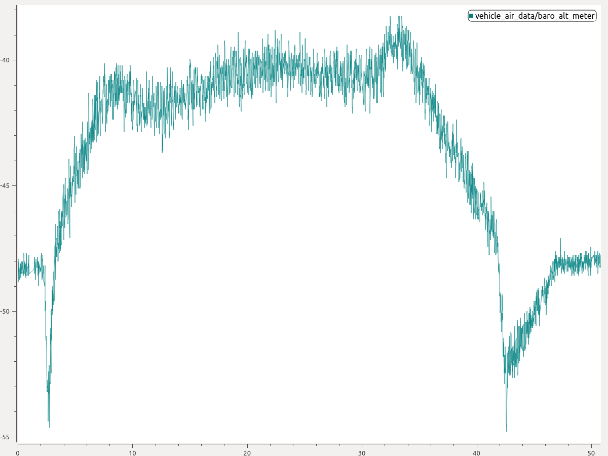

# Використання ECL EKF

Цей підручник відповідає на поширені запитання щодо використання алгоритму ECL EKF.

:::tip
Відео [Огляд оцінки стану PX4](https://youtu.be/HkYRJJoyBwQ) з _Саміту розробників PX4 2019_ (доктор Пол Райсборо) надає огляд оцінювача, а також описує як основні зміни з 2018/2019 року, так і очікувані поліпшення до 2020 року.
:::

## Що таке ECL EKF?

Бібліотека оцінок і керування (ECL) використовує алгоритм розширеного фільтра Калмана (EKF) для обробки вимірювань датчиків і надання оцінки таких станів:

- Quaternion defining the rotation from North, East, Down local earth frame to X, Y, Z body frame
- Velocity at the IMU - North, East, Down (m/s)
- Position at the IMU - North, East, Down (m)
- IMU delta angle bias estimates - X, Y, Z (rad)
- IMU delta velocity bias estimates - X, Y, Z (m/s)
- Earth Magnetic field components - North, East, Down \(gauss\)
- Vehicle body frame magnetic field bias - X, Y, Z \(gauss\)
- Wind velocity - North, East \(m/s\)

EKF працює зі затримкою 'горизонту злиття часу', щоб дозволити різним затримкам часу для кожного вимірювання відносно ІМП. Дані для кожного датчика зберігаються у буфері FIFO та забираються з буфера ЕКФ для використання в потрібний час. Компенсація затримки для кожного датчика керується параметрами [EKF2\_\*\_DELAY](../advanced_config/parameter_reference.md#ekf2).

Для передачі станів від "горизонту злиття" до поточного часу використовується доповнювальний фільтр за допомогою буферизованих даних ІМУ. Часова константа цього фільтру контролюється параметрами [EKF2_TAU_VEL](../advanced_config/parameter_reference.md#EKF2_TAU_VEL) та [EKF2_TAU_POS](../advanced_config/parameter_reference.md#EKF2_TAU_POS).

:::note
Затримка "горизонту злиття" та довжина буферів визначається найбільшим з параметрів `EKF2_*_DELAY`. Якщо датчик не використовується, рекомендується встановити для нього затримку часу на рівні нуля. Зменшення затримки "горизонту злиття" зменшує помилки в доповнювальному фільтрі, що використовується для передачі станів до поточного часу.
:::

Стани положення та швидкості налаштовуються з урахуванням зсуву між IMU та каркасом тіла перед тим, як вони виводяться на контури керування. Положення ІМУ відносно тіла задається параметрами `EKF2_IMU_POS_X,Y,Z`.

ЕКФ використовує дані ІМУ лише для передбачення стану. Дані ІМУ не використовуються як спостереження при похідництві ЕКФ. Алгебраїчні рівняння для передбачення коваріації, оновлення стану та оновлення коваріації були отримані за допомогою пакету символьних обчислень Matlab і можуть бути знайдені тут: [Matlab Symbolic Derivation](https://github.com/PX4/PX4-ECL/blob/master/EKF/matlab/scripts/Terrain%20Estimator/GenerateEquationsTerrainEstimator.m).

## Запуск одного EKF екземпляра

_Стандартна поведінка_ полягає в тому, щоб запускати один екземпляр ЕКФ. In this case sensor selection and failover is performed before data is received by the EKF. Це забезпечує захист від обмеженої кількості несправностей датчиків, таких як втрата даних, але не захищає від ситуацій, коли датчик надає неточні дані, які перевищують можливості ЕКФ та контрольних циклів компенсувати.

Налаштування параметрів для запуску окремого екземпляра EKF:

- [EKF2_MULTI_IMU](../advanced_config/parameter_reference.md#EKF2_MULTI_IMU) = 0
- [EKF2_MULTI_MAG](../advanced_config/parameter_reference.md#EKF2_MULTI_MAG) = 0
- [SENS_IMU_MODE](../advanced_config/parameter_reference.md#SENS_IMU_MODE) = 1
- [SENS_MAG_MODE](../advanced_config/parameter_reference.md#SENS_MAG_MODE) = 1

## Запуск кількох екземплярів EKF

Залежно від кількості ІМП та магнітометрів і потужності ЦП автопілота, може бути запущено декілька екземплярів EKF. Це забезпечує захист від більш широкого спектру помилок датчиків і досягається за рахунок використання кожним екземпляром EKF різної комбінації датчиків. Порівнюючи внутрішню узгодженість кожного екземпляра EKF, селектор EKF може визначити комбінацію EKF та датчиків з найкращою узгодженістю даних. Це дозволяє виявляти та ізолювати несправності, такі як раптові зміни в зміщенні ІМП, насичення або застрягання даних.

The total number of EKF instances is the product of the number of IMU's and number of magnetometers selected by [EKF2_MULTI_IMU](../advanced_config/parameter_reference.md#EKF2_MULTI_IMU) and [EKF2_MULTI_MAG](../advanced_config/parameter_reference.md#EKF2_MULTI_MAG) and is given by the following formula:

> N_instances = MAX([EKF2_MULTI_IMU](../advanced_config/parameter_reference.md#EKF2_MULTI_IMU) , 1) x MAX([EKF2_MULTI_MAG](../advanced_config/parameter_reference.md#EKF2_MULTI_MAG) , 1)

For example an autopilot with 2 IMUs and 2 magnetometers could run with EKF2_MULTI_IMU = 2 and EKF2_MULTI_MAG = 2 for a total of 4 EKF instances where each instance uses the following combination of sensors:

- EKF instance 1 : IMU 1, magnetometer 1
- EKF instance 2 : IMU 1, magnetometer 2
- EKF instance 3 : IMU 2, magnetometer 1
- EKF instance 4 : IMU 2, magnetometer 2

The maximum number of IMU or magnetometer sensors that can be handled is 4 of each for a theoretical maximum of 4 x 4 = 16 EKF instances. In practice this is limited by available computing resources. During development of this feature, testing with STM32F7 CPU based HW demonstrated 4 EKF instances with acceptable processing load and memory utilisation margin.

:::warning
Ground based testing to check CPU and memory utilisation should be performed before flying.
:::

If [EKF2_MULTI_IMU](../advanced_config/parameter_reference.md#EKF2_MULTI_IMU) >= 3, then the failover time for large rate gyro errors is further reduced because the EKF selector is able to apply a median select strategy for faster isolation of the faulty IMU.

The setup for multiple EKF instances is controlled by the following parameters:

- [SENS_IMU_MODE](../advanced_config/parameter_reference.md#SENS_IMU_MODE): Set to 0 if running multiple EKF instances with IMU sensor diversity, ie [EKF2_MULTI_IMU](../advanced_config/parameter_reference.md#EKF2_MULTI_IMU) > 1.

  When set to 1 (default for single EKF operation) the sensor module selects IMU data used by the EKF. This provides protection against loss of data from the sensor but does not protect against bad sensor data. When set to 0, the sensor module does not make a selection.

- [SENS_MAG_MODE](../advanced_config/parameter_reference.md#SENS_MAG_MODE): Set to 0 if running multiple EKF instances with magnetometer sensor diversity, ie [EKF2_MULTI_MAG](../advanced_config/parameter_reference.md#EKF2_MULTI_MAG) > 1.

  When set to 1 (default for single EKF operation) the sensor module selects Magnetometer data used by the EKF. This provides protection against loss of data from the sensor but does not protect against bad sensor data. When set to 0, the sensor module does not make a selection.

- [EKF2_MULTI_IMU](../advanced_config/parameter_reference.md#EKF2_MULTI_IMU): This parameter specifies the number of IMU sensors used by the multiple EKF's. If `EKF2_MULTI_IMU` <= 1, then only the first IMU sensor will be used. When [SENS_IMU_MODE](../advanced_config/parameter_reference.md#SENS_IMU_MODE) = 1, this will be the sensor selected by the sensor module. If `EKF2_MULTI_IMU` >= 2, then a separate EKF instance will run for the specified number of IMU sensors up to the lesser of 4 or the number of IMU's present.

- [EKF2_MULTI_MAG](../advanced_config/parameter_reference.md#EKF2_MULTI_MAG): This parameter specifies the number of magnetometer sensors used by the multiple EKF's If `EKF2_MULTI_MAG` <= 1, then only the first magnetometer sensor will be used. When [SENS_MAG_MODE](../advanced_config/parameter_reference.md#SENS_MAG_MODE) = 1, this will be the sensor selected by the sensor module. If `EKF2_MULTI_MAG` >= 2, then a separate EKF instance will run for the specified number of magnetometer sensors up to the lesser of 4 or the number of magnetometers present.

:::note
The recording and [EKF2 replay](../debug/system_wide_replay.md#ekf2-replay) of flight logs with multiple EKF instances is not supported. To enable recording for EKF replay you must set the parameters to enable a [single EKF instance](#running-a-single-ekf-instance).
:::

## Які датчики вимірювань він використовує?

The EKF has different modes of operation that allow for different combinations of sensor measurements. On start-up the filter checks for a minimum viable combination of sensors and after initial tilt, yaw and height alignment is completed, enters a mode that provides rotation, vertical velocity, vertical position, IMU delta angle bias and IMU delta velocity bias estimates.

This mode requires IMU data, a source of yaw (magnetometer or external vision) and a source of height data. This minimum data set is required for all EKF modes of operation. Other sensor data can then be used to estimate additional states.

### IMU

- Three axis body fixed Inertial Measurement unit delta angle and delta velocity data at a minimum rate of 100Hz. Note: Coning corrections should be applied to the IMU delta angle data before it is used by the EKF.

### Magnetometer

Three axis body fixed magnetometer data (or external vision system pose data) at a minimum rate of 5Hz is required.

Magnetometer data can be used in two ways:

- Magnetometer measurements are converted to a yaw angle using the tilt estimate and magnetic declination. The yaw angle is then used as an observation by the EKF.
  - This method is less accurate and does not allow for learning of body frame field offsets, however it is more robust to magnetic anomalies and large start-up gyro biases.
  - It is the default method used during start-up and on ground.
- The XYZ magnetometer readings are used as separate observations.
  - This method is more accurate but requires that the magnetometer biases are correctly estimated.
    - The biases are observable while the drone is rotating and the true heading is observable when the vehicle is accelerating (linear acceleration).
    - Since the biases can change and are only observable when moving, it is safer to switch back to heading fusion when not moving.
  - It assumes the earth magnetic field environment only changes slowly and performs less well when there are significant external magnetic anomalies.
  - This is the default method used when the vehicle is moving.

The logic used to select these modes is set by the [EKF2_MAG_TYPE](../advanced_config/parameter_reference.md#EKF2_MAG_TYPE) parameter. The default 'Automatic' mode (`EKF2_MAG_TYPE=0`) is recommended as it uses the more robust magnetometer yaw on the ground, and more accurate 3-axis magnetometer when moving. Setting '3-axis' mode all the time (`EKF2_MAG_TYPE=2`) is more error-prone, and requires that all the IMUs are well calibrated.

The option is available to operate without a magnetometer, either by replacing it using [yaw from a dual antenna GPS](#yaw-measurements) or using the IMU measurements and GPS velocity data to [estimate yaw from vehicle movement](#yaw-from-gps-velocity).

### Height

A source of height data - GPS, barometric pressure, range finder, external vision or a combination of those at a minimum rate of 5Hz is required.

If none of the selected measurements are present, the EKF will not start. When these measurements have been detected, the EKF will initialise the states and complete the tilt and yaw alignment. When tilt and yaw alignment is complete, the EKF can then transition to other modes of operation enabling use of additional sensor data:

Each height source can be enabled/disabled using its dedicated control parameter:

- [GNSS/GPS](#gnss-gps): [EKF2_GPS_CTRL](../advanced_config/parameter_reference.md#EKF2_GPS_CTRL)
- [Barometer](#barometer): [EKF2_BARO_CTRL](../advanced_config/parameter_reference.md#EKF2_BARO_CTRL)
- [Range finder](#range-finder): [EKF2_RNG_CTRL](../advanced_config/parameter_reference.md#EKF2_RNG_CTRL)
- [External vision](#external-vision-system): Enabled when [EKF2_HGT_REF](../advanced_config/parameter_reference.md#EKF2_HGT_REF) is set to "Vision"

Over the long term the height estimate follows the "reference source" of height data. This reference is defined by the [EKF2_HGT_REF](../advanced_config/parameter_reference.md#EKF2_HGT_REF) parameter.

#### Typical configurations

|                           | [EKF2_GPS_CTRL](../advanced_config/parameter_reference.md#EKF2_GPS_CTRL) | [EKF2_BARO_CTRL](../advanced_config/parameter_reference.md#EKF2_BARO_CTRL) | [EKF2_RNG_CTRL](../advanced_config/parameter_reference.md#EKF2_RNG_CTRL) | [EKF2_HGT_REF](../advanced_config/parameter_reference.md#EKF2_HGT_REF) |
| ------------------------- | -------------------------------------------------------------------------- | ---------------------------------------------------------------------------- | -------------------------------------------------------------------------- | ------------------------------------------------------------------------ |
| Outdoor (default)         | 7 (Lon/lat/alt/vel)                                                        | 1 (enabled)                                                                  | 1 ([conditional](#conditional-range-aiding))                               | 1 (GNSS)                                                                 |
| Indoor (non-flat terrain) | 0 (disabled)                                                               | 1 (enabled)                                                                  | 1 ([conditional](#conditional-range-aiding))                               | 2 (range)                                                                |
| Indoor (flat terrain)     | 0 (disabled)                                                               | 1 (enabled)                                                                  | 2 ([always enabled](#range-height-fusion))                                 | 2 (range)                                                                |
| External vision           | As required                                                                | As required                                                                  | As required                                                                | 3 (vision)                                                               |

### Barometer

Enable/disable using [EKF2_BARO_CTRL](../advanced_config/parameter_reference.md#EKF2_BARO_CTRL) as a source for [Height](#height) data.

Note that data from only one barometer is fused, even if multiple barometers are available. The barometer with the highest [CAL_BAROx_PRIO](../advanced_config/parameter_reference.md#CAL_BARO0_PRIO) priority value is selected first, falling back to the next highest priority barometer if a sensor fault is detected. If barometers have equal-highest priorities, the first detected is used. A barometer can be completely disabled as a possible source by setting its `CAL_BAROx_PRIO` value to `0` (disabled).

See [Height](#height) more details about the configuration of height sources.

#### Correction for Static Pressure Position Error

Висота за барометром піддається помилкам, що виникають від аеродинамічних перешкод, спричинених вітровою швидкістю та орієнтацією транспортного засобу. Це відомо в авіації як _помилка позиції за статичним тиском_. Модуль EKF2, який використовує бібліотеку оцінювача ECL/EKF2, надає метод компенсації цих помилок, за умови, що оцінка стану швидкості вітру активна.

Для транспортних засобів, що працюють у режимі фіксованого крила, оцінка стану швидкості вітру потребує активації злиття [швидкості повітря](#airspeed) та/або [синтетичного бокового ковзання](#synthetic-sideslip).

Для багатовертольотів злиття [специфічних сил тяги](#mc_wind_estimation_using_drag) може бути активоване та налаштоване для надання потрібних оцінок стану швидкості вітру.

Модуль EKF2 моделює помилку у вигляді еліпсоїда, що фіксується в тілі, який визначає частку динамічного тиску, що додається до/віднімається від барометричного тиску - перш ніж він перетворюється у висотну оцінку.

A good tuning is obtained as follows:

1. Fly once in [Position mode](../flight_modes_mc/position.md) repeatedly forwards/backwards/left/right/up/down between rest and maximum speed (best results are obtained when this testing is conducted in still conditions).
2. Extract the `.ulg` log file using, for example, [QGroundControl: Analyze > Log Download](https://docs.qgroundcontrol.com/master/en/analyze_view/log_download.html)

:::note
The same log file can be used to tune the [multirotor wind estimator](#mc_wind_estimation_using_drag).
:::

3. Use the log with the [baro_static_pressure_compensation_tuning.py](https://github.com/PX4/PX4-Autopilot/tree/main/src/modules/ekf2/EKF/python/tuning_tools/baro_static_pressure_compensation) Python script to obtain the optimal set of parameters.

Tuning parameters:

- [EKF2_PCOEF_XP](../advanced_config/parameter_reference.md#EKF2_PCOEF_XP)
- [EKF2_PCOEF_XN](../advanced_config/parameter_reference.md#EKF2_PCOEF_XN)
- [EKF2_PCOEF_YP](../advanced_config/parameter_reference.md#EKF2_PCOEF_YP)
- [EKF2_PCOEF_YN](../advanced_config/parameter_reference.md#EKF2_PCOEF_YN)
- [EKF2_PCOEF_Z](../advanced_config/parameter_reference.md#EKF2_PCOEF_Z)

#### Barometer bias compensation

Барометр при постійній висоті піддається дрейфу в своїх вимірюваннях через зміни в оточуючому тисковому середовищі або варіації температури датчика. Для компенсації цієї помилки вимірювання EKF2 оцінює зміщення за допомогою висоти GNSS (якщо доступно) як "нестійкий" еталон. No tuning is required.

### GNSS/GPS

#### Position and Velocity Measurements

GPS measurements will be used for position and velocity if the following conditions are met:

- GPS use is enabled via setting of the [EKF2_GPS_CTRL](../advanced_config/parameter_reference.md#EKF2_GPS_CTRL) parameter.
- GPS quality checks have passed. These checks are controlled by the [EKF2_GPS_CHECK](../advanced_config/parameter_reference.md#EKF2_GPS_CHECK) and `EKF2_REQ_*` parameters.

For more details about the configuration of height sources, [click here](#height).

#### Yaw Measurements

Some GPS receivers such as the [Trimble MB-Two RTK GPS receiver](https://www.trimble.com/Precision-GNSS/MB-Two-Board.aspx) can be used to provide a heading measurement that replaces the use of magnetometer data. This can be a significant advantage when operating in an environment where large magnetic anomalies are present, or at latitudes here the earth's magnetic field has a high inclination. Use of GPS yaw measurements is enabled by setting bit position 3 to 1 (adding 8) in the [EKF2_GPS_CTRL](../advanced_config/parameter_reference.md#EKF2_GPS_CTRL) parameter.

#### Yaw From GPS Velocity

The EKF runs an additional multi-hypothesis filter internally that uses multiple 3-state Extended Kalman Filters (EKF's) whose states are NE velocity and yaw angle. These individual yaw angle estimates are then combined using a Gaussian Sum Filter (GSF). The individual 3-state EKF's use IMU and GPS horizontal velocity data (plus optional airspeed data) and do not rely on any prior knowledge of the yaw angle or magnetometer measurements. This provides a backup to the yaw from the main filter and is used to reset the yaw for the main 24-state EKF when a post-takeoff loss of navigation indicates that the yaw estimate from the magnetometer is bad. This will result in an `Emergency yaw reset - magnetometer use stopped` message information message at the GCS.

Data from this estimator is logged when ekf2 replay logging is enabled and can be viewed in the `yaw_estimator_status` message. The individual yaw estimates from the individual 3-state EKF yaw estimators are in the `yaw` fields. The GSF combined yaw estimate is in the `yaw_composite` field. The variance for the GSF yaw estimate is in the `yaw_variance` field. All angles are in radians. Weightings applied by the GSF to the individual 3-state EKF outputs are in the`weight` fields.

This also makes it possible to operate without any magnetometer data or dual antenna GPS receiver for yaw provided some horizontal movement after takeoff can be performed to enable the yaw to become observable. To use this feature, set [EKF2_MAG_TYPE](../advanced_config/parameter_reference.md#EKF2_MAG_TYPE) to `none` (5) to disable magnetometer use. Once the vehicle has performed sufficient horizontal movement to make the yaw observable, the main 24-state EKF will align it's yaw to the GSF estimate and commence use of GPS.

#### Dual Receivers

Дані з приймачів GPS можуть бути змішані за допомогою алгоритму, який вагує дані на основі звітної точності (це працює найкраще, якщо обидва приймачі виводять дані з однаковою частотою та використовують однакову точність). Механізм також забезпечує автоматичний перехід на резервний варіант, якщо дані від приймача втрачаються (це дозволяє, наприклад, використовувати стандартний GPS як резервний варіант для більш точного приймача RTK). Це контролюється параметром [SENS_GPS_MASK](../advanced_config/parameter_reference.md#SENS_GPS_MASK).

Параметр [SENS_GPS_MASK](../advanced_config/parameter_reference.md#SENS_GPS_MASK) за замовчуванням встановлений для вимкнення змішування і завжди використовує перший приймач, тому його потрібно встановити, щоб вибрати, які метрики точності приймача використовуються для визначення внеску кожного виходу приймача в змішане рішення. У випадку використання різних моделей приймачів важливо, щоб параметр [SENS_GPS_MASK](../advanced_config/parameter_reference.md#SENS_GPS_MASK) був встановлений на значення, яке використовує метрики точності, які підтримуються обома приймачами. Наприклад, не встановлюйте позицію біта 0 в значення `true`, якщо драйвери для обох приймачів не публікують значення у полі `s_variance_m_s` повідомлення `vehicle_gps_position`, які можна порівняти. Це може бути складним з приймачами від різних виробників через різний спосіб визначення точності, наприклад, CEP проти 1-сигма і т.д.

The following items should be checked during setup:

- Verify that data for the second receiver is present. This will be logged as `vehicle_gps_position_1` and can also be checked when connected via the _nsh console_ using the command `listener vehicle_gps_position -i 1`. The [GPS_2_CONFIG](../advanced_config/parameter_reference.md#GPS_2_CONFIG) parameter will need to be set correctly.
- Check the `s_variance_m_s`, `eph` and `epv` data from each receiver and decide which accuracy metrics can be used. If both receivers output sensible `s_variance_m_s` and `eph` data, and GPS vertical position is not being used directly for navigation, then setting [SENS_GPS_MASK](../advanced_config/parameter_reference.md#SENS_GPS_MASK) to 3 is recommended. Where only `eph` data is available and both receivers do not output `s_variance_m_s` data, set [SENS_GPS_MASK](../advanced_config/parameter_reference.md#SENS_GPS_MASK) to 2. Bit position 2 would only be set if the GPS had been selected as the reference height source with the [EKF2_HGT_REF](../advanced_config/parameter_reference.md#EKF2_HGT_REF) parameter and both receivers output sensible `epv` data.
- The output from the blended receiver data is logged as `ekf_gps_position`, and can be checked whilst connect via the nsh terminal using the command `listener ekf_gps_position`.
- Where receivers output at different rates, the blended output will be at the rate of slower receiver. Where possible receivers should be configured to output at the same rate.

#### GNSS Performance Requirements

Для того щоб ECL приймав дані GNSS для навігації, необхідно, щоб певні мінімальні вимоги були виконані протягом певного часу, визначеного параметром [EKF2_REQ_GPS_H](../advanced_config/parameter_reference.md#EKF2_REQ_GPS_H) (за замовчуванням 10 секунд).

Мінімуми визначаються у параметрах [EKF2_REQ_*](../advanced_config/parameter_reference.md#EKF2_REQ_EPH), і кожна перевірка може бути увімкнена/вимкнена за допомогою параметра [EKF2_GPS_CHECK](../advanced_config/parameter_reference.md#EKF2_GPS_CHECK).

The table below shows the different metrics directly reported or calculated from the GNSS data, and the minimum required values for the data to be used by ECL. Крім того, стовпчик _Середнє значення_ показує типові значення, які можуть бути розумними для отримання зі стандартного модуля GNSS (наприклад, серія u-blox M8) - тобто значення, які вважаються хорошими/прийнятними.

| Metric               | Minimum required                                                                            | Average Value | Units | Notes                                                                                                                                       |
| -------------------- | ------------------------------------------------------------------------------------------- | ------------- | ----- | ------------------------------------------------------------------------------------------------------------------------------------------- |
| eph                  | <&nbsp;3 ([EKF2_REQ_EPH](../advanced_config/parameter_reference.md#EKF2_REQ_EPH))         | 0.8           | m     | Standard deviation of horizontal position error                                                                                             |
| epv                  | <&nbsp;5 ([EKF2_REQ_EPV](../advanced_config/parameter_reference.md#EKF2_REQ_EPV))         | 1.5           | m     | Standard deviation of vertical position error                                                                                               |
| Number of satellites | ≥6&nbsp;([EKF2_REQ_NSATS](../advanced_config/parameter_reference.md#EKF2_REQ_NSATS))      | 14            | -     |                                                                                                                                             |
| sacc                 | <&nbsp;0.5 ([EKF2_REQ_SACC](../advanced_config/parameter_reference.md#EKF2_REQ_SACC))     | 0.2           | m/s   | Standard deviation of horizontal speed error                                                                                                |
| fix type             | ≥&nbsp;3                                                                                    | 4             | -     | 0-1: no fix, 2: 2D fix, 3: 3D fix, 4: RTCM code differential, 5: Real-Time Kinematic, float, 6: Real-Time Kinematic, fixed, 8: Extrapolated |
| PDOP                 | <&nbsp;2.5 ([EKF2_REQ_PDOP](../advanced_config/parameter_reference.md#EKF2_REQ_PDOP))     | 1.0           | -     | Position dilution of precision                                                                                                              |
| hpos drift rate      | <&nbsp;0.1 ([EKF2_REQ_HDRIFT](../advanced_config/parameter_reference.md#EKF2_REQ_HDRIFT)) | 0.01          | m/s   | Drift rate calculated from reported GNSS position (when stationary).                                                                        |
| vpos drift rate      | <&nbsp;0.2 ([EKF2_REQ_VDRIFT](../advanced_config/parameter_reference.md#EKF2_REQ_VDRIFT)) | 0.02          | m/s   | Drift rate calculated from reported GNSS altitude (when stationary).                                                                        |
| hspd                 | <&nbsp;0.1 ([EKF2_REQ_HDRIFT](../advanced_config/parameter_reference.md#EKF2_REQ_HDRIFT)) | 0.01          | m/s   | Filtered magnitude of reported GNSS horizontal velocity.                                                                                    |
| vspd                 | <&nbsp;0.2 ([EKF2_REQ_VDRIFT](../advanced_config/parameter_reference.md#EKF2_REQ_VDRIFT)) | 0.02          | m/s   | Filtered magnitude of reported GNSS vertical velocity.                                                                                      |

:::note
The `hpos_drift_rate`, `vpos_drift_rate` and `hspd` are calculated over a period of 10 seconds and published in the `ekf2_gps_drift` topic. Note that `ekf2_gps_drift` is not logged!
:::

### Range Finder

Відстань до землі, виміряна дальномером, використовується одним фільтром стану для оцінки вертикального положення території відносно висотного датуму.

The fusion modes of operation are controlled by [EKF2_RNG_CTRL](../advanced_config/parameter_reference.md#EKF2_RNG_CTRL):

1. [Conditional range aiding](#conditional-range-aiding)
1. [Range height fusion](#range-height-fusion)

Для отримання додаткової інформації про налаштування джерел висоти, натисніть [тут](#height).

#### Conditional range aiding

Conditional range finder fusion (a.k.a. _Умовна допомога зони діапазону_) активує злиття відомостей дальномера для оцінки висоти під час операцій з низькою швидкістю/низькою висотою (додатково до інших активних джерел висоти). Якщо дальномер встановлено як джерело висоти за замовчуванням (використовуючи [EKF2_HGT_REF](../advanced_config/parameter_reference.md#EKF2_HGT_REF)), інші активні джерела висоти, такі як барометр та висота ГНСС, з часом коригуватимуть свої вимірювання, щоб відповідати показам дальномера. Коли умови не виконані для початку допомоги діапазону, автоматично обирається вторинне джерело.

:::note
Перемикання між джерелами висоти призводить до поступового відхилення оцінки абсолютної висоти з плином часу.
Це не проблема при польоті в режимі позиції, але може стати проблемою, якщо дрон має летіти місію на конкретній висоті за ГНСС.
Якщо небажане відхилення абсолютної висоти, рекомендується встановити висоту за ГНСС як джерело висоти, навіть при використанні умовної допомоги діапазону.
:::

Це передбачено переважно для _зльоту та посадки_, у випадках, коли налаштування барометра таке, що втручання від струменя повітря від лопастей відбувається в надмірній мірі та може спотворити оцінки стану EKF.

Допомога діапазону також може використовуватися для поліпшення утримання висоти, коли транспортний засіб зупинений.

:::tip
[Утримання за допомогою рельєфу](../flying/terrain_following_holding.md#terrain_hold) рекомендується перед _Допомогою діапазону_ для утримання на рельєфі. Це через те, що утримання за допомогою рельєфу використовує звичайний оцінювач ECL/EKF для визначення висоти, і це загалом надійніше, ніж датчик відстані в більшості умов.
:::

_Умовна допомога діапазону_ включається шляхом встановлення [EKF2_RNG_CTRL](../advanced_config/parameter_reference.md#EKF2_RNG_CTRL) = "Увімкнено (умовний режим)" (1).

Вона додатково налаштовується за допомогою параметрів `EKF2_RNG_A_`:

- [EKF2_RNG_A_VMAX](../advanced_config/parameter_reference.md#EKF2_RNG_A_VMAX): Maximum horizontal speed, above which range aid is disabled.
- [EKF2_RNG_A_HMAX](../advanced_config/parameter_reference.md#EKF2_RNG_A_HMAX): Maximum height, above which range aid is disabled.
- [EKF2_RNG_A_IGATE](../advanced_config/parameter_reference.md#EKF2_RNG_A_IGATE): Range aid consistency checks "gate" (a measure of the error before range aid is disabled).

#### Range height fusion

PX4 дозволяє постійно об'єднувати дальномер як джерело висоти (у будь-якому режимі польоту/типі транспортного засобу). Це може бути корисно для застосунків, коли транспортний засіб гарантовано летить лише над майже плоскою поверхнею (наприклад, у приміщенні).

При використанні датчика відстані як джерела висоти, літакам слід бути уважними:

- Перельот над перешкодами може призвести до відкидання даних дальномера оцінювачем (через внутрішні перевірки консистентності даних), що може призвести до поганого утримання висоти в той час, коли оцінювач базується виключно на оцінках акселерометра.

  :::note
Цей сценарій може статися, коли транспортний засіб піднімається на схилі майже на постійній висоті над землею, оскільки висота, виміряна дальномером, не змінюється, тоді як та, яка визначається за допомогою акселерометра, змінюється.
ЕКФ виконує перевірки консистентності інновацій, які враховують помилку між виміром і поточним станом, а також оцінену дисперсію стану і дисперсію самого вимірювання.
Якщо перевірки не вдаються, дані дальномера будуть відхилені, і висота буде оцінена за допомогою акселерометра та інших обраних джерел висоти (ГНСС, баро, візія), якщо вони включені та доступні. Після 5 секунд неузгоджених даних, якщо датчик відстані є активним джерелом висотних даних, оцінювач скидає стан висоти для відповідності поточним даним дальномера.
Якщо одне або кілька інших джерел висоти активні, дальномер визнається несправним, і оцінювач продовжує оцінювати висоту за допомогою інших датчиків.
Вимірювання також можуть стати знову узгодженими, наприклад, якщо транспортний засіб спускається, або якщо оцінена висота дрейфує для відповідності виміряній висоті дальномера.
:::

- Локальне початкове положення NED буде підніматися та опускатися разом з рівнем ґрунту.
- Продуктивність дальномера над нерівними поверхнями (наприклад, деревами) може бути дуже низькою, що призводить до шумних і неузгоджених даних. Це знову призводить до поганого утримання висоти.

The feature is enabled by setting [EKF2_RNG_CTRL](../advanced_config/parameter_reference.md#EKF2_RNG_CTRL) to "Enabled" (2). To make the range finder the height reference when active, set: [EKF2_HGT_REF](../advanced_config/parameter_reference.md#EKF2_HGT_REF) to "Range sensor".

:::tip
Для того щоб увімкнути злиття дальномера тільки тоді, коли дрон знаходиться у спокої (для отримання кращої оцінки висоти під час зльоту та посадки), але не злити дальномер решту часу, скористайтеся [умовним режимом](#conditional-range-aiding) (1) параметру [EKF2_RNG_CTRL](../advanced_config/parameter_reference.md#EKF2_RNG_CTRL).
:::

#### Range Finder Obstruction Detection

ЕКФ може виявити, чи перешкоджається шлях дальномера до землі (можливо, завдяки вантажу), використовуючи кінематичну перевірку консистентності між оцінкою вертикальної швидкості та числовою похідною даних дальномера. Якщо дальномер статистично неузгоджений з EKF2, датчик відкидається на решту польоту, якщо тільки статистичний тест не пройшов знову протягом щонайменше 1 секунди при вертикальній швидкості 0,5 м/с або більше.

Перевірка активується лише тоді, коли дальномер не використовується як основне джерело висоти, і активна лише тоді, коли транспортний засіб не рухається горизонтально (оскільки вона припускає статичну висоту ґрунту).

Для ефективного виявлення перешкод необхідно тісно налаштувати параметр шуму дальномера за допомогою даних польоту. Параметр порогу кінематичної консистентності можна налаштувати для досягнення бажаної чутливості виявлення несправностей.

Tuning parameters:

- [EKF2_RNG_NOISE](../advanced_config/parameter_reference.md#EKF2_RNG_NOISE)
- [EKF2_RNG_K_GATE](../advanced_config/parameter_reference.md#EKF2_RNG_K_GATE)

### Airspeed

Дані про еквівалентну повітряну швидкість (EAS) можуть бути використані для оцінки швидкості вітру та зменшення дрейфу, коли втрачений сигнал GPS, встановивши значення [EKF2_ARSP_THR](../advanced_config/parameter_reference.md#EKF2_ARSP_THR) на позитивне значення. Дані про повітряну швидкість будуть використані, коли вони перевищать поріг, встановлений позитивним значенням для [EKF2_ARSP_THR](../advanced_config/parameter_reference.md#EKF2_ARSP_THR), і тип транспортного засобу не є вертольотом.

### Synthetic Sideslip

Фіксованокрилі платформи можуть скористатися припущеною спостереженням дрейфу нульовим, щоб поліпшити оцінку швидкості вітру і також включити оцінку швидкості вітру без датчика повітряної швидкості. Це вмикається, встановивши параметр [EKF2_FUSE_BETA](../advanced_config/parameter_reference.md#EKF2_FUSE_BETA) на значення 1.

<a id="mc_wind_estimation_using_drag"></a>

### Multicopter Wind Estimation using Drag Specific Forces

Багатороторні платформи можуть скористатися взаємозв'язком між повітряною швидкістю та силою опору вздовж осей тіла X та Y для оцінки північної / східної складових швидкості вітру. This can be enabled using [EKF2_DRAG_CTRL](../advanced_config/parameter_reference.md#EKF2_DRAG_CTRL).

Взаємозв'язок між повітряною швидкістю та конкретною силою (виміри прискорення ІМП) вздовж осей тіла X та Y контролюється параметрами [EKF2_BCOEF_X](../advanced_config/parameter_reference.md#EKF2_BCOEF_X), [EKF2_BCOEF_Y](../advanced_config/parameter_reference.md#EKF2_BCOEF_Y) та [EKF2_MCOEF](../advanced_config/parameter_reference.md#EKF2_MCOEF), які встановлюють коефіцієнти балістики для польоту в напрямку X та Y та коефіцієнт ковзання, що виникає від пропелерів, відповідно. Кількість шуму спостереження конкретної сили встановлюється параметром [EKF2_DRAG_NOISE](../advanced_config/parameter_reference.md#EKF2_DRAG_NOISE).

A good tuning is obtained as follows:

1. Fly once in [Position mode](../flight_modes_mc/position.md) repeatedly forwards/backwards/left/right/up/down between rest and maximum speed (best results are obtained when this testing is conducted in still conditions).
2. Extract the **.ulg** log file using, for example, [QGroundControl: Analyze > Log Download](https://docs.qgroundcontrol.com/master/en/analyze_view/log_download.html) :::note The same **.ulg** log file can also be used to tune the [static pressure position error coefficients](#correction-for-static-pressure-position-error).
:::
3. Use the log with the [mc_wind_estimator_tuning.py](https://github.com/PX4/PX4-Autopilot/tree/main/src/modules/ekf2/EKF/python/tuning_tools/mc_wind_estimator) Python script to obtain the optimal set of parameters.

### Optical Flow

[Optical flow](../sensor/optical_flow.md) data will be used if the following conditions are met:

- Valid range finder data is available.
- [EKF2_OF_CTRL](../advanced_config/parameter_reference.md#EKF2_OF_CTRL) is set.
- The quality metric returned by the flow sensor is greater than the minimum requirement set by the [EKF2_OF_QMIN](../advanced_config/parameter_reference.md#EKF2_OF_QMIN) parameter.

### External Vision System

Position, velocity or orientation measurements from an external vision system, e.g. Vicon, can be used.

The measurements that are fused are configured by setting the appropriate bits of [EKF2_EV_CTRL](../advanced_config/parameter_reference.md#EKF2_EV_CTRL) to `true`:

- `0`: Horizontal position data
- `1`: Vertical position data. Height sources may additionally be configured using [EKF2_HGT_REF](../advanced_config/parameter_reference.md#EKF2_HGT_REF) (see section [Height](#height)).
- `2`: Velocity data
- `3`: Yaw data

Note that if yaw data is used (bit 3) the heading is with respect to the external vision frame; otherwise the heading is relative to North.

The EKF considers uncertainty in the visual pose estimate. This uncertainty information can be sent via the covariance fields in the MAVLink [ODOMETRY](https://mavlink.io/en/messages/common.html#ODOMETRY) message or it can be set through the parameters [EKF2_EVP_NOISE](../advanced_config/parameter_reference.md#EKF2_EVP_NOISE), [EKF2_EVV_NOISE](../advanced_config/parameter_reference.md#EKF2_EVV_NOISE) and [EKF2_EVA_NOISE](../advanced_config/parameter_reference.md#EKF2_EVA_NOISE). You can choose the source of the uncertainty with [EKF2_EV_NOISE_MD](../advanced_config/parameter_reference.md#EKF2_EV_NOISE_MD).

## How do I use the 'ecl' library EKF?

Set the [SYS_MC_EST_GROUP](../advanced_config/parameter_reference.md#SYS_MC_EST_GROUP) parameter to 2 to use the ecl EKF.

## What are the advantages and disadvantages of the ecl EKF over other estimators?

Like all estimators, much of the performance comes from the tuning to match sensor characteristics. Настройка - це компроміс між точністю і надійністю, і хоча ми намагалися надати настройку, яка задовольняє потреби більшості користувачів, будуть випадки, коли потрібні зміни налаштувань.

З цієї причини не висуваються претензії на точність в порівнянні з традиційною комбінацією `attitude_estimator_q` + `local_position_estimator`, і найкращий вибір оцінювача буде залежати від застосування і налаштування.

### Disadvantages

- The ecl EKF is a complex algorithm that requires a good understanding of extended Kalman filter theory and its application to navigation problems to tune successfully. It is therefore more difficult for users that are not achieving good results to know what to change.
- The ecl EKF uses more RAM and flash space.
- The ecl EKF uses more logging space.

### Advantages

- ЕКФ ecl може об'єднувати дані з датчиків з різними затримками часу та частотами даних в математично послідовний спосіб, що підвищує точність під час динамічних маневрів, якщо параметри затримки часу встановлені правильно.
- The ecl EKF is capable of fusing a large range of different sensor types.
- The ecl EKF detects and reports statistically significant inconsistencies in sensor data, assisting with diagnosis of sensor errors.
- For fixed-wing operation, the ecl EKF estimates wind speed with or without an airspeed sensor and is able to use the estimated wind in combination with airspeed measurements and sideslip assumptions to extend the dead-reckoning time available if GPS is lost in flight.
- ЕКФ ecl оцінює відхилення акселерометра по трьох осях, що підвищує точність для апаратів типу "хвісторізи" та інших транспортних засобів, які досвідчують великі зміни у положенні між фазами польоту.
- The federated architecture (combined attitude and position/velocity estimation) means that attitude estimation benefits from all sensor measurements. This should provide the potential for improved attitude estimation if tuned correctly.

## How do I check the EKF performance?

EKF outputs, states and status data are published to a number of uORB topics which are logged to the SD card during flight. The following guide assumes that data has been logged using the _.ulog file format_. The **.ulog** format data can be parsed in python by using the [PX4 pyulog library](https://github.com/PX4/pyulog).

Most of the EKF data is found in the [EstimatorInnovations](https://github.com/PX4/PX4-Autopilot/blob/main/msg/EstimatorInnovations.msg) and [EstimatorStatus](https://github.com/PX4/PX4-Autopilot/blob/main/msg/EstimatorStatus.msg) uORB messages that are logged to the .ulog file.

A python script that automatically generates analysis plots and metadata can be found [here](https://github.com/PX4/PX4-Autopilot/blob/main/Tools/ecl_ekf/process_logdata_ekf.py). To use this script file, cd to the `Tools/ecl_ekf` directory and enter `python process_logdata_ekf.py <log_file.ulg>`. This saves performance metadata in a csv file named **<log_file>.mdat.csv** and plots in a pdf file named `<log_file>.pdf`.

Multiple log files in a directory can be analysed using the [batch_process_logdata_ekf.py](https://github.com/PX4/PX4-Autopilot/blob/main/Tools/ecl_ekf/batch_process_logdata_ekf.py) script. Коли це вже зроблено, файли метаданих про продуктивність можна обробити, щоб надати статистичну оцінку продуктивності оцінювача по всій популяції журналів, використовуючи сценарій [batch_process_metadata_ekf.py](https://github.com/PX4/PX4-Autopilot/blob/main/Tools/ecl_ekf/batch_process_metadata_ekf.py).

### Output Data

- Attitude output data is found in the [VehicleAttitude](https://github.com/PX4/PX4-Autopilot/blob/main/msg/VehicleAttitude.msg) message.
- Local position output data is found in the [VehicleLocalPosition](https://github.com/PX4/PX4-Autopilot/blob/main/msg/VehicleLocalPosition.msg) message.
- Global \(WGS-84\) output data is found in the [VehicleGlobalPosition](https://github.com/PX4/PX4-Autopilot/blob/main/msg/VehicleGlobalPosition.msg) message.
- Wind velocity output data is found in the [Wind.msg](https://github.com/PX4/PX4-Autopilot/blob/main/msg/Wind.msg) message.

### States

Refer to states\[24\] in [EstimatorStates](https://github.com/PX4/PX4-Autopilot/blob/main/msg/EstimatorStates.msg). The index map for states\[24\] is as follows:

- \[0 ... 3\] Quaternions
- \[4 ... 6\] Velocity NED \(m/s\)
- \[7 ... 9\] Position NED \(m\)
- \[10 ... 12\] IMU delta angle bias XYZ \(rad\)
- \[13 ... 15\] IMU delta velocity bias XYZ \(m/s\)
- \[16 ... 18\] Earth magnetic field NED \(gauss\)
- \[19 ... 21\] Body magnetic field XYZ \(gauss\)
- \[22 ... 23\] Wind velocity NE \(m/s\)

### State Variances

Refer to covariances\[24\] in [EstimatorStates](https://github.com/PX4/PX4-Autopilot/blob/main/msg/EstimatorStates.msg). The index map for covariances\[24\] is as follows:

- \[0 ... 3\] Quaternions
- \[4 ... 6\] Velocity NED \(m/s\)^2
- \[7 ... 9\] Position NED \(m^2\)
- \[10 ... 12\] IMU delta angle bias XYZ \(rad^2\)
- \[13 ... 15\] IMU delta velocity bias XYZ \(m/s\)^2
- \[16 ... 18\] Earth magnetic field NED \(gauss^2\)
- \[19 ... 21\] Body magnetic field XYZ \(gauss^2\)
- \[22 ... 23\] Wind velocity NE \(m/s\)^2

### Observation Innovations & Innovation Variances

The observation `estimator_innovations`, `estimator_innovation_variances`, and `estimator_innovation_test_ratios` message fields are defined in [EstimatorInnovations.msg](https://github.com/PX4/PX4-Autopilot/blob/main/msg/EstimatorInnovations.msg). The messages all have the same field names/types (but different units).

:::note
The messages have the same fields because they are generated from the same field definition. The `# TOPICS` line (at the end of [the file](https://github.com/PX4/PX4-Autopilot/blob/main/msg/EstimatorInnovations.msg)) lists the names of the set of messages to be created):

```
# TOPICS estimator_innovations estimator_innovation_variances estimator_innovation_test_ratios
```

:::

Some of the observations are:

- Magnetometer XYZ (gauss, gauss^2) : `mag_field[3]`
- Yaw angle (rad, rad^2) : `heading`
- True Airspeed (m/s, (m/s)^2) : `airspeed`
- Synthetic sideslip (rad, rad^2) : `beta`
- Optical flow XY (rad/sec, (rad/s)^2) : `flow`
- Height above ground (m, m^2) : `hagl`
- Drag specific force ((m/s)^2): `drag`
- Velocity and position innovations : per sensor

In addition, each sensor has its own fields for horizontal and vertical position and/or velocity values (where appropriate). These are largely self documenting, and are reproduced below:

```
# GPS
float32[2] gps_hvel # horizontal GPS velocity innovation (m/sec) and innovation variance ((m/sec)**2)
float32    gps_vvel # vertical GPS velocity innovation (m/sec) and innovation variance ((m/sec)**2)
float32[2] gps_hpos # horizontal GPS position innovation (m) and innovation variance (m**2)
float32    gps_vpos # vertical GPS position innovation (m) and innovation variance (m**2)

# External Vision
float32[2] ev_hvel  # horizontal external vision velocity innovation (m/sec) and innovation variance ((m/sec)**2)
float32    ev_vvel  # vertical external vision velocity innovation (m/sec) and innovation variance ((m/sec)**2)
float32[2] ev_hpos  # horizontal external vision position innovation (m) and innovation variance (m**2)
float32    ev_vpos  # vertical external vision position innovation (m) and innovation variance (m**2)

# Fake Position and Velocity
float32[2] fake_hvel    # fake horizontal velocity innovation (m/s) and innovation variance ((m/s)**2)
float32    fake_vvel    # fake vertical velocity innovation (m/s) and innovation variance ((m/s)**2)
float32[2] fake_hpos    # fake horizontal position innovation (m) and innovation variance (m**2)
float32    fake_vpos    # fake vertical position innovation (m) and innovation variance (m**2)

# Height sensors
float32 rng_vpos    # range sensor height innovation (m) and innovation variance (m**2)
float32 baro_vpos   # barometer height innovation (m) and innovation variance (m**2)

# Auxiliary velocity
float32[2] aux_hvel # horizontal auxiliary velocity innovation from landing target measurement (m/sec) and innovation variance ((m/sec)**2)
float32    aux_vvel # vertical auxiliary velocity innovation from landing target measurement (m/sec) and innovation variance ((m/sec)**2)
```

### Output Complementary Filter

The output complementary filter is used to propagate states forward from the fusion time horizon to current time. Щоб перевірити величину помилок відстеження кутової швидкості та положення, виміряних у момент злиття, зверніться до `output_tracking_error[3]` у повідомленні `ekf2_innovations`.

The index map is as follows:

- [0] Angular tracking error magnitude (rad)
- [1] Velocity tracking error magnitude (m/s). The velocity tracking time constant can be adjusted using the [EKF2_TAU_VEL](../advanced_config/parameter_reference.md#EKF2_TAU_VEL) parameter. Reducing this parameter reduces steady state errors but increases the amount of observation noise on the NED velocity outputs.
- [2] Position tracking error magnitude \(m\). The position tracking time constant can be adjusted using the [EKF2_TAU_POS](../advanced_config/parameter_reference.md#EKF2_TAU_POS) parameter. Reducing this parameter reduces steady state errors but increases the amount of observation noise on the NED position outputs.

### EKF Errors

The EKF contains internal error checking for badly conditioned state and covariance updates. Refer to the `filter_fault_flags` in [EstimatorStatus](https://github.com/PX4/PX4-Autopilot/blob/main/msg/EstimatorStatus.msg).

### Observation Errors

There are two categories of observation faults:

- Loss of data. An example of this is a range finder failing to provide a return.
- The innovation, which is the difference between the state prediction and sensor observation is excessive. An example of this is excessive vibration causing a large vertical position error, resulting in the barometer height measurement being rejected.

Обидва ці фактори можуть призвести до відкидання спостережень настільки довго, що ЕКФ спробує скинути стани, використовуючи спостереження датчика. До всіх спостережень застосовуються статистичні перевірки на впевненість у інноваціях. Кількість стандартних відхилень для перевірки контролюється параметром `EKF2_*_GATE` для кожного типу спостереження.

Test levels are available in [EstimatorStatus](https://github.com/PX4/PX4-Autopilot/blob/main/msg/EstimatorStatus.msg) as follows:

- `mag_test_ratio`: ratio of the largest magnetometer innovation component to the innovation test limit
- `vel_test_ratio`: ratio of the largest velocity innovation component to the innovation test limit
- `pos_test_ratio`: ratio of the largest horizontal position innovation component to the innovation test limit
- `hgt_test_ratio`: ratio of the vertical position innovation to the innovation test limit
- `tas_test_ratio`: ratio of the true airspeed innovation to the innovation test limit
- `hagl_test_ratio`: ratio of the height above ground innovation to the innovation test limit

For a binary pass/fail summary for each sensor, refer to innovation_check_flags in [EstimatorStatus](https://github.com/PX4/PX4-Autopilot/blob/main/msg/EstimatorStatus.msg).

### GPS Quality Checks

The EKF applies a number of GPS quality checks before commencing GPS aiding. These checks are controlled by the [EKF2_GPS_CHECK](../advanced_config/parameter_reference.md#EKF2_GPS_CHECK) and `EKF2_REQ_*` parameters. The pass/fail status for these checks is logged in the [EstimatorStatus](https://github.com/PX4/PX4-Autopilot/blob/main/msg/EstimatorStatus.msg).gps_check_fail_flags message. This integer will be zero when all required GPS checks have passed. If the EKF is not commencing GPS alignment, check the value of the integer against the bitmask definition `gps_check_fail_flags` in [EstimatorStatus](https://github.com/PX4/PX4-Autopilot/blob/main/msg/EstimatorStatus.msg).

### EKF Numerical Errors

ЕКФ використовує операції з плаваючою комою одинарної точності для всіх своїх обчислень і апроксимації першого порядку для похідних у рівняннях прогнозу та оновлення коваріації, щоб зменшити обчислювальні вимоги. Це означає, що при повторному налаштуванні ЕКФ можуть виникнути умови, коли операції з матрицями коваріації стають погано умовленими, що може призвести до розходження або значних помилок у оцінках стану.

To prevent this, every covariance and state update step contains the following error detection and correction steps:

- If the innovation variance is less than the observation variance (this requires a negative state variance which is impossible) or the covariance update will produce a negative variance for any of the states, then:
  - The state and covariance update is skipped
  - The corresponding rows and columns in the covariance matrix are reset
  - The failure is recorded in the [EstimatorStatus](https://github.com/PX4/PX4-Autopilot/blob/main/msg/EstimatorStatus.msg) `filter_fault_flags` message
- State variances (diagonals in the covariance matrix) are constrained to be non-negative.
- An upper limit is applied to state variances.
- Symmetry is forced on the covariance matrix.

After re-tuning the filter, particularly re-tuning that involve reducing the noise variables, the value of `estimator_status.gps_check_fail_flags` should be checked to ensure that it remains zero.

## What should I do if the height estimate is diverging?

Найбільш поширену причину відхилення висоти ЕКФ від GPS та вимірів альтиметра під час польоту становить обрізання і/або аліасинг вимірів ІМУ, спричинене вібрацією. If this is occurring, then the following signs should be evident in the data

- [EstimatorInnovations](https://github.com/PX4/PX4-Autopilot/blob/main/msg/EstimatorInnovations.msg).vel_pos_innov\[2\] and [EstimatorInnovations](https://github.com/PX4/PX4-Autopilot/blob/main/msg/EstimatorInnovations.msg).vel_pos_innov\[5\] will both have the same sign.
- [EstimatorStatus](https://github.com/PX4/PX4-Autopilot/blob/main/msg/EstimatorStatus.msg).hgt_test_ratio will be greater than 1.0

Рекомендований перший крок - переконатися, що автопілот відізолований від конструкції корпусу за допомогою ефективної системи кріплення з ізоляцією. An isolation mount has 6 degrees of freedom, and therefore 6 resonant frequencies. Загалом, шість резонансних частот автопілота на кріпленні з ізоляцією повинні бути вище 25 Гц, щоб уникнути взаємодії з динамікою автопілота та нижче частоти обертання моторів.

Кріплення з ізоляцією може погіршити вібрацію, якщо резонансні частоти співпадають з частотами обертання моторів або лопаток пропелерів.

The EKF can be made more resistant to vibration induced height divergence by making the following parameter changes:

- Double the value of the innovation gate for the primary height sensor. If using barometric height this is [EKF2_BARO_GATE](../advanced_config/parameter_reference.md#EKF2_BARO_GATE).
- Increase the value of [EKF2_ACC_NOISE](../advanced_config/parameter_reference.md#EKF2_ACC_NOISE) to 0.5 initially. If divergence is still occurring, increase in further increments of 0.1 but do not go above 1.0

Note that the effect of these changes will make the EKF more sensitive to errors in GPS vertical velocity and barometric pressure.

## What should I do if the position estimate is diverging?

The most common causes of position divergence are:

- High vibration levels.
  - Fix by improving mechanical isolation of the autopilot.
  - Increasing the value of [EKF2_ACC_NOISE](../advanced_config/parameter_reference.md#EKF2_ACC_NOISE) and [EKF2_GYR_NOISE](../advanced_config/parameter_reference.md#EKF2_GYR_NOISE) can help, but does make the EKF more vulnerable to GPS glitches.
- Large gyro bias offsets.
  - Fix by re-calibrating the gyro. Check for excessive temperature sensitivity (&gt; 3 deg/sec bias change during warm-up from a cold start and replace the sensor if affected of insulate to slow the rate of temperature change.
- Bad yaw alignment
  - Check the magnetometer calibration and alignment.
  - Check the heading shown QGC is within 15 deg truth
- Poor GPS accuracy
  - Check for interference
  - Improve separation and shielding
  - Check flying location for GPS signal obstructions and reflectors \(nearby tall buildings\)
- Loss of GPS

Determining which of these is the primary cause requires a methodical approach to analysis of the EKF log data:

- Plot the velocity innovation test ratio - [EstimatorStatus](https://github.com/PX4/PX4-Autopilot/blob/main/msg/EstimatorStatus.msg).vel_test_ratio
- Plot the horizontal position innovation test ratio - [EstimatorStatus](https://github.com/PX4/PX4-Autopilot/blob/main/msg/EstimatorStatus.msg).pos_test_ratio
- Plot the height innovation test ratio - [EstimatorStatus](https://github.com/PX4/PX4-Autopilot/blob/main/msg/EstimatorStatus.msg).hgt_test_ratio
- Plot the magnetometer innovation test ratio - [EstimatorStatus](https://github.com/PX4/PX4-Autopilot/blob/main/msg/EstimatorStatus.msg).mag_test_ratio
- Plot the GPS receiver reported speed accuracy - [SensorGps.msg](https://github.com/PX4/PX4-Autopilot/blob/main/msg/SensorGps.msg).s_variance_m_s
- Plot the IMU delta angle state estimates - [EstimatorStatus](https://github.com/PX4/PX4-Autopilot/blob/main/msg/EstimatorStatus.msg).states\[10\], states\[11\] and states\[12\]
- Plot the EKF internal high frequency vibration metrics:
  - Delta angle coning vibration - [EstimatorStatus](https://github.com/PX4/PX4-Autopilot/blob/main/msg/EstimatorStatus.msg).vibe\[0\]
  - High frequency delta angle vibration - [EstimatorStatus](https://github.com/PX4/PX4-Autopilot/blob/main/msg/EstimatorStatus.msg).vibe\[1\]
  - High frequency delta velocity vibration - [EstimatorStatus](https://github.com/PX4/PX4-Autopilot/blob/main/msg/EstimatorStatus.msg).vibe\[2\]

During normal operation, all the test ratios should remain below 0.5 with only occasional spikes above this as shown in the example below from a successful flight:


The following plot shows the EKF vibration metrics for a multirotor with good isolation. The landing shock and the increased vibration during takeoff and landing can be seen. Insufficient data has been gathered with these metrics to provide specific advice on maximum thresholds.


Вказані метрики вібрації мають обмежену цінність, оскільки наявність вібрації на частоті, близькій до частоти дискретизації ІМУ (1 кГц для більшості плат), призведе до появи зсувів у даних, які не виявляються на метриках вищої частоти вібрації. The only way to detect aliasing errors is in their effect on inertial navigation accuracy and the rise in innovation levels.

Крім того, крім генерації великих тестових відношень позиції та швидкості більше 1.0, різні механізми помилок впливають на інші тестові відношення по-різному:

### Determination of Excessive Vibration

High vibration levels normally affect vertical position and velocity innovations as well as the horizontal components. Magnetometer test levels are only affected to a small extent.

\(insert example plots showing bad vibration here\)

### Determination of Excessive Gyro Bias

Великі зміщення гіроскопа зазвичай характеризуються зміною значення зміщення кутової швидкості більше, ніж 5E-4 під час польоту (еквівалентно приблизно 3 град/с) і також можуть призводити до значного збільшення відношення тесту магнітомера, якщо позначений вплив на ось розвороту. Висота зазвичай не піддається впливу, за винятком випадків надзвичайних ситуацій. Перемикання на значення зсуву до 5 градусів за секунду може бути прийнятним, за умови, що фільтр має час встановитися перед польотом. Перевірки перед польотом, які виконує командир, повинні уникати підготовки до польоту, якщо позиція відхиляється.

\(insert example plots showing bad gyro bias here\)

### Determination of Poor Yaw Accuracy

Погане вирівнювання курсу викликає швидке збільшення відношення тесту швидкості, коли транспортний засіб починає рухатися через непослідовність у напрямку швидкості, обчисленої інерціальною навігацією, та вимірювання GPS. Інновації магнітометра слабо впливають. Висота зазвичай не піддається впливу.

\(insert example plots showing bad yaw alignment here\)

### Determination of Poor GPS Accuracy

Погана точність GPS зазвичай супроводжується зростанням звітної помилки швидкості приймача разом із зростанням інновацій. Тимчасові помилки, спричинені мультипуттям, затемненням та перешкодами, є більш поширеними причинами. Ось приклад тимчасової втрати точності GPS, коли багатороторний літак почав віддалятися від своєї позиції у режимі очікування і його довелося коригувати за допомогою джойстиків. Підвищення значення [EstimatorStatus](https://github.com/PX4/PX4-Autopilot/blob/main/msg/EstimatorStatus.msg).vel_test_ratio понад 1 вказує на те, що швидкість GPS була неузгодженою з іншими вимірами і була відхилена.


Це супроводжується зростанням звітної точності швидкості приймача GPS, що вказує на ймовірну помилку GPS.


Якщо ми також розглянемо інновації та дисперсії інновацій горизонтальної швидкості GPS, то ми побачимо великий пік інновації північної швидкості, який супроводжує цю подію "збою" GPS.


### Determination of GPS Data Loss

Втрата даних GPS буде відображатися стійким "заповзанням" в тестових відношеннях інновацій швидкості та позиції. Якщо це сталося, перевірте інші дані про статус GPS у `vehicle_gps_position` для отримання додаткової інформації.

Наступний графік показує інновації швидкості GPS NED `ekf2_innovations_0.vel_pos_innov[0 ... 2]`, інновації позиції GPS NE `ekf2_innovations_0.vel_pos_innov[3 ... 4]` та інновацію вертикальної позиції барометра `ekf2_innovations_0.vel_pos_innov[5]`, згенеровані під час симуляції польоту VTOL за допомогою SITL Gazebo.

Симульований GPS був налаштований на втрату зв'язку о 73 секундах. Зверніть увагу, що інновації швидкості NED та інновації позиції NE "заповзають" після втрати зв'язку з GPS. Зверніть увагу, що після 10 секунд без даних GPS ЕКФ повертається до статичного режиму положення, використовуючи останнє відоме положення, і інновації позиції ПН починають змінюватися знову.


### Компенсація впливу землі на барометр

Якщо під час посадки транспортний засіб має тенденцію підніматися у повітря, коли він наближається до землі, найбільш ймовірна причина - це вплив землі на барометр.

Це відбувається, коли повітря, виштовхуване гвинтами, вдаряє в землю і утворює зону високого тиску під дроном. Результатом є менше вимірювання висоти тиску, що призводить до непотрібної команди на підйом. На малюнку нижче показано типову ситуацію, коли присутній ефект землі. Note how the barometer signal dips at the beginning and end of the flight.



Ви можете ввімкнути _компенсацію ефекту землі_, щоб вирішити цю проблему:

- From the plot estimate the magnitude of the barometer dip during takeoff or landing. In the plot above one can read a barometer dip of about 6 meters during landing.
- Then set the parameter [EKF2_GND_EFF_DZ](../advanced_config/parameter_reference.md#EKF2_GND_EFF_DZ) to that value and add a 10 percent margin. Therefore, in this case a value of 6.6 meters would be a good starting point.

If a terrain estimate is available (e.g. the vehicle is equipped with a range finder) then you can additionally specify [EKF2_GND_MAX_HGT](../advanced_config/parameter_reference.md#EKF2_GND_MAX_HGT), the above ground-level altitude below which ground effect compensation should be activated. If no terrain estimate is available this parameter will have no effect and the system will use heuristics to determine if ground effect compensation should be activated.

## Подальша інформація

- [Огляд оцінки стану PX4](https://youtu.be/HkYRJJoyBwQ), _Саміт розробників PX4 2019_, д-р Пол Райзборо: Огляд оцінювача та основні зміни з 2018/19, а також очікувані покращення до 2019/ 20.
