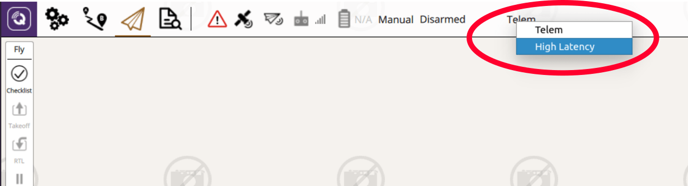

# Система супутникового зв'язку Iridium/RockBlock

Система супутникового зв'язку може використовуватись для забезпечення високого діапазону між наземною станцією та транспортним засобом.

Ця тема описує спосіб налаштування системи, яка використовує RockBlock як постачальника послуг для системи зв'язку зі супутниковими системами SBD.
З огляду на хорошу якість сигналу, користувачі можуть очікувати затримки від 10 до 15 секунд.

## Загальний огляд

Для посилання на супутникове зв'язку потрібні наступні компоненти:

- A [RockBlock 9603 Iridium Satellite Modem](https://www.iridium.com/products/rock-seven-rockblock-9603/) module connected to a Pixhawk flashed with the PX4 Autopilot.
- Сервер повторного повідомлення працює Ubuntu Linux.
- A ground station computer running _QGroundControl_ on Ubuntu Linux

Нижче показана вся архітектура системи:


:::info
The setup was tested with the current release of _QGroundControl_ running on Ubuntu 14.04 and 16.04.

- Можливо, можна запустити систему на інших наземних станціях і операційних системах, але це не було перевірено (і не гарантовано працює).
- The [RockBlock MK2](https://www.groundcontrol.com/us/product/rockblock-9602-satellite-modem/) module can also be used.
  Модуль RockBlock 9603 рекомендується оскільки він є меншим та легшим, одночасно забезпечує той самий функціонал.

:::

## Витрати

Посилання на посилання, що працює в Великобританії, складається з вартості оренди лінії та витрат на повідомлення:

- Кожен модуль повинен бути активований, який коштує 10,00 в місяць
- Each message transmitted over the system costs one _credit_ per 50 bytes.
  Пакети кредитів можна купити від RockBlock за £0.04-£0.11 за кредит, в залежності від розміру пакета.

Refer to the [RockBlock Documentation](https://docs.rockblock.rock7.com/docs) for a detailed explanation of the modules, running costs and _RockBlock_ in general.

## Налаштування транспорту

### Підключення

Підключіть модуль RockBlock до послідовного порту Pixhawk.
Через вимоги до живлення модуля його можна живити лише через високопотужний послідовний порт, оскільки для роботи необхідно максимум 0,5 А при 5 В.
Якщо жоден з них недоступний або вільний, то інший джерело живлення, яке має той самий рівень землі, що й Pixhawk і може забезпечити необхідну потужність, повинно бути налаштоване.
The details of the [connectors](https://docs.rockblock.rock7.com/docs/connectors) and the [power requirements](https://docs.rockblock.rock7.com/docs/power-supply) can be found in the RockBlock documentation.

### Модулі

Модуль може використовувати як внутрішню антену, так і зовнішню, підключену до роз'єму SMA.
To [switch between the two antennas modes](https://docs.rockblock.rock7.com/docs/switching-rockblock-9603-antenna-mode) the position of a small RF link cable needs to changed.
Якщо використовується зовнішня антена, завжди переконуйтеся, що антена підключена до модуля перед включенням живлення, щоб уникнути пошкодження модуля.

Стандартна швидкість передачі даних модуля - 19200. However, the PX4 _iridiumsbd_ driver requires a baud rate of 115200 so it needs to be changed using the [AT commands](https://www.groundcontrol.com/en/wp-content/uploads/2022/02/IRDM_ISU_ATCommandReferenceMAN0009_Rev2.0_ATCOMM_Oct2012.pdf).

1. Connect to the module with using a 19200/8-N-1 setting and check if the communication is working using the command: `AT`.
   The response should be: `OK`.

2. Змінити швидкість передачі:

   ```
   AT+IPR=9
   ```

3. Знову підключіться до моделі з параметрами 115200/8-N-1 і збережіть конфігурацію за допомогою:

   ```
   AT&W0
   ```

Модуль тепер готовий до використання з PX4.

### Програмне забезпечення

[Configure the serial port](../peripherals/serial_configuration.md) on which the RockBlock module will run using [ISBD_CONFIG](../advanced_config/parameter_reference.md#ISBD_CONFIG).
Немає потреби встановлювати швидкість передачі для порту, оскільки це налаштовано драйвером.

:::info
If the configuration parameter is not available in _QGroundControl_ then you may need to [add the driver to the firmware](../peripherals/serial_configuration.md#parameter_not_in_firmware):

```
drivers/telemetry/iridiumsbd
```

:::

## Налаштування RockBlock

При придбанні першого модуля на RockBlock спочатку потрібно створити обліковий запис користувача.

Log in to the [account](https://rockblock.rock7.com/Operations) and register the RockBlock module under the `My RockBLOCKs`.
Активуйте оренду лінії для модуля та переконайтеся, що на обліковому записі є достатньо кредитів для очікуваного часу польоту.
Якщо використовуються налаштування за замовчуванням, з апаратури відправляється одне повідомлення на хвилину на наземну станцію.

Створіть групу доставки для реле-сервера повідомлень та додайте модуль до цієї групи доставки:


## Налаштування сервера станції

Сервер relay має бути запущений або на Ubuntu 16.04 або 14.04 OS.

1. Сервер, який працює як ретранслятор повідомлень, повинен мати статичну IP-адресу та два загальнодоступних відкритих TCP-порти:

   - `5672` for the _RabbitMQ_ message broker (can be changed in the _rabbitmq_ settings)
   - `45679` for the HTTP POST interface (can be changed in the **relay.cfg** file)

2. Встановіть необхідні модулі python:

   ```sh
   sudo pip install pika tornado future
   ```

3. Install the `rabbitmq` message broker:

   ```sh
   sudo apt install rabbitmq-server
   ```

4. Налаштуйте облікові дані брокера (змініть PWD на ваш бажаний пароль):

   ```sh
   sudo rabbitmqctl add_user iridiumsbd PWD
   sudo rabbitmqctl set_permissions iridiumsbd ".*" ".*" ".*"
   ```

5. Clone the [SatComInfrastructure](https://github.com/acfloria/SatComInfrastructure.git) repository:

   ```sh
   git clone https://github.com/acfloria/SatComInfrastructure.git
   ```

6. Go to the location of the _SatComInfrastructure_ repo and configure the broker's queues:

   ```sh
   ./setup_rabbit.py localhost iridiumsbd PWD
   ```

7. Перевірте налаштування:

   ```sh
   sudo rabbitmqctl list_queues
   ```

   This should give you a list of 4 queues: `MO`, `MO_LOG`, `MT`, `MT_LOG`

8. Edit the `relay.cfg` configuration file to reflect your settings.

9. Запустіть скрипт реле в режимі відокремленого виконання:

   ```sh
   screen -dm bash -c 'cd SatcomInfrastructure/; ./relay.py
   ```

Інші інструкції включають:

- Від’єднати від екрану:

  ```sh
  ctrl+a d
  ```

- Припиніть виконання сценарію:

  ```sh
  ctrl+a :quit
  ```

- Знову приєднати до екрана:

  ```sh
  screen -dr
  ```

## Наземна станція

Для налаштування наземної станції:

1. Встановіть необхідні модулі python:

   ```sh
   sudo pip install pika tornado future
   ```

2. Клонуйте репозиторій SatComInfrastructure:

   ```sh
   git clone https://github.com/acfloria/SatComInfrastructure.git
   ```

3. Edit the **udp2rabbit.cfg** configuration file to reflect your settings.

4. [Install _QGroundControl_](https://docs.qgroundcontrol.com/master/en/qgc-user-guide/getting_started/download_and_install.html) (daily build).

5. Додавайте UDP з'єднання в QGC з параметрами:

   - Порт прослуховування: 10000
   - Цільові хости: 127.0.0.1:10001
   - Висока затримка: позначено

   

### Перевірка

1. Open a terminal on the ground station computer and change to the location of the _SatComInfrastructure_ repository.
   Then start the **udp2rabbit.py** script:

   ```sh
   ./udp2rabbit.py
   ```

2. Send a test message from [RockBlock Account](https://rockblock.rock7.com/Operations) to the created delivery group in the `Test Delivery Groups` tab.

If in the terminal where the `udp2rabbit.py` script is running within a couple of seconds the acknowledge for a message can be observed, then the RockBlock delivery group, the relay server and the udp2rabbit script are set up correctly:


## Запуск системи

1. Start _QGroundControl_.
   Спочатку вручну підключіть високо запізнюваний зв'язок, а потім звичайний телеметрійний зв'язок:

   

2. Open a terminal on the ground station computer and change to the location of the _SatComInfrastructure_ repository.
   Then start the **udp2rabbit.py** script:

   ```sh
   ./udp2rabbit.py
   ```

3. Увімкніть транспортний засіб.

4. Wait until the first `HIGH_LATENCY2` message is received on QGC.
   This can be checked either using the _MAVLink Inspector_ widget or on the toolbar with the _LinkIndicator_.
   If more than one link is connected to the active vehicle the _LinkIndicator_ shows all of them by clicking on the name of the shown link:

   

   Індикатор зв'язку завжди показує назву пріоритетного зв'язку.

5. Супутникова система зв'язку тепер готова до використання.
   Пріоритетний зв'язок, через який надсилаються команди, визначається наступними способами:

   - Якщо користувач не вказав зв'язок, звичайний радіо телеметрійний зв'язок віддається перевагу перед високозапізнюваним зв'язком.
   - Автопілот та QGC перехоплюватимуть звичайний радіо телеметрійний зв'язок на високозапізнюваний зв'язок, якщо транспортний засіб зброєний, а радіо телеметрійний зв'язок втрачений (не отримано жодного повідомлення MAVLink протягом певного часу).
     Як тільки радіо телеметрійний зв'язок відновлюється, QGC та автопілот повертаються до нього.
   - The user can select a priority link over the `LinkIndicator` on the toolbar.
     Це посилання зберігається як пріоритетне посилання, поки воно активне або користувач вибирає інше пріоритетне посилання:

     

## Усунення проблем

- Повідомлення з супутникового зв'язку від літака отримуються, але команди не можуть бути передані (транспортний засіб не реагує)
  - Перевірте налаштування реле-сервера і переконайтеся, що вони правильні, особливо IMEI.

- Повідомлення з супутникового зв'язку від літака не надходять на наземну станцію:

  - Check using the system console if the _iridiumsbd_ driver started and if it did that a signal from any satellite is received by the module:

    ```sh
    iridiumsbd status
    ```

  - Make sure using the verification steps from above that the relay server, the delivery group and the `udp2rabbit.py` script are set up correctly.

  - Перевірте, чи з'єднання активне, і чи налаштування в ньому правильні.

- Драйвер IridiumSBD не запускається:

  - Перезапустіть транспортний засіб.
    If that helps increase the sleep time in the `extras.txt` before the driver is started.
    Якщо це не допомагає, переконайтеся, що Pixhawk і модуль мають одинаковий рівень ґрунту. Підтвердіть також, що швидкість передачі даних модуля встановлена на 115200.

- Перше повідомлення отримане на землі, але як тільки транспортний засіб літає, жодне повідомлення не може бути передане, або затримка значно збільшується (в розмірах хвилин)
  - Перевірте якість сигналу після польоту.
    Якщо вона зменшується під час польоту, і ви використовуєте внутрішню антену, розгляньте можливість використання зовнішньої антени.
    Якщо ви вже використовуєте зовнішню антену, спробуйте віддалити антену якнайдалі від будь-якої електроніки або будь-якого обладнання, яке може перешкоджати сигналу.
    Також переконайтеся, що антена не пошкоджена.
