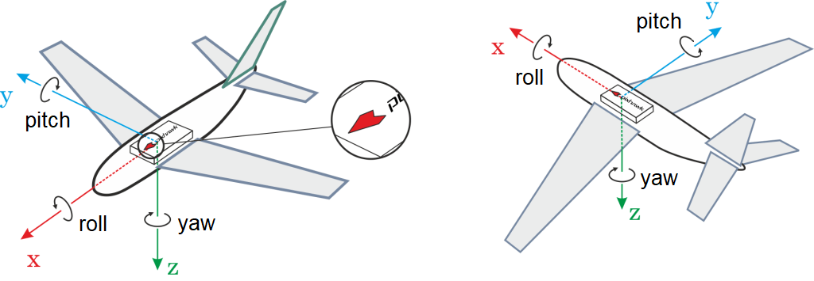

# Монтаж Політного Контролера

Політний контролер слід розташувати на рамі якомога ближче до центру маси (CoG), верхньою стороною вгору, та орієнтувати так, щоб _стрілка позначки курсу_ вказувала на передню частину апарату. Часто необхідна [віброізоляція](#vibration-isolation), тому слід дотримуватися рекомендацій виробника. Якщо змонтовано таким чином, подальша конфігурація PX4 не потрібна.

## Орієнтація

Майже у всіх контролерів польоту є _стрілка маркування напрямку_ (показана нижче). Контролер повинен бути розміщений на верхній стороні рами, орієнтований таким чином, щоб стрілка вказувала вперед транспортного засобу (на всіх рамах повітряних суден - літак, багатокоптер, VTOL, наземні транспортні засоби тощо).

:::info Якщо контролер не може бути встановлений у рекомендованому/стандартному положенні через фізичні обмеження, вам потрібно налаштувати програмне забезпечення автопілота з орієнтацією, яку ви дійсно використали: [Орієнтація Польотного Контролера](../config/flight_controller_orientation.md).
:::

## Положення

Контролер польоту повинен бути розміщений на рамці якнайближче до центру ваги.

Якщо ви не можете встановити контролер у цьому положенні, то вам слід [налаштувати](../advanced_config/parameters.md) наступні параметри для встановлення зміщення відносно ЦТТ: [EKF2_IMU_POS_X](../advanced_config/parameter_reference.md#EKF2_IMU_POS_X), [EKF2_IMU_POS_Y](../advanced_config/parameter_reference.md#EKF2_IMU_POS_Y), [EKF2_IMU_POS_Z](../advanced_config/parameter_reference.md#EKF2_IMU_POS_Z) (для типового оцінювача EKF2).

Зверніть увагу, що якщо ви не встановите ці зміщення, то оцінки положення / швидкості EKF2 будуть відображатися на місці його розташування, а не в ЦМ. Це може призвести до небажаних коливань, залежно від того, наскільки далеко знаходиться IMU від CoG.

:::details
Пояснення
Щоб зрозуміти вплив відсутності встановлення цих зміщень, розгляньте випадок, коли контролер польоту (IMU) знаходиться спереду CoG, ви летите в режимі позиції, і відбувається впередній кидковий рух навколо CoG.
Оцінка висоти зменшиться, оскільки IMU фактично рухалася вниз.
Як реакцію, контролер висоти надасть більше тяги для компенсації.
Амплітуда залежить від того, наскільки далеко знаходиться IMU від CoG.
Можливо, це може бути незначним, але це все ще деякий непотрібний зусилля по контролю, яке постійно застосовується.
Якщо вказані зміщення, чистий рух висоти не створить жодних змін у приблизній оцінці, тому буде менше паразитних коригувань.
:::

## Віброізоляція

Плати управління польотом з вбудованими акселерометрами або гіроскопами чутливі до вібрацій. Деякі плати включають вбудовану віброізоляцію, тоді як інші постачаються з _монтажною піною_, яку ви можете використовувати для ізоляції контролера від транспортного засобу.

 _Піна для поглинання вібрації_

Ви повинні використовувати стратегію монтажу, рекомендовану у документації вашого контролера польоту.

:::tip
[Аналіз Логів за допомогою Flight Review > Вібрація](../log/flight_review.md#vibration) пояснює, як використовувати логи для підтвердження того, чи є вібрація ймовірною причиною проблем з польотом.
:::
