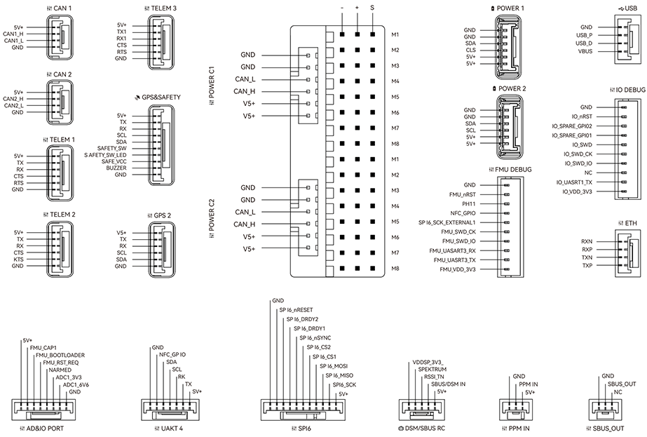

# Швидке підключення CUAV Pixhawk V6X

This quick start guide shows how to power the [Pixhawk V6X&reg;](../flight_controller/cuav_pixhawk_v6x.md) flight controller and connect its most important peripherals.

## Огляд схеми підключення

На зображенні нижче показано, як під'єднати найважливіші датчики та периферійні пристрої (за винятком виходів мотора та сервоприводів).
Ми розглянемо кожну з них докладно в наступних розділах.

| Інтерфейс                        | **Function**                                                                                                                                                                                                                             |
| :------------------------------- | :--------------------------------------------------------------------------------------------------------------------------------------------------------------------------------------------------------------------------------------- |
| POWER C1                         | Підключіть CAN PMU SE до цього інтерфейсу; цей інтерфейс підключений до модуля живлення UAVCAN                                                                                                                                           |
| POWER C2                         | Підключіть CAN PMU SE до цього інтерфейсу; цей інтерфейс підключений до модуля живлення UAVCAN                                                                                                                                           |
| POWER 1                          | Підключіть модуль живлення SMbus (I2C)                                                                                                                                                                                |
| POWER 2                          | Підключіть модуль живлення SMbus (I2C)                                                                                                                                                                                |
| GPS&SAFETY   | Підключіть Neo серії GPS/C-RTK 9PS, включаючи GPS, запобіжний вимикач, інтерфейс зумера.                                                                                                                                 |
| GPS2                             | Підключіть модуль GPS/RTK                                                                                                                                                                                                                |
| UART 4                           | Користувацькі налаштування                                                                                                                                                                                                               |
| TELEM (1,2,3) | Підключіть телеметрію або пристрої MAVLink                                                                                                                                                                                               |
| TF CARD                          | Карта SD для зберігання журналів (карта попередньо вставлена на заводі).                                                                                                                              |
| M1~M8            | Вихідний IO PWM (для підключення до ESC і Servo)                                                                                                                                                                      |
| A1~A8            | FMU PWM вивід. Може бути визначено як PWM/GPIO; підтримує dshot; використовується для підключення затвора камери/гарячого черевика, сервоприводу тощо.                                                   |
| USB                              | Під'єднати до комп'ютера для зв'язку між контролером польоту та комп'ютером, наприклад, як завантаження прошивки.                                                                                                        |
| CAN1/CAN2                        | Підключає пристрої Dronecan/UAVCAN, такі як NEO3 Pro.                                                                                                                                                                    |
| DSM/SUB/RSSI                     | Включає інтерфейси введення сигналів DSM, SBUS, RSSI, інтерфейс DSM може бути підключений до супутникового приймача DSM, інтерфейс SBUS - до приймача дистанційного керування SBUS, RSSI - для модуля зворотного повернення сили сигналу |
| PPM                              | Підключення PPM RC Receiver                                                                                                                                                                                                              |
| ETH                              | Інтерфейс Ethernet. Підключіть пристрої Ethernet, такі як комп'ютери завдань                                                                                                                                             |
| AD&IO        | Є два аналогових входи (ADC3.3/ADC6.6); зазвичай не використовуються                                                                                                                  |

## Передній бампер

:::info
If the controller cannot be mounted in the recommended/default orientation (e.g. due to space constraints) you will need to configure the autopilot software with the orientation that you actually used: [Flight Controller Orientation](../config/flight_controller_orientation.md).
:::

## GPS + Compass + Buzzer + Safety Switch + LED

The Pixhawk&reg; V6X can be purchased with a [NEO3 GPS](https://store.cuav.net/shop/neo-3/) (10-pin connector) and should be connected to the **GPS1** port.
Ці модулі GNSS мають вбудований компас, безпечний перемикач, дзвіночок та світлодіод.

If you need to use assisted GPS, connect to the **GPS2** port.

The GPS/compass should be [mounted on the frame](../assembly/mount_gps_compass.md) as far away from other electronics as possible, with the direction markings towards the front of the vehicle (separating the compass from other electronics will reduce interference).

:::info
Pixhawk V6X&amp;reg; is not compatible with NEO V2 GPS built-in buzzer: you should use [NEO3/NEO 3Pro](https://store.cuav.net/shop/neo-3/) instead.
The GPS module's integrated safety switch is enabled _by default_ (when enabled, PX4 will not let you arm the vehicle).
Щоб вимкнути безпеку, натисніть і утримуйте безпечний вимикач протягом 1 секунди.
Ви можете натиснути безпечний вимикач знову, щоб увімкнути безпеку та відключити транспортний засіб (це може бути корисно, якщо, з якихось причин, ви не можете вимкнути транспортний засіб за допомогою вашого пульта дистанційного керування або наземної станції).
:::

## Радіоуправління

A remote control (RC) radio system is required if you want to _manually_ control your vehicle (PX4 does not require a radio system for autonomous flight modes).

You will need to [select a compatible transmitter/receiver](../getting_started/rc_transmitter_receiver.md) and then _bind_ them so that they communicate (read the instructions that come with your specific transmitter/receiver).

- Spektrum/DSM receivers connect to the **DSM/SBUS** input.
- PPM receivers connect to the **PPM** input port.

For more information about selecting a radio system, receiver compatibility, and binding your transmitter/receiver pair, see: [Remote Control Transmitters & Receivers](../getting_started/rc_transmitter_receiver.md).

## Power

Pixhawk V6X&reg; обладнаний модулем CAN PMU lite, який підтримує літійну батарею від 3 до 14s.
Connect the 6pin connector of the module to the flight control **Power C1** or **Power C2** interface.

_Pixhawk V6X_ power port receives Dronecan digital signal from CAN PMU lite power module for voltage, current and remaining battery data, the VCC line must provide at least 3A continuous current and should default to 5.2V.
Нижчий напруга 5V все ще прийнятний, але не рекомендується.

## Телеметрійна (радіо) система

[Telemetry radios](../telemetry/index.md) may be used to communicate and control a vehicle in flight from a ground station (for example, you can direct the UAV to a particular position, or upload a new mission).

The vehicle-based radio should be connected to the **TELEM1**/**TELEM2**/**TELEM3** port as shown below (if connected to **TELEM1**, no further configuration is required).
Інша радіостанція підключається до вашого комп'ютера або мобільного пристрою наземної станції (зазвичай за допомогою USB).

You can also purchase telemetry radios from the [CUAV store](https://store.cuav.net/uav-telemetry-module/).

## SD-карта

SD cards are highly recommended as they are required for [recording and analyzing flight details](../getting_started/flight_reporting.md), running tasks and using UAVCAN bus hardware.
Карта пам'яті SD вже встановлена на Pixhawk V6X&reg;, коли вона залишає фабрику.

:::tip
For more information see [Basic Concepts > SD Cards (Removable Memory)](../getting_started/px4_basic_concepts.md#sd-cards-removable-memory).
:::

## Мотори/Сервоприводи

Motors/servos are connected to the **M1~M8** (**MAIN**) and **A1~A8** (**AUX**) ports in the order specified for your vehicle in the [Airframe Reference](../airframes/airframe_reference.md).

:::info
The **MAIN** outputs in the PX4 firmware are mapped to the Pixhawk V6X's M1~M8 ports (from IO), while the **AUX outputs** are mapped to the A1~A8 ports (from the FMU).
For example, **MAIN1** maps to M1 pin and **AUX1** maps to A1 pin.
Цей довідник містить зіставлення портів виводу до моторів/сервоприводів для всіх підтримуваних повітряних та наземних шасі (якщо ваше шасі не вказане в довіднику, то використовуйте "загальний" планер відповідного типу).
:::

:::warning
Відображення не є однорідним для всіх конструкцій (наприклад, ви не можете покладатися на те, що ручка газу буде на тому ж вихідному порту для всіх повітряних конструкцій).
Переконайтеся, що ви використовуєте правильне зіставлення для вашого апарату.
:::

## Джерело живлення для сервоприводу

Pixhawk V6X&reg; не подає живлення на сервоприводи.
Якщо використовується літак або ровер, до будь-якої з контактів живлення (+) в M1~M8/A1~A8 потрібно підключити зовнішній BEC (наприклад, ESC з BEC або окремий BEC на 5 В або акумулятор LiPo на 2S) для керування сервоприводами.

:::info
The power rail voltage must be appropriate for the servo being used!
:::

## Інші периферійні пристрої

The wiring and configuration of optional/less common components is covered within the topics for individual [peripherals](../peripherals/index.md).

## Схема розташування виводів

## Налаштування

General configuration information is covered in: [Autopilot Configuration](../config/index.md).

QuadPlane specific configuration is covered here: [QuadPlane VTOL Configuration](../config_vtol/vtol_quad_configuration.md)

## Подальша інформація

- [CUAV Docs](https://doc.cuav.net/) (CUAV)
- [Pixhawk V6X](../flight_controller/cuav_pixhawk_v6x.md) (PX4 Doc Overview page)
- [Pixhawk Autopilot FMUv6X Standard](https://github.com/pixhawk/Pixhawk-Standards/blob/master/DS-012%20Pixhawk%20Autopilot%20v6X%20Standard.pdf)
- [Pixhawk Autopilot Bus Standard](https://github.com/pixhawk/Pixhawk-Standards/blob/master/DS-010%20Pixhawk%20Autopilot%20Bus%20Standard.pdf)
- [Pixhawk Connector Standard](https://github.com/pixhawk/Pixhawk-Standards/blob/master/DS-009%20Pixhawk%20Connector%20Standard.pdf)
