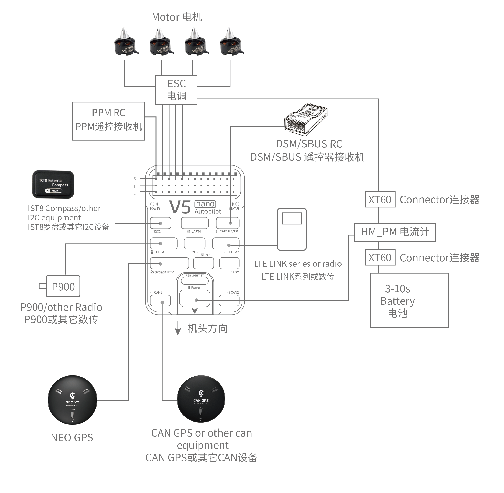

# Швидке підключення CUAV V5 nano

:::warning PX4 не виробляє цей (або будь-який інший) автопілот. Звертайтесь до [виробника](https://store.cuav.net/) щодо питань апаратного забезпечення або питань відповідності.
:::

Цей швидка інструкція показує, як живити польовий контролер [CUAV V5 nano](../flight_controller/cuav_v5_nano.md) та під'єднати його найважливіші периферійні пристрої.

## Огляд схеми підключення

На зображенні нижче показано, як під'єднати найважливіші датчики та периферійні пристрої (за винятком виходів мотора та сервоприводів). Ми розглянемо кожну з них докладно в наступних розділах.

| Основний інтерфейс | Функція                                                                                                                                                                                                                               |
|:------------------ |:------------------------------------------------------------------------------------------------------------------------------------------------------------------------------------------------------------------------------------- |
| Живлення           | Під'єднати модуль живлення; Надає живлення та виміри напруги та струму ANALOG.                                                                                                                                                        |
| PM2                | [Не використовуйте з PX4](../flight_controller/cuav_v5_nano.md#compatibility_pm2)                                                                                                                                                     |
| TF CARD            | Карта SD для зберігання logs (постачається з картою)                                                                                                                                                                                  |
| M1~M8              | PWM виходи. Може бути використаний для управління двигунами або сервоприводами.                                                                                                                                                       |
| A1~A3              | Capture pins (not _currently_ supported on PX4).                                                                                                                                                                                      |
| nARMED             | Вказує на стан зброєння FMU. Це активне низьке (низьке під час увімкнення).                                                                                                                                                           |
| DSU7               | Використовується для дебагінгу FMU, читання інформації щодо дебагінгу.                                                                                                                                                                |
| I2C2/I2C3/I2C4     | Підключає пристрій I2C, такий як зовнішній компас.                                                                                                                                                                                    |
| CAN1/CAN2          | Підключає пристрої UAVCAN, такі як CAN GPS.                                                                                                                                                                                           |
| TYPE-C\(USB\)    | Під'єднатися до комп'ютера для зв'язку між контролером польоту та комп'ютером, наприклад, як завантаження прошивки                                                                                                                    |
| GPS&SAFETY         | Приєднайтесь до Neo GPS, який містить GPS, перемикач безпеки, інтерфейс зумовлювача.                                                                                                                                                  |
| TELEM1/TELEM2      | Під'єднатися до системи телеметрії.                                                                                                                                                                                                   |
| DSM/SBUS/RSSI      | Включає інтерфейси введення сигналів DSM, SBUS, RSSI, інтерфейс DSM може бути підключений до приймача DSM-супутника, інтерфейс SBUS - до приймача дистанційного керування SBUS, RSSI - для модуля зворотного повернення сили сигналу. |

::: інформація Для отримання додаткової інформації про інтерфейс, будь ласка, прочитайте [Посібник з V5 nano](http://manual.cuav.net/V5-nano.pdf).
:::

:::info Якщо контролер не може бути змонтований в рекомендованій/стандартній орієнтації (наприклад, через обмеження місця), вам потрібно буде налаштувати програмне забезпечення автопілота з орієнтацією, яку ви фактично використовували: [Орієнтація контролера польоту](../gps_compass/rtk_gps.md).
:::

## GPS + Компас + Безпечний вимикач + Світлодіоди

Рекомендованим модулем GPS є _Neo v2 GPS_, який містить GPS, компас, запобіжний вимикач, зумер, світлодіодний індикатор статусу.

:::info Інші модулі GPS можуть не працювати (див. [цю проблему сумісності](../flight_controller/cuav_v5_nano.md#compatibility_gps))).
:::

Модуль GPS/Компас слід [монтувати на раму](../assembly/mount_gps_compass.md) якомога подалі від інших електронних пристроїв, з напрямком вперед транспортного засобу (стрілка Neo GPS спрямована в тому ж напрямку, що й стрілка керування польотом). Під'єднайтеся до інтерфейсу GPS контролера польоту за допомогою кабелю.

:::info
Якщо ви використовуєте CAN GPS, будь ласка, використовуйте кабель для підключення до інтерфейсу CAN контролера польоту.
:::

## Запобіжний перемикач

Спеціальний запобіжний вимикач, який поставляється з V5+, потрібен лише у випадку, якщо ви не використовуєте рекомендований _GPS Neo V2_ (у якому вбудований запобіжний вимикач).

Якщо ви літаєте без GPS, ви повинні прикріпити вимикач безпосередньо до порту `GPS1`, щоб мати можливість озброїти рухомий засіб і летіти (якщо ви використовуєте старий GPS з 6 контактами, будь ласка, прочитайте визначення нижнього інтерфейсу для зміни лінії).

## Зумер

Якщо ви не використовуєте рекомендований _Neo v2 GPS_, зумер може не працювати.

## Радіоуправління

Для ручного керування вашим апаратом потрібна система дистанційного керування радіо (RC) (PX4 не вимагає наявності системи радіо для автономних режимів польоту). Вам буде потрібно вибрати сумісний передавач/приймач та потім зв'язати їх, щоб вони взаємодіяли (прочитайте інструкції, що додаються до вашого конкретного передавача/приймача).

На малюнку нижче показано, як ви можете отримати доступ до вашого віддаленого приймача (знайдіть кабель S.Bus у комплекті)

## Супутникові приймачі Spektrum

V5 nano має присвячений кабель DSM. Якщо використовується супутниковий приймач Spektrum, його слід підключити до інтерфейсу `DSM/SBUS/RSSI` контролера польоту.

## Потужність

Набір _v5 nano_ включає модуль _HV_PM_, який підтримує LiPo-акумулятори від 2 до 14S. Підключіть 6-контактний роз'єм модуля _HW_PM_ до інтерфейсу живлення керування польотом `Power`.

:::warning
Наданий модуль живлення не захищений від перегріву. Живлення **повинне** бути вимкнене при підключенні периферійних пристроїв.
:::

:::info
Модуль живлення не є джерелом живлення для периферійних пристроїв, підключених до виходів PWM.
Якщо ви підключаєте сервоприводи / приводи, вам потрібно окремо живити їх за допомогою BEC.
:::

## Система телеметрії (Опціонально)

Система телеметрії дозволяє вам спілкуватися, контролювати та управляти транспортним засобом у польоті з наземної станції (наприклад, ви можете направляти БПЛА до певної позиції або завантажувати нове завдання).

Канал зв'язку здійснюється через телеметричні радіостанції. Радіостанцію, розташовану на транспортному засобі, слід підключити до порту **TELEM1** або **TELEM2** (якщо підключено до цих портів, додаткова конфігурація не потрібна). Інша радіостанція підключається до вашого комп'ютера або мобільного пристрою наземної станції (зазвичай через USB).

## SD-карта (Опціонально)

[SD-картку](../getting_started/px4_basic_concepts.md#sd-cards-removable-memory) вставляють на заводі (вам нічого не потрібно робити).

## Двигуни

Мотори/сервоприводи підключені до портів MAIN в порядку, вказаному для вашого апарату в [Довіднику планерів](../airframes/airframe_reference.md).

## Схема розташування виводів

## Детальна інформація

- [Журнал збірки конструкції повітряного каркасу за допомогою CUAV v5 nano на рамі DJI FlameWheel450](../frames_multicopter/dji_f450_cuav_5nano.md)
- [CUAV V5 nano ](../flight_controller/cuav_v5_nano.md)
- [Посібник з V5 Nano](http://manual.cuav.net/V5-nano.pdf) (CUAV)
- [Схема роз'ємів для посилання на FMUv5](https://docs.google.com/spreadsheets/d/1-n0__BYDedQrc_2NHqBenG1DNepAgnHpSGglke-QQwY/edit#gid=912976165) (CUAV)
- [CUAV Github](https://github.com/cuav) (CUAV)
