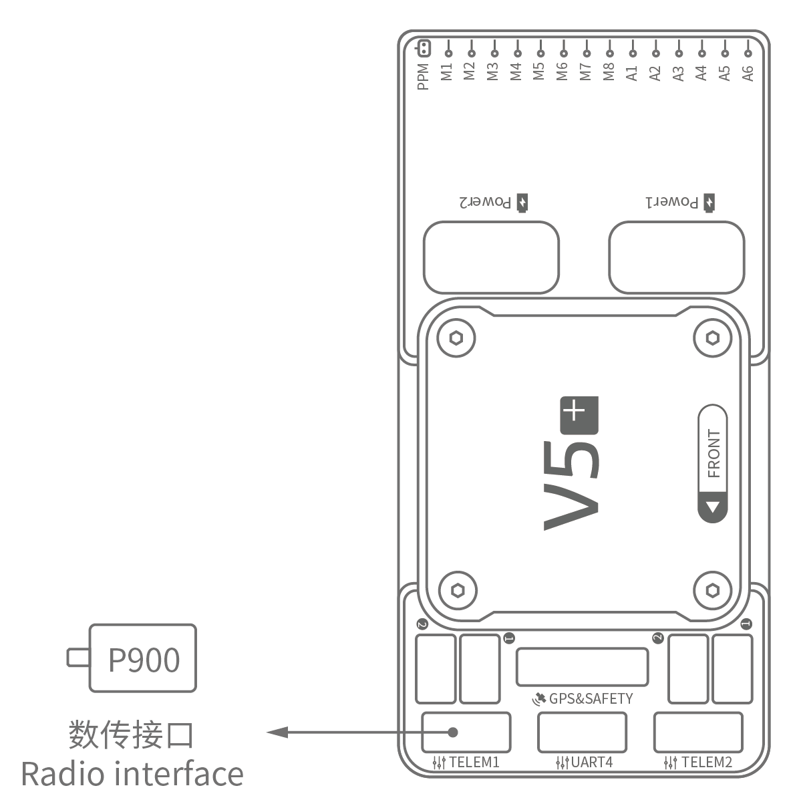

# Короткий посібник з підключення CUAV V5+

:::warning PX4 не виробляє цей (чи будь-який) автопілот. Зверніться до [виробника](https://store.cuav.net/) щодо питань технічної підтримки або відповідності вимогам.
:::

Цей короткий посібник показує, як живити польотний контролер [CUAV V5+](../flight_controller/cuav_v5_plus.md) та під'єднати його найважливіші периферійні пристрої.

## Огляд схеми підключення

На зображенні нижче показано, як під'єднати найважливіші датчики та периферійні пристрої (за винятком виходів мотора та сервоприводів). Ми розглянемо кожен з них детально в наступних розділах.

| Основний інтерфейс | Функція                                                                                                                                                                                                                                   |
|:------------------ |:----------------------------------------------------------------------------------------------------------------------------------------------------------------------------------------------------------------------------------------- |
| Power1             | Підключає модуль живлення. Вхід живлення з детекцією _аналогової_ напруги та струму. Не використовуйте Digital PM на цьому роз'ємі!                                                                                                       |
| Power2             | Підключає i2c розумну батарею.                                                                                                                                                                                                            |
| TF CARD            | Карта SD для зберігання журналів (карта попередньо вставлена на заводі).                                                                                                                                                                  |
| M1~M8              | ШІМ виходи. Можна використовувати для контролю моторів чи сервоприводів.                                                                                                                                                                  |
| A1~A6              | ШІМ виходи. Можна використовувати для контролю моторів чи сервоприводів.                                                                                                                                                                  |
| DSU7               | Використовується для дебагінгу FMU, читання інформації щодо дебагінгу.                                                                                                                                                                    |
| І2C1/I2C2          | Connect an I2C device such as an external compass.                                                                                                                                                                                        |
| CAN1/CAN2          | Connect UAVCAN devices such as CAN GPS.                                                                                                                                                                                                   |
| TYPE-C\(USB\)    | Під'єднати до комп'ютера для зв'язку між контролером польоту та комп'ютером, наприклад, як завантаження прошивки.                                                                                                                         |
| SBUS OUT           | Підключає пристрої SBUS (наприклад, камери з карданним підвісом).                                                                                                                                                                         |
| GPS&SAFETY         | Приєднайтесь до Neo GPS, який містить GPS, запобіжний вимикач, інтерфейс зумера.                                                                                                                                                          |
| TELEM1/TELEM2      | Під'єднатися до системи телеметрії.                                                                                                                                                                                                       |
| DSM/SBUS/RSSI      | Включає інтерфейси введення сигналів DSM, SBUS, RSSI, інтерфейс DSM може бути підключений до супутникового приймача DSM, інтерфейс SBUS - до приймача дистанційного керування SBUS, RSSI - для модуля зворотного повернення сили сигналу. |

::: info Для отримання додаткової інформації про інтерфейс, будь ласка, прочитайте [Посібник з V5+](http://manual.cuav.net/V5-Plus.pdf).
:::

::: info Якщо контролер не може бути встановлений у рекомендованому/стандартному положенні (наприклад, через обмеження простору), вам потрібно налаштувати програмне забезпечення автопілота з орієнтацією, яку ви дійсно використали: [Орієнтація Польотного Контролера](../gps_compass/rtk_gps.md).
:::

## GPS + Компас + Запобіжний вимикач + LED

Рекомендованим модулем GPS є _Neo v2 GPS_, який містить GPS, компас, запобіжний вимикач, зумер, світлодіодний індикатор статусу.

::: info Інші модулі GPS можуть не працювати (див. [цю проблему сумісності](../flight_controller/cuav_v5_nano.md#compatibility_gps))).
:::

Модуль GPS/Компасу слід [монтувати на раму](../assembly/mount_gps_compass.md) якомога далі від інших електронних пристроїв, з маркером напрямку до передньої частини транспортного засобу (стрілка _Neo v2 GPS_ спрямована в тому ж напрямку, що і стрілка управління польотами). Під'єднайтеся до інтерфейсу GPS контролера польоту за допомогою кабелю.

Якщо ви використовуєте [NEO V2 PRO GNSS (CAN GPS)](http://doc.cuav.net/gps/neo-series-gnss/en/neo-v2-pro.html), будь ласка, використовуйте кабель для підключення до інтерфейсу CAN контролера польоту.
:::

## Запобіжний вимикач

Спеціальний запобіжний вимикач, який поставляється з V5+, потрібен лише у випадку, якщо ви не використовуєте рекомендований _GPS Neo V2_ (у якому вбудований запобіжний вимикач).

Якщо ви літаєте без GPS, ви повинні прикріпити вимикач безпосередньо до порту `GPS1`, щоб мати можливість озброїти рухомий засіб і летіти (якщо ви використовуєте старий GPS з 6 контактами, будь ласка, прочитайте визначення нижнього інтерфейсу для зміни лінії).

## Зумер

Якщо ви не використовуєте рекомендований GPS, зумер може не працювати.

## Радіоуправління

Для того щоб керувати транспортним засобом вручну, потрібна система радіоуправління (RC) (PX4 не потребує системи радіоуправління для автономних режимів польоту). Вам буде потрібно вибрати сумісний передавач/приймач і зв'язати їх таким чином, щоб вони комунікували (ознайомтеся з інструкціями, що додаються до вашого конкретного передавача/приймача).

На малюнку нижче показано, як ви можете отримати доступ до вашого віддаленого приймача (знайдіть кабель SBUS у комплекті).

## Супутникові приймачі Spektrum

V5+ має присвячений кабель DSM. Якщо використовується супутниковий приймач Spektrum, його слід підключити до інтерфейсу DSM/SBUS/RSSI контролера польоту.

## Живлення

Набір V5+ включає модуль _HV_PM_, який підтримує LiPo-акумулятори від 2 до 14S. Підключіть 6-контактний роз'єм модуля _HW_PM_ до інтерфейсу живлення керування польотом `Power1`.

:::warning
The supplied power module is unfused. Живлення **повинне** бути вимкнене при підключенні периферійних пристроїв.
:::

::: info
Модуль живлення не є джерелом живлення для периферійних пристроїв, підключених до виходів ШІМ.
If you're connecting servos/actuators you will need to separately power them using a BEC.
:::

## Система телеметрії (Опціонально)

Система телеметрії дозволяє вам спілкуватися, спостерігати та керувати рухомим засобом у польоті з наземної станції (наприклад, ви можете направляти БПЛА в певне положення або завантажувати нове завдання).

The communication channel is via Telemetry Radios. The vehicle-based radio should be connected to either the `TELEM1` or `TELEM2` port (if connected to these ports, no further configuration is required). The other radio is connected to your ground station computer or mobile device (usually via USB).

## SD Card (Optional)

An [SD card](../getting_started/px4_basic_concepts.md#sd-cards-removable-memory) is inserted in the factory (you do not need to do anything).

## Motors

Motors/servos are connected to the MAIN and AUX ports in the order specified for your vehicle in the [Airframes Reference](../airframes/airframe_reference.md).

## Pinouts

Download **V5+** pinouts from [here](http://manual.cuav.net/V5-Plus.pdf).

## Further Information

- [Airframe build-log using CUAV v5+ on a DJI FlameWheel450](../frames_multicopter/dji_f450_cuav_5plus.md)
- [CUAV V5+ Manual](http://manual.cuav.net/V5-Plus.pdf) (CUAV)
- [CUAV V5+ docs](http://doc.cuav.net/flight-controller/v5-autopilot/en/v5+.html) (CUAV)
- [FMUv5 reference design pinout](https://docs.google.com/spreadsheets/d/1-n0__BYDedQrc_2NHqBenG1DNepAgnHpSGglke-QQwY/edit#gid=912976165) (CUAV)
- [CUAV Github](https://github.com/cuav) (CUAV)
- [Base board design reference](https://github.com/cuav/hardware/tree/master/V5_Autopilot/V5%2B/V5%2BBASE) (CUAV)
