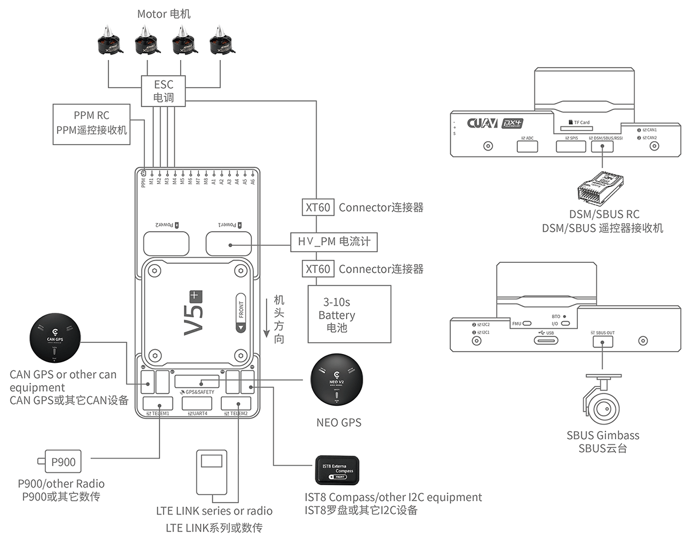

# Короткий посібник з підключення CUAV V5+

:::warning PX4 не виробляє цей (чи будь-який) автопілот. Зверніться до [виробника](https://store.cuav.net/) щодо питань технічної підтримки або відповідності вимогам.
:::

Цей короткий посібник показує, як живити польотний контролер [CUAV V5+](../flight_controller/cuav_v5_plus.md) та під'єднати його найважливіші периферійні пристрої.

## Огляд схеми підключення

На зображенні нижче показано, як під'єднати найважливіші датчики та периферійні пристрої (за винятком виходів мотора та сервоприводів). Ми розглянемо кожен з них детально в наступних розділах.

| Основний інтерфейс | Функція                                                                                                                                                                                            |
|:------------------ |:-------------------------------------------------------------------------------------------------------------------------------------------------------------------------------------------------- |
| Power1             | Підключає модуль живлення. Вхід живлення з детекцією _аналогової_ напруги та струму. Не використовуйте Digital PM на цьому роз'ємі!                                                                |
| Power2             | Підключає i2c розумну батарею.                                                                                                                                                                     |
| TF CARD            | SD card for log storage (card pre-inserted in factory).                                                                                                                                            |
| M1~M8              | PWM outputs. Can be used to control motors or servos.                                                                                                                                              |
| A1~A6              | PWM outputs. Can be used to control motors or servos.                                                                                                                                              |
| DSU7               | Used for FMU debug, reading debug information.                                                                                                                                                     |
| I2C1/I2C2          | Connect an I2C device such as an external compass.                                                                                                                                                 |
| CAN1/CAN2          | Connect UAVCAN devices such as CAN GPS.                                                                                                                                                            |
| TYPE-C\(USB\)    | Connect to a computer for communication between the flight controller and the computer, such as loading firmware.                                                                                  |
| SBUS OUT           | Connect SBUS devices (e.g. camera gimbals).                                                                                                                                                        |
| GPS&SAFETY         | Connect to Neo GPS, which includes GPS, safety switch, buzzer interface.                                                                                                                           |
| TELEM1/TELEM2      | Connect to the Telemetry System.                                                                                                                                                                   |
| DSM/SBUS/RSSI      | Includes DSM, SBUS, RSSI signal input interface, DSM interface can be connected to DSM satellite receiver, SBUS interface to SBUS remote control receiver, RSSI for signal strength return module. |

::: info Для отримання додаткової інформації про інтерфейс, будь ласка, прочитайте [Посібник з V5+](http://manual.cuav.net/V5-Plus.pdf).
:::

::: info Якщо контролер не може бути встановлений у рекомендованому/стандартному положенні (наприклад, через обмеження простору), вам потрібно налаштувати програмне забезпечення автопілота з орієнтацією, яку ви дійсно використали: [Орієнтація Польотного Контролера](../gps_compass/rtk_gps.md).
:::

## GPS + Компас + Запобіжний вимикач + LED

Рекомендованим модулем GPS є _Neo v2 GPS_, який містить GPS, компас, запобіжний вимикач, зумер, світлодіодний індикатор статусу.

::: info Інші модулі GPS можуть не працювати (див. [цю проблему сумісності](../flight_controller/cuav_v5_nano.md#compatibility_gps))).
:::

Модуль GPS/Компасу слід [монтувати на раму](../assembly/mount_gps_compass.md) якомога далі від інших електронних пристроїв, з маркером напрямку до передньої частини транспортного засобу (стрілка _Neo v2 GPS_ спрямована в тому ж напрямку, що і стрілка управління польотами). Під'єднайтеся до інтерфейсу GPS контролера польоту за допомогою кабелю.

Якщо ви використовуєте [NEO V2 PRO GNSS (CAN GPS)](http://doc.cuav.net/gps/neo-series-gnss/en/neo-v2-pro.html), будь ласка, використовуйте кабель для підключення до інтерфейсу CAN контролера польоту.
:::

## Запобіжний вимикач

The dedicated safety switch that comes with the V5+ is only required if you are not using the recommended _Neo V2 GPS_ (which has an inbuilt safety switch).

If you are flying without the GPS you must attach the switch directly to the `GPS1` port in order to be able to arm the vehicle and fly (if you use the old 6-pin GPS, please read the definition of the bottom interface to change the line).

## Buzzer

If you do not use the recommended GPS, the buzzer may not work.

## Radio Control

A remote control (RC) radio system is required if you want to manually control your vehicle (PX4 does not require a radio system for autonomous flight modes). You will need to select a compatible transmitter/receiver and then bind them so that they communicate (read the instructions that come with your specific transmitter/receiver).

The figure below shows how you can access your remote receiver (please find the SBUS cable in the kit).

## Spektrum Satellite Receivers

The V5+ has a dedicated DSM cable. If using a Spektrum satellite receiver, this should be connected to the flight controller DSM/SBUS/RSSI interface.

## Power

The V5+ kit includes the _HV_PM_ module, which supports 2~14S LiPo batteries. Connect the 6pin connector of the _HW_PM_ module to the flight control `Power1` interface.

:::warning
The supplied power module is unfused. Power **must** be turned off while connecting peripherals.
:::

::: info
The power module is not a power source for peripherals connected to the PWM outputs.
If you're connecting servos/actuators you will need to separately power them using a BEC.
:::

## Telemetry System (Optional)

A telemetry system allows you to communicate with, monitor, and control a vehicle in flight from a ground station (for example, you can direct the UAV to a particular position, or upload a new mission).

The communication channel is via Telemetry Radios. The vehicle-based radio should be connected to either the `TELEM1` or `TELEM2` port (if connected to these ports, no further configuration is required). The other radio is connected to your ground station computer or mobile device (usually via USB).

## SD Card (Optional)

An [SD card](../getting_started/px4_basic_concepts.md#sd-cards-removable-memory) is inserted in the factory (you do not need to do anything).

## Motors

Motors/servos are connected to the MAIN and AUX ports in the order specified for your vehicle in the [Airframes Reference](../airframes/airframe_reference.md).

## Pinouts

Download **V5+** pinouts from [here](http://manual.cuav.net/V5-Plus.pdf).

## Further Information

- [Airframe build-log using CUAV v5+ on a DJI FlameWheel450](../frames_multicopter/dji_f450_cuav_5plus.md)
- [CUAV V5+ Manual](http://manual.cuav.net/V5-Plus.pdf) (CUAV)
- [CUAV V5+ docs](http://doc.cuav.net/flight-controller/v5-autopilot/en/v5+.html) (CUAV)
- [FMUv5 reference design pinout](https://docs.google.com/spreadsheets/d/1-n0__BYDedQrc_2NHqBenG1DNepAgnHpSGglke-QQwY/edit#gid=912976165) (CUAV)
- [CUAV Github](https://github.com/cuav) (CUAV)
- [Base board design reference](https://github.com/cuav/hardware/tree/master/V5_Autopilot/V5%2B/V5%2BBASE) (CUAV)
