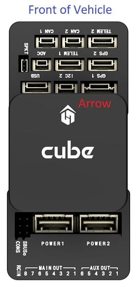
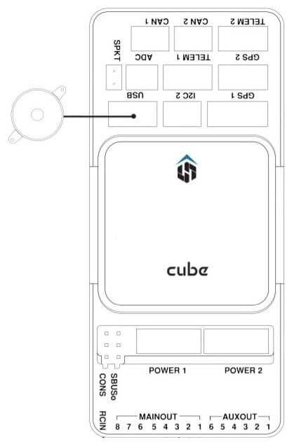

# Швидке підключення Cube

:::warning PX4 не виробляє цей (або будь-який інший) автопілот. Зверніться до [виробника](https://cubepilot.org/#/home) щодо підтримки апаратного забезпечення чи відповідності вимогам.

Також варто зазначити, що, хоча [Cube Black](../flight_controller/pixhawk-2.md) [повністю підтримується PX4](../flight_controller/autopilot_pixhawk_standard.md), [Cube Yellow](../flight_controller/cubepilot_cube_yellow.md) та [Cube Orange](../flight_controller/cubepilot_cube_orange.md) [підтримуються виробником](../flight_controller/autopilot_manufacturer_supported.md).
:::

Цей короткий посібник показує, як живити польотні контролери _Cube_&reg; та під'єднати їх найважливіші периферійні пристрої.

  

:::tip
Інструкції застосовуються до всіх варіантів Cube, включаючи [Cube Black](../flight_controller/pixhawk-2.md), [Cube Yellow](../flight_controller/cubepilot_cube_yellow.md) та [Cube Orange](../flight_controller/cubepilot_cube_orange.md). Додаткову/оновлену інформацію можна знайти у [Посібнику користувача по Cube](https://docs.cubepilot.org/user-guides/autopilot/the-cube-user-manual) (Cube Docs).
:::

## Аксесуари

Куб поставляється з більшістю (або всіма) аксесуарами, які вам знадобляться при [покупці](../flight_controller/pixhawk-2.md#stores).

Виняток полягає в тому, що деякі комплекти не включають GPS, який доведеться придбати окремо ([див. нижче](#gps)).

## Загальний огляд проводки

На зображенні нижче показано, як підключити найважливіші датчики та периферійні пристрої. Ми розглянемо кожен з них докладно в наступних розділах.

1. [Система телеметрії](#telemetry) — Дозволяє вам планувати/виконувати місії, контролювати та відстежувати транспортний засіб в реальному часі. Зазвичай включає телеметричні радіо, планшет / ПК та програмне забезпечення для земної станції.
2. [Сигналізатор](#buzzer) — Надає аудіосигнали, які вказують, що робить БПЛА
3. [Система приймача пульта дистанційного керування](#rc_control) — Підключається до ручного передавача, який оператор може використовувати для ручного керування транспортним засобом (показано приймач PWM з конвертером PWM>PPM).
4. (Спеціалізований) [Безпечний перемикач](#safety-switch) — Натисніть і утримуйте, щоб заблокувати та розблокувати двигуни. Лише обов'язково, якщо ви не використовуєте рекомендований [GPS](#gps) з вбудованим безпечним вимикачем.
5. [GPS, Компас, Світлодіод, Кнопка безпеки](#gps) — Рекомендований модуль GPS містить GPS, Компас, Світлодіод та Кнопку безпеки.
6. [Система живлення](#power) — Куб живлення та регулятори швидкості моторів. Складається з LiPo акумулятора, модуля живлення та необов'язкової системи попередження про рівень заряду акумулятора (аудіо попередження, якщо рівень заряду акумулятора падає нижче попередньо встановленого рівня).

::: info Порт, позначений як `GPS2`, відповідає `TEL4` в PX4 (тобто, якщо підключитися до порту, позначеного як `GPS2`, призначте [параметр конфігурації послідовного порту](../peripherals/serial_configuration.md) для підключеного обладнання до `TEL4`).
:::

:::tip
Додаткову інформацію про доступні порти можна знайти тут: [Куб > Порти](../flight_controller/pixhawk-2.md#ports).
:::

## Монтаж та орієнтація контролера

Встановіть Куб якомога ближче до центру ваги вашого транспортного засобу, ідеально орієнтований верхньою стороною вгору і зі стрілкою, що вказує вперед транспортного засобу (зверніть увагу на _вишукану_ стрілкову позначку зверху на кубі)

::: info Якщо контролер не може бути змонтований в рекомендованій/стандартній орієнтації (наприклад, через обмеження місця), вам потрібно буде налаштувати програмне забезпечення автопілота з орієнтацією, яку ви фактично використовували: [Орієнтація контролера польоту](../config/flight_controller_orientation.md).
:::

Куб може бути встановлений за допомогою або амортизуючих вібрації пінопластових підкладок (включених у комплект) або кріпильних гвинтів. Гвинти кріплення в аксесуарах Куба призначені для рамки товщиною 1,8 мм. Налаштовані гвинти повинні бути M2.5 з довжиною різьблення всередині Куба в діапазоні від 6 мм до 7.55 мм.

## GPS + Компас + Безпечний вимикач + Світлодіоди

Рекомендовані модулі GPS - _Here_ та [Here+](../gps_compass/rtk_gps_hex_hereplus.md), обидва з якими поєднані модуль GPS, компас, захисний вимикач та [світлодіоди](../getting_started/led_meanings.md). Різниця між модулями полягає в тому, що _Here+_ підтримує позиціонування на рівні сантиметрів через [RTK](../gps_compass/rtk_gps.md). В іншому випадку вони використовуються / підключаються так само.

:::warning
[Тут](../gps_compass/rtk_gps_hex_hereplus.md) було замінено на [Тут3](https://www.cubepilot.org/#/here/here3) - RTK-GNSS з компасом та [DroneCAN](../dronecan/index.md), які включають компас та [світлодіоди](../getting_started/led_meanings.md) (але без вимикача безпеки). Див. [DroneCAN](../dronecan/index.md) для інформації про з'єднання _Here3_ та конфігурацію PX4.
:::

Модуль слід монтувати на раму якомога подалі від інших електронних пристроїв, з напрямком вперед транспортного засобу (відокремлення компаса від інших електронних пристроїв зменшить втручання). Він повинен бути підключений до порту `GPS1` за допомогою постачального 8-пінного кабелю.

Діаграма нижче показує схематичний вигляд модуля та його з'єднань.

::: info Вбудований безпечний вимикач в GPS-модулі увімкнений _за замовчуванням_ (коли включений, PX4 не дозволить вам готувати до польоту). Щоб вимкнути безпеку, натисніть і утримуйте безпечний вимикач протягом 1 секунди. Ви можете натиснути безпечний вимикач знову, щоб увімкнути безпеку та відключити транспортний засіб (це може бути корисно, якщо, з якихось причин, ви не можете вимкнути транспортний засіб за допомогою вашого пульта дистанційного керування або наземної станції).
:::

:::tip
Якщо ви хочете використовувати старомодний 6-контактний модуль GPS, комплект поставки містить кабель, за допомогою якого ви можете підключити як GPS, так і [Вимикач безпеки](#safety-switch).
:::

## Запобіжний перемикач

_Спеціальний_ запобіжний вимикач, який поставляється з кубом, потрібен лише у випадку, якщо ви не використовуєте рекомендований [GPS](#gps) (у якому вбудований запобіжний вимикач).

Якщо ви літаєте без GPS, ви повинні прикріпити перемикач безпосередньо до порту `GPS1`, щоб мати можливість озброїти транспортний засіб і летіти (або за допомогою постачального кабелю, якщо використовуєте старий GPS з 6 контактами).

## Зумер

Динамік відтворює [звуки та мелодії](../getting_started/tunes.md), які надають слухове сповіщення про стан транспортного засобу (включаючи звуки, які корисні для виправлення проблем під час запуску, та сповіщення про умови, які можуть впливати на безпечну експлуатацію транспортного засобу).

Дзвіночок слід підключити до порту USB, як показано (додаткова конфігурація не потрібна).

## Radio Control

Для того щоб керувати транспортним засобом [система радіоуправління (RC)](../getting_started/rc_transmitter_receiver.md) потрібна, якщо ви хочете _вручну_ керувати своїм транспортним засобом (PX4 не потребує системи радіоуправління для автономних режимів польоту).

Вам потрібно [вибрати сумісний передавач/приймач](../getting_started/rc_transmitter_receiver.md) і _зв'язати_ їх таким чином, щоб вони взаємодіяли (ознайомтеся з інструкціями, що додаються до вашого конкретного передавача/приймача).

Нижче наведено інструкції, як підключити різні типи приймачів.

### PPM-SUM / Futaba S.Bus отримувачі

Підключіть дріт землі (-), живлення (+) та сигналу (S) до контактів RC за допомогою наданого трьохжильного серво-кабелю.

### Супутникові приймачі Spektrum

Приймачі Spektrum DSM, DSM2 та DSM-X Satellite RC підключаються до порту **SPKT/DSM**.

### Приймачі PWM

Куб не може безпосередньо підключатися до приймачів PPM або PWM, які мають _окремий провід для кожного каналу_. Отримувачі PWM повинні тому підключатися до порту **RCIN** _через_ модуль енкодера PPM, який можна придбати на hex.aero або proficnc.com.

## Потужність

Куб зазвичай живиться від батареї літій-полімеру (LiPo) через модуль живлення (постачається ​​з набором), який підключений до порту **POWER1**. Модуль живлення забезпечує надійне постачання та індикацію напруги / струму до плати, і може _окремо_ постачати живлення до ESC, які використовуються для приводу двигунів на багатороторному літальному апараті.

Типове живлення для транспортного засобу Multicopter показано нижче.

::: info Контактна шина живлення (+) **MAIN/AUX** _не живиться_ блоком живлення модуля живлення контролера польоту. Для керування сервоприводами керма, елеронами тощо, їх потрібно буде окремо живити.

Це можна зробити, підключивши живильну рейку до ESC з BEC, автономного BEC на 5V або 2S LiPo акумулятора. Переконайтеся, що напруга сервопривода, яку ви збираєтеся використовувати, відповідає!
:::

## Система телеметрії (Опціонально)

Система телеметрії дозволяє вам спілкуватися, контролювати та керувати транспортним засобом у польоті з наземної станції (наприклад, ви можете направляти БПЛА до певної позиції або завантажувати нове завдання).

Канал зв'язку здійснюється через [телеметричні радіостанції](../telemetry/index.md). Радіостанцію, розташовану на транспортному засобі, слід підключити до порту **TELEM1** (якщо підключено до цього порту, додаткова конфігурація не потрібна). Інша радіостанція підключається до вашого комп'ютера або мобільного пристрою наземної станції (зазвичай за допомогою USB).

## SD-карта (Опціонально)

Картки SD настійно рекомендується, оскільки вони потрібні для [запису та аналізу даних польоту](../getting_started/flight_reporting.md), для виконання місій та для використання апаратного засобу UAVCAN-bus. Вставте картку Micro-SD в Куб, як показано (якщо вона ще не вставлена).

:::tip
Для отримання додаткової інформації див. [Основні концепції > SD-карти (знімна пам'ять)](../getting_started/px4_basic_concepts.md#sd-cards-removable-memory).
:::

## Двигуни

Мотори/сервоприводи підключені до портів **MAIN** та **AUX** в порядку, вказаному для вашого апарату в [Довіднику планерів](../airframes/airframe_reference.md).

::: інформація
Цей довідник містить зіставлення портів виводу до моторів/сервоприводів для всіх підтримуваних повітряних та наземних шасі (якщо ваше шасі не вказане в довіднику, то використовуйте "загальний" планер відповідного типу).
:::

:::попередження
Відображення не є однорідним для всіх конструкцій (наприклад, ви не можете покладатися на те, що ручка газу буде на тому ж вихідному порту для всіх повітряних конструкцій). Переконайтеся, що ви використовуєте правильне відображення для вашого транспортного засобу.
:::

## Інші периферійні пристрої

Підключення та конфігурація додаткових / менш поширених компонентів описано в темах для окремих [периферійних пристроїв](../peripherals/index.md).

::: info Якщо підключаєте периферійні пристрої до порту з позначкою `GPS2`, призначте [параметр конфігурації послідовного порту](../peripherals/serial_configuration.md) PX4 для апаратного забезпечення `TEL4` (а не GPS2).
:::

## Конфігурація

Конфігурацію виконують за допомогою [QGroundContro](http://qgroundcontrol.com/).

Після завантаження, встановлення та запуску _QGroundControl_ підключіть плату до комп'ютера, як показано.

Основна / загальна інформація про конфігурацію описана в: [Конфігурація автопілота](../config/index.md).

Особливу конфігурацію QuadPlane описано тут: [Конфігурація QuadPlane VTOL](../config_vtol/vtol_quad_configuration.md)

<!-- what about config of other vtol types and plane. Do the instructions in these ones above apply for tailsitters etc? -->

### Оновлення завантажувача

Якщо ви отримуєте сигнал попередження [Програма PX4IO(../getting_started/tunes.md#program-px4io) після прошивки програмного забезпечення PX4, вам може знадобитися оновити завантажувач.

Перемикач безпеки може бути використаний для примусового оновлення завантажувача. Для використання цієї функції вимкніть живлення Куба, утримуйте перемикач безпеки, а потім підключіть живлення Куба через USB.

## Детальна інформація

- [Куб Чорний](../flight_controller/pixhawk-2.md)
- [Cube Yellow](../flight_controller/cubepilot_cube_yellow.md)
- [Куб Оранжевий](../flight_controller/cubepilot_cube_orange.md)
- Cube Docs (виробник):
  - [Огляд модуля Cube](https://docs.cubepilot.org/user-guides/autopilot/the-cube-module-overview)
  - [Посібник користувача Cube](https://docs.cubepilot.org/user-guides/autopilot/the-cube-user-manual)
  - [Міні-платформа](https://docs.cubepilot.org/user-guides/carrier-boards/mini-carrier-board)
