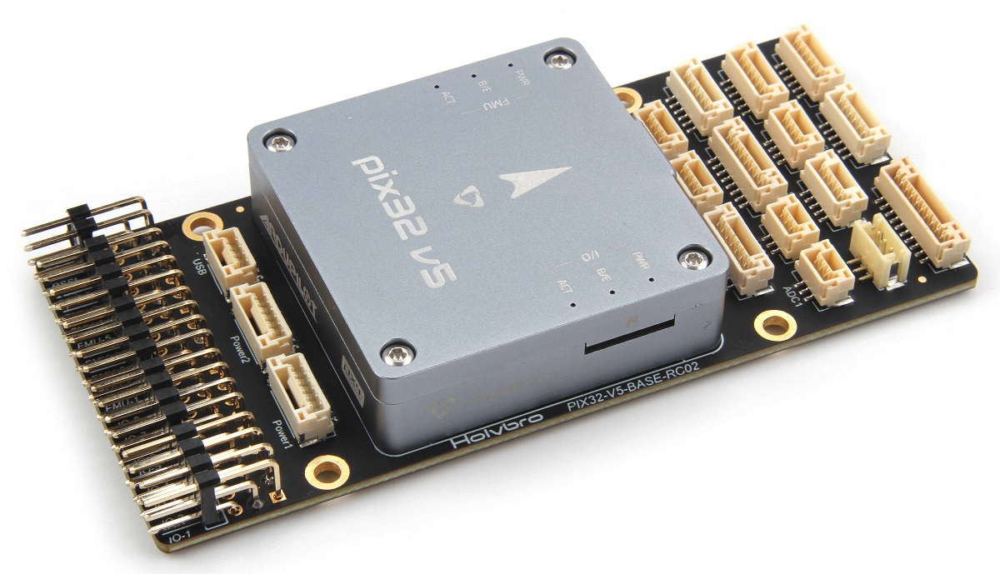
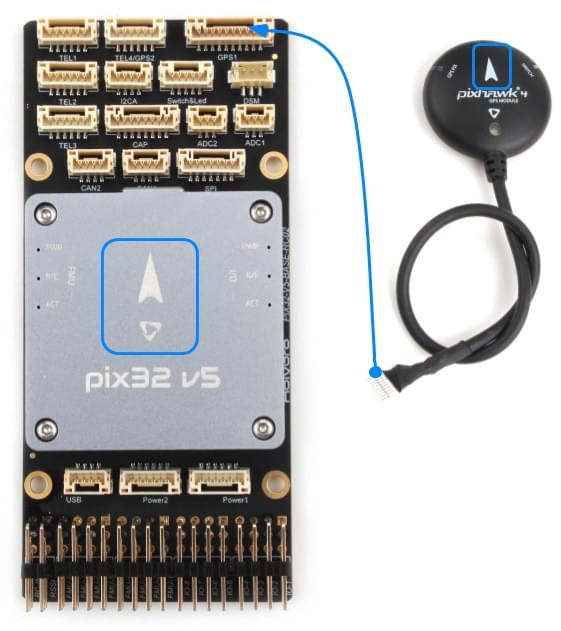

# Швидкий старт Pix32 v5 Wiring

:::warning PX4 не виробляє цей (або будь-який) автопілот. Зверніться до [виробника](https://holybro.com/) щодо питань технічної підтримки або відповідності вимогам.
:::

Цей швидкий старт показує, як живити польовий контролер [Holybro Pix32v5](../flight_controller/holybro_pix32_v5.md)&reg; та підключити його найважливіші периферійні пристрої.

## Розпакування

Pix32 v5 продається в комплекті з різноманітними комбінаціями аксесуарів, включаючи базову _дошку pix32 v5_, модуль живлення _PM02 V3_ та [GPS Holybro M8N](https://holybro.com/collections/gps/products/m8n-gps) (UBLOX NEO-M8N).

Вміст коробки з модулем живлення _PM02 V3_ та компасом _Pixhawk 4 GPS_ показано нижче. У коробці також є керівництво з роз'ємів та інструкції щодо модуля живлення, а також базова плата (не показана на схемі нижче).

## Огляд схеми підключення

На зображенні нижче показано, як підключити найважливіші датчики та периферійні пристрої (за винятком виходів мотора та сервоприводів). Ми розглянемо кожен з них детально в наступних розділах.

:::tip
Додаткову інформацію про доступні порти можна знайти [тут](https://cdn.shopify.com/s/files/1/0604/5905/7341/files/Holybro_Pix32-V5-Base-Mini-Pinouts.pdf).
:::

## Монтаж та орієнтація контролера

_Pix32 v5_ повинен бути змонтований на раму якомога ближче до центру мас транспортного засобу, орієнтований верхньою стороною вгору зі стрілкою, що вказує вперед транспортного засобу.

::: info Якщо контролер не може бути змонтований у рекомендованому/стандартному положенні (наприклад, через обмеження місця), вам потрібно буде налаштувати програмне забезпечення автопілота з орієнтацією, яку ви фактично використовували: [Орієнтація контролера польоту](../config/flight_controller_orientation.md).
:::

:::tip

Плата має внутрішню вібраційну ізоляцію.
Не використовуйте віброізоляційну пінку для монтажу контролера (подвійна стрічка на клейовій основі зазвичай достатня).
:::

## GPS + Компас + Сигналізація + Безпечний вимикач + Світлодіоди

Pix32 v5 призначений для успішної роботи з [GPS Holybro M8N](https://holybro.com/collections/gps/products/m8n-gps), який має вбудований компас, безпечний вимикач, сигналізацію, світлодіоди. Він підключається безпосередньо до **порту GPS** за допомогою 10-жильного кабелю.

GPS/Компас слід монтувати на раму якомога подалі від інших електронних пристроїв, з напрямком вперед транспортного засобу (відокремлення компаса від інших електронних пристроїв зменшить втручання).

::: info Вбудований безпечний вимикач в GPS-модулі увімкнений _за замовчуванням_ (коли включений, PX4 не дозволить вам готувати до польоту). Щоб вимкнути безпеку, натисніть і утримуйте безпечний вимикач протягом 1 секунди. Ви можете натиснути безпечний вимикач знову, щоб увімкнути безпеку та відключити транспортний засіб (це може бути корисно, якщо, з якихось причин, ви не можете вимкнути транспортний засіб за допомогою вашого пульта дистанційного керування або наземної станції).
:::

## Живлення

Ви можете використовувати модуль живлення або розподільник живлення для живлення двигунів/сервоприводів та виміру споживаної потужності. Рекомендовані модулі живлення показані нижче.

### Модуль живлення PM02 v3

[Модуль живлення (PM02 v3)](../power_module/holybro_pm02.md) може бути поставлений разом з _pix32 v5_. Він надає регульоване живлення контролеру польоту та надсилає напругу/силу струму акумулятора контролеру польоту.

Підключіть вихід _Модуля живлення_, як показано.

- Порт напруги/струму PM: підключіться до порту POWER1 (або `POWER2`) за допомогою 6-жильного кабелю GH, що входить у комплект.
- Вхід PM (роз'єм XT60): підключіть до ліпо-акумулятора (2~12S).
- Вихід живлення PM (роз'єм XT60): підведіть до будь-якого контролера регулятора обертів мотора.

::: info 
Оскільки цей модуль живлення не містить проводки розподілу живлення, ви зазвичай просто підключаєте всі контролери регуляторів обертів мотора паралельно до виходу модуля живлення (контролер регулятора обертів мотора повинен бути відповідним для постачаного рівня напруги).
:::

::: info 8-контактна шина живлення (+) **MAIN/AUX** не живиться від блоку живлення модуля живлення контролера польоту. Якщо вона повинна бути окремо живленою для керування сервоприводами для рульових поверхонь, елеронами тощо, лінію живлення потрібно підключити до ESC зі вбудованим BEC або окремого BEC напругою 5V або акумулятора LiPo 2S. Переконайтеся, що напруга сервопривода, яку ви збираєтеся використовувати, відповідає.
:::

Модуль живлення має наступні характеристики/обмеження:

- Максимальна вхідна напруга: 60В
- Максимальний струм вимірювання: 120A Напруга
- Вимірювання струму, налаштоване для SV АЦП Перемикання виходів регулятора 5,2 В і 3А макс
- Вага: 20г
- Пакет включає:
  - Плата PM02
  - 6-контактний кабель MLX (1)
  - 6-контактний кабель GH (1)

### Конфігурація батареї

Налаштування батареї/живлення потрібно налаштувати в [Налаштування оцінки батареї](../config/battery.md). Для будь-якого модуля живлення вам потрібно буде налаштувати _кількість комірок_.

Вам не потрібно оновлювати _дільник напруги_, якщо ви використовуєте інший модуль живлення (наприклад, той, що від Pixracer).

## Радіоуправління

Для того щоб керувати транспортним засобом _вручну_, потрібна система радіоуправління (RC) (PX4 не потребує системи радіоуправління для автономних режимів польоту).

Вам потрібно [вибрати сумісний передавач/приймач](../getting_started/rc_transmitter_receiver.md) і _зв'язати_ їх таким чином, щоб вони взаємодіяли (ознайомтеся з інструкціями, що додаються до вашого конкретного передавача/приймача).

Нижче наведено інструкції з підключення різних типів приймачів до _Pix32_ v5 з Baseboard:

- Приймачі Spektrum/DSM підключаються до входу **DSM RC**, показаного нижче.

  

- Приймачі PPM і S.Bus підключаються до входу **SBUS_IN/PPM_IN** (позначений як RC IN):

  

- Приймачі PPM та PWM, які мають _окремий провід для кожного каналу_, повинні підключатися до порту **PPM RC** _через PPM кодер_ [як цей](http://www.getfpv.com/radios/radio-accessories/holybro-ppm-encoder-module.html) (приймачі PPM-Sum використовують один сигнальний провід для всіх каналів).

Для отримання додаткової інформації про вибір радіосистеми, сумісність приймача та зв'язок вашої передавача/приймача, див. статтю: [Пульт керування передавачів& приймачів](../getting_started/rc_transmitter_receiver.md).

## Телеметричні радіостанції (Опціонально)

Телеметричні радіостанції можуть використовуватися для зв'язку та управління транспортним засобом у польоті з наземної станції (наприклад, ви можете направляти БПЛА до певної позиції або завантажувати нове завдання).

Радіостанцію, розташовану на транспортному засобі, слід підключити до порту **TELEM1**, як показано нижче (якщо підключено до цього порту, додаткова конфігурація не потрібна). Інша радіостанція підключається до вашого комп'ютера або мобільного пристрою наземної станції (зазвичай за допомогою USB).

## SD-карта (Опціонально)

SD-карти найчастіше використовуються для [реєстрації та аналізу деталей польоту](../getting_started/flight_reporting.md). Мікро-SD-карта повинна бути встановлена наперед на pix32 v5; якщо у вас є власна мікро-SD-карта, вставте карту в _pix32 v5_, як показано нижче.

:::tip
[Рекомендується використовувати](../dev_log/logging.md#sd-cards) карту SanDisk Extreme U3 32 Гб.
:::

## Двигуни

Сигнали управління двигунами/сервоприводами підключаються до портів **I/O PWM OUT** (**MAIN**) та **FMU PWM OUT** (**AUX**) в порядку, вказаному для вашого транспортного засобу в [Airframe Reference](../airframes/airframe_reference.md).

Двигуни повинні мати окреме [живлення](#power).

::: info 
Якщо ваша рама не вказана в Airframe Reference, використовуйте "загальну" раму відповідного типу.
:::

## Інші периферійні пристрої

Підключення та конфігурація додаткових/менш поширених компонентів описано в темах для окремих [периферійних пристроїв](../peripherals/index.md).

## Схема розташування виводів

[Pix32 v5 Pinouts](https://cdn.shopify.com/s/files/1/0604/5905/7341/files/Holybro_Pix32-V5-Base-Mini-Pinouts.pdf) (Holybro)

## Конфігурація

Загальну інформацію про конфігурацію описано в: [Конфігурація автопілота](../config/index.md).

Особливу конфігурацію QuadPlane описано тут: [Конфігурація QuadPlane VTOL](../config_vtol/vtol_quad_configuration.md)

<!-- Nice to have detailed wiring infographic and instructions for different vehicle types. -->

## Подальша інформація

- [Огляд Pix32 v5](../flight_controller/holybro_pix32_v5.md) (сторінка огляду)
- [Технічний паспорт Pix32 v5](https://cdn.shopify.com/s/files/1/0604/5905/7341/files/Holybro_PIX32-V5_technical_data_sheet_v1.1.pdf)
- [Розпіновки Pix32 v5](https://cdn.shopify.com/s/files/1/0604/5905/7341/files/Holybro_Pix32-V5-Base-Mini-Pinouts.pdf)
- [Базова принципова схема Pix32 v5](https://cdn.shopify.com/s/files/1/0604/5905/7341/files/Holybro_PIX32-V5-BASE-Schematic_diagram.pdf)
- [Розклад базових компонентів Pix32 v5](https://holybro.com/manual/Holybro_PIX32-V5-BASE-ComponentsLayout.pdf)
- [Розпіновка еталонного дизайну FMUv5](https://docs.google.com/spreadsheets/d/1-n0__BYDedQrc_2NHqBenG1DNepAgnHpSGglke-QQwY/edit#gid=912976165).
