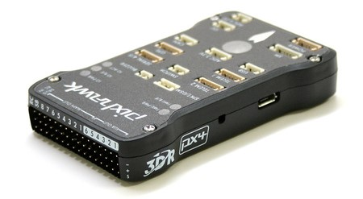
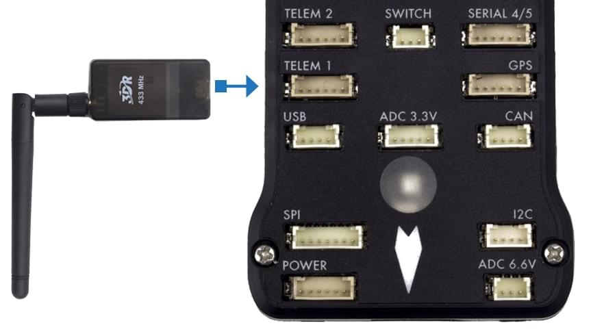

# Швидкий старт Pixhawk Wiring

:::warning PX4 не виробляє цей (чи будь-який) автопілот. Звертайтесь до [виробника](https://store.mrobotics.io/) щодо питань щодо апаратного забезпечення або питань відповідності.
:::

Цей швидкий старт показує, як живити автопілот _3DR Pixhawk_ та підключити його найважливіші периферійні пристрої.

::: info [3DR Pixhawk](../flight_controller/pixhawk.md) більше не доступний від 3DR. Інші контролери польоту на основі архітектури [FMUv2 Pixhawk](../flight_controller/pixhawk_series.md) доступні від інших компаній (вони мають такі самі підключення, виходи, функції і т. д. і підключаються аналогічним чином).
:::

## Огляд схеми підключення

На зображенні нижче показані стандартні підключення Pixhawk (за винятком виходів мотора та сервоприводів). Ми розглянемо кожну основну частину в наступних розділах.

::: info Додаткова інформація щодо підключення [показана нижче](#detailed-wiring-infographic-copter).
:::

## Монтаж та орієнтація контролера

_Pixhawk_ повинен бути змонтований на раму за допомогою амортизаційних підушок проти вібрації (включені в комплект). Він повинен бути розташований якомога ближче до центру ваги вашого транспортного засобу, орієнтований верхньою стороною вгору зі стрілкою, що вказує вперед транспортного засобу.

::: info Якщо контролер не може бути змонтований в рекомендованій/стандартній орієнтації (наприклад, через обмеження місця), вам потрібно буде налаштувати програмне забезпечення автопілота з орієнтацією, яку ви фактично використовували: [Орієнтація контролера польоту](../config/flight_controller_orientation.md).
:::

## Звуковий сигнал і захисний вимикач

Підключіть зумер і захисний вимикач, як показано нижче (вони є обов’язковими).

## GPS + Компас

Прикріпіть GPS (потрібно) до GPS порту, використовуючи 6-канальний кабель в комплекті. Додатково можна підключити компас до порту I2C за допомогою 4-жильного кабелю (у Pixhawk є вбудований компас, який можна використовувати за потреби).

::: info
На діаграмі показано комбінований GPS та компас.
GPS/компас слід монтувати на раму якомога подалі від інших електронних пристроїв, з напрямком вперед транспортного засобу (відокремлення компаса від інших електронних пристроїв зменшить втручання).
:::

## Живлення

Підключіть вихід _модуля живлення (PM)_ до порту **POWER** за допомогою 6-жильного кабелю, як показано на схемі. Вхід PM буде підключений до вашого акумулятора LiPo, а основний вихід буде постачати живлення для ESC/motor вашого транспортного засобу (можливо, через плату розподілу потужності).

Модуль живлення постачає контролер польоту енергією від акумулятора та також надсилає інформацію про аналоговий струм та напругу, що постачається через модуль (включаючи як потужність контролеру польоту, так і до моторів тощо).

:::warning
Модуль живлення постачає контролер польоту енергією, але не може живити сервоприводи та інше обладнання, підключене до виходних портів контролера (рейки). Для вертольотів це не має значення, оскільки мотори окремо живляться.
:::

Для літаків та ВТОЛ рейка виходу повинна бути окремо живлена для керування сервоприводами для рульових пристроїв, елеронами тощо. Зазвичай основний тяговий мотор використовує регулятор швидкості з вбудованим [BEC](https://en.wikipedia.org/wiki/Battery_eliminator_circuit), який можна підключити до виходної рейки Pixhawk. Якщо цього немає, вам доведеться налаштувати 5-вольтовий BEC для підключення до одного з вільних портів Pixhawk (без живлення сервоприводи не будуть працювати).

<!-- It would be good to have real example of this powering -->

## Радіоуправління

Для _ручного_ керування вашим транспортним засобом потрібна система дистанційного керування радіо (RC) (PX4 не вимагає наявності системи радіо для автономних режимів польоту).

Вам потрібно [вибрати сумісний передавач/приймач](../getting_started/rc_transmitter_receiver.md) та потім _зв'язати_ їх, щоб вони взаємодіяли (прочитайте інструкції, що додаються до вашого конкретного передавача/приймача).

Нижче наведено інструкції, як підключити різні типи приймачів до Pixhawk:

- Приймачі Spektrum та DSM підключаються до входу **SPKT/DSM**. 

- Приймачі PPM-SUM та S.BUS підключаються до контактів для **RC** заземлення, живлення та сигналу, як показано. 

- Приймачі PPM та PWM, які мають _окремий провід для кожного каналу_, повинні підключатися до порту **RC** _через PPM кодер_
як цей< /2> (приймачі PPM-Sum використовують один сигнальний провід для всіх каналів).
</li> </ul> 
  
  Для отримання додаткової інформації про вибір системи радіо, сумісність приймачів та зв'язування вашої пари передавача/приймача дивіться: [Remote Control Transmitters & Receivers](../getting_started/rc_transmitter_receiver.md).
  
  

## Telemetry Radios (Optional)

Telemetry radios may be used to communicate and control a vehicle in flight from a ground station (for example, you can direct the UAV to a particular position, or upload a new mission). One radio must be connected to your vehicle as shown below. The other is connected to your ground station computer or mobile device (usually by USB).

<!-- what configuration is required once you've set up a radio) -->

## Motors

The mappings between MAIN/AUX output ports and motor/servos for all supported air and ground frames are listed in the [Airframe Reference](../airframes/airframe_reference.md).

:::warning
The mapping is not consistent across frames (e.g. you can't rely on the throttle being on the same output for all plane frames).
Make sure to use the correct mapping for your vehicle.
:::

:::tip
If your frame is not listed in the reference then use a "generic" airframe of the correct type.
:::

::: info The output rail must be separately powered, as discussed in the [Power](#power) section above.
:::

<!-- INSERT image of the motor AUX/MAIN ports? -->

## Other Peripherals

The wiring and configuration of other components is covered within the topics for individual [peripherals](../peripherals/index.md).

## Configuration

General configuration information is covered in: [Autopilot Configuration](../config/index.md).

QuadPlane specific configuration is covered here: [QuadPlane VTOL Configuration](../config_vtol/vtol_quad_configuration.md)

<!-- what about config of other vtol types and plane. Do the instructions in these ones above apply for tailsitters etc? -->

## Detailed Wiring Infographic (Copter)

## Further information

- [Pixhawk Series](../flight_controller/pixhawk_series.md)
- [3DR Pixhawk](../flight_controller/pixhawk.md)
