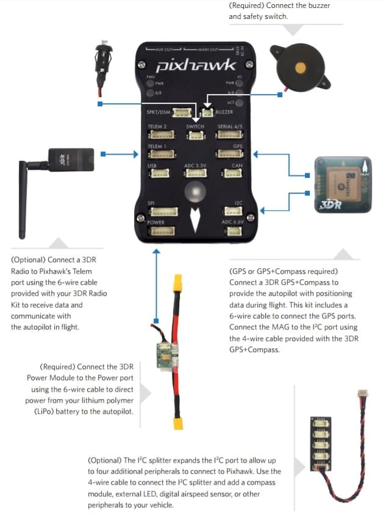
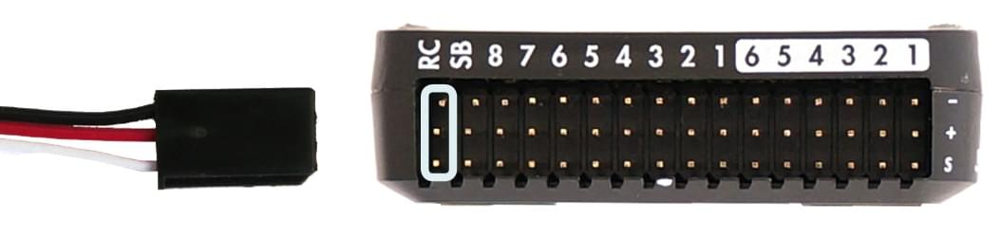

# Швидкий старт Pixhawk Wiring

:::warning PX4 не виготовляє це (або ще) автопілот. Зверніться до [виробника](https://store.mrobotics.io/) щодо підтримки обладнання або питань сумісності.
:::

Цей швидкий старт показує, як живити автопілот _3DR Pixhawk_ та підключити його найважливіші периферійні пристрої.

:::info info [3DR Pixhawk](../flight_controller/pixhawk.md) більше не доступний від 3DR. Інші контролери польоту на основі архітектури [FMUv2 Pixhawk](../flight_controller/pixhawk_series.md) доступні від інших компаній (вони мають такі самі підключення, виходи, функції і т. д. і підключаються аналогічним чином).
:::

## Огляд схеми підключення

На зображенні нижче показані стандартні підключення Pixhawk (за винятком виходів мотора та сервоприводів). Ми розглянемо кожну основну частину в наступних розділах.

:::info Додаткова інформація щодо підключення [показана нижче](#detailed-wiring-infographic-copter).
:::

## Монтаж та орієнтація контролера

_Pixhawk_ повинен бути змонтований на раму за допомогою амортизаційних підушок проти вібрації (включені в комплект). Він повинен бути розташований якомога ближче до центру ваги вашого транспортного засобу, орієнтований верхньою стороною вгору зі стрілкою, що вказує вперед транспортного засобу.

:::info Якщо контролер не може бути змонтований в рекомендованій/стандартній орієнтації (наприклад, через обмеження місця), вам потрібно буде налаштувати програмне забезпечення автопілота з орієнтацією, яку ви фактично використовували: [Орієнтація контролера польоту](../config/flight_controller_orientation.md).
:::

## Звуковий сигнал і захисний вимикач

Підключіть зумер і захисний вимикач, як показано нижче (вони є обов’язковими).

## GPS + Компас

Прикріпіть GPS (потрібно) до GPS порту, використовуючи 6-канальний кабель в комплекті. Додатково можна підключити компас до порту I2C за допомогою 4-жильного кабелю (у Pixhawk є вбудований компас, який можна використовувати за потреби).

:::info
На діаграмі показано комбінований GPS та компас.
GPS/компас слід монтувати на раму якомога подалі від інших електронних пристроїв, з напрямком вперед транспортного засобу (відокремлення компаса від інших електронних пристроїв зменшить втручання).
:::

## Живлення

Підключіть вихід _модуля живлення (PM)_ до порту **POWER** за допомогою 6-жильного кабелю, як показано на схемі. Вхід PM буде підключений до вашого акумулятора LiPo, а основний вихід буде постачати живлення для ESC/motor вашого транспортного засобу (можливо, через плату розподілу потужності).

Модуль живлення постачає контролер польоту енергією від акумулятора та також надсилає інформацію про аналоговий струм та напругу, що постачається через модуль (включаючи як потужність контролеру польоту, так і до моторів тощо).

:::warning
Модуль живлення постачає контролер польоту енергією, але не може живити сервоприводи та інше обладнання, підключене до виходних портів контролера (рейки). Для вертольотів це не має значення, оскільки мотори окремо живляться.
:::

Для літаків та ВТОЛ рейка виходу повинна бути окремо живлена для керування сервоприводами для рульових пристроїв, елеронами тощо. Зазвичай основний тяговий мотор використовує регулятор швидкості з вбудованим [BEC](https://en.wikipedia.org/wiki/Battery_eliminator_circuit), який можна підключити до виходної рейки Pixhawk. Якщо цього немає, вам доведеться налаштувати 5-вольтовий BEC для підключення до одного з вільних портів Pixhawk (без живлення сервоприводи не будуть працювати).

<!-- It would be good to have real example of this powering -->

## Радіоуправління

Для _ручного_ керування вашим транспортним засобом потрібна система дистанційного керування радіо (RC) (PX4 не вимагає наявності системи радіо для автономних режимів польоту).

Вам потрібно [вибрати сумісний передавач/приймач](../getting_started/rc_transmitter_receiver.md) та потім _зв'язати_ їх, щоб вони взаємодіяли (прочитайте інструкції, що додаються до вашого конкретного передавача/приймача).

Нижче наведено інструкції, як підключити різні типи приймачів до Pixhawk:

- Приймачі Spektrum та DSM підключаються до входу **SPKT/DSM**. 

- Приймачі PPM-SUM та S.BUS підключаються до контактів для **RC** заземлення, живлення та сигналу, як показано. 

- Приймачі PPM та PWM, які мають _окремий провід для кожного каналу_, повинні підключатися до порту **RC** _через PPM кодер_ [як цей](http://www.getfpv.com/radios/radio-accessories/holybro-ppm-encoder-module.html) (приймачі PPM-Sum використовують один сигнальний провід для всіх каналів).

Для отримання додаткової інформації про вибір системи радіо, сумісність приймачів та зв'язування вашої пари передавача/приймача дивіться: [Remote Control Transmitters & Receivers](../getting_started/rc_transmitter_receiver.md).

## Телеметричні радіостанції (опціонально)

Телеметрійні радіомодулі можуть використовуватися для зв'язку та управління транспортним засобом в польоті з наземної станції (наприклад, ви можете направляти БПЛА в певне положення або завантажувати нове завдання). Один радіомодуль повинен бути підключений до вашого транспортного засобу, як показано нижче. Інший підключається до вашого комп'ютера або мобільного пристрою наземної станції (зазвичай за допомогою USB).

<!-- what configuration is required once you've set up a radio) -->

## Двигуни

Відображення між головними/допоміжними вихідними портами та двигунами/сервоприводами для всіх підтримуваних повітряних та наземних конструкцій перераховані в [Довіднику з конструкцій повітряних суден](../airframes/airframe_reference.md).

:::warning
Відображення не є однорідним для всіх конструкцій (наприклад, ви не можете покладатися на те, що ручка газу буде на тому ж вихідному порту для всіх повітряних конструкцій).
Переконайтеся, що ви використовуєте правильне відображення для вашого транспортного засобу.
:::

:::tip
Якщо ваша рама не вказана в довідці, використовуйте "загальну" раму відповідного типу.
:::

:::info Рейка виходу повинна бути окремо живлена, як це обговорюється в розділі [Живлення](#power) вище.
:::

<!-- INSERT image of the motor AUX/MAIN ports? -->

## Інші периферійні пристрої

Проведення кабелів та налаштування інших компонентів описані у розділах для окремих пристроїв [peripherals](../peripherals/index.md).

## Конфігурація

Загальну інформацію про конфігурацію описано в: [Конфігурація автопілота](../config/index.md).

Особливу конфігурацію QuadPlane описано тут: [Конфігурація QuadPlane VTOL](../config_vtol/vtol_quad_configuration.md)

<!-- what about config of other vtol types and plane. Do the instructions in these ones above apply for tailsitters etc? -->

## Інфографіка з детальною проводкою (коптер)

## Подальша інформація

- [Серія Pixhawk](../flight_controller/pixhawk_series.md)
- [3DR Pixhawk](../flight_controller/pixhawk.md)
