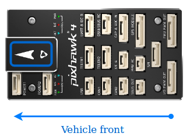

# Pixhawk 4 Wiring Quick Start

:::warning PX4 не займається виготовленням цього (чи якогось іншого) автопілоту. Зверніться до [виробника](https://holybro.com/) щодо підтримки апаратного забезпечення чи питань відповідності вимогам.
:::

У цьому короткому посібнику показано, як увімкнути живлення польотного контролера [Pixhawk 6C](../flight_controller/pixhawk4.md)&reg; та підʼєднати до нього найважливіші периферійні пристрої.

## Огляд схеми підключення

На зображенні нижче показано, як під'єднати найважливіші датчики та периферійні пристрої (за винятком виходів мотора та сервоприводів). Ми розглянемо кожен з них докладно в наступних розділах.

:::tip
Додаткову інформацію про доступні порти можна знайти тут: [Pixhawk 4 > Connections](../flight_controller/pixhawk4.md#connectors).
:::

## Монтаж та орієнтація контролера

_Pixhawk_ необхідно змонтувати на раму разом з амортизаційними подушками проти вібрації (включені в комплект). Вона повинна розташовуватися якомога ближче до центру тяжіння вашого апарату верхньою стороною вгору зі стрілкою, що вказує в напрямку передньої частини апарату.

::: info Якщо контролер не може бути змонтований у рекомендованому/стандартному положенні (наприклад, через обмеження місця), вам потрібно буде налаштувати програмне забезпечення автопілота з орієнтацією, яку ви фактично використовували: [Орієнтація контролера польоту](../config/flight_controller_orientation.md).
:::

## GPS + компас + зумер + перемикач безпеки + LED

Підключіть наданий GPS з інтегрованим компасом, безпечним перемикачем, піщальцем та світлодіодом до порту **МОДУЛЬ GPS**.

GPS/компас повинен бути [закріплений на рамі](../assembly/mount_gps_compass.md) якомога далі від іншої електроніки, так, щоб маркер напрямку був спрямований до передньої частини апарату (відокремлення компаса від іншої електроніки зменшить радіоперешкоди).

:::info Вбудований перемикач безпеки GPS-модуля за _замовчуванням_ увімкнений (коли він увімкнений, PX4 не дозволить вам привести апарат в працездатний стан). Щоб вимкнути безпеку, натисніть і утримуйте безпечний вимикач протягом 1 секунди. Ви можете натиснути безпечний вимикач знову, щоб увімкнути безпеку та відключити транспортний засіб (це може бути корисно, якщо, з якихось причин, ви не можете вимкнути транспортний засіб за допомогою вашого пульта дистанційного керування або наземної станції).
:::

## Живлення

Підключіть вихід _плати управління живленням_ (PM board), яка постачається в комплекті, до одного з кирпичів **POWER** _Pixhawk 4_ за допомогою 6-провідного кабелю. Вхід PM **2~12S** буде підключений до вашої LiPo батареї. Підключення плати управління живленням, включаючи живлення та сигнальні з'єднання з ESC та сервоприводами, пояснені в таблиці нижче. Зверніть увагу, що плата PM не постачає живлення до сервоприводів через контакти + та - **FMU PWM-OUT**.

На зображенні нижче показана плата управління живленням, яка постачається разом з _Pixhawk 4_.

:::info Якщо використовується літак або ровер, 8-контактна шина живлення (+) **FMU PWM-OUT** повинна бути окремо живлена для керування сервоприводами для рульових пристроїв, елеронами тощо. Щоб це зробити, живильну рейку потрібно підключити до ESC з BEC або автономного BEC на 5V або 2S LiPo акумулятора. Будьте обережні з напругою сервопривода, який ви збираєтеся використовувати тут.
:::

| PIN&Connector | Функція                                                                                                     |
| ------------- | ----------------------------------------------------------------------------------------------------------- |
| I/O PWM-IN    | See note below for connection to _Pixhawk 4_                                                                |
| M1            | I/O PWM OUT 1: connect signal wire to ESC of motor 1 here                                                   |
| M2            | I/O PWM OUT 2: connect signal wire to ESC of motor 2 here                                                   |
| M3            | I/O PWM OUT 3: connect signal wire to ESC of motor 3 here                                                   |
| M4            | I/O PWM OUT 4: connect signal wire to ESC of motor 4 here                                                   |
| M5            | I/O PWM OUT 5: connect signal wire to ESC of motor 5 here                                                   |
| M6            | I/O PWM OUT 6: connect signal wire to ESC of motor 6 here                                                   |
| M7            | I/O PWM OUT 7: connect signal wire to ESC of motor 7 here                                                   |
| M8            | I/O PWM OUT 8: connect signal wire to ESC of motor 8 here                                                   |
| FMU PWM-IN    | See note below for connection to _Pixhawk 4_                                                                |
| FMU PWM-OUT   | If FMU PWM-IN is connected to _Pixhawk 4_, connect signal wires to ESC or signal, +, - wires to servos here |
| CAP&ADC-OUT   | connect to CAP & ADC IN port of _Pixhawk 4_                                                                 |
| CAP&ADC-IN    | CAP&ADC input: Pinouts are printed on the back side of the board                                            |
| B+            | connect to ESC B+ to power the ESC                                                                          |
| GND           | connect to ESC Ground                                                                                       |
| PWR1          | 5v output 3A, connect to _Pixhawk 4_ POWER 1                                                                |
| PWR2          | 5v output 3A, connect to _Pixhawk 4_ POWER 2                                                                |
| 2~12S         | Power Input, connect to 12S LiPo Battery                                                                    |

:::info Залежно від типу вашої авіаструктури, зверніться до [Довідника з авіаструктур](../airframes/airframe_reference.md), щоб підключити порти **I/O PWM OUT** та **FMU PWM OUT** _Pixhawk 4_ до плати PM. **MAIN** виходи у прошивці PX4 призначені для порту **I/O PWM OUT** на _Pixhawk 4_, тоді як виходи **AUX** призначені для порту **FMU PWM OUT** на _Pixhawk 4_. Наприклад, **MAIN1** відповідає виводу IO_CH1 **I/O PWM OUT**, а **AUX1** відповідає виводу FMU_CH1 **FMU PWM OUT**. **FMU PWM-IN** плати PM внутрішньо підключений до **FMU PWM-OUT**. **Вхід I/O PWM** плати PM внутрішньо підключений до **M1-8**.
:::

Наступна таблиця узагальнює, як підключити PWM OUT порти _Pixhawk 4_ до PWM-IN портів PM плати, залежно від посилання на конструкцію повітряного судна.

| Довідник зі структури літальних апаратів | З'єднання між _Pixhawk 4_ -- > PM плата |
| ---------------------------------------- | --------------------------------------- |
| **MAIN**: motor                          | I/O PWM OUT --> I/O PWM IN              |
| **MAIN**: servo                          | I/O PWM OUT --> FMU PWM IN              |
| **AUX**: motor                           | FMU PWM OUT --> I/O PWM IN              |
| **AUX**: servo                           | FMU PWM OUT --> FMU PWM IN              |

<!--In the future, when Pixhawk 4 kit is available, add wiring images/videos for different airframes.-->

Схема роз'ємів _Pixhawk 4_ для підключення живлення показана нижче. Сигнал CURRENT повинен переносити аналогове напругу від 0-3.3V для 0-120A за замовчуванням. Сигнал VOLTAGE повинен переносити аналогове напругу від 0-3.3V для 0-60V за замовчуванням. Лінії VCC повинні пропонувати принаймні 3A безперервного струму і за замовчуванням повинні мати напругу 5,1 В. Нижчий напруга 5V все ще прийнятний, але не рекомендується.

| Pin      | Сигнал  | Volt  |
| -------- | ------- | ----- |
| 1(red)   | VCC     | +5V   |
| 2(black) | VCC     | +5V   |
| 3(black) | CURRENT | +3.3V |
| 4(black) | VOLTAGE | +3.3V |
| 5(black) | GND     | GND   |
| 6(black) | GND     | GND   |

:::info При використанні модуля живлення, який постачається з комплектом, вам потрібно налаштувати _Кількість елементів_ у [Налаштуваннях живлення](https://docs.qgroundcontrol.com/master/en/qgc-user-guide/setup_view/power.html), але вам не потрібно калібрувати _подільник напруги_. Вам доведеться оновити _дільник напруги_, якщо ви використовуєте будь-який інший модуль живлення (наприклад, той з Pixracer).
:::

## Радіоуправління

Для того щоб керувати транспортним засобом _вручну_, потрібна система радіоуправління (RC) (PX4 не потребує системи радіоуправління для автономних режимів польоту).

Вам потрібно [вибрати сумісний передавач/приймач](../getting_started/rc_transmitter_receiver.md) і _зв'язати_ їх таким чином, щоб вони взаємодіяли (ознайомтеся з інструкціями, що додаються до вашого конкретного передавача/приймача).

Нижче наведено інструкції, як підключити різні типи приймачів до _Pixhawk 4_:

- Приймачі Spektrum/DSM або S.BUS підключаються до входу **DSM/SBUS RC**.

  

- Приймачі PPM підключаються до вхідного порту **PPM RC**.

  

- Приймачі PPM та PWM, які мають _окремий провід для кожного каналу_, повинні підключатися до порту **PPM RC** _через PPM кодер_ [як цей](http://www.getfpv.com/radios/radio-accessories/holybro-ppm-encoder-module.html) (приймачі PPM-Sum використовують один сигнальний провід для всіх каналів).

Для отримання додаткової інформації про вибір радіосистеми, сумісність приймача та налаштування пари передавач/приймач див.: [Пульт керування передавачів& приймачів](../getting_started/rc_transmitter_receiver.md).

## Телеметричні радіостанції (Опціонально)

Телеметричні радіостанції можуть використовуватися для зв'язку та управління транспортним засобом у польоті з наземної станції (наприклад, ви можете направляти БПЛА до певної позиції або завантажувати нове завдання).

Радіостанцію, розташовану на транспортному засобі, слід підключити до порту **TELEM1** так, як показано нижче (якщо підключено до цього порту, додаткова конфігурація не потрібна). Інша радіостанція підключається до комп'ютера або мобільного пристрою наземної станції (зазвичай через USB).

## SD Card (Optional)

Картки SD настійно рекомендується, оскільки вони потрібні для [запису та аналізу даних польоту](../getting_started/flight_reporting.md), для виконання місій та для використання апаратного засобу UAVCAN-bus. Вставте картку (з комплекту Pixhawk 4) в _Pixhawk 4_, як показано нижче.

:::tip
Для отримання додаткової інформації див. [Основні концепції > SD-карти (знімна пам'ять)](../getting_started/px4_basic_concepts.md#sd-cards-removable-memory).
:::

## Мотори

Мотори/сервоприводи підключені до портів **I/O PWM OUT** (**MAIN**) та **FMU PWM OUT** (**AUX**) в порядку, вказаному для вашого апарату в [Довіднику планерів](../airframes/airframe_reference.md).

:::info
Цей довідник перелічує протокол виводу порту до автора/servo зіставлення всіх підтримуваних повітря і наземних кадрів (якщо кадр відсутній, використовуйте блок "типової" рамки правильного типу).
:::

:::warning
Відображення не є однорідним для всіх конструкцій (наприклад, ви не можете покладатися на те, що ручка газу буде на тому ж вихідному порту для всіх повітряних конструкцій). Переконайтеся, що ви використовуєте правильне відображення для вашого транспортного засобу.
:::

## Інші периферійні пристрої

Підключення та конфігурація додаткових/менш поширених компонентів описано в темах для окремих [периферійних пристроїв](../peripherals/index.md).

## Розпіновка

[Розводка Pixhawk 4](https://holybro.com/manual/Pixhawk4-Pinouts.pdf) (Holybro)

## Конфігурація

Загальну інформацію про конфігурацію описано в: [Конфігурація автопілота](../config/index.md).

Конфігурація для QuadPlane описана тут: [Конфігурація QuadPlane VTOL](../config_vtol/vtol_quad_configuration.md)

<!-- Nice to have detailed wiring infographic and instructions for different vehicle types. -->

## Подальша інформація

- [Pixhawk 4](../flight_controller/pixhawk4.md) (сторінка огляду)
- [Технічна інформація по Pixhawk 4](https://github.com/PX4/PX4-user_guide/raw/main/assets/flight_controller/pixhawk4/pixhawk4_technical_data_sheet.pdf)
- [Розводка Pixhawk 4](https://holybro.com/manual/Pixhawk4-Pinouts.pdf) (Holybro)
- [Посібник з швидкого запуску Pixhawk 4 (Holybro)](https://holybro.com/manual/Pixhawk4-quickstartguide.pdf)
