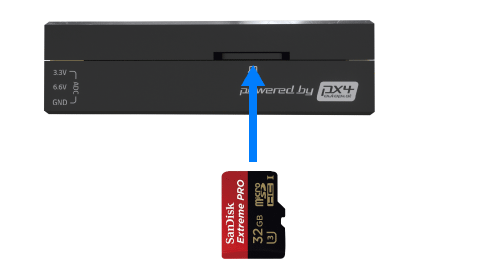

# _Pixhawk 4 Mini_ Wiring Quick Start

:::warning PX4 не виробляє цей (чи будь-який) автопілот. Зверніться до [виробника](https://holybro.com/) щодо підтримки апаратного забезпечення чи відповідності вимогам.
:::

Цей швидкий старт показує, як живити автопілот [_Pixhawk&reg; 4 Mini_](../flight_controller/pixhawk4_mini.md) та підключити його найважливіші периферійні пристрої.

## Загальний огляд проводки

На зображенні нижче показано, куди підключити найважливіші датчики та периферійні пристрої (за винятком моторів та сервоприводів).

:::tip
Додаткову інформацію про доступні порти можна знайти тут: [_Pixhawk 4 Mini_ > Interfaces](../flight_controller/pixhawk4_mini.md#interfaces).
:::

## Монтаж та орієнтація контролера

_Pixhawk 4 Mini_ повинен бути змонтований на вашу раму за допомогою амортизаційних підушок проти вібрації (включені в комплект). Вона повинна бути розташувана якомога ближче до центру тяжіння вашого автомобіля верхньою стороною вгору зі стрілкою, що вказує в напрямку передньої частини автомобіля.

::: info Якщо контролер не може бути змонтований у рекомендованому/стандартному положенні (наприклад, через обмеження місця), вам потрібно буде налаштувати програмне забезпечення автопілота з орієнтацією, яку ви фактично використовували: [Орієнтація контролера польоту](../config/flight_controller_orientation.md).
:::

## GPS + компас + зумер + захисний вимикач + світлодіод

Підключіть наданий GPS з інтегрованим компасом, безпечним перемикачем, піщальцем та світлодіодом до порту **МОДУЛЬ GPS**. GPS/компас слід [монтувати на раму](../assembly/mount_gps_compass.md) якомога подалі від інших електронних пристроїв, з напрямком вперед транспортного засобу (відокремлення компаса від інших електронних пристроїв зменшить втручання).

::: info Вбудований безпечний вимикач в GPS-модулі увімкнений _за замовчуванням_ (коли включений, PX4 не дозволить вам готувати до польоту). Щоб вимкнути безпеку, натисніть і утримуйте безпечний вимикач протягом 1 секунди. Ви можете натиснути безпечний вимикач знову, щоб увімкнути безпеку та відключити транспортний засіб (це може бути корисно, якщо, з якихось причин, ви не можете вимкнути транспортний засіб за допомогою вашого пульта дистанційного керування або наземної станції).
:::

## Потужність

Плата управління живленням (PMB) виконує функції блоку живлення та розподільчої плати живлення. Крім надання регульованого живлення _Pixhawk 4 Mini_ та ESC, вона надсилає інформацію автопілоту про напругу батареї та поточний струм, який подається на керуючий пристрій польоту та двигуни.

Підключіть вихід PMB, що постачається в комплекті, до порту **POWER** _Pixhawk 4 Mini_ за допомогою 6-жильного кабелю. Підключення PMB, включаючи живлення та сигнальні з'єднання з ESC та сервоприводами, пояснені на зображенні нижче.

::: інформація
Вище показано лише з'єднання одного ESC і одного сервопривода.
Підключіть інші ESC та сервоприводи аналогічно.
:::

| Pin(s) або роз'єм | Функція                                                                            |
| ----------------- | ---------------------------------------------------------------------------------- |
| B+                | Підключіться до ESC B+, щоб живити ESC                                             |
| GND               | Підключіться до землі ESC                                                          |
| PWR               | Роз'єм JST-GH 6-pin, вихід 5V 3A  підключити до живлення _Pixhawk 4 Mini_ |
| BAT               | Живлення, підключіть до акумулятора LiPo 2~12s                                     |

Схема роз'ємів _Pixhawk 4 Mini_ для підключення **живлення** показана нижче. Сигнал `CURRENT` повинен переносити аналогове напругу від 0 до 3,3 В для значення від 0 до 120 А за замовчуванням. Сигнал `VOLTAGE` повинен переносити аналогове напругу від 0-3.3V для 0-60V за замовчуванням. Лінії VCC повинні пропонувати принаймні 3A безперервного струму і за замовчуванням повинні мати напругу 5,1 В. Нижчий напруга 5V все ще прийнятний, але не рекомендується.

| Pin      | Сигнал  | Вольтаж |
| -------- | ------- | ------- |
| 1(red)   | VCC     | +5V     |
| 2(black) | VCC     | +5V     |
| 3(black) | CURRENT | +3.3V   |
| 4(black) | VOLTAGE | +3.3V   |
| 5(black) | GND     | GND     |
| 6(black) | GND     | GND     |

::: інформація Якщо використовується літак або ровер, рейка живлення (+) з 8 контактами **MAIN OUT** повинна бути окремо живлена для керування сервоприводами для рульових пристроїв, елеронами тощо. Щоб це зробити, живильну рейку потрібно підключити до ESC з BEC, автономного BEC на 5V або 2S LiPo акумулятора. Будьте обережні з напругою сервопривода, який ви збираєтеся використовувати тут.
:::

<!--In the future, when Pixhawk 4 kit is available, add wiring images/videos for different airframes.-->

::: info При використанні модуля живлення, який постачається з комплектом, вам потрібно налаштувати _Кількість елементів_ у [Налаштуваннях живлення](https://docs.qgroundcontrol.com/master/en/qgc-user-guide/setup_view/power.html), але вам не потрібно калібрувати _подільник напруги_. Вам доведеться оновити _дільник напруги_, якщо ви використовуєте будь-який інший модуль живлення (наприклад, той, що від Pixracer).
:::

## Radio Control

Для того щоб керувати транспортним засобом _вручну_, потрібна система радіоуправління (RC) (PX4 не потребує системи радіоуправління для автономних режимів польоту).

Вам потрібно [вибрати сумісний передавач/приймач](../getting_started/rc_transmitter_receiver.md) і _зв'язати_ їх таким чином, щоб вони взаємодіяли (ознайомтеся з інструкціями, що додаються до вашого конкретного передавача/приймача).

Нижче наведено інструкції з підключення різних типів приймачів до _Pixhawk 4 Mini_:

- Приймачі Spektrum/DSM або S.BUS підключаються до входу **DSM/SBUS RC**.

  

- PPM приймачі підключаються до порту входу **PPM RC**.

  

- Приймачі PPM та PWM, які мають _окремий провід для кожного каналу_, повинні підключатися до порту **PPM RC** _через PPM кодер_ [як цей](http://www.getfpv.com/radios/radio-accessories/holybro-ppm-encoder-module.html) (приймачі PPM-Sum використовують один сигнальний провід для всіх каналів).

Для отримання додаткової інформації про вибір системи радіо, сумісність приймачів та зв'язування вашої пари передавача/приймача дивіться: [Remote Control Transmitters & Receivers](../getting_started/rc_transmitter_receiver.md).

## Телеметрійне радіо (Опціонально)

Телеметрійні радіомодулі можуть використовуватися для зв'язку та управління транспортним засобом в польоті з наземної станції (наприклад, ви можете направляти БПЛА в певне положення або завантажувати нове завдання).

Радіостанцію, розташовану на транспортному засобі, слід підключити до порту **TELEM1** так, як показано нижче (якщо підключено до цього порту, додаткова конфігурація не потрібна). Інша радіостанція підключається до вашого комп'ютера або мобільного пристрою наземної станції (зазвичай за допомогою USB).

## microSD-карта (Опціонально)

Картки SD настійно рекомендується, оскільки вони потрібні для [запису та аналізу даних польоту](../getting_started/flight_reporting.md), для виконання місій та для використання апаратного засобу UAVCAN-bus. Вставте картку (включену в комплект) в _Pixhawk 4 Mini_, як показано нижче.

:::tip
Для отримання додаткової інформації див. [Основні концепції > SD-карти (знімна пам'ять)](../getting_started/px4_basic_concepts.md#sd-cards-removable-memory).
:::

## Двигуни

Мотори/сервоприводи підключені до портів **MAIN OUT** в порядку, вказаному для вашого апарату в [Довіднику планерів](../airframes/airframe_reference.md). Дивіться [_Pixhawk 4 Mini_ > Supported Platforms](../flight_controller/pixhawk4_mini.md#supported-platforms) для отримання додаткової інформації.

::: інформація
Цей довідник містить зіставлення портів виводу до моторів/сервоприводів для всіх підтримуваних повітряних та наземних шасі (якщо ваше шасі не вказане в довіднику, то використовуйте "загальний" планер відповідного типу).
:::

:::warning
Відображення не є однорідним для всіх конструкцій (наприклад, ви не можете покладатися на те, що ручка газу буде на тому ж вихідному порту для всіх повітряних конструкцій).
Переконайтеся, що ви використовуєте правильне відображення для вашого транспортного засобу.
:::

## Інші периферійні пристрої

Підключення та конфігурація додаткових/менш поширених компонентів описано в темах для окремих [периферійних пристроїв](../peripherals/index.md).

## Конфігурація

Загальна інформація про конфігурацію описана в: [Конфігурація автопілота](../config/index.md).

Особливу конфігурацію QuadPlane описано тут: [Конфігурація QuadPlane VTOL](../config_vtol/vtol_quad_configuration.md)

<!-- Nice to have detailed wiring infographic and instructions for different vehicle types. -->

## Подальша інформація

- [_Підключення Pixhawk 4 Mini_](../flight_controller/pixhawk4_mini.md)
