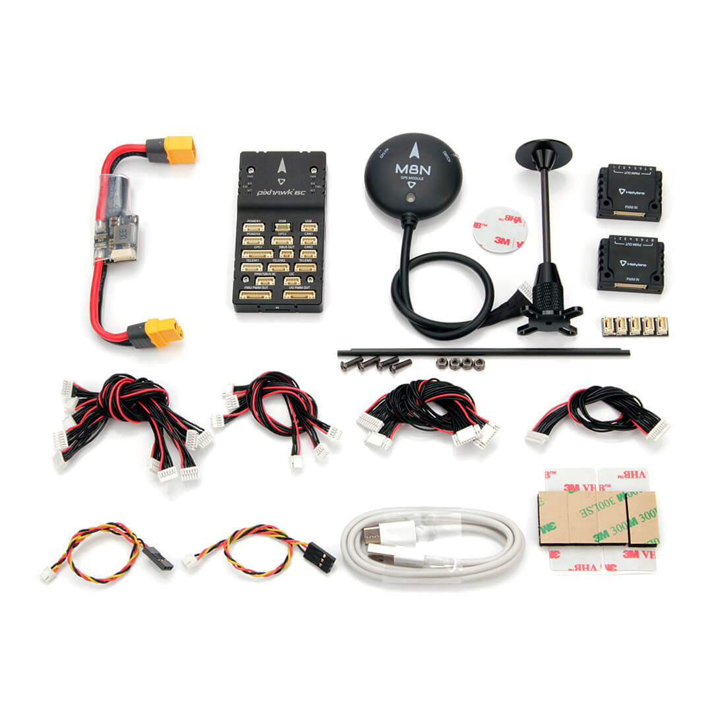
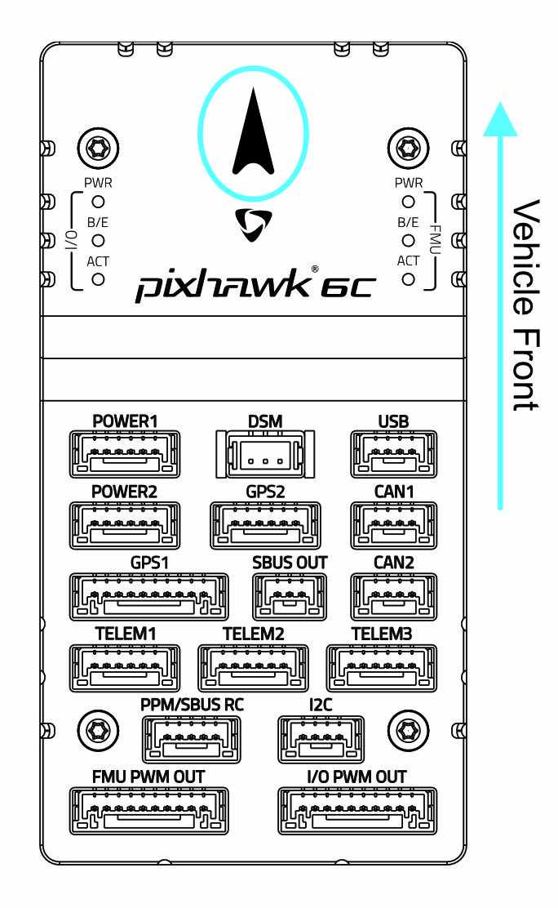
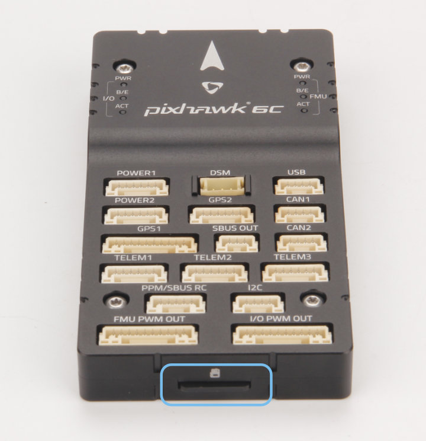

# Швидке підключення Holybro Pixhawk 6C

:::warning PX4 не виробляє цей (або будь-який) автопілот. Зверніться до [виробника](https://holybro.com/) щодо підтримки апаратного забезпечення чи питань відповідності вимогам.
:::

У цьому короткому посібнику показано, як увімкнути живлення польотного контролера [Pixhawk 6C&reg;](../flight_controller/pixhawk6c.md) та підключити до нього найважливіші периферійні пристрої.

## Вміст комплекту

Pixhawk 6C + PM02 + M8N GPS.

## Монтаж та орієнтація контролера

_Pixhawk 6С_ можна змонтувати на раму за допомогою двосторонньої стрічки, включеної в комплект. Він повинен бути розташований якомога ближче до центру ваги вашого транспортного засобу, орієнтований верхньою стороною вгору зі стрілкою, що вказує вперед транспортного засобу.

::: info Якщо контролер не може бути змонтований у рекомендованому/стандартному положенні (наприклад, через обмеження місця), вам потрібно буде налаштувати програмне забезпечення автопілота з орієнтацією, яку ви фактично використовували: [Орієнтація контролера польоту](../config/flight_controller_orientation.md).
:::

## GPS + компас + зумер + захисний вимикач + світлодіод

Набір _Pixhawk6С_ можна придбати з GPS M8N або M9N (10-контактний роз'єм), який слід підключити до порту **GPS1**. Ці модулі GNSS мають вбудований компас, безпечний перемикач, дзвіночок та світлодіод.

Додатковий [GPS M8N або M9N](https://holybro.com/collections/gps) (6-контактний роз'єм) можна придбати окремо і підключити до порту **GPS2**.

GPS/компас повинен бути [закріплений на рамі](../assembly/mount_gps_compass.md) якомога далі від іншої електроніки, так, щоб маркер напрямку був спрямований до передньої частини апарату (відокремлення компаса від іншої електроніки зменшить радіоперешкоди).

::: info Вбудований перемикач безпеки GPS-модуля за _замовчуванням_ увімкнений (коли він увімкнений, PX4 не дозволить вам привести апарат в працездатний стан). Щоб вимкнути функцію безпеки, натисніть і утримуйте запобіжник протягом 1 секунди. Ви можете повторно натиснути запобіжник, щоб увімкнути функцію безпеки та перевести апарат в неробоче положення (це може бути корисно, якщо з якихось причин ви не можете перевести апарат в неробоче положення за допомогою пульта дистанційного керування або наземної станції).
:::

## Живлення

Підключіть вихід обраного вами модуля живлення, що входить до стандартного комплекту, до одного з портів **POWER** _Pixhawk 6C_ за допомогою 6-провідного кабелю.

Якщо використовується літак або ровер, **FMU PWM-OUT** повинно бути окремо живлене для керування сервоприводами для рульових пристроїв, елеронами тощо. Це можна зробити, під'єднавши 8-контактний живильний (+) рейл **FMU PWM-OUT** до стабілізатора напруги (наприклад, ESC з обладнаною BEC або автономною BEC на 5 В або акумулятором LiPo 2S).

::: info
Напруга на шині живлення повинна відповідати використовуваному сервоприводу!
:::

| PIN & Connector | Функція                                                           |
| --------------- | ----------------------------------------------------------------- |
| I/O PWM Out     | Підключіть сюди дроти Motor Signal і GND.                         |
| FMU PWM Out     | Підключіть сигнальні, позитивні та GND-проводи сервоприводу сюди. |

::: info Виходи **MAIN** у прошивці PX4 призначені для порту **I/O PWM OUT** на _Pixhawk 6C_, тоді як виходи **AUX** призначені для порту **FMU PWM OUT** на _Pixhawk 6C_. Наприклад, **MAIN1** відповідає виводу IO_CH1 **I/O PWM OUT**, а **AUX1** відповідає виводу FMU_CH1 **FMU PWM OUT**.
:::

Схема роз'ємів _Pixhawk 6С_ для підключення живлення показана нижче.

| Пін      | Signal  | Вольтаж |
| -------- | ------- | ------- |
| 1(red)   | VDD     | +5В     |
| 2(black) | VDD     | +5В     |
| 3(black) | CURRENT | +3.3В   |
| 4(black) | VOLTAGE | +3.3В   |
| 5(black) | GND     | GND     |
| 6(black) | GND     | GND     |

## Радіоуправління

Для _ручного_ керування вашим апаратом потрібна система дистанційного керування радіо (RC) (PX4 не вимагає наявності системи радіо для автономних режимів польоту).

Вам буде потрібно [вибрати сумісний передавач/приймач](../getting_started/rc_transmitter_receiver.md) та потім _зв'язати_ їх, щоб вони взаємодіяли (прочитайте інструкції, що додаються до вашого конкретного передавача/приймача).

- Приймачі Spektrum/DSM підключаються до входу **DSM**.
- Приймачі PPM або SBUS підключаються до вхідного порту **PPM/SBUS**.

Приймачі PPM і ШІМ, які мають _окремий дріт для кожного каналу_, повинні підключатися до порту *PPM/SBUS\*\* через енкодер PPM\* [подібний до цього](http://www.getfpv.com/radios/radio-accessories/holybro-ppm-encoder-module.html) (приймачі PPM-Sum використовують один сигнальний дріт для всіх каналів).

Для отримання додаткової інформації про вибір радіосистеми, сумісність приймача та налаштування пари передавач/приймач див.: [Пульт керування передавачів& приймачів](../getting_started/rc_transmitter_receiver.md).

## Телеметричні радіостанції (Опціонально)

[Телеметрійні радіомодулі](../telemetry/index.md) можуть використовуватися для зв'язку та управління апаратом в польоті з наземної станції (наприклад, ви можете направляти БПЛА в певне положення або завантажувати нове завдання).

Бортову радіостанцію слід підключити до порту **TELEM1**, як показано нижче (у разі підключення до цього порту подальша конфігурація не потрібна). Інша радіостанція підключається до комп'ютера або мобільного пристрою наземної станції (зазвичай через USB).

Радіостанції також доступні для придбання на веб-сайті [Holybro](https://holybro.com/collections/telemetry-radios) .

## SD-карта (Опціонально)

Наполегливо рекомендуємо використовувати SD-карти, оскільки вони необхідні для [запису та аналізу даних польоту](../getting_started/flight_reporting.md), запуску місій та використання обладнання UAVCAN-шини. Вставте картку (з комплекту Pixhawk 6C) в _Pixhawk 6C_, як показано нижче.

:::tip
Для отримання додаткової інформації див. [Основні концепції > SD-карти (знімна пам'ять)](../getting_started/px4_basic_concepts.md#sd-cards-removable-memory).
:::

## Двигуни

Двигуни/сервоприводи підключаються до портів **I/O PWM OUT** (**MAIN**) та **FMU PWM OUT** (**AUX**) у порядку, вказаному для вашого апарату в [Airframe Reference](../airframes/airframe_reference.md).

::: info
У цьому довіднику перераховані вихідні порти для мапування двигунів/сервоприводів для всіх підтримуваних повітряних і наземних каркасів (якщо ваш каркас не вказаний у довіднику, використовуйте "загальний" каркас відповідного типу).
:::

:::warning
Відображення не є однаковим для різних фреймів (наприклад, ви не можете покладатися на те, що дросель буде на одному і тому ж виході для всіх повітряних конструкцій). Переконайтеся, що ви використовуєте правильне відображення для вашого транспортного засобу.
:::

## Інші периферійні пристрої

Підключення та конфігурація додаткових / менш поширених компонентів описано в темах для окремих [периферійних пристроїв](../peripherals/index.md).

## Схема розташування виводів

- [Holybro Pixhawk -6C Pinout](https://docs.holybro.com/autopilot/pixhawk-6c/pixhawk-6c-pinout)

## Конфігурація

Загальну інформацію про конфігурацію описано в: [Конфігурація автопілота](../config/index.md).

QuadPlane specific configuration is covered here: [QuadPlane VTOL Configuration](../config_vtol/vtol_quad_configuration.md)

<!-- Nice to have detailed wiring infographic and instructions for different vehicle types. -->

## Further information

- [Holybro Docs](https://docs.holybro.com/) (Holybro)
- [Pixhawk 6C](../flight_controller/pixhawk6c.md) (PX4 Doc Overview page)
- [PM02 Power Module](../power_module/holybro_pm02.md)
- [PM06 Power Module](../power_module/holybro_pm06_pixhawk4mini_power_module.md)
- [PM07 Power Module](../power_module/holybro_pm07_pixhawk4_power_module.md)
- [Pixhawk Autopilot Bus Standard](https://github.com/pixhawk/Pixhawk-Standards/blob/master/DS-010%20Pixhawk%20Autopilot%20Bus%20Standard.pdf).
- [Pixhawk Connector Standard](https://github.com/pixhawk/Pixhawk-Standards/blob/master/DS-009%20Pixhawk%20Connector%20Standard.pdf).
