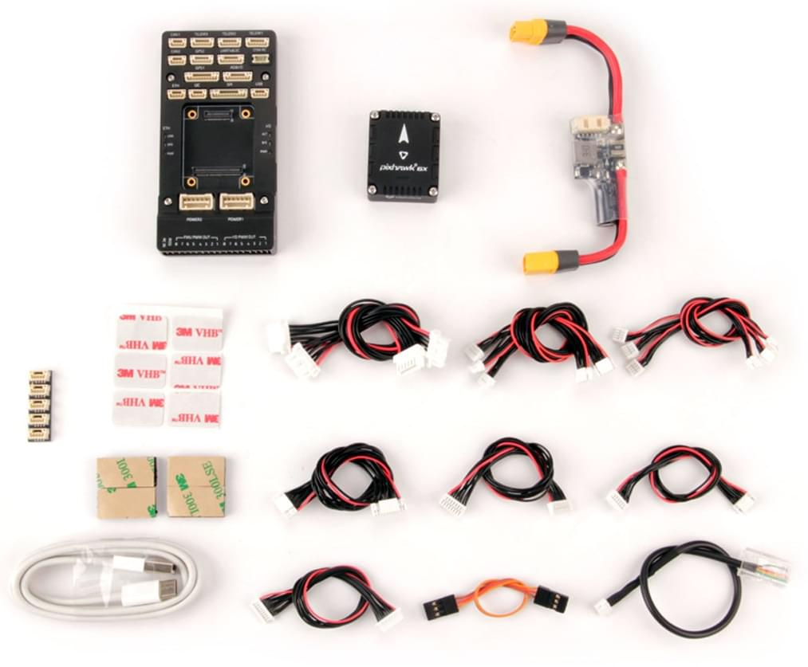

# Короткий посібник з підключення Holybro Pixhawk 6X

:::warning PX4 не виробляє цей (чи будь-який інший) автопілот. Зверніться до [виробника](https://holybro.com/) щодо підтримки апаратного забезпечення чи відповідності вимогам.
:::

Цей короткий посібник показує, як живити польовий контролер [Pixhawk 6X&reg;](../flight_controller/pixhawk6x.md) та під'єднати його найважливіші периферійні пристрої.

## Вміст набору

### Набір Pixhawk 6X Standard

### Набір Pixhawk 6X Mini

## Огляд схеми підключення

На зображенні нижче показано, як під'єднати найважливіші датчики та периферійні пристрої.

:::tip
Додаткову інформацію про доступні порти можна знайти тут: [Pixhawk 6X > Connections](../flight_controller/pixhawk6x.md#connections).
:::

## Монтаж та орієнтація контролера

_Pixhawk 6X_ можна змонтувати на раму за допомогою двосторонньої стрічки, включеної в комплект. Він повинен бути розташований якомога ближче до центру ваги вашого апарату, орієнтований верхньою стороною вгору зі стрілкою, що вказує вперед апарату.

::: info Якщо контролер не може бути змонтований в рекомендованій/стандартній орієнтації (наприклад, через обмеження місця), вам потрібно буде налаштувати програмне забезпечення автопілота з орієнтацією, яку ви фактично використовували: [Орієнтація контролера польоту](../config/flight_controller_orientation.md).
:::

## GPS + компас + перемикач безпеки + світлодіод

Набір _Pixhawk6X Standard Set_ та _Pixhawk6X Mini Set_ можна придбати з GPS M8N або M9N (10-контактний роз'єм), який слід підключити до порту **GPS1**. Ці модулі GNSS мають вбудований компас, безпечний перемикач, дзвіночок та світлодіод.

Додатковий [GPS M8N або M9N](https://holybro.com/collections/gps) (6-контактний роз'єм) можна придбати окремо і підключити до порту **GPS2**.

GPS/Компас слід [монтувати на раму](../assembly/mount_gps_compass.md) якомога подалі від інших електронних пристроїв, з напрямком вперед транспортного засобу (відокремлення компаса від інших електронних пристроїв зменшить втручання).

:::info Вбудований безпечний вимикач в GPS-модулі увімкнений _за замовчуванням_ (коли включений, PX4 не дозволить вам готувати до польоту). Щоб вимкнути безпеку, натисніть і утримуйте безпечний вимикач протягом 1 секунди. Ви можете натиснути безпечний вимикач знову, щоб увімкнути безпеку та відключити транспортний засіб (це може бути корисно, якщо, з якихось причин, ви не можете вимкнути транспортний засіб за допомогою вашого пульта дистанційного керування або наземної станції).
:::

## Живлення

Підключіть вихід модуля живлення _PM02D Power Module_ (плати PM), що входить до стандартного комплекту, до одного з портів **POWER** _Pixhawk 6X_ за допомогою 6-провідного кабелю. Порти PM02D та живлення на Pixhawk 6X використовують 6-контактний [Роз'єм плати CLIK-Mate Wire-to-Board PCB з кроком 2,00 мм](https://www.molex.com/molex/products/part-detail/pcb_receptacles/5024430670) & [Корпус](https://www.molex.com/molex/products/part-detail/crimp_housings/5024390600).

Модуль живлення PM02D підтримує акумулятор **2~6S**, вхід до плати повинен бути підключений до вашого LiPo акумулятора. Зверніть увагу, що плата PM не постачає живлення до контактів + та - **FMU PWM OUT** та **I/O PWM OUT**.

Якщо використовується літак або рухомий об'єкт, вихідна рейка **FMU PWM-OUT** повинна бути окремо живлена для керування сервоприводами для рульових пристроїв, елеронами тощо. Це можна зробити, під'єднавши 8-контактний живильний (+) рейл **FMU PWM-OUT** до стабілізатора напруги (наприклад, ESC з обладнаною BEC або автономною BEC на 5 В або акумулятором LiPo 2S).

::: info
The power rail voltage must be appropriate for the servo being used!
:::

| PIN & Connector | Function                                            |
| --------------- | --------------------------------------------------- |
| I/O PWM Out     | Connect Motor Signal and GND wires here.            |
| FMU PWM Out     | Connect Servo Signal, positive, and GND wires here. |

::: info **MAIN** outputs in PX4 firmware map to **I/O PWM OUT** port of _Pixhawk 6X_ whereas **AUX outputs** map to **FMU PWM OUT** of _Pixhawk 6X_. For example, **MAIN1** maps to IO_CH1 pin of **I/O PWM OUT** and **AUX1** maps to FMU_CH1 pin of **FMU PWM OUT**.
:::

The pinout of _Pixhawk 6X_’s power ports is shown below. The power ports takes in I2C digital signal from the PM02D power module for voltage and current data. The VCC lines have to offer at least 3A continuous and should default to 5.2V. A lower voltage of 5V is still acceptable, but discouraged.

| Pin      | Signal | Volt  |
| -------- | ------ | ----- |
| 1(red)   | VCC    | +5V   |
| 2(black) | VCC    | +5V   |
| 3(black) | SCL    | +3.3V |
| 4(black) | SDA    | +3.3V |
| 5(black) | GND    | GND   |
| 6(black) | GND    | GND   |

## Radio Control

A remote control (RC) radio system is required if you want to _manually_ control your vehicle (PX4 does not require a radio system for autonomous flight modes).

You will need to [select a compatible transmitter/receiver](../getting_started/rc_transmitter_receiver.md) and then _bind_ them so that they communicate (read the instructions that come with your specific transmitter/receiver).

- Spektrum/DSM receivers connect to the **DSM/SBUS RC** input.
- PPM or SBUS receivers connect to the **RC IN** input port.

PPM and PWM receivers that have an _individual wire for each channel_ must connect to the **RC IN** port _via a PPM encoder_ [like this one](http://www.getfpv.com/radios/radio-accessories/holybro-ppm-encoder-module.html) (PPM-Sum receivers use a single signal wire for all channels).

For more information about selecting a radio system, receiver compatibility, and binding your transmitter/receiver pair, see: [Remote Control Transmitters & Receivers](../getting_started/rc_transmitter_receiver.md).

## Telemetry Radios (Optional)

[Telemetry radios](../telemetry/index.md) may be used to communicate and control a vehicle in flight from a ground station (for example, you can direct the UAV to a particular position, or upload a new mission).

The vehicle-based radio should be connected to the **TELEM1** port as shown below (if connected to this port, no further configuration is required). The other radio is connected to your ground station computer or mobile device (usually by USB).

Radios are also available for purchase on [Holybro's website](https://holybro.com/collections/telemetry-radios) .

## SD Card (Optional)

SD cards are highly recommended as they are needed to [log and analyse flight details](../getting_started/flight_reporting.md), to run missions, and to use UAVCAN-bus hardware. Insert the card (included in Pixhawk 6X) into _Pixhawk 6X_ as shown below.

:::tip
For more information see [Basic Concepts > SD Cards (Removable Memory)](../getting_started/px4_basic_concepts.md#sd-cards-removable-memory).
:::

## Motors

Motors/servos are connected to the **I/O PWM OUT** (**MAIN**) and **FMU PWM OUT** (**AUX**) ports in the order specified for your vehicle in the [Airframe Reference](../airframes/airframe_reference.md).

::: info
This reference lists the output port to motor/servo mapping for all supported air and ground frames (if your frame is not listed in the reference then use a "generic" airframe of the correct type).
:::

:::warning
The mapping is not consistent across frames (e.g. you can't rely on the throttle being on the same output for all plane frames). Make sure to use the correct mapping for your vehicle.
:::

## Other Peripherals

The wiring and configuration of optional/less common components is covered within the topics for individual [peripherals](../peripherals/index.md).

## Pinouts

- [Holybro Pixhawk Baseboard Pinout](https://docs.holybro.com/autopilot/pixhawk-6x/pixhawk-baseboard-pinout)
- [Holybro Pixhawk Mini-Baseboard Pinout](https://docs.holybro.com/autopilot/pixhawk-6x/pixhawk-mini-baseboard-pinout)

## Configuration

General configuration information is covered in: [Autopilot Configuration](../config/index.md).

QuadPlane specific configuration is covered here: [QuadPlane VTOL Configuration](../config_vtol/vtol_quad_configuration.md)

<!-- Nice to have detailed wiring infographic and instructions for different vehicle types. -->

## Further information

- [Holybro Docs](https://docs.holybro.com/) (Holybro)
- [Pixhawk 6X](../flight_controller/pixhawk6x.md) (PX4 Doc Overview page)
- [PM02D Power Module](../power_module/holybro_pm02d.md)
- [PM03D Power Module](../power_module/holybro_pm03d.md)
- [Pixhawk Autopilot FMUv6X Standard](https://github.com/pixhawk/Pixhawk-Standards/blob/master/DS-012%20Pixhawk%20Autopilot%20v6X%20Standard.pdf).
- [Pixhawk Autopilot Bus Standard](https://github.com/pixhawk/Pixhawk-Standards/blob/master/DS-010%20Pixhawk%20Autopilot%20Bus%20Standard.pdf).
- [Pixhawk Connector Standard](https://github.com/pixhawk/Pixhawk-Standards/blob/master/DS-009%20Pixhawk%20Connector%20Standard.pdf).
