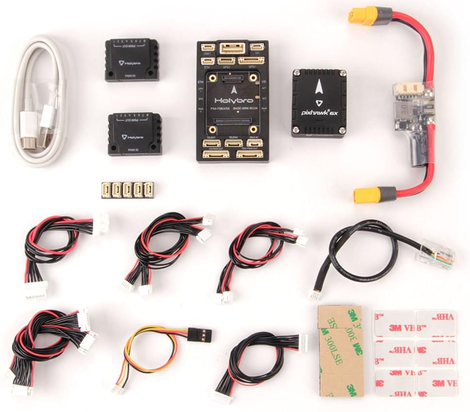
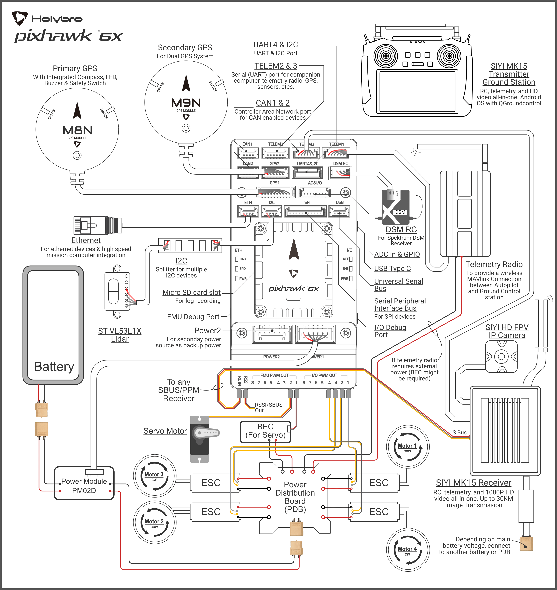

# Короткий посібник з підключення Holybro Pixhawk 6X

:::warning PX4 не виробляє цей (чи будь-який інший) автопілот. Зверніться до [виробника](https://holybro.com/) щодо підтримки апаратного забезпечення чи відповідності вимогам.
:::

Цей короткий посібник показує, як живити польовий контролер [Pixhawk 6X&reg;](../flight_controller/pixhawk6x.md) та під'єднати його найважливіші периферійні пристрої.

## Вміст набору

### Набір Pixhawk 6X Standard

### Набір Pixhawk 6X Mini

## Огляд схеми підключення

На зображенні нижче показано, як під'єднати найважливіші датчики та периферійні пристрої.

:::tip
Додаткову інформацію про доступні порти можна знайти тут: [Pixhawk 6X > Connections](../flight_controller/pixhawk6x.md#connections).
:::

## Монтаж та орієнтація контролера

_Pixhawk 6X_ можна змонтувати на раму за допомогою двосторонньої стрічки, включеної в комплект. Він повинен бути розташований якомога ближче до центру ваги вашого апарату, орієнтований верхньою стороною вгору зі стрілкою, що вказує вперед апарату.

::: info Якщо контролер не може бути змонтований в рекомендованій/стандартній орієнтації (наприклад, через обмеження місця), вам потрібно буде налаштувати програмне забезпечення автопілота з орієнтацією, яку ви фактично використовували: [Орієнтація контролера польоту](../config/flight_controller_orientation.md).
:::

## GPS + компас + перемикач безпеки + світлодіод

Набір _Pixhawk6X Standard Set_ та _Pixhawk6X Mini Set_ можна придбати з GPS M8N або M9N (10-контактний роз'єм), який слід підключити до порту **GPS1**. Ці модулі GNSS мають вбудований компас, безпечний перемикач, дзвіночок та світлодіод.

Додатковий [GPS M8N або M9N](https://holybro.com/collections/gps) (6-контактний роз'єм) можна придбати окремо і підключити до порту **GPS2**.

GPS/Компас слід [монтувати на раму](../assembly/mount_gps_compass.md) якомога подалі від інших електронних пристроїв, з напрямком вперед транспортного засобу (відокремлення компаса від інших електронних пристроїв зменшить втручання).

:::info Вбудований безпечний вимикач в GPS-модулі увімкнений _за замовчуванням_ (коли включений, PX4 не дозволить вам готувати до польоту). Щоб вимкнути безпеку, натисніть і утримуйте безпечний вимикач протягом 1 секунди. Ви можете натиснути безпечний вимикач знову, щоб увімкнути безпеку та відключити транспортний засіб (це може бути корисно, якщо, з якихось причин, ви не можете вимкнути транспортний засіб за допомогою вашого пульта дистанційного керування або наземної станції).
:::

## Живлення

Підключіть вихід модуля живлення _PM02D Power Module_ (плати PM), що входить до стандартного комплекту, до одного з портів **POWER** _Pixhawk 6X_ за допомогою 6-провідного кабелю. Порти PM02D та живлення на Pixhawk 6X використовують 6-контактний [Роз'єм плати CLIK-Mate Wire-to-Board PCB з кроком 2,00 мм](https://www.molex.com/molex/products/part-detail/pcb_receptacles/5024430670) & [Корпус](https://www.molex.com/molex/products/part-detail/crimp_housings/5024390600).

Модуль живлення PM02D підтримує акумулятор **2~6S**, вхід до плати повинен бути підключений до вашого LiPo акумулятора. Зверніть увагу, що плата PM не постачає живлення до контактів + та - **FMU PWM OUT** та **I/O PWM OUT**.

Якщо використовується літак або рухомий об'єкт, вихідна рейка **FMU PWM-OUT** повинна бути окремо живлена для керування сервоприводами для рульових пристроїв, елеронами тощо. Це можна зробити, під'єднавши 8-контактний живильний (+) рейл **FMU PWM-OUT** до стабілізатора напруги (наприклад, ESC з обладнаною BEC або автономною BEC на 5 В або акумулятором LiPo 2S).

:::info
Напруга шини живлення повинна бути відповідною для використаного сервоприводу!
:::

| PIN& Connector | Функція                                             |
| -------------- | --------------------------------------------------- |
| I/O PWM Out    | Тут під'єднайте сигнал Motor та GND дроти.          |
| FMU PWM Out    | Під'єднайте сигнальні, позитивні та GND дроти сюди. |

:::info Виходи **MAIN** у прошивці PX4 призначені для порту **I/O PWM OUT** на _Pixhawk 6X_, тоді як виходи **AUX** призначені для порту **FMU PWM OUT** на _Pixhawk 6X_. Наприклад, **MAIN1** відповідає виводу IO_CH1 **I/O PWM OUT**, а **AUX1** відповідає виводу FMU_CH1 **FMU PWM OUT**.
:::

Схема роз'ємів _Pixhawk 6X_ для підключення живлення показана нижче. Роз'єми живлення приймають цифровий сигнал I2C від модуля живлення PM02D для даних про напругу та силу струму. Лінії VCC повинні пропонувати принаймні 3A безперервного струму і за замовчуванням повинні мати напругу 5.2В. Нижчий напруга 5V все ще прийнятний, але не рекомендується.

| Пін          | Сигнал | Вольт |
| ------------ | ------ | ----- |
| 1 (червоний) | VCC    | +5V   |
| 2 (чорний)   | VCC    | +5V   |
| 3 (чорний)   | SCL    | +3.3V |
| 4 (чорний)   | SDA    | +3.3V |
| 5 (чорний)   | GND    | GND   |
| 6 (чорний)   | GND    | GND   |

## Радіоуправління

Для того щоб керувати транспортним засобом _вручну_, потрібна система радіоуправління (RC) (PX4 не потребує системи радіоуправління для автономних режимів польоту).

Вам потрібно [вибрати сумісний передавач/приймач](../getting_started/rc_transmitter_receiver.md) і _зв'язати_ їх таким чином, щоб вони взаємодіяли (ознайомтеся з інструкціями, що додаються до вашого конкретного передавача/приймача).

- Приймачі Spektrum/DSM підключаються до входу **DSM/SBUS RC**.
- Приймачі PPM або SBUS підключаються до вхідного порту **RC IN**.

Приймачі PPM та PWM, які мають _окремий провід для кожного каналу_, повинні підключатися до порту **RC IN** _через PPM кодер_ [як цей](http://www.getfpv.com/radios/radio-accessories/holybro-ppm-encoder-module.html) (приймачі PPM-Sum використовують один сигнальний провід для всіх каналів).

Для отримання додаткової інформації про вибір радіосистеми, сумісність приймача та зв'язок вашої передавача/приймача, див. статтю: [Пульт керування передавачів & приймачів](../getting_started/rc_transmitter_receiver.md).

## Телеметричні радіостанції (Опціонально)

[Телеметричні радіостанції](../telemetry/index.md) можуть використовуватися для зв'язку та управління транспортним засобом у польоті з наземної станції (наприклад, ви можете направляти БПЛА до певної позиції або завантажувати нове завдання).

Бортову радіостанцію слід підключити до порту **TELEM1**, як показано нижче (у разі підключення до цього порту подальша конфігурація не потрібна). Інша радіостанція підключається до вашого комп'ютера або мобільного пристрою наземної станції (зазвичай за допомогою USB).

Радіостанції також доступні для придбання на веб-сайті [Holybro](https://holybro.com/collections/telemetry-radios) .

## SD-карта (Опціонально)

Картки SD настійно рекомендується, оскільки вони потрібні для [запису та аналізу даних польоту](../getting_started/flight_reporting.md), для виконання місій та для використання апаратного засобу UAVCAN-bus. Вставте картку (включену в комплект Pixhawk 6X) в _Pixhawk 6X_, як показано нижче.

:::tip
Для отримання додаткової інформації див. [Основні концепції > SD-карти (знімна пам'ять)](../getting_started/px4_basic_concepts.md#sd-cards-removable-memory).
:::

## Двигуни

Мотори/сервоприводи підключені до портів **I/O PWM OUT** (**MAIN**) та **FMU PWM OUT** (**AUX**) в порядку, вказаному для вашого апарату в [Довіднику планерів](../airframes/airframe_reference.md).

:::info
Цей довідник містить зіставлення портів виводу до моторів/сервоприводів для всіх підтримуваних повітряних та наземних шасі (якщо ваше шасі не вказане в довіднику, то використовуйте "загальний" планер відповідного типу).
:::

:::warning
Відображення не є однорідним для всіх конструкцій (наприклад, ви не можете покладатися на те, що ручка газу буде на тому ж вихідному порту для всіх повітряних конструкцій). Переконайтеся, що ви використовуєте правильне відображення для вашого транспортного засобу.
:::

## Інші периферійні пристрої

Підключення та конфігурація додаткових/менш поширених компонентів описано в темах для окремих [периферійних пристроїв](../peripherals/index.md).

## Розпіновка

- [Розпиновка базової плати Holybro Pixhawk](https://docs.holybro.com/autopilot/pixhawk-6x/pixhawk-baseboard-pinout)
- [Розпиновка міні-базової плати Holybro Pixhawk](https://docs.holybro.com/autopilot/pixhawk-6x/pixhawk-mini-baseboard-pinout)

## Конфігурація

Загальну інформацію про конфігурацію описано в: [Конфігурація автопілота](../config/index.md).

Конфігурація для QuadPlane описана тут: [Конфігурація QuadPlane VTOL](../config_vtol/vtol_quad_configuration.md)

<!-- Nice to have detailed wiring infographic and instructions for different vehicle types. -->

## Подальша інформація

- [Документи Holybro](https://docs.holybro.com/) (Holybro)
- [Pixhawk 6X](../flight_controller/pixhawk6x.md) (сторінка з оглядом документації PX4)
- [Модуль потужності PM02D](../power_module/holybro_pm02d.md)
- [PM03D Модуль живлення](../power_module/holybro_pm03d.md)
- [Стандарт автопілота Pixhawk FMUv6X](https://github.com/pixhawk/Pixhawk-Standards/blob/master/DS-012%20Pixhawk%20Autopilot%20v6X%20Standard.pdf).
- [Стандарт шин автопілота Pixhawk](https://github.com/pixhawk/Pixhawk-Standards/blob/master/DS-010%20Pixhawk%20Autopilot%20Bus%20Standard.pdf).
- [Стандарт роз'ємів Pixhawk](https://github.com/pixhawk/Pixhawk-Standards/blob/master/DS-009%20Pixhawk%20Connector%20Standard.pdf).
