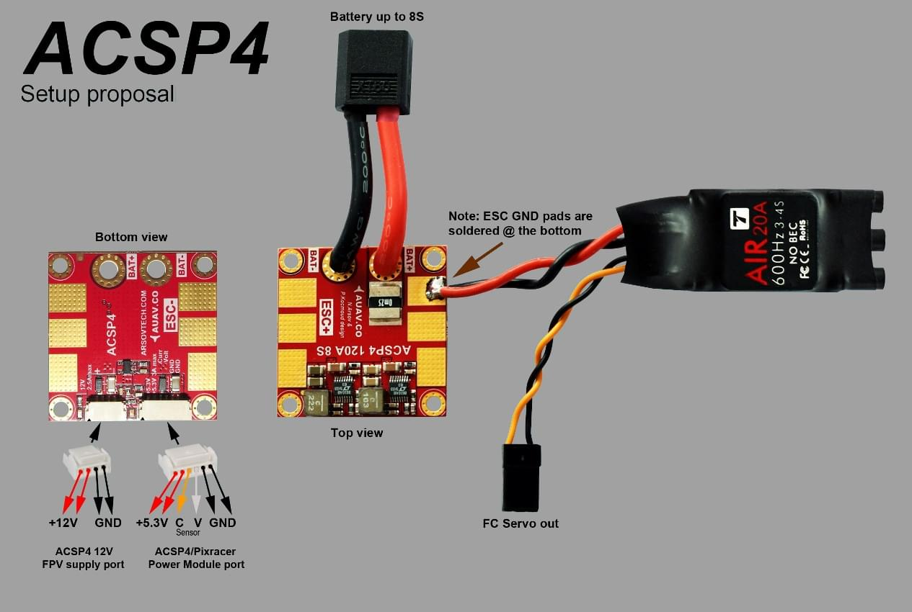

# Швидкий старт з підключенням Pixracer

:::warning PX4 не виробляє цей (або будь-який інший) автопілот. Зверніться до [виробника](https://store.mrobotics.io/) щодо питань технічної підтримки або відповідності вимогам.
:::

:::warning
У процесі будівництва
:::

Цей швидкий старт показує, як живити польовий контролер [Pixracer](../flight_controller/pixracer.md) та підключити його найважливіші периферійні пристрої.

## Посібники з підключення/монтажу

### Основне Налаштування

### Радіо/Дистанційне Управління

Для _ручного_ керування вашим апаратом потрібна система дистанційного керування радіо (RC) (PX4 не вимагає наявності системи радіо для автономних режимів польоту).

Вам буде потрібно [вибрати сумісний передавач/приймач](../getting_started/rc_transmitter_receiver.md) та потім _зв'язати_ їх, щоб вони взаємодіяли (прочитайте інструкції, що додаються до вашого конкретного передавача/приймача).

Нижче наведено інструкції з підключення різних типів приймачів:

- Приймачі FrSky підключаються через показаний порт і можуть використовувати наданий роз'єм введення/виведення.

  

  

- Приймачі PPM-SUM та S.BUS підключаються до порту **RCIN**.

  

- PPM та PWM приймачі, які мають _окремий дріт для кожного каналу_, повинні підключатися до порту **RCIN** _через PPM перетворювач_ [на зразок цього](http://www.getfpv.com/radios/radio-accessories/holybro-ppm-encoder-module.html) (PPM-Sum приймачі використовують єдиний сигнальний дріт для всіх каналів).

### Модуль потужності (ACSP4)

### Зовнішня телеметрія

Pixracer має вбудований WiFi, але також підтримує телеметрію через зовнішні модулі Wi-Fi або радіо телеметрії, підключені до портів `TELEM1` або `TELEM2`. Це показано на схемі підключення нижче.

::: info Порт `TELEM2` повинен бути налаштований як другий екземпляр MAVLink за допомогою параметра [MAV_2_CONFIG](../advanced_config/parameter_reference.md#MAV_2_CONFIG). Для отримання додаткової інформації див. [Периферійні пристрої MAVLink > Екземпляри MAVLink](../peripherals/mavlink_peripherals.md#mavlink-instances) (і [Конфігурація послідовного порту](../peripherals/serial_configuration.md)).
:::
