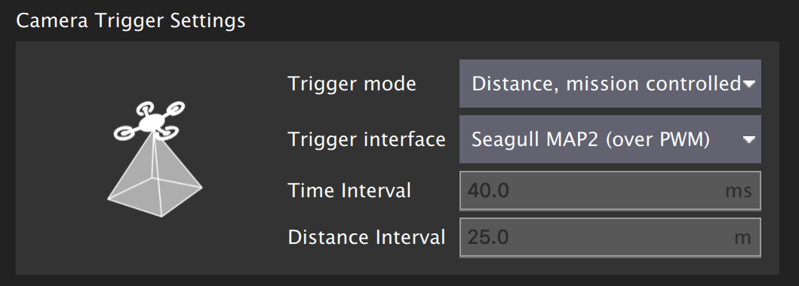

# Налаштування камери

PX4 може бути налаштований для під'єднання фізичних виходів для спуску камери, або його можна використовувати з [камерою MAVLink](#mavlink-cameras).

:::info
Рекомендуємо вам використовувати камеру MAVLink оскільки це робить можливим повний контроль камер через [протокол камери](https://mavlink.io/en/services/camera.html).
Камери, підключені безпосередньо, підтримують лише [невеликий набір](#mavlink-command-interface-directly-connected-cameras) команд камери MAVLink.
:::

Кожен раз, коли спрацьовує камера, публікується повідомлення MAVLink [CAMERA_TRIGGER](https://mavlink.io/en/messages/common.html#CAMERA_TRIGGER), що містить номер послідовності (тобто послідовний номер зображення поточного сеансу) та відповідну відмітку часу.
Ця відмітка може бути використана багато де, включаючи: відмітку фотографій повітряного обстеження та реконструкції, синхронізацію системи з багатьма камерами або для візуально-інерційної навігації.

Також камери можуть (не обов'язково) сигналізувати за допомогою виводу захоплення камери PX4 в момент знімання, що фото/кадр зроблені.
Це дозволяє більш точну прив'язку зображень до позиції GPS для прив'язки до місцевості або потрібну вибірку IMU для синхронізації ВІО, тощо.

<!-- Camera trigger driver: https://github.com/PX4/PX4-Autopilot/tree/main/src/drivers/camera_trigger -->

<!-- Camera capture driver: https://github.com/PX4/PX4-Autopilot/tree/main/src/drivers/camera_capture -->

## Налаштування спрацьовування

Спрацювання камери зазвичай налаштовується з розділу _QGroundControl_ [Налаштування рухомого засобу > Камера](https://docs.qgroundcontrol.com/master/en/qgc-user-guide/setup_view/camera.html#px4-camera-setup).



Різні [режими спрацювання](#trigger-modes), [бекенди інтерфейсу спуску](#trigger-interface-backends) та [налаштування виводу спуску](#trigger-output-pin-configuration) описані нижче (їх також можна встановити прямо з [параметрів](../advanced_config/parameters.md)).

:::info
Розділ налаштувань камери за замовчуванням недоступний для польотних контролерів на основі FMUv2 (наприклад 3DR Pixhawk), оскільки модуль камери не включено в прошивку автоматично.
Для додаткової інформації дивіться [Пошук/Оновлення параметрів > Параметри, яких немає в прошивці](../advanced_config/parameters.md#parameter-not-in-firmware).
:::

### Режими спрацювання

Підтримуються чотири різні режими, керуються параметром [TRIG_MODE](../advanced_config/parameter_reference.md#TRIG_MODE):

| Режим | Опис                                                                                                                                                                                                                                                                                     |
| ----- | ---------------------------------------------------------------------------------------------------------------------------------------------------------------------------------------------------------------------------------------------------------------------------------------- |
| 0     | Спрацювання камери вимкнено.                                                                                                                                                                                                                                             |
| 1     | Працює як звичайний вимірювач інтервалів який можна увімкнути або вимкнути використовуючи команду MAVLink `MAV_CMD_DO_TRIGGER_CONTROL`. Дивіться [командний інтерфейс](#mavlink-command-interface-directly-connected-cameras) для додаткової інформації. |
| 2     | Вмикає вимірювач інтервалів.                                                                                                                                                                                                                                             |
| 3     | Спрацювання основані на відстані. Знімок робиться кожного разу, коли перевищується встановлена горизонтальна відстань. Мінімальний інтервал часу між двома знімками, однак, обмежується встановленим інтервалом спрацьовування.          |
| 4     | Спрацьовує автоматично при виконанні обстеження у режимі політного завдання.                                                                                                                                                                                             |

:::info
Якщо ви вперше вмикаєте додаток спрацювання камери, не забудьте перезавантажитись після зміни параметру `TRIG_MODE`.
:::

### Бекенди інтерфейсу спрацювання

Драйвер спрацювання камери підтримує кілька бекендів - кожен для конкретного застосування, що керується параметром [TRIG_INTERFACE](../advanced_config/parameter_reference.md#TRIG_INTERFACE):

| Номер | Опис                                                                                                                                                                                                                                                                                                                                                                                                                                                                                                                                                                                                                                                                  |
| ----- | --------------------------------------------------------------------------------------------------------------------------------------------------------------------------------------------------------------------------------------------------------------------------------------------------------------------------------------------------------------------------------------------------------------------------------------------------------------------------------------------------------------------------------------------------------------------------------------------------------------------------------------------------------------------- |
| 1     | Вмикає інтерфейс GPIO. AUX виходи дають періодичний високий або низький сигнал (в залежності від параметра `TRIG_POLARITY`) кожен інтервал часу [TRIG_INTERVAL](../advanced_config/parameter_reference.md#TRIG_INTERVAL). Це може бути використано для безпосереднього спуску більшості стандартних камер машинного зору. Зверніть увагу, що на апаратному забезпеченні серії PX4FMU (Pixhawk, Pixracer тощо) рівень сигналу на AUX контактах становить 3,3 В.                                                                             |
| 2     | Вмикає інтерфейс Seagull MAP2. Це дозволяє використовувати [Seagull MAP2](http://www.seagulluav.com/product/seagull-map2/) для взаємодії з безліччю камер, що підтримуються. Контакт/канал 1 (спуск камери) так контакт/канал 2 (селектор режиму) MAP2 повинні бути підключені до [контактів спрацювання камери](#trigger-output-pin-configuration) з налаштованим низьким та високим сигналом. За допомогою Seagull MAP2, PX4 також підтримує автоматичний контроль потужності та функційність утримання в робочому стані камер Sony Multiport, таких як QX-1. |
| 3     | Вмикає інтерфейс MAVLink. У цьому режимі не використовується фактичний апаратний вивід. Автопілотом відправляється лише повідомлення MAVLink `CAMERA_TRIGGER` (за замовчуванням, якщо додаток MAVLink в режимі `onboard`. В іншому випадку потрібно буде увімкнути власний потік).                                                                                                                                                                                                                                                                                                 |
| 4     | Вмикає загальний інтерфейс ШІМ. Це дозволяє використовувати [інфрачервоні спускові пристрої](https://hobbyking.com/en_us/universal-remote-control-infrared-shutter-ir-rc-1g.html) або сервоприводи для спуску камери.                                                                                                                                                                                                                                                                                                                                                                                                                 |

### Налаштування вихідних контактів спуску

Контакти спуску камери встановлюються в _QGroundControl_ на екрані налаштувань [Приводи](../config/actuators.md).

Контакти спуску можуть бути встановлені призначенням функції `Camera_Trigger` на будь-який вихід FMU.
Якщо використовується налаштування спрацювання, яке потребує двох контактів (наприклад Seagull MAP2), ви можете призначити її на будь-які два виходи.

Однак зверніть увагу, якщо вивід _ШІМ_ було використано для спуску камери (наприклад як у Seagull MAP2), уся група ШІМ не може бути використана для чого-небудь ще (ви не зможете використати інший вивід в групі для приводу, двигуна або захоплення камери, оскільки таймер вже використано).

::: info
At time of writing triggering only works on FMU pins:

- На контролері польоту Pixhawk, який має як FMU, так і плати вводу-виводу, контакти FMU призначені на виходи `AUX` (наприклад Pixhawk 4, CUAV v5+).
- Контакти контролера, що має лише FMU призначено на виходи `MAIN` (наприклад Pixhawk 4 mini, CUAV v5 nano).

:::

### Інші параметри

| Параметр                                                                                                           | Опис                                                                                                                                                                                                                                                                                                                                          |
| ------------------------------------------------------------------------------------------------------------------ | --------------------------------------------------------------------------------------------------------------------------------------------------------------------------------------------------------------------------------------------------------------------------------------------------------------------------------------------- |
| [TRIG_POLARITY](../advanced_config/parameter_reference.md#TRIG_POLARITY)                      | Доречний лише при використанні інтерфейсу GPIO. Встановлює полярність контакту спрацювання. Високий сигнал в активному стані означає що сигнал на контакті зазвичай низький і підіймається на високий рівень під час спрацювання. Низький сигнал в активному стані - навпаки. |
| [TRIG_INTERVAL](../advanced_config/parameter_reference.md#TRIG_INTERVAL)                      | Визначає час між двома послідовними подіями спрацьовування в мілісекундах.                                                                                                                                                                                                                                                    |
| [TRIG_ACT_TIME](../advanced_config/parameter_reference.md#TRIG_ACT_TIME) | Визначає час у мілісекундах, протягом якого контакт спуску утримується в стані "активний" перед поверненням до нейтрального. У режимах ШІМ мінімум обмежується 40 мс щоб завжди вміщати активний імпульс у сигнал ШІМ з частотою 50 Гц.                                                                       |

Повний список параметрів, що стосуються модуля спуску камери можна знайти на сторінці [довіднику параметрів](../advanced_config/parameter_reference.md#camera-trigger).

## Захоплення камерою

Камери можуть також (необов'язково) використовувати контакт захоплення камерою, щоб сигналізувати точну мить, коли зроблено фото/кадр.
Це дозволяє більш точну прив'язку зображень до позиції GPS для прив'язки до місцевості або потрібну вибірку IMU для синхронізації ВІО, тощо.

Захоплення/зворотний зв'язок камери вмикається в PX4 встановленням [CAM_CAP_FBACK = 1](../advanced_config/parameter_reference.md#CAM_CAP_FBACK).
Контакт, використаний для захоплення камерою потім налаштовується на екрані налаштувань _QGroundControl_ [Приводи](../config/actuators.md), призначенням функції `Camera_Capture` на будь-який вихід FMU.

Note that if a _PWM output_ is used as a camera capture input, the whole PWM group cannot be used for anything else (you can't use another output in the group for an actuator, motor, or camera trigger, because the timer has already been used).

::: info
At time of writing camera capture only works on FMU pins:

- On a Pixhawk flight controller that has both FMU and I/O boards FMU pins map to `AUX` outputs (e.g. Pixhawk 4, CUAV v5+).
- A controller that only has an FMU, the pins map to `MAIN` outputs (e.g. Pixhawk 4 mini, CUAV v5 nano).

:::

PX4 detects a rising edge with the appropriate voltage level on the camera capture pin (for Pixhawk flight controllers this is normally 3.3V).
If the camera isn't outputting an appropriate voltage, then additional circuitry will be required to make the signal compatible.

Cameras that have a hotshoe connector (for connecting a flash) can usually be connected via a hotshoe-adaptor.
For example, the [Seagull #SYNC2 Universal Camera Hot Shoe Adapter](https://www.seagulluav.com/product/seagull-sync2/) is an optocoupler that decouples and shifts the flash voltage to the Pixhawk voltage.
This slides into the flash slot on the top of the camera.
The red and black ouptputs are connected to the servo rail/ground and the white wire is connected to the input capture pin.


:::info
PX4 emits the MAVLink [CAMERA_TRIGGER](https://mavlink.io/en/messages/common.html#CAMERA_TRIGGER) message on both camera trigger and camera capture.
If camera capture is configured, the timestamp from the camera capture driver is used, otherwise the triggering timestamp.
:::

## MAVLink Command Interface (Directly Connected Cameras)

When using a camera connected to the flight controller as described in this document (e.g. using the GPIO, PWM or seagull backend interfaces) the camera driver supports the following subset of MAVLink commands:

[MAV_CMD_DO_TRIGGER_CONTROL](https://mavlink.io/en/messages/common.html#MAV_CMD_DO_TRIGGER_CONTROL) - Accepted in "command controlled" mode (`TRIG_MODE` 1).

| Command Parameter | Description                                                                                                                                                        |
| ----------------- | ------------------------------------------------------------------------------------------------------------------------------------------------------------------ |
| Param #1          | Trigger enable/disable. `1`: enable (start), `0`: disable.                      |
| Param #2          | Reset trigger sequence. `1`: reset, any other value does nothing.                                                  |
| Param #3          | Pause triggering, but without switching the camera off or retracting it. `1`: pause, `0`: restart. |

<!-- https://github.com/PX4/PX4-Autopilot/blob/main/src/drivers/camera_trigger/camera_trigger.cpp#L549 -->

[MAV_CMD_DO_DIGICAM_CONTROL](https://mavlink.io/en/messages/common.html#MAV_CMD_DO_DIGICAM_CONTROL) - Accepted in all modes.

This is used by the GCS to test-shoot the camera from the user interface.
The trigger driver does not support all camera control parameters defined by the MAVLink spec.

| Command Parameter | Description                                                                                             |
| ----------------- | ------------------------------------------------------------------------------------------------------- |
| Param #5          | Trigger one-shot command (set to 1 to trigger a single image frame). |

[MAV_CMD_DO_SET_CAM_TRIGG_DIST](https://mavlink.io/en/messages/common.html#MAV_CMD_DO_SET_CAM_TRIGG_DIST) - Accepted in "mission controlled" mode (`TRIG_MODE` 4)

This command is autogenerated during missions to trigger the camera based on survey missions from the GCS.

[MAV_CMD_OBLIQUE_SURVEY](https://mavlink.io/en/messages/common.html#MAV_CMD_OBLIQUE_SURVEY) - Mission command to set a camera auto mount pivoting oblique survey.

This accepts `param1` to `param4` as defined in the MAVLink message definition.
The shutter integration setting (`param2`) is only obeyed with a GPIO backend.

<!-- https://github.com/PX4/PX4-Autopilot/blob/main/src/drivers/camera_trigger/camera_trigger.cpp#L632 -->

## MAVLink Cameras

PX4 can also be configured to use a [MAVLink trigger interface backend](#trigger-interface-backends) with a MAVLink camera.

In this case MAVLink camera messages are forwarded to a MAVLink camera for handling (although PX4 will still emit the `CAMERA_TRIGGER` when a trigger command is received).

MAVLink cameras are recommended because directly connected cameras only support [a small subset](#mavlink-command-interface-directly-connected-cameras) of the available MAVLink camera messages and commands.
MAVLink cameras potentially offer much more control over a camera using the [MAVLink Camera Protocol](https://mavlink.io/en/services/camera.html).

## Testing Trigger Functionality

:::warning
The following sections are out of date and need retesting.
:::

1. On the PX4 console:

   ```
   camera_trigger test
   ```

2. From _QGroundControl_:

   Click on **Trigger Camera** in the main instrument panel.
   These shots are not logged or counted for geotagging.

   

## Sony QX-1 example (Photogrammetry)


In this example, we will use a Seagull MAP2 trigger cable to interface to a Sony QX-1 and use the setup to create orthomosaics after flying a fully autonomous survey mission.

### Trigger Settings

The recommended camera settings are:

- `TRIG_INTERFACE=2` (Seagull MAP2).
- `TRIG_MODE=4` (Mission controlled).
- Leave the remaining parameters at their defaults.

You will need to connect the Seagull MAP2 to FMU pins on your autopilot.
The other end of the MAP2 cable will go into the QX-1's "MULTI" port.

### Camera Configuration

We use a Sony QX-1 with a 16-50mm f3.5-5.6 lens for this example.

To avoid autofocus and metering lag when the camera is triggered, the following guidelines should be followed:

- Manual focus to infinity
- Set camera to continuous shooting mode
- Manually set exposure and aperture
- ISO should be set as low as possible
- Manual white balance suitable for scene

### Mission Planning


### Geotagging

Download/copy the logfile and images from the flight and point QGroundControl to them.
Then click on **Start Tagging**.


You can verify the geotagging using a free online service like [Pic2Map](https://www.pic2map.com/).
Note that Pic2Map is limited to only 40 images.

### Reconstruction

We use [Pix4D](https://pix4d.com/) for 3D reconstruction.


## Camera-IMU sync example (VIO)

In this example, we will go over the basics of synchronising IMU measurements with visual data to build a stereo Visual-Inertial Navigation System (VINS).
To be clear, the idea here isn't to take an IMU measurement exactly at the same time as we take a picture but rather to correctly time stamp our images so as to provide accurate data to our VIO algorithm.

The autopilot and companion have different clock bases (boot-time for the autopilot and UNIX epoch for companion), so instead of skewing either clock, we directly observe the time offset between the clocks.
This offset is added or subtracted from the timestamps in the MAVLink messages (e.g. `HIGHRES_IMU`) in the cross-middleware translator component (e.g. MAVROS on the companion and `mavlink_receiver` in PX4).
The actual synchronisation algorithm is a modified version of the Network Time Protocol (NTP) algorithm and uses an exponential moving average to smooth the tracked time offset.
This synchronisation is done automatically if MAVROS is used with a high-bandwidth onboard link (MAVLink mode `onboard`).

For acquiring synchronised image frames and inertial measurements, we connect the trigger inputs of the two cameras to a GPIO pin on the autopilot.
The timestamp of the inertial measurement from start of exposure and a image sequence number is recorded and sent to the companion computer (`CAMERA_TRIGGER` message), which buffers these packets and the image frames acquired from the camera.
They are matched based on the sequence number (first image frame is sequence 0), the images timestamped (with the timestamp from the `CAMERA_TRIGGER` message) and then published.

The following diagram illustrates the sequence of events which must happen in order to correctly timestamp our images.

[](https://mermaid.live/edit#pako:eNqNUs9rwjAU_lceOW-3nXIQpIoIVkftZIdCeTbPNqxJXJI6ivi_L1Er6Dzs9kK-H3lfviOrjCDGmaPvjnRFE4m1RVVogKXxBFbWjQezg_fPN-CQS0Xgel3Bj_QNKDxY40A6EEYTYOeNQi8rbNs-SkTS62g04DgkqMgi5EG2JguWUPR_vaoLSlh5CKAb63reGuMdoBbR96Zwz7kzvQylcrXjPDFKBe71BYnR3po2ClzhkXnZNR1vFlJ_cR6GMkkn5WRV5tl8NptmZbJa5tlqEXmtMXuYBtMe4m05X-bTbDNegJJtKx1VRgv3NIybQTJOp9l4EH94zGMY99ugmqcfa49q_zyER3aKvmpg-G3QndqS_R_17AJSYU3n9PfdNuzXFJq0YC8sgBVKEbp0jHoF8w0pKhgPo6Addq0vWKFPARp7sg4lYtzbjl5Ytxfoh-oxvsPW0ekXb8TjxQ)

<!-- Original

{/% mermaid %/}
sequenceDiagram
  Note right of PX4 : Time sync with mavros is done automatically
  PX4 ->> mavros : Camera Trigger ready
  Note right of camera driver : Camera driver boots and is ready
  camera driver ->> mavros : mavros_msgs::CommandTriggerControl
  mavros ->> PX4 : MAVLink::MAV_CMD_DO_TRIGGER_CONTROL
  loop Every TRIG_INTERVAL milliseconds
  PX4 ->> mavros : MAVLink::CAMERA_TRIGGER
  mavros ->> camera driver : mavros_msgs::CamIMUStamp
  camera driver ->> camera driver : Match sequence number
  camera driver ->> camera driver : Stamp image and publish
end
{/% endmermaid %/}
-->

### Step 1

First, set the TRIG_MODE to 1 to make the driver wait for the start command and reboot your FCU to obtain the remaining parameters.

### Step 2

For the purposes of this example we will be configuring the trigger to operate in conjunction with a Point Grey Firefly MV camera running at 30 FPS.

- `TRIG_INTERVAL`: 33.33 ms
- `TRIG_POLARITY`: 0 (active low)
- `TRIG_ACT_TIME`: 0.5 ms.
  The manual specifies it only has to be a minimum of 1 microsecond.
- `TRIG_MODE`: 1, because we want our camera driver to be ready to receive images before starting to trigger.
  This is essential to properly process sequence numbers.

### Step 3

Wire up your cameras to your AUX port by connecting the ground and signal pins to the appropriate place.

### Step 4

You will have to modify your driver to follow the sequence diagram above.
Public reference implementations for [IDS Imaging UEye](https://github.com/ProjectArtemis/ueye_cam) cameras and for [IEEE1394 compliant](https://github.com/andre-nguyen/camera1394) cameras are available.
