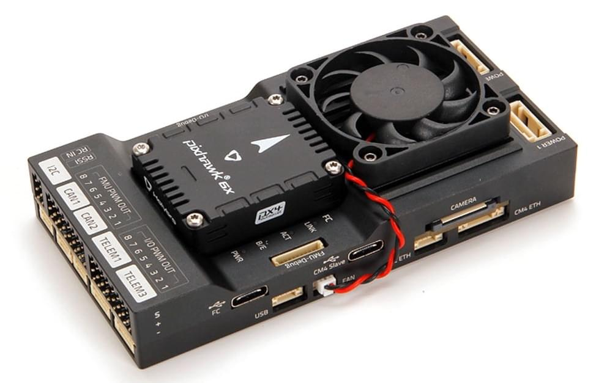
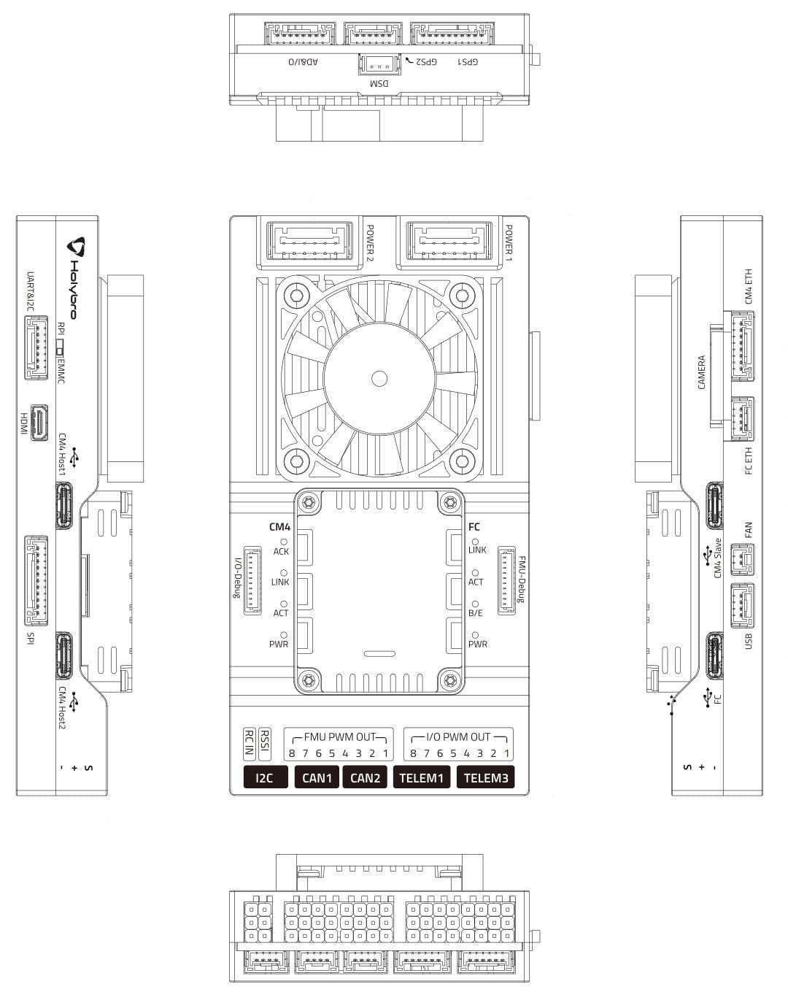
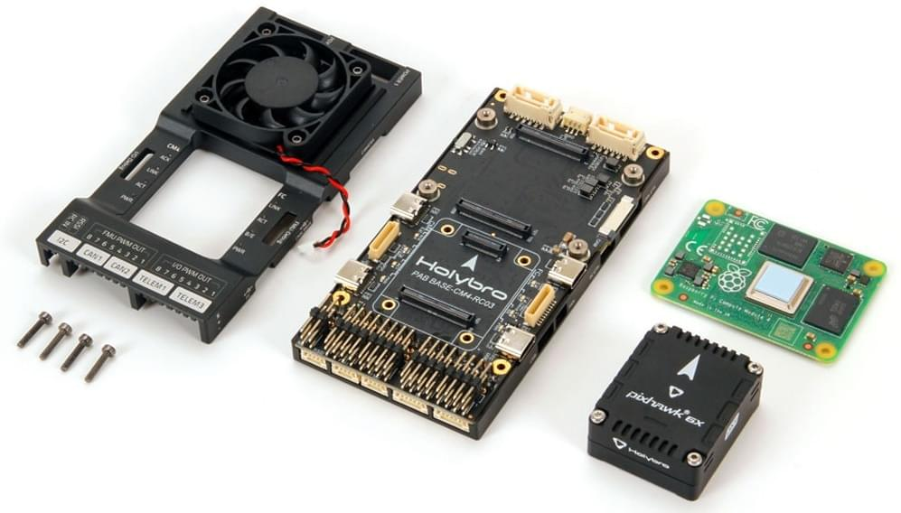
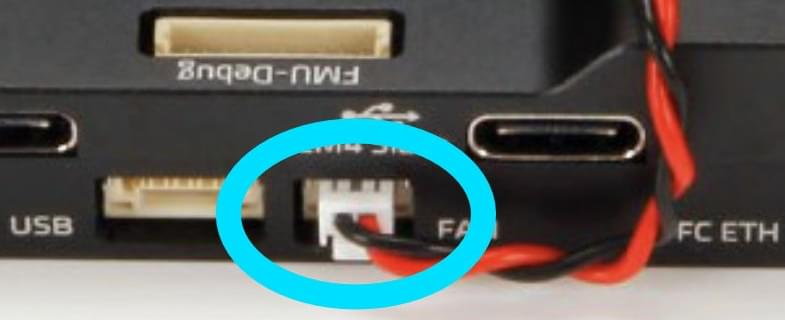
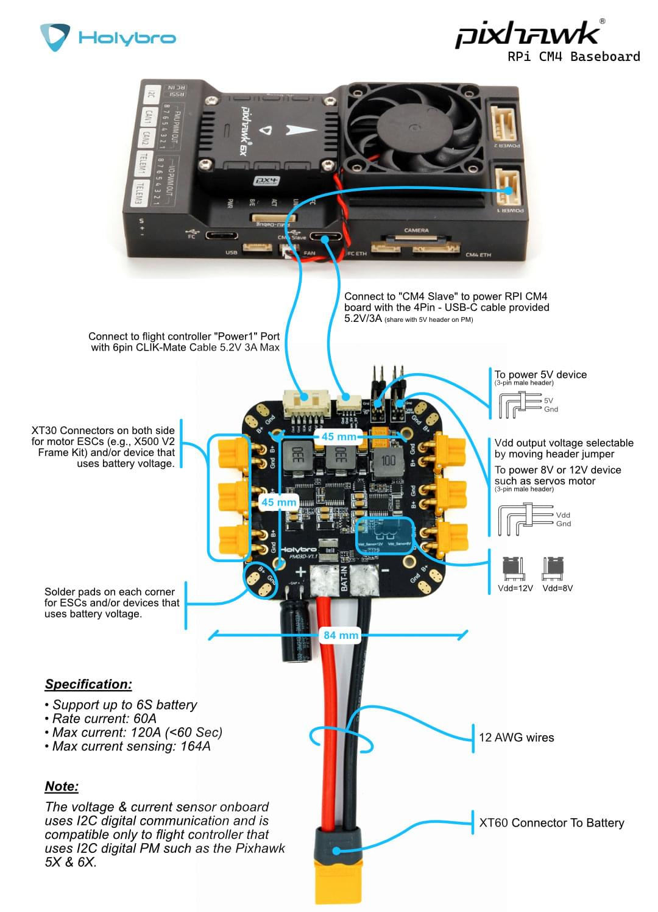
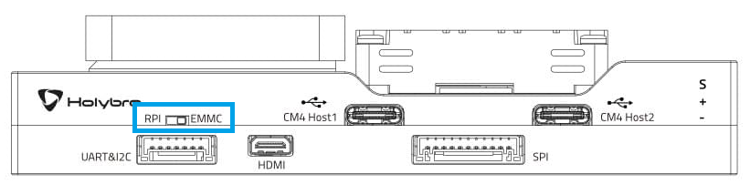
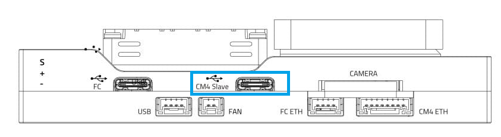
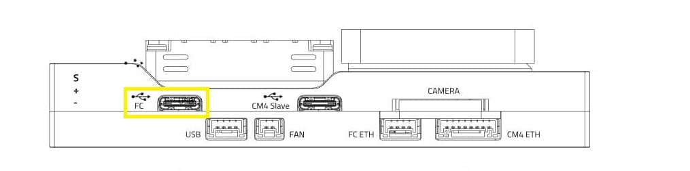
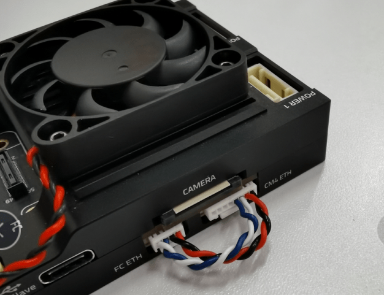

# Holybro Pixhawk RPi CM4 Baseboard

[Holybro Pixhawk RPi CM4 Baseboard](https://holybro.com/products/pixhawk-rpi-cm4-baseboard) - це одноплатне рішення, яке передбачає попередню інтеграцію (змінну) контролера польоту Pixhawk з супутниковим комп'ютером Raspberry Pi CM4 ("RPi"). Базова плата має компактний форм-фактор з усіма необхідними з'єднаннями для розробки.



Модуль контролера польоту внутрішньо підключений до RPi CM4 через `TELEM2`, але також може бути підключений за допомогою Ethernet за допомогою зовнішнього кабелю, що надається.

Ця базова плата сумісна з [Holybro Pixhawk 5X](../flight_controller/pixhawk5x.md), [Holybro Pixhawk 6X](../flight_controller/pixhawk6x.md) та будь-яким іншим контролером Pixhawk, який відповідає стандартам роз'ємів [Pixhawk Autopilot Bus Standard](https://github.com/pixhawk/Pixhawk-Standards/blob/master/DS-010%20Pixhawk%20Autopilot%20Bus%20Standard.pdf) для механічної сумісності між виробниками.

:::note
Плата відповідає стандарту роз'ємів [Pixhawk](https://github.com/pixhawk/Pixhawk-Standards/blob/master/DS-009%20Pixhawk%20Connector%20Standard.pdf) і стандарту [Pixhawk Autopilot Bus](https://github.com/pixhawk/Pixhawk-Standards/blob/master/DS-010%20Pixhawk%20Autopilot%20Bus%20Standard.pdf) (включаючи вказівки щодо "механічної сумісності між виробниками").
:::

## Купити

- [Holybro Pixhawk RPi CM4 Baseboard](https://holybro.com/products/pixhawk-rpi-cm4-baseboard) (www.holybro.com)

  Базову плату можна придбати з або без RPi CM4 та/або контролером польоту:

  - Модуль Raspberry Pi CM4 (CM4008032), постачений компанією Holybro, має наступні технічні характеристики:
    - RAM: 8GB
    - eMMC: 32GB
    - Wireless: No
  - Рекомендована мінімальна специфікація для RPi CM4:
    - RAM: 4GB (or 8GB)
    - eMMC: 16GB
    - Wireless: Yes

## Підключення & Порти

:::info
[Документація Holybro](https://docs.holybro.com/autopilot/pixhawk-baseboards/pixhawk-rpi-cm4-baseboard/connections-and-ports) містить більше детальної (і можливо більш "актуальної") інформації про порти та з'єднання.
:::

Діаграма нижче показує всі роз'єми та порти на базовій платі.



### RPi CM4 та FC Послідовне підключення

Порт керування польотом `TELEM2` внутрішньо підключений до RPi CM4, як показано:

| RPi CM4 | FC TELEM2 (FMU) |
| ------- | --------------- |
| GPIO14  | TXD             |
| GPIO15  | RXD             |
| GPIO16  | CTS             |
| GPIO17  | RTS             |

:::info
Підключення також повинно бути [налаштоване як на RPi, так і на PX4](#configure-px4-to-cm4-mavlink-serial-connection) (якщо не використовується [Ethernet](#ethernet-connection-optional)).
:::

## Встановлення Політного Контролера

Плагін-сумісний контролер польоту, такий як [Holybro Pixhawk 5X](../flight_controller/pixhawk5x.md) та [Holybro Pixhawk 6X](../flight_controller/pixhawk6x.md), може просто бути вставлений у роз'єм модуля.

Контролери польоту, які мають інший форм-фактор, будуть потребувати додаткового підключення проводів.

## Встановлення супутника RPi CM4

Цей розділ показує, як встановити/прикріпити Raspberry Pi CM4 до базової плати.



Щоб встановити компаньйонський комп'ютер Raspberry Pi CM4:

1. Відключити `FAN` (FAN A).

   

1. Видаліть ці 4 гвинти на задній стороні підлогової дошки.

   

1. Видаліть підставку корпусу, встановіть CM4 та використовуйте 4 гвинти для його кріплення (як показано):

   

1. Прикріпіть кришку знову.

## Проводка силового модуля

Модуль живлення PM03D постачається разом з платою.

RPi CM4 та контролер польоту повинні бути живлені окремо:

- Контролер польоту живиться через кабель CLIK-Mate до порту `POWER1` або порту `POWER2`
- RPi CM4 працює від підключення `USB C` (CM4 Slave). Ви також можете використовувати власний блок живлення для живлення базової плати RPi CM4.

На зображенні нижче показана проводка більш детально.



## Прошивка RPi CM4

Цей розділ пояснює, як встановити вашу улюблену дистрибутив Linux, таку як "Raspberry Pi OS 64bit", на RPi EMCC.

Примітки:

- Якщо ви використовуєте PX4, вам потрібно використовувати версію PX4 1.13.1 або новішу, щоб PX4 впізнав цю базову плату.
- Вентилятор не показує, чи живиться/працює RPi CM4.
- Модуль живлення, вставлений у Power1/2, не живить частину RPi. Ви можете використовувати додатковий кабель USB-C від модуля живлення PM03D до порту USB-C CM4 Slave.
- Порт Micro-HDMI є вихідним портом.
- Плати RPi CM4, які не мають пристрою Wifi, не будуть автоматично підключатися. У цьому випадку вам знадобиться підключити його до маршрутизатора або підключити сумісний Wifi-донгл до портів хоста CM4.

### Flash EMMC

Записати образ RPi на EMMC.

1. Switch Dip-Switch to `RPI`.

   

1. Підключіть комп'ютер до порту USB-C _CM4 Slave_, що використовується для живлення та прошивки RPi.

   

1. Отримайте `usbboot`, зберіть його та запустіть.

   ```sh
   sudo apt install libusb-1.0-0-dev
   git clone --depth=1 https://github.com/raspberrypi/usbboot,
   cd usbboot
   make
   sudo ./rpiboot
   ```

1. Тепер ви можете встановити свою перевагу Linux дистрибутив за допомогою `rpi-imager`. Переконайтеся, що ви додали налаштування WiFi та SSH (приховані за символом шестерні / розширеним).

   ```sh
   sudo apt install rpi-imager
   rpi-imager
   ```

1. Після завершення відключення USB-C CM4 Slave (це відмонтує томи та вимкне CM4).
1. Перемикач Dip-Switch поверніть на `EMMC`.
1. Увімкніть CM4, надаючи живлення через порт USB-C CM4 Slave.
1. Щоб перевірити, чи запускається/працює, ви можете або:
   - Перевірте, чи є вихід HDMI
   - Підключіться через SSH (якщо налаштовано в rpi-imager, і є доступ до WiFi).

## Налаштуйте послідовне підключення PX4 до CM4 MAVLink

:::info
Якщо ви використовуєте [Ethernet](#ethernet-connection-optional) для підключення FC та RPi, ця настройка не потрібна.
:::

Модуль Pixhawk FC [внутрішньо підключено до RPi CM4](#rpi-cm4-fc-serial-connection) за допомогою `TELEM2` (`/dev/ttyS4`). FC та RPi CM4 повинні бути налаштовані для зв'язку через цей порт.

### Налаштування послідовного порту FC

FC повинен бути налаштований для підключення до порту `TELEM2` правильно за замовчуванням. Якщо ні, ви можете налаштувати порт за допомогою параметрів, як показано.

Для активації цього екземпляру MAVLink на FC:

1. Підключіть комп'ютер, на якому працює QGroundControl, через порт USB Type C на базовій платі, позначеній як `FC`

   

1. [Встановіть параметри](../advanced_config/parameters.md):

   - `MAV_1_CONFIG` = `102`
   - `MAV_1_MODE = 2`
   - `SER_TEL2_BAUD` = `921600`

1. Перезавантажте FC.

### Налаштування послідовного порту RPi

На стороні RPi:

1. Підключіться до RPi (використовуючи WiFi, маршрутизатор або Wifi Dongle).
1. Увімкніть послідовний порт RPi, запустивши `RPi-config`

   - Перейдіть до `3 Варіанти інтерфейсу`, потім `I6 Серійний порт`. Потім введіть:
     - `login shell accessible over serial → No`
     - `serial port hardware enabled` → `Yes`

1. Завершіть і перезавантажте. (Це додасть `enable_uart=1` у `/boot/config.txt`, та видалить `consoleal0,115200` з `/boot/cmdline.txt`
1. Тепер MAVLink-трафік повинен бути доступний на `/dev/serial0` з швидкістю передачі даних 921600.

## Спробуйте MAVSDK-Python

1. Переконайтеся, що CM4 підключений до Інтернету, наприклад, використовуючи wifi або Ethernet.
1. Встановіть MAVSDK Python:

   ```sh
   python3 -m pip install mavsdk
   ```

1. Скопіюйте приклад з [прикладів MAVSDK-Python](https://github.com/mavlink/MAVSDK-Python/tree/main/examples).
1. Змініть `system_address="udp://:14540"` на `system_address="serial:///dev/serial0:921600"`
1. Спробуйте приклад. Дозвіл на послідовний порт вже повинен бути доступний через групу `dialout`.

## Підключення Ethernet (Необов'язково)

Модуль керування польотом [внутрішньо підключено до RPi CM4](#rpi-cm4-fc-serial-connection) з `TELEM2` (Serial).

Ви також можете налаштувати локальне підключення Ethernet між ними за допомогою постачаного кабелю. Підключення через Ethernet надає швидкий, надійний та гнучкий спосіб зв'язку, який може бути альтернативою використанню USB або інших послідовних з'єднань.

:::info
Для отримання загальної інформації див. : [Налаштування Ethernet PX4](../advanced_config/ethernet_setup.md).
:::

### Підключіть кабель

Для налаштування локального етнернет-з'єднання між CM4 та бортовим комп'ютером, потрібно підключити два етнернет-порти за допомогою наданого коннектора з 8 контактів до 4 контактів.



Схема виводів кабелю:

| CM4 Eth 8 Pin | FC ETH 4 Pin |
| ------------- | ------------ |
| A             | B            |
| B             | A            |
| C             | D            |
| D             | C            |
| -             | N/A          |
| -             | N/A          |
| -             | N/A          |
| -             | N/A          |

### Налаштування IP на CM4

Оскільки в цій конфігурації відсутній активний DHCP-сервер, IP-адреси повинні бути встановлені вручну:

Спочатку підключіться до CM4 через SSH, підключившись до WiFi CM4 (або використовуйте ключ Wi-Fi). Після того як етнергетичні кабелі підключені, мережевий інтерфейс `eth0` здається переходить зі стану DOWN в UP.

Ви можете перевірити статус за допомогою:

```sh
ip address show eth0
```

Ви також можете спробувати увімкнути його вручну:

```sh
sudo ip link set dev eth0 up
```

Потім здається, що він автоматично встановлює локальну адресу зв'язку, для цього прикладу виглядає так:

```sh
ip address show eth0

2: eth0: <BROADCAST,MULTICAST,UP,LOWER_UP> mtu 1500 qdisc mq state UP group default qlen 1000
    link/ether xx:xx:xx:xx:xx:xx brd ff:ff:ff:ff:ff:ff
    inet 169.254.21.183/16 brd 169.254.255.255 scope global noprefixroute eth0
       valid_lft forever preferred_lft forever
    inet6 fe80::yyyy:yyyy:yyyy:yyyy/64 scope link
       valid_lft forever preferred_lft forever
```

Це означає, що IP-адреса мережі ethernet CM4 - 169.254.21.183.

#### Налаштування IP на FC

Зараз підключіться до оболонки NuttX (використовуючи консоль або оболонку MAVLink) та перевірте статус зв'язку:

```sh
ifconfig

eth0    Link encap:Ethernet HWaddr xx:xx:xx:xx:xx:xx at DOWN
        inet addr:0.0.0.0 DRaddr:192.168.0.254 Mask:255.255.255.0
```

На цьому прикладі спочатку він DOWN.

Щоб встановити його на UP:

```sh
ifup eth0

ifup eth0...OK
```

Тепер знов перевірте конфігурацію:

```sh
ifconfig

eth0    Link encap:Ethernet HWaddr xx:xx:xx:xx:xx:xx at UP
        inet addr:0.0.0.0 DRaddr:192.168.0.254 Mask:255.255.255.0
```

Однак в нього ще немає IP. Встановіть такий, який схожий на той, що на RPi CM4:

```sh
ifconfig eth0 169.254.21.184
```

Далі перевірте:

```sh
ifconfig

eth0    Link encap:Ethernet HWaddr xx:xx:xx:xx:xx:xx at UP
        inet addr:169.254.21.184 DRaddr:169.254.21.1 Mask:255.255.255.0
```

Тепер пристрої повинні мати можливість пінгувати одне одного.

Зверніть увагу, що ця конфігурація є ефемерною і буде втрачена після перезавантаження, тому нам потрібно знайти спосіб налаштувати її статично.

#### Тест пінгу

Перший з CM4:

```sh
ping 169.254.21.184

PING 169.254.21.184 (169.254.21.184) 56(84) bytes of data.
64 bytes from 169.254.21.184: icmp_seq=1 ttl=64 time=0.188 ms
64 bytes from 169.254.21.184: icmp_seq=2 ttl=64 time=0.131 ms
64 bytes from 169.254.21.184: icmp_seq=3 ttl=64 time=0.190 ms
64 bytes from 169.254.21.184: icmp_seq=4 ttl=64 time=0.112 ms
^C
--- 169.254.21.184 ping statistics ---
4 packets transmitted, 4 received, 0% packet loss, time 3077ms
rtt min/avg/max/mdev = 0.112/0.155/0.190/0.034 ms
```

Потім з польотного контролера в NuttShell:

```sh
ping 169.254.21.183

PING 169.254.21.183 56 bytes of data
56 bytes from 169.254.21.183: icmp_seq=0 time=0 ms
56 bytes from 169.254.21.183: icmp_seq=1 time=0 ms
56 bytes from 169.254.21.183: icmp_seq=2 time=0 ms
56 bytes from 169.254.21.183: icmp_seq=3 time=0 ms
56 bytes from 169.254.21.183: icmp_seq=4 time=0 ms
56 bytes from 169.254.21.183: icmp_seq=5 time=0 ms
56 bytes from 169.254.21.183: icmp_seq=6 time=0 ms
56 bytes from 169.254.21.183: icmp_seq=7 time=0 ms
56 bytes from 169.254.21.183: icmp_seq=8 time=0 ms
56 bytes from 169.254.21.183: icmp_seq=9 time=0 ms
10 packets transmitted, 10 received, 0% packet loss, time 10010 ms
```

#### MAVLink/MAVSDK Test

Для цього нам потрібно встановити екземпляр MAVLink для відправлення трафіку на IP-адресу CM4:

Для початкового тесту ми можемо зробити:

```sh
mavlink start -o 14540 -t 169.254.21.183
```

Це буде відправляти трафік MAVLink по UDP на порт 14540 (порт MAVSDK/MAVROS) на цей IP, що означає, що MAVSDK може просто слухати будь-який UDP, що надходить на цей типовий порт.

Для запуску прикладу MAVSDK встановіть mavsdk через pip і спробуйте приклад з [MAVSDK-Python/examples](https://github.com/mavlink/MAVSDK-Python/tree/main/examples).

Наприклад:

```sh
python3 -m pip install mavsdk

wget https://raw.githubusercontent.com/mavlink/MAVSDK-Python/main/examples/tune.py
chmod +x tune.py
./tune.py
```

## Дивіться також

- [Отримати базову плату Pixhawk Raspberry Pi CM4 від Holybro, яка спілкується з PX4](https://px4.io/get-the-pixhawk-raspberry-pi-cm4-baseboard-by-holybro-talking-with-px4/) (блог px4.io):
  - Урок, який показує, як підключити Pixhawk 6X + Raspberry Pi на базі CM4 через провідний Ethernet.
