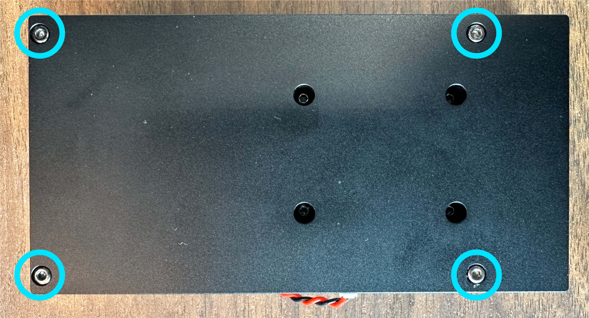
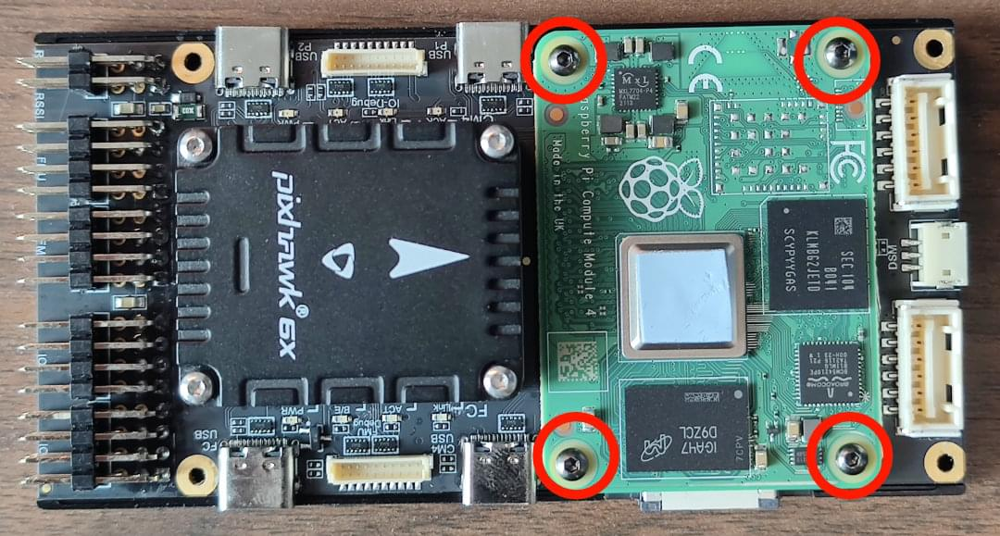

# Holybro Pixhawk RPi CM4 Baseboard

[Holybro Pixhawk RPi CM4 Baseboard](https://holybro.com/products/pixhawk-rpi-cm4-baseboard) - це одноплатне рішення, яке передбачає попередню інтеграцію (змінну) контролера польоту Pixhawk з супутниковим комп'ютером Raspberry Pi CM4 ("RPi"). Базова плата має компактний форм-фактор з усіма необхідними з'єднаннями для розробки.


Модуль контролера польоту внутрішньо підключений до RPi CM4 через `TELEM2`, але також може бути підключений за допомогою Ethernet за допомогою зовнішнього кабелю, що надається.

Ця базова плата сумісна з [Holybro Pixhawk 5X](../flight_controller/pixhawk5x.md), [Holybro Pixhawk 6X](../flight_controller/pixhawk6x.md) та будь-яким іншим контролером Pixhawk, який відповідає стандартам роз'ємів [Pixhawk Autopilot Bus Standard](https://github.com/pixhawk/Pixhawk-Standards/blob/master/DS-010%20Pixhawk%20Autopilot%20Bus%20Standard.pdf) для механічної сумісності між виробниками.

:::note
Плата відповідає стандарту роз'ємів [Pixhawk](https://github.com/pixhawk/Pixhawk-Standards/blob/master/DS-009%20Pixhawk%20Connector%20Standard.pdf) і стандарту [Pixhawk Autopilot Bus](https://github.com/pixhawk/Pixhawk-Standards/blob/master/DS-010%20Pixhawk%20Autopilot%20Bus%20Standard.pdf) (включаючи вказівки щодо "механічної сумісності між виробниками").
:::

## Купити

- [Holybro Pixhawk RPi CM4 Baseboard](https://holybro.com/products/pixhawk-rpi-cm4-baseboard) (www.holybro.com)

  The baseboard can be purchased with or without an RPi CM4 and/or flight controller:

  - Модуль Raspberry Pi CM4 (CM4008032), постачений компанією Holybro, має наступні технічні характеристики:
    - RAM: 8GB
    - eMMC: 32GB
    - Wireless: No
  - The recommended minimum specification for the RPi CM4 is:
    - RAM: 4GB (or 8GB)
    - eMMC: 16GB
    - Wireless: Yes

## Підключення & Порти

::: info
The [Holybro Documentation](https://docs.holybro.com/autopilot/pixhawk-baseboards/pixhawk-rpi-cm4-baseboard/connections-and-ports) has more detailed (and possibly more "up to date") port and connection information.
:::

The diagram below shows all the connectors and ports on the baseboard.


### RPi CM4 & FC Serial Connection

The flight controller `TELEM2` port is internally connected to RPi CM4 as shown:

| RPi CM4 | FC TELEM2 (FMU) |
| ------- | --------------- |
| GPIO14  | TXD             |
| GPIO15  | RXD             |
| GPIO16  | CTS             |
| GPIO17  | RTS             |

::: info
The connection must be also be [configured in both RPi and PX4](#configure-px4-to-cm4-mavlink-serial-connection) (unless [Ethernet](#ethernet-connection-optional) is used instead).
:::

## Installing the Flight Controller

A plug-compatible flight controller such as [Holybro Pixhawk 5X](../flight_controller/pixhawk5x.md) and [Holybro Pixhawk 6X](../flight_controller/pixhawk6x.md) can simply be pushed into the module slot.

Flight controllers that have a different form factor will need additional wiring.

## Installing the RPi CM4 Companion

This section shows how to install/attach a Raspberry Pi CM4 to the baseboard.


To install the Raspberry Pi CM4 companion computer:

1. Відключити `FAN` (FAN A).

   

1. Remove these 4 screws on the back side of the baseboard.

   

1. Remove the baseboard case, install the CM4, and use the 4 screws to attach it (as shown):

   

1. Reattach the cover.

## Power Module Wiring

The PM03D power module is supplied with the board.

The RPi CM4 and flight controller must be powered separately:

- The flight controller is powered via the CLIK-Mate cable to `POWER1` or `POWER2` port
- The RPi CM4 is powered by the `USB C` (CM4 Slave) connection. You can also use your own power supply to power the RPi CM4 baseboard.

The image below shows the wiring in greater detail.


## Flashing the RPi CM4

This section explains how you install your preferred Linux distro, such as "Raspberry Pi OS 64bit" onto the RPi EMCC.

Notes:

- If you are using PX4, you will need to use PX4 version 1.13.1 or newer for PX4 to recognize this baseboard.
- The fan does not indicate if the RPi CM4 is powered/running or not.
- The power module plugged into Power1/2 does not power the RPi part. You can use the additional USB-C Cable from the PM03D power module to the CM4 Slave USB-C port.
- The Micro-HDMI port is an output port.
- RPi CM4 boards that do not have Wifi device will not connect automatically. In this case you will need to plug it into a router or plug a compatible Wifi dongle into the CM4 Host ports.

### Flash EMMC

To flash a RPi image onto EMMC.

1. Switch Dip-Switch to `RPI`.

   

1. Connect computer to USB-C _CM4 Slave_ port used to power & flash the RPi.

   

1. Get `usbboot`, build it and run it.

   ```sh
   sudo apt install libusb-1.0-0-dev
   git clone --depth=1 https://github.com/raspberrypi/usbboot,
   cd usbboot
   make
   sudo ./rpiboot
   ```

1. You can now install your preferred Linux distro using The `rpi-imager`. Make sure you add WiFi and SSH settings (hidden behind the gear/advanced symbol).

   ```sh
   sudo apt install rpi-imager
   rpi-imager
   ```

1. Once done, unplugging USB-C CM4 Slave (this will unmount the volumes, and power off the CM4).
1. Switch Dip-Switch back to `EMMC`.
1. Power on CM4 by providing power to USB-C CM4 Slave port.
1. To check if it's booting/working you can either:
   - Check there is HDMI output
   - Connect via SSH (if set up in rpi-imager, and WiFi is available).

## Налаштуйте послідовне підключення PX4 до CM4 MAVLink

:::info
Якщо ви використовуєте [Ethernet](#ethernet-connection-optional) для підключення FC та RPi, ця настройка не потрібна.
:::

Модуль Pixhawk FC [внутрішньо підключено до RPi CM4](#rpi-cm4-fc-serial-connection) за допомогою `TELEM2` (`/dev/ttyS4`). FC та RPi CM4 повинні бути налаштовані для зв'язку через цей порт.

### Налаштування послідовного порту FC

The FC should be set up to connect to the `TELEM2` port correctly by default. If not, you can configure the port using the parameters as shown.

To enable this MAVLink instance on the FC:

1. Connect a computer running QGroundControl via USB Type C port on the baseboard labeled `FC`

   

1. [Встановіть параметри](../advanced_config/parameters.md):

   - `MAV_1_CONFIG` = `102`
   - `MAV_1_MODE = 2`
   - `SER_TEL2_BAUD` = `921600`

1. Перезавантажте FC.

### RPi Serial Port Setup

On the RPi side:

1. Connect to the RPi (using WiFi, a router, or a Wifi Dongle).
1. Enable the RPi serial port by running `RPi-config`

   - Go to `3 Interface Options`, then `I6 Serial Port`. Then choose:
     - `login shell accessible over serial → No`
     - `serial port hardware enabled` → `Yes`

1. Finish, and reboot. (This will add `enable_uart=1` to `/boot/config.txt`, and remove `console=serial0,115200` from `/boot/cmdline.txt`
1. Now MAVLink traffic should be available on `/dev/serial0` at a baudrate of 921600.

## Try out MAVSDK-Python

1. Make sure the CM4 is connected to the internet, e.g. using a wifi, or ethernet.
1. Install MAVSDK Python:

   ```sh
   python3 -m pip install mavsdk
   ```

1. Copy an example from the [MAVSDK-Python examples](https://github.com/mavlink/MAVSDK-Python/tree/main/examples).
1. Change the `system_address="udp://:14540"` to `system_address="serial:///dev/serial0:921600"`
1. Try out the example. Permission for the serial port should already be available through the `dialout` group.

## Ethernet Connection (Optional)

The flight controller module is [internally connected to RPi CM4](#rpi-cm4-fc-serial-connection) from `TELEM2` (Serial).

You can also set up a local Ethernet connection between them using the supplied cable. Ethernet connectivity provides a fast, reliable, and flexible communication alternative to using USB or other serial connections.

::: info
For more general information see: [PX4 Ethernet Setup](../advanced_config/ethernet_setup.md).
:::

### Connect the Cable

To set up a local ethernet connection between CM4 and the flight computer, the two ethernet ports need to be connected using the provided 8 pin to 4 pin connector.


The pinout of the cable is:

| CM4 Eth 8 Pin | FC ETH 4 Pin |
| ------------- | ------------ |
| A             | B            |
| B             | A            |
| C             | D            |
| D             | C            |
| -             | N/A          |
| -             | N/A          |
| -             | N/A          |
| -             | N/A          |

### IP Setup on CM4

Since there is no DHCP server active in this configuration, the IP addresses have to be set manually:

First, connect to the CM4 via SSH by connecting to the CM4’s WiFi (or use a Wifi dongle). Once the ethernet cables are plugged in, the `eth0` network interface seems to switch from DOWN to UP.

You can check the status using:

```sh
ip address show eth0
```

You can also try to enable it manually:

```sh
sudo ip link set dev eth0 up
```

It then seems to automatically set a link-local address, for this example it looks like this:

```sh
ip address show eth0

2: eth0: <BROADCAST,MULTICAST,UP,LOWER_UP> mtu 1500 qdisc mq state UP group default qlen 1000
    link/ether xx:xx:xx:xx:xx:xx brd ff:ff:ff:ff:ff:ff
    inet 169.254.21.183/16 brd 169.254.255.255 scope global noprefixroute eth0
       valid_lft forever preferred_lft forever
    inet6 fe80::yyyy:yyyy:yyyy:yyyy/64 scope link
       valid_lft forever preferred_lft forever
```

This means the CM4's ethernet IP is 169.254.21.183.

#### IP Setup on FC

Now connect to the NuttX shell (using a console, or the MAVLink shell), and check the status of the link:

```sh
ifconfig

eth0    Link encap:Ethernet HWaddr xx:xx:xx:xx:xx:xx at DOWN
        inet addr:0.0.0.0 DRaddr:192.168.0.254 Mask:255.255.255.0
```

For this example, it is DOWN at first.

To set it to UP:

```sh
ifup eth0

ifup eth0...OK
```

Now check the config again:

```sh
ifconfig

eth0    Link encap:Ethernet HWaddr xx:xx:xx:xx:xx:xx at UP
        inet addr:0.0.0.0 DRaddr:192.168.0.254 Mask:255.255.255.0
```

However, it doesn’t have an IP yet. Set one that is similar to the one on the RPi CM4:

```sh
ifconfig eth0 169.254.21.184
```

Далі перевірте:

```sh
ifconfig

eth0    Link encap:Ethernet HWaddr xx:xx:xx:xx:xx:xx at UP
        inet addr:169.254.21.184 DRaddr:169.254.21.1 Mask:255.255.255.0
```

Now the devices should be able to ping each other.

Note that this configuration is ephemeral and will be lost after a reboot, so we’ll need to find a way to configure it statically.

#### Тест пінгу

First from the CM4:

```sh
ping 169.254.21.184

PING 169.254.21.184 (169.254.21.184) 56(84) bytes of data.
64 bytes from 169.254.21.184: icmp_seq=1 ttl=64 time=0.188 ms
64 bytes from 169.254.21.184: icmp_seq=2 ttl=64 time=0.131 ms
64 bytes from 169.254.21.184: icmp_seq=3 ttl=64 time=0.190 ms
64 bytes from 169.254.21.184: icmp_seq=4 ttl=64 time=0.112 ms
^C
--- 169.254.21.184 ping statistics ---
4 packets transmitted, 4 received, 0% packet loss, time 3077ms
rtt min/avg/max/mdev = 0.112/0.155/0.190/0.034 ms
```

Потім з польотного контролера в NuttShell:

```sh
ping 169.254.21.183

PING 169.254.21.183 56 bytes of data
56 bytes from 169.254.21.183: icmp_seq=0 time=0 ms
56 bytes from 169.254.21.183: icmp_seq=1 time=0 ms
56 bytes from 169.254.21.183: icmp_seq=2 time=0 ms
56 bytes from 169.254.21.183: icmp_seq=3 time=0 ms
56 bytes from 169.254.21.183: icmp_seq=4 time=0 ms
56 bytes from 169.254.21.183: icmp_seq=5 time=0 ms
56 bytes from 169.254.21.183: icmp_seq=6 time=0 ms
56 bytes from 169.254.21.183: icmp_seq=7 time=0 ms
56 bytes from 169.254.21.183: icmp_seq=8 time=0 ms
56 bytes from 169.254.21.183: icmp_seq=9 time=0 ms
10 packets transmitted, 10 received, 0% packet loss, time 10010 ms
```

#### MAVLink/MAVSDK Test

For this, we need to set the MAVLink instance to send traffic to the CM4's IP address:

Для початкового тесту ми можемо зробити:

```sh
mavlink start -o 14540 -t 169.254.21.183
```

This will send MAVLink traffic on UDP to port 14540 (the MAVSDK/MAVROS port) to that IP which means MAVSDK can just listen to any UDP arriving at that default port.

To run a MAVSDK example, install mavsdk via pip, and try out an example from [MAVSDK-Python/examples](https://github.com/mavlink/MAVSDK-Python/tree/main/examples).

Наприклад:

```sh
python3 -m pip install mavsdk

wget https://raw.githubusercontent.com/mavlink/MAVSDK-Python/main/examples/tune.py
chmod +x tune.py
./tune.py
```

## Дивіться також

- [Get The Pixhawk Raspberry Pi CM4 Baseboard By Holybro Talking With PX4](https://px4.io/get-the-pixhawk-raspberry-pi-cm4-baseboard-by-holybro-talking-with-px4/) (px4.io blog):
  - Tutorial showing how to connect Pixhawk 6X + Raspberry Pi on CM4 baseboard via wired Ethernet.
