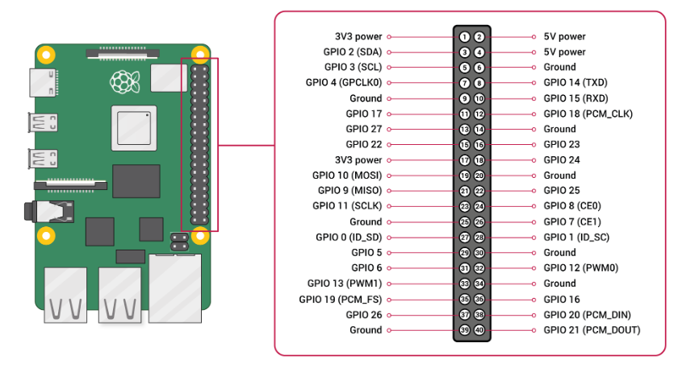

# Raspberry Pi Companion with Pixhawk

У цій темі описано, як налаштувати супутника Raspberry Pi ("RPi"), що працює з [ROS 2](../ros/ros2_comm.md) на операційній системі Linux Ubuntu, підключення до автопілота [Pixhawk](../flight_controller/autopilot_pixhawk_standard.md) за допомогою послідовного з'єднання між портом `TELEM2` Pixhawk та виводами TX/RX RPi.

Ці інструкції мають бути легко розширювані для інших конфігурацій контролерів RPi та польотів.

:::: info
Інші загальні способи підключення RaPi та Pixhawk це:

- Ethernet-з'єднання між RPi та Pixhawk. Контролери Pixhawk на основі FMUv5x, FMUv6x та пізніших можуть мати вбудований порт Ethernet. Див. [PX4 Ethernet > Підтримувані контролери](../advanced_config/ethernet_setup.md#supported-flight-controllers).
- Серійне підключення до USB-порту RPi. Це просто і надійно, але потребує додаткової плати адаптера USB-серійного інтерфейсу від FTDI Chip. Ця опція описана в [Pixhawk Companion > Налаштування послідовного порту](../companion_computer/pixhawk_companion.md#serial-port-setup).
:::

## Підключення

### Послідовне з'єднання

Спочатку підключіть послідовне з'єднання між RPi та PX4, яке буде використовуватися для управління ззовні.

Це налаштування з'єднує Pixhawk `TELEM2` , що загалом рекомендується для офлайн керування. It is initially configured in PX4 to use with MAVLink, which we will change later when setting up ROS 2. Pixhawk ports can be located anywhere on the flight controller, but are almost always well labeled, and should be obvious on your particular [flight controller](../flight_controller/index.md).

Підключіть контакти Pixhawk `TELEM2` `TX`/`RX`/`GND` до відповідних контактів `RXD`/`TXD`/`Ground` на платі GPIO RPi:

| PX4 TELEM2 Pin | RPi GPIO Pin           |
| -------------- | ---------------------- |
| UART5_TX (2)   | RXD (GPIO 15 - pin 10) |
| UART5_RX (3)   | TXD (GPIO 14 - pin 8)  |
| GND (6)        | Ground (pin 6)         |

Діаграма показує контакти порту Pixhawk `TELEM2` зліва та контакти плати GPIO RPi справа. The pins on the `TELEM2` port are normally numbered right-to-left as shown.

| `TELEM2`                                                                                                      | RPi GPIO                                                      |
| ------------------------------------------------------------------------------------------------------------- | ------------------------------------------------------------- |
|  |  |

:::info
Майже всі останні плати Pixhawk, такі як Pixhawk-6C, використовують ті ж самі роз'єми та номери контактів для відповідних портів, як визначено в Стандарті роз'ємів Pixhawk. You can check the specific board documentation to confirm the pin layout.

Стандартні призначення контактів `TELEM2` показані нижче.

| Піни      | Сигнал          | Напруга |
| --------- | --------------- | ------- |
| 1 (Red)   | VCC             | +5V     |
| 2 (Black) | UART5_TX (out)  | +3.3V   |
| 3 (Black) | UART5_RX (in)   | +3.3V   |
| 4 (Black) | UART5_CTS (in)  | +3.3V   |
| 5 (Black) | UART5_RTS (out) | +3.3V   |
| 6 (Black) | GND             | GND     |

:::

### TELEM1/Telemetry Radio

The Pixhawk `TELEM1` port is preconfigured for connecting to a GCS via MAVLink over a telemetry radio.

You can plug an [appropriate radio](../telemetry/index.md) into the Pixhawk `TELEM1` port and in most cases it should just work. Generally the other radio needs to be connected to the ground station USB port. If you have any issues, check the radio documentation.

### Power Supply

Pixhawk boards usually require a reliable 5V DC supply, which is commonly supplied from LiPO batteries via a [Power Module and/or Power Distribution board](../power_module/index.md) to a port labeled `POWER` (or similar).

The instructions for your flight controller will normally explain the recommended setup. For example:

- [Holybro Pixhawk 6C > Voltage Ratings](../flight_controller/pixhawk6c.md#voltage-ratings)
- [Holybro Pixhawk 6C Wiring Quick Start > Power](../assembly/quick_start_pixhawk6c.md#power)

Pixhawk controllers can supply power to a _small_ number of low-power peripherals, such as GPS modules and low-range telemetry radios. The RPi companion computer, servos, high power radios, and other peripherals require a separate power supply, which is usually from a battery elimination circuit (BEC) wired to the same or another battery. Some power modules have a separate BEC included.

:::warning
Overloading your Pixhawk is a good way to destroy it.
:::

::: info
During PX4 setup and configuration the USB connection with your ground station laptop is sufficient to power the Pixhawk board, and your companion computer might be powered from a desktop charger.
:::

## Налаштування PX4

These instructions work on PX4 v1.14 and later.

If you need to update the firmware then connect the Pixhawk to your laptop/desktop via the `USB` port and use QGroundControl to update the firmware as described [Firmware > Install Stable PX4](../config/firmware.md#install-stable-px4). If you want the latest developer version then update the firmware to the "main" as described in [Firmware > Installing PX4 Master, Beta or Custom Firmware](../config/firmware.md#installing-px4-main-beta-or-custom-firmware).

::: info
You can alternatively [setup a development environment](../dev_setup/dev_env.md), [build](../dev_setup/building_px4.md#building-for-nuttx) and [upload](../dev_setup/building_px4.md#uploading-firmware-flashing-the-board) the firmware manually.
:::


<!-- Keeping this line as record - this is only unexpected dependency:
```
sudo apt -y install stlink-tools
```
-->

<!-- Keeping this because we might need it for updating linux instructions
On Linux, the default name of a USB connection is `/dev/ttyACM0`:

```
sudo chmod a+rw /dev/ttyACM0
cd /PX4-Autopilot
make px4_fmu-v6c_default upload
```
-->

## Налаштування Ubuntu на RPi

The following steps show how to install and setup Ubuntu 22.04 on the RPi. Note that ROS 2 versions target particular Ubuntu versions. We're using Ubuntu 22.04 to match ROS 2 "Humble", so if you're working with ROS 2 "Foxy" you would instead install Ubuntu 20.04.

Спочатку встановіть Ubuntu на RPi:

1. Підготуйте завантажувальну карту Ubuntu 22.04 Ubuntu Desktop SD слідуючи офіційному посібнику: [Як встановити Ubuntu Desktop на Raspberry Pi 4](https://ubuntu.com/tutorials/how-to-install-ubuntu-desktop-on-raspberry-pi-4#1-overview)
1. Під'єднайте мишу, клавіатуру, монітор і підключіть RPi до джерела живлення 5 В (зовнішнє джерело/зарядний пристрій).
1. Вставте SD-карту в RPi і увімкніть RPi для завантаження з карти SD.
1. Дотримуйтесь інструкцій на екрані для встановлення Ubuntu.

Введіть наступні команди (у послідовності) у термінал для налаштування Ubuntu на RPi:

1. Встановіть `raspi-config`:

   ```sh
   sudo apt update
   sudo apt upgrade
   sudo apt-get install raspi-config
   ```

1. Відкрийте `raspi-config`:

   ```sh
   sudo raspi-config
   ```

1. Перейдіть до **Варіанти інтерфейсу**, а потім клацніть **Серійний порт**.

   - Виберіть **No**, щоб вимкнути послідовний вхід у оболонку.
   - Виберіть **Так**, щоб увімкнути послідовний інтерфейс.
   - Клацніть **Завершити** та перезапустіть RPi.

1. Відкрийте файл конфігурації завантаження прошивки в редакторі `nano` на RaPi:

   ```sh
   sudo nano /boot/firmware/config.txt
   ```

1. Додайте наступний текст в кінець файлу (після останнього рядка):

   ```sh
   enable_uart=1
   dtoverlay=disable-bt
   ```

1. Далі збережіть файл і перезапустіть RPi.

   - У `nano` ви можете зберегти файл за допомогою такої послідовності комбінацій клавіш: **ctrl+x**, **ctrl+y**, **Enter**.

1. Перевірте, чи доступний послідовний порт. В даному випадку ми використовуємо наступні команди для перегляду серійних пристроїв:

   ```sh
   cd /
   ls /dev/ttyAMA0
   ```

   Результат команди повинен містити підключення RX/TX `/dev/ttyAMA0` (зверніть увагу, що цей послідовний порт також доступний як `/dev/serial0`).

RPi наразі налаштований для роботи з RPi та зв'язку за допомогою послідовного порту `/dev/ttyAMA0`. Зверніть увагу, що ми встановимо додаткове програмне забезпечення в наступних розділах для роботи з MAVLink та ROS 2.

## Зв'язок MAVLink

[MAVLink](https://mavlink.io/en/) є стандартним і стабільним інтерфейсом зв'язку для роботи з PX4. Додатки MAVLink, які працюють на супутниковому комп'ютері, можуть підключатися до послідовного порту `/dev/ttyAMA0`, який ви щойно налаштували на RPi, і за замовчуванням повинні автоматично підключатися до `TELEM 2` на Pixhawk.

PX4 рекомендує використовувати [MAVSDK](https://mavsdk.mavlink.io/main/en/index.html) для написання додатків супутникового комп'ютера, що використовують MAVLink, оскільки він надає прості API для використання багатьох загальних сервісів MAVLink на багатьох різних мов програмування. Ви також можете писати додатки, використовуючи бібліотеки, надані [MAVLink](https://mavlink.io/en/#mavlink-project-generatorslanguages), такі як [Pymavlink](https://mavlink.io/en/mavgen_python/), але в такому випадку вам, ймовірно, доведеться надати власні реалізації деяких мікрослужб.

У цьому підручнику ми не будемо вдаватися в докладності щодо управління MAVLink (воно добре описане в відповідних SDK). Однак ми встановимо та використаємо простий розробницький GCS MAVLink, званий `mavproxy`. Це дозволить нам перевірити підключення MAVLink, а отже, правильність налаштування нашого фізичного з'єднання. Дуже схожий шаблон підключення використовуватиметься для MAVSDK та інших додатків MAVLink.

Спочатку перевірте конфігурацію Pixhawk `TELEM 2`:

1. Підключіть Pixhawk до ноутбука за допомогою USB-кабеля.
1. Відкрийте QGroundControl (повинно з'єднатися з транспортним засобом).
1. [Перевірте/змініть наступні параметри](../advanced_config/parameters.md) в QGroundControl:

   ```ini
   MAV_1_CONFIG = TELEM2
   UXRCE_DDS_CFG = 0 (Disabled)
   SER_TEL2_BAUD = 57600
   ```

   Зверніть увагу, що параметри можуть вже бути налаштовані належним чином. For information about how serial ports and MAVLink configuration work see [Serial Port Configuration](../peripherals/serial_configuration.md) and [MAVLink Peripherals](../peripherals/mavlink_peripherals.md).

Потім встановіть налаштування MAVProxy на RPi за допомогою наступних термінальних команд:

1. Встановіть MAVProxy:

   ```sh
   sudo apt install python3-pip
   sudo pip3 install mavproxy
   sudo apt remove modemmanager
   ```

1. Запустіть MAVProxy, встановивши порт для підключення до `/dev/ttyAMA0` та швидкість передачі даних, щоб відповідати PX4:

   ```sh
   sudo mavproxy.py --master=/dev/serial0 --baudrate 57600
   ```

   :::info Зверніть увагу, що вище ми використовували `/dev/serial0`, але ми могли б так само добре використовувати `/dev/ttyAMA0`. Якщо ми підключалися через USB, тоді ми замість цього встановили порт як `/dev/ttyACM0`:

   ```sh
   sudo chmod a+rw /dev/ttyACM0
   sudo mavproxy.py --master=/dev/ttyACM0 --baudrate 57600
   ```


:::

MAVProxy на RPi тепер повинен підключатися до Pixhawk через контакти RX/TX. Ви повинні бачити це в терміналі RPi.

Тепер ми підтвердили, що наше підключення пов'язано належним чином. У наступному розділі ми налаштуємо як Pixhawk, так і RPi для використання uXRCE-DDS та ROS2 замість MAVLink.

## ROS 2 та uXRCE-DDS

Сторінки [Посібника ROS 2](../ros/ros2_comm.md) та [uXRCE-DDS](../middleware/uxrce_dds.md) охоплюють варіанти налаштування uXRCE-DDS та ROS, зосереджуючись на ROS 2 "Foxy". Цей посібник використовує ROS 2 "Humble" та охоплює конкретну настройку для роботи з RPi. It is worth reading both!

### Налаштування Pixhawk/PX4

Next we set up ROS 2 instead of MAVLink on `TELEM2`. We do this by changing parameters in QGroundControl, which can be connected via USB, or using a telemetry radio connected to `TELEM1`.

The configuration steps are:

1. Connect the Pixhawk with the laptop using a USB cable and open QGroundControl (if not currently connected).
1. [Check/change the following parameters](../advanced_config/parameters.md) in QGroundControl:

   ```ini
   MAV_1_CONFIG = 0 (Disabled)
   UXRCE_DDS_CFG = 102 (TELEM2)
   SER_TEL2_BAUD = 921600
   ```

   [MAV_1_CONFIG=0](../advanced_config/parameter_reference.md#MAV_1_CONFIG) and [UXRCE_DDS_CFG=102](../advanced_config/parameter_reference.md#UXRCE_DDS_CFG) disable MAVLink on TELEM2 and enable the uXRCE-DDS client on TELEM2, respectively. The `SER_TEL2_BAUD` rate sets the comms link data rate.  
You could similarly configure a connection to `TELEM1` using either `MAV_1_CONFIG` or `MAV_0_CONFIG`.

   ::: info
You will need to reboot the flight controller to apply any changes to these parameters.
:::

1. Check that the [uxrce_dds_client](../modules/modules_system.md#uxrce-dds-client) module is now running. YOu can do this by running the following command in the QGroundControl [MAVLink Console](https://docs.qgroundcontrol.com/master/en/qgc-user-guide/analyze_view/mavlink_console.html):

   ```sh
   uxrce_dds_client status
   ```

::: info
If the client module is not running you can start it manually in the MAVLink console:

```sh
uxrce_dds_client start -t serial -d /dev/ttyS3 -b 921600
```

Note that `/dev/ttyS3` is the PX4 port for `TELEM2` on the [Holybro Pixhawk 6c](../flight_controller/pixhawk6c.md#serial-port-mapping). For other flight controllers check the serial port mapping section in their overview page.
:::

### ROS Setup on RPi

The steps to setup ROS 2 and the Micro XRCE-DDS Agent on the RPi are:

1. Install ROS 2 Humble by following the [official tutorial](https://docs.ros.org/en/humble/Installation/Ubuntu-Install-Debians.html).
2. Install the git using the RPi terminal:

   ```sh
   sudo apt install git
   ```

3. Install the uXRCE_DDS agent:

   ```sh
   git clone https://github.com/eProsima/Micro-XRCE-DDS-Agent.git
   cd Micro-XRCE-DDS-Agent
   mkdir build
   cd build
   cmake ..
   make
   sudo make install
   sudo ldconfig /usr/local/lib/
   ```

   See [uXRCE-DDS > Micro XRCE-DDS Agent Installation](../middleware/uxrce_dds.md#micro-xrce-dds-agent-installation) for alternative ways of installing the agent.

4. Start the agent in the RPi terminal:

   ```sh
   sudo MicroXRCEAgent serial --dev /dev/serial0 -b 921600
   ```

   Note how we use the serial port set up earlier and the same baud rate as for PX4.

Now that both the agent and client are running, you should see activity on both the MAVLink console and the RPi terminal. You can view the available topics using the following command on the RPi:

```sh
source /opt/ros/humble/setup.bash
ros2 topic list
```

That's it. Once you have the connection working, see the [ROS 2 Guide](../ros/ros2_comm.md) for more information about working with PX4 and ROS 2.
