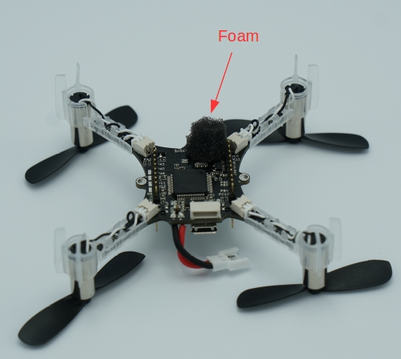

# Crazyflie 2.0 (Припинено)

<Badge type="error" text="Discontinued" />

:::warning
_Crazyflie 2.0_ було [припинено/замінено](../flight_controller/autopilot_experimental.md).
Натомість спробуйте [Bitcraze Crazyflie 2.1](../complete_vehicles_mc/crazyflie21.md)!
:::

:::warning

- PX4 не розробляє цей (або будь-який інший) автопілот.
  Зверніться до [виробника](https://www.bitcraze.io/) щодо підтримки апаратного забезпечення чи питань відповідності вимогам.
- Підтримка PX4 для цього контролера польоту є [експериментальною](../flight_controller/autopilot_experimental.md).

:::

Лінійка мікро-квадрокоптерів Crazyflie була створена компанією Bitcraze AB.
Огляд Crazyflie 2.0 можна [знайти тут](https://www.bitcraze.io/crazyflie-2/).


## Короткий опис

::: info
Основна документація з апаратного забезпечення тут: https://wiki.bitcraze.io/projects:crazyflie2:index
:::

- Основний System-on-Chip: STM32F405RG
  - CPU: 168 МГц ARM Cortex M4 з одноточним FPU
  - RAM: 192 KB SRAM
- nRF51822 радіо та керування живленням MCU
- MPU9250 Акселератор / Гіроскоп / Магнит
- Барометр LPS25H

## Де придбати

- [Crazyflie 2.0](https://store.bitcraze.io/collections/kits/products/crazyflie-2-0).
- [Crazyradio PA 2.4 GHz USB dongle](https://store.bitcraze.io/collections/kits/products/crazyradio-pa): використовується для бездротового зв'язку між _QGroundControl_ та Crazyflie 2.0.
- [Breakout deck](https://store.bitcraze.io/collections/decks/products/breakout-deck): плата розширення для підключення нових периферійних пристроїв.
- [Дека потоку](https://store.bitcraze.io/collections/decks/products/flow-deck): містить оптичний сенсор потоку для вимірювання рухів землі та датчик відстані для вимірювання відстані до землі.
  Це буде корисно для точного контролю висоти та положення.
- [Deck Z-ranger](https://store.bitcraze.io/collections/decks/products/z-ranger-deck) має той самий датчик відстані, як і Deck Flow, щоб виміряти відстань до землі.
  Це буде корисно для точного контролю висоти.
- [Набір SD-картки](https://store.bitcraze.io/collections/decks/products/sd-card-deck): використовується для швидкого внутрішнього журналювання на карту micro SD.
- [Джойстик Logitech](https://support.logi.com/hc/en-us/articles/360024326793--Getting-Started-Gamepad-F310).

## Прошивка PX4

Після налаштування середовища розробки PX4 слідкуйте цим крокам, щоб встановити автопілот PX4 на Crazyflie 2.0:

1. Завантажте вихідний код завантажувача PX4:

   ```sh
   git clone https://github.com/PX4/Bootloader.git
   ```

2. Перейдіть до верхньої директорії вихідного коду та скомпілюйте його за допомогою:

   ```sh
   make crazyflie_bl
   ```

3. Поставте Crazyflie 2.0 у режим DFU, виконавши ці кроки:
   - Спочатку переконайтеся, що він знеструмлений.
   - Утримуйте кнопку скидання (див. малюнок нижче...).
     
   - Підключіть до USB-порту комп'ютера.
   - Через секунду синій світлодіод повинен почати блимати, а через 5 секунд повинен почати блимати швидше.
   - Відпустіть кнопку.

4. Встановіть _dfu-util_:

   ```sh
   sudo apt-get update
   sudo apt-get install dfu-util
   ```

5. Виконайте прошивку завантажувальника за допомогою _dfu-util_ та від'єднайте Crazyflie 2.0, коли це зроблено:

   ```sh
   sudo dfu-util -d 0483:df11 -a 0 -s 0x08000000 -D ./build/crazyflie_bl/crazyflie_bl.bin
   ```

   Коли увімкнено Crazyflie 2.0, жовтий світлодіод повинен мигати.

6. Завантажте вихідний код завантажувача автопілоту PX4:

   ```sh
   git clone https://github.com/PX4/PX4-Autopilot.git
   ```

7. Перейдіть до верхньої директорії вихідного коду та скомпілюйте його за допомогою:

   ```sh
   make bitcraze_crazyflie_default upload
   ```

8. Коли вас попросять підключити пристрій, підключіть Crazyflie 2.0.
   Жовтий світлодіод повинен почати блимати, що вказує на режим завантажувача.
   Потім червоний світлодіод повинен увімкнутися, що вказує на те, що процес мигання розпочався.

9. Очікування завершення.

10. Готово! Калібруйте сенсори за допомогою [QGroundControl](https://docs.qgroundcontrol.com/master/en/qgc-user-guide/setup_view/sensors.html).

::: info
If QGroundControl does not connect with the vehicle, ensure that in [nuttx-config](https://github.com/PX4/PX4-Autopilot/blob/main/boards/bitcraze/crazyflie/nuttx-config/nsh/defconfig) for crazyflie `# CONFIG_DEV_LOWCONSOLE is not set` is replaced by `CONFIG_DEV_LOWCONSOLE=y`.
This should be done using _menuconfig_:

```sh
make bitcraze_crazyflie_default menuconfig
```

або _qconfig_ (Перевірте _Low-level console support_ в розділі _Serial Driver Support_ у GUI):

```sh
make bitcraze_crazyflie_default qconfig
```

:::

## Інструкції з налаштування бездротового з'єднання

Модуль nRF на борту дозволяє підключатися до плати через Bluetooth або через пропрієтарний протокол Nordic ESB на частоті 2,4 ГГц.

- Рекомендується [Crazyradio PA](https://www.bitcraze.io/crazyradio-pa/).
- Щоб одразу летіти на Crazyflie 2.0, додаток для смартфона Crazyflie підтримується через Bluetooth.

Використання офіційного додатка **Crazyflie для телефону**:

- Підключіться через Bluetooth.
- Змініть режим у налаштуваннях на 1 або 2.
- Відкалібруйте через QGroundControl.

Підключення через **MAVLink**:

- Використовуйте Crazyradio PA разом із сумісним GCS.
- Завантажте вихідний код _crazyflie-lib-python_:

  ```sh
  git clone https://github.com/bitcraze/crazyflie-lib-python.git
  ```

:::info
Ми будемо використовувати [cfbridge.py](https://github.com/bitcraze/crazyflie-lib-python/blob/master/examples/cfbridge.py) для налаштування бездротового зв'язку MAVlink між Crazyflie 2.0 (прошитий PX4) та QGroundControl. _Cfbridge_ дозволяє QGroundControl комунікувати з crazyradio PA.
Цей [базований на C cfbridge](https://github.com/dennisss/cfbridge) наразі має проблеми з втратою даних, тому ми вирішили використовувати **cfbridge.py**.
:::

- Переконайтеся, що ви налаштували дозволи udev для використання USB радіо. Для цього виконайте наступні кроки [тут](https://www.bitcraze.io/documentation/repository/crazyflie-lib-python/master/installation/usb_permissions/) та **перезапустіть** ваш комп'ютер.

- Підключіть Crazyradio PA через USB.

- Побудуйте [віртуальне середовище (локальне середовище Python)](https://virtualenv.pypa.io/en/latest/) залежностей в пакеті, використовуючи наступний метод:

  ```sh
  pip install tox --user
  ```

- Перейдіть до папки crazyflie-lib-python та введіть:

  ```sh
  make venv
  ```

- Активуйте віртуальне середовище:

  ```sh
  source venv-cflib/bin/activate
  ```

- Встановіть необхідні залежності:

  ```sh
  pip install -r requirements.txt --user
  ```

Щоб підключити Crazyflie 2.0 з crazyradio, **запустіть cfbridge** за допомогою цих кроків:

- Вимкніть та увімкніть Crazyflie 2.0 та зачекайте, поки він завантажиться.

- Підключіть радіопристрій Crazyflie через USB.

- Перейдіть до папки crazyflie-lib-python.

- Активуйте середовище:

  ```sh
  source venv-cflib/bin/activate
  ```

- Перейдіть до папки прикладів:

  ```sh
  cd examples
  ```

- Запустіть cfbridge:

```sh
python cfbridge.py
```

:::info
_Cfbridge_ за замовчуванням намагається ініціювати комунікацію радіоканалу на каналі 80 та з адресою crazyflie 0xE7E7E7E7E7.
Якщо ви використовуєте [кілька crazyflies та/або crazyradios](https://github.com/dennisss/cfbridge/blob/master/index.md#advanced-swarming) в одній кімнаті і хочете використовувати різні канали та/або адреси для кожного, спочатку підключіть crazyflie до QGroundControl через USB-кабель і змініть параметри syslink (канал, адреса) в QGroundControl.
Після цього запустіть cfbridge, надаючи той самий канал та адресу як перший та другий аргументи відповідно, наприклад: `python cfbridge.py 90 0x0202020202`
:::

- Відкрийте QGroundControl.
- Після використання _cfbridge_ ви можете вимкнути віртуальне середовище, якщо ви його активували, натиснувши `CTRL+z`.
  Більшість часу, запуск _cfbridge_ знову з того ж терміналу не підключається до crazyflie, це можна вирішити, закривши термінал і знову запустивши _cfbridge_ в новому терміналі.

:::tip
If you change any driver in [crazyflie-lib-python](https://github.com/bitcraze/crazyflie-lib-python) or if launching _cfbridge_ in a new terminal does not find crazyflie, you can try navigating to the crazyflie-lib-python folder and run the script below to rebuild cflib.

```sh
make venv
```

:::

:::info
Для використання джойстика встановіть `COM_RC_IN_MODE` в QGroundControl на "Joystick/No RC Checks".
Калібруйте джойстик та встановіть частоту повідомлень джойстика в QGroundControl на будь-яке значення від 5 до 14 Гц (рекомендовано 10 Гц).
Щоб мати можливість встановити частоту, потрібно ввімкнути розширену опцію.
Це швидкість, з якою команди джойстика відправляються з QGroundControl до Crazyflie 2.0 (для цього вам потрібно слідувати інструкціям [тут](https://github.com/mavlink/qgroundcontrol), щоб отримати останній вихідний код QGroundControl (master) і скомпілювати його).
:::


## Налаштування програмного забезпечення

Crazyflie 2.0 може літати з точним керуванням у режимі [Стабілізований режим](../flight_modes_mc/manual_stabilized.md), режимі [Висотний режим](../flight_modes_mc/altitude.md) та режимі [Позиційний режим](../flight_modes_mc/position.md).

- Для польоту в режимі _Altitude_ вам знадобиться [Z-ranger deck](https://store.bitcraze.io/collections/decks/products/z-ranger-deck).
  Якщо ви також хочете літати в режимі _Position_, рекомендується придбати [Flow deck](https://store.bitcraze.io/collections/decks/products/flow-deck), який також має вбудований сенсор Z-ranger.
- Покладений барометр дуже чутливий до будь-яких зовнішніх вітрових порушень, включаючи ті, які створюються Crazyflie власними гвинтами. Hence, we isolated the barometer with a piece of foam, and then mounted the distance sensor on top of it as shown below:





In order to log flight details, you can mount SD card deck on top of crazyflie as shown below:


Then, you need to stick the battery on top of the SD card deck using a double sided tape:


## Altitude Control

Crazyflie is able to fly in _Altitude_ mode if you use a [Z-ranger deck](https://store.bitcraze.io/collections/decks/products/z-ranger-deck).
According to the datasheet, the maximum height (above ground) the range finder can sense is 2 m. However, when tested on dark surfaces this value decreases to 0.5 m. On a light floor, it goes up to max 1.3 m. This means you cannot hold altitudes above this value in _Altitude_ or _Position_ flight modes.

:::tip
If the Crazyflie 2.0 height drifts at mid-throttle command in _Altitude mode_ or _Position mode_, first try rebooting the vehicle. If this does not fix the problem, recalibrate the accel and mag (compass).\
:::

:::info
Since the onboard barometer is highly susceptible to wind disturbances created by the Crazyflie's own propellers, you cannot rely on it to hold altitude.
:::

## Position Control

With [Flow deck](https://store.bitcraze.io/collections/decks/products/flow-deck), you can fly Crazyflie 2.0 in _Position mode_.
Unlike [PX4FLOW](../sensor/px4flow.md), the flow deck does not house a gyro, hence the onboard gyro is used for flow fusion to find the local position estimates.
Moreover, the flow deck shares the same SPI bus as the SD card deck, therefore logging at high rate on SD card is not recommended when flying in _Position mode_.

## Using FrSky Taranis RC Transmitter as Joystick

If you already own a Taranis RC transmitter and want to use it as a controller, it can be configured as a USB Joystick:

- Create a new model in Taranis.

  

- In _MODEL SETUP_ menu page, turn off both internal and external TX modules.

  

- In _OUTPUTS_ menu page (also called “SERVOS” page in some Taranis transmitters), invert Throttle (CH1) and Aileron (CH3).

  

To use Taranis switches to arm/disarm and switch to different flight modes:

- In Taranis UI _MIXER_ menu page, you can assign the switches to any channel in the range channel 9-16 which map to the buttons 0-7 in the QGroundControl Joystick setup. For example, Taranis “SD” switch can be set to channel 9 in Taranis UI:

  

- Connect Taranis to PC with a USB cable and Open QGroundControl.

- In QGroundControl Joystick Setup, you can see the buttons turning yellow when you switch them on. For example, channel 9 in Taranis maps to button 0 in QGroundControl Joystick setup. You can assign any mode to this button e.g. _Altitude_ mode. Now when you lower the switch "SD", flight mode will change to _Altitude_.

  

### ROS

To connect to Crazyflie 2.0 via MAVROS:

- Start up _cfbridge_ using the above instructions.

- Change the UDP port QGroundControl listens to:
  - In QGroundControl, navigate to **Application Settings > General** and uncheck all the boxes under _Autoconnect to the following devices_.
  - Add in **Comm Links** a link of type _UDP_, check the _Automatically Connect on Start_ option, change the _Listening Port_ to 14557, add Target Hosts: 127.0.0.1 and then press **OK**.

- Make sure you have [MAVROS](https://github.com/mavlink/mavros/tree/master/mavros#installation) installed.

- Start MAVROS with command:

  ```sh
  roslaunch mavros px4.launch fcu_url:="udp://:14550@127.0.0.1:14551" gcs_url:="udp://@127.0.0.1:14557"
  ```

- Restart QGroundControl if it doesn't connect.

## Політ

@[youtube](https://youtu.be/2Bcy3k1h5uc)
