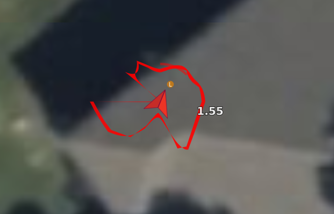
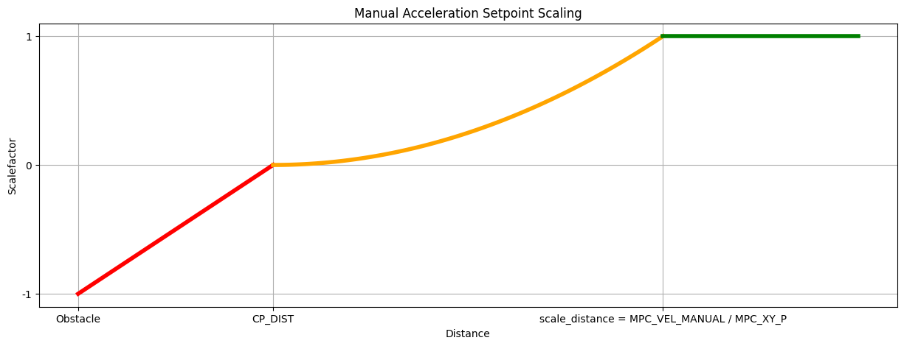
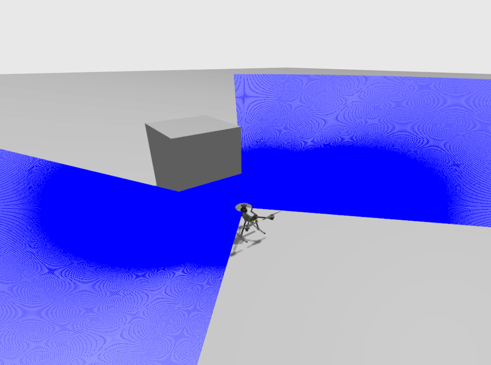
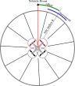

# Запобігання зіткненням

_Collision Prevention_ may be used to automatically slow and stop a vehicle before it can crash into an obstacle.
It can be enabled for multicopter vehicles when using acceleration-based [Position mode](../flight_modes_mc/position.md) (or VTOL vehicles in MC mode).

## Загальний огляд

The vehicle restricts the current velocity in order to slow down as it gets closer to obstacles and adapts the acceleration setpoint in order to disallow collision trajectories.
Для того, щоб відійти від перешкоди (або паралельно їй), користувач повинен наказати транспортному засобу рухатися до заданої точки, яка не наближає транспортний засіб до перешкоди.
Алгоритм внесе незначні корективи в напрямок заданого значення, якщо буде визначено, що "краще" значення існує в межах фіксованого запасу по обидва боки від запитуваного заданого значення.

Collision prevention prevents motion in directions where no sensor data is available (i.e. if you have no rear-sensor data, you will not be able to fly backwards).
It may also restrict vehicle maximum speed if the sensor range isn't large enough!

Multiple sensors can be used to get information about, and prevent collisions with, objects _around_ the vehicle.
If multiple sources supply data for the _same_ orientation, the system uses the data that reports the smallest distance to an object.

The feature requires obstacle information from a [distance sensor](../sensor/rangefinders.md).
The sensor may be connected to the flight controller (recommended).
It can also be used with distance information provided by an external system via MAVLink, but this is currently untested (see [companion setup](#companion) below).

The [rangefinders](#rangefinder) that have been tested when directly connected to PX4 are listed below, along with setup instructions.
The [PX4 Configuration](#px4-configuration) specific to collision-prevention is the same for all sensors and independent of whether data is provided by a connected sensor or MAVLink.

:::tip

- If high flight speeds are critical, consider disabling collision prevention when not needed.
- Ensure that you have sensors/sensor data in all directions that you want to fly, including backwards (when collision prevention is enabled).

:::

## Supported Rangefinders {#rangefinder}

Collision Prevention has been tested with the following rangefinders attached to PX4 (not for providing data [supplied over MAVLink](#companion)).

### Lanbao PSK-CM8JL65-CC5

At time of writing PX4 allows you to use the [Lanbao PSK-CM8JL65-CC5](../sensor/cm8jl65_ir_distance_sensor.md) IR distance sensor for collision prevention "out of the box", with minimal additional configuration:

1. [Attach and configure the sensor](../sensor/cm8jl65_ir_distance_sensor.md).
2. Set the sensor orientation using [SENS_CM8JL65_R_0](../advanced_config/parameter_reference.md#SENS_CM8JL65_R_0).
3. [Configure and enable collision prevention](#px4-configuration)

### LightWare LiDAR SF45 Поворотний лідар

PX4 v1.14 (and later) supports the [LightWare LiDAR SF45](https://www.lightwarelidar.com/shop/sf45-b-50-m/) rotating lidar which provides 320 degree sensing.

The SF45 must be connected via a UART/serial port and configured as described below:

1. [LightWare Studio](https://www.lightwarelidar.com/resources-software) configuration:

   - In the LightWare Studio app enable scanning, set the scan angle, and change the baud rate to `921600`.

2. Add [lightware_sf45_serial](../modules/modules_driver_distance_sensor.md#lightware-sf45-serial) driver to PX4 firmware:

   1. Open [menuconfig](../hardware/porting_guide_config.md#px4-menuconfig-setup)
   2. Under **drivers > Distance sensors** select `lightware_sf45_serial`.
   3. Перекомпілюйте та завантажте на контролер польоту.

3. [Set the following parameters](../advanced_config/parameters.md) via QGC to configure the driver:

   - [SENS_EN_SF45_CFG](../advanced_config/parameter_reference.md#SENS_EN_SF45_CFG): Set to the serial port you have the sensor connected to.
     Переконайтеся, що GPS або телеметрія не активовані на цьому порті.
   - [SF45_ORIENT_CFG](../advanced_config/parameter_reference.md#SF45_ORIENT_CFG): Set the orientation of the sensor (facing up or down)
   - [SF45_UPDATE_CFG](../advanced_config/parameter_reference.md#SF45_UPDATE_CFG): Set the update rate
   - [SF45_YAW_CFG](../advanced_config/parameter_reference.md#SF45_YAW_CFG): Set the yaw orientation

4. [Configure and enable collision prevention](#px4-configuration)

PX4 will emit the [OBSTACLE_DISTANCE](https://mavlink.io/en/messages/common.html#OBSTACLE_DISTANCE) message when collision prevention is enabled.
In QGroundControl you should this in the [MAVLink console](../debug/mavlink_shell.md#qgroundcontrol-mavlink-console) if collision prevention is configured correctly and active.

Налаштування перешкод в QGC буде виглядати так:



### Other Rangefinders

Інші датчики можуть бути активовані, але це вимагає модифікації коду драйвера для встановлення орієнтації датчика та поля зору.

- Attach and configure the distance sensor on a particular port (see [sensor-specific docs](../sensor/rangefinders.md)) and enable collision prevention using [CP_DIST](#CP_DIST).
- Модифікуйте драйвер для встановлення орієнтації.
  This should be done by mimicking the `SENS_CM8JL65_R_0` parameter (though you might also hard-code the orientation in the sensor _module.yaml_ file to something like `sf0x start -d ${SERIAL_DEV} -R 25` - where 25 is equivalent to `ROTATION_DOWNWARD_FACING`).
- Modify the driver to set the _field of view_ in the distance sensor UORB topic (`distance_sensor_s.h_fov`).

:::tip
You can see the required modifications from the [feature PR](https://github.com/PX4/PX4-Autopilot/pull/12179).
Будь ласка, внесіть свої зміни!
:::

## Конфігурація PX4

_Collision Prevention_ is enabled on PX4 by [setting the parameter](../advanced_config/parameters.md) for minimum allowed approach distance in QGroundControl to a positive value ([CP_DIST](#CP_DIST)).
Note that this value is the distance to the sensors, not the outside of your vehicle or propellers (set a safe margin!).

In addition you will need to tune the [sendor delay](#delay_tuning) and [angle change tuning](#angle_change_tuning).
You may choose to enable [CP_GO_NO_DATA](#CP_GO_NO_DATA) in order to allow unprotected movement in directions where there is no rangefinder data/sensor.

### CP_DELAY Delay Tuning {#delay_tuning}

There are two main sources of delay which should be accounted for: _sensor delay_, and vehicle _velocity setpoint tracking delay_.
Both sources of delay are tuned using the [CP_DELAY](#CP_DELAY) parameter.

The _sensor delay_ for distance sensors connected directly to the flight controller can be assumed to be 0.
Для зовнішніх систем на основі зору затримка датчика може досягати 0,2 с.

Vehicle _velocity setpoint tracking delay_ can be measured by flying at full speed in [Position mode](../flight_modes_mc/position.md), then commanding a stop.
Затримка між фактичною швидкістю та заданою швидкістю може бути виміряна з лог-файлів.
Зазвичай затримка відстеження становить від 0,1 до 0,5 секунди, в залежності від розміру транспортного засобу та налаштувань.

:::tip
If vehicle speed oscillates as it approaches the obstacle (i.e. it slows down, speeds up, slows down) the delay is set too high.
:::

### CP_GUIDE_ANG Guidance Tuning {#angle_change_tuning}

Залежно від транспортного засобу, типу середовища та навичок пілота можуть бути вимоги щодо різних рівнів керування.
Setting the [CP_GUIDE_ANG](#CP_GUIDE_ANG) parameter to 0 will disable the guidance, resulting in the vehicle only moving exactly in the directions commanded.
Збільшення цього параметра дозволить транспортному засобу вибирати оптимальні напрямки для уникнення перешкод, що полегшує прохід через вузькі проміжки і точне збереження мінімальної відстані при об'єзді об'єктів.

Якщо цей параметр занадто малий, транспортний засіб може відчуватися "застряглим" біля перешкод, оскільки дозволено тільки рух від перешкод на мінімальній відстані.
Якщо параметр занадто великий, транспортний засіб може відчуватися, як "слайд", віддаляючись від перешкод в напрямках, які не задані оператором.
Згідно з тестуванням, 30 градусів - це хороший баланс, хоча різні транспортні засоби можуть мати різні вимоги.

:::info
The guidance feature will never direct the vehicle in a direction without sensor data.
Якщо транспортний засіб відчуває "застряглим" з одним лише датчиком відстані, що спрямованим вперед, це, ймовірно, через те, що керування не може безпечно адаптувати напрямок через відсутність інформації.
:::

### Параметри

All relevant parameters are listed below:

| Параметр                                                                                                                                                          | Опис                                                                                                                                                                                                                                       |
| ----------------------------------------------------------------------------------------------------------------------------------------------------------------- | ------------------------------------------------------------------------------------------------------------------------------------------------------------------------------------------------------------------------------------------ |
| <a id="CP_DIST"></a>[CP_DIST](../advanced_config/parameter_reference.md#CP_DIST)                                                             | Minimum allowed distance from the sensor (the closest distance that the vehicle can approach the obstacle). Set negative to _disable_ collision prevention.                             |
| <a id="CP_DELAY"></a>[CP_DELAY](../advanced_config/parameter_reference.md#CP_DELAY)                                                          | Sensor and velocity setpoint tracking delay. See [Delay Tuning](#delay_tuning) below.                                                                                                                      |
| <a id="CP_GUIDE_ANG"></a>[CP_GUIDE_ANG](../advanced_config/parameter_reference.md#CP_GUIDE_ANG)                         | Angle (to both sides of the commanded direction) within which the vehicle may deviate if it finds fewer obstacles in that direction. See [Guidance Tuning](#angle_change_tuning) below. |
| <a id="CP_GO_NO_DATA"></a>[CP_GO_NO_DATA](../advanced_config/parameter_reference.md#CP_GO_NO_DATA) | Set to `1` to allow the vehicle to move in directions where there is no sensor coverage (default is 0/`False`).                                                                                         |
| <a id="MPC_POS_MODE"></a>[MPC_POS_MODE](../advanced_config/parameter_reference.md#MPC_POS_MODE)                         | Set to `Acceleration based` (default). Collision prevention is disabled for `Direct velocity` and `Smoothed velocity`.                                                                  |

## Опис алгоритму

The data from all sensors are fused into an internal representation of 72 sectors around the vehicle, each containing either the sensor data and information about when it was last observed, or an indication that no data for the sector was available.
When the vehicle is commanded to move in a particular direction, all sectors in the hemisphere of that direction are checked to see if the movement will bring the vehicle closer than allowed to any obstacles. Якщо так, то швидкість транспортного засобу буде обмежена.

The Algorithm then can be split intwo two parts, the constraining of the acceleration setpoint coming from the operator, and the compensation of the current velocity of the vehicle.

:::info
If there is no sensor data in a particular direction, movement in that direction is restricted to 0 (preventing the vehicle from crashing into unseen objects).
If you wish to move freely into directions without sensor coverage, this can be enabled by setting [CP_GO_NO_DATA](#CP_GO_NO_DATA) to 1.
:::

### Acceleration Constraining

For this we split out Acceleration Setpoint into two components, one parallel to the closest distance to the obstacle and one normal to it. Then we scale each of these components according the the figure below.


 <!-- the code for this figure is at the end of this file -->

### Velocity compensation

This velocity restriction takes into account the [jerk-optimal velocity controller](../config_mc/mc_jerk_limited_type_trajectory.md) via [MPC_JERK_MAX](../advanced_config/parameter_reference.md#MPC_JERK_MAX) and [MPC_ACC_HOR](../advanced_config/parameter_reference.md#MPC_ACC_HOR). Whereby <!--this is only partially valid anymore... check -->
The current velocity is compared with the maximum allowed velocity so that we are still able to break based on the maximal allowed jerk, acceleration and delay. from this we are able to use the proportional gain of the acceleration controller([MPC_XY_VEL_P_ACC](../advanced_config/parameter_reference.md#MPC_XY_VEL_P_ACC)) to transform it into an acceleration.

### Delay

The delay associated with collision prevention, both in the vehicle tracking velocity setpoints and in receiving sensor data from external sources, is conservatively estimated via the [CP_DELAY](#CP_DELAY) parameter.
This should be [tuned](#delay_tuning) to the specific vehicle.

If the sectors adjacent to the commanded sectors are 'better' by a significant margin, the direction of the requested input can be modified by up to the angle specified in [CP_GUIDE_ANG](#CP_GUIDE_ANG).
Це допомагає точно налаштувати вхідні дані користувача, щоб "вести" транспортний засіб навколо перешкод, а не застрявати на них.

### Втрата даних про дальність

If the autopilot does not receive range data from any sensor for longer than 0.5s, it will output a warning _No range data received, no movement allowed_.
Це змусить встановити швидкість у ху до нуля.
After 5 seconds of not receiving any data, the vehicle will switch into [HOLD mode](../flight_modes_mc/hold.md).
If you want the vehicle to be able to move again, you will need to disable Collision Prevention by either setting the parameter [CP_DIST](#CP_DIST) to a negative value, or switching to a mode other than [Position mode](../flight_modes_mc/position.md) (e.g. to _Altitude mode_ or _Stabilized mode_).

Якщо у вас підключено кілька датчиків і ви втратили зв'язок з одним з них, ви все одно зможете літати в полі зору (FOV) датчиків, що звітують.
Дані несправного датчика втратять чинність, а область, що покривається цим датчиком, буде вважатися непокритою, тобто ви не зможете там пересуватися.

:::warning
Be careful when enabling [CP_GO_NO_DATA=1](#CP_GO_NO_DATA), which allows the vehicle to fly outside the area with sensor coverage.
Якщо ви втратите зв'язок з одним з декількох датчиків, зона, яку охоплює несправний датчик, також буде вважатися відкритою, і ви зможете пересуватися там без обмежень.
:::

## Companion Setup {#companion}

:::warning
The companion implementation/setup is currently untested (the original companion project was unmaintained and has been archived).
:::

If using a companion computer or external sensor, it needs to supply a stream of [OBSTACLE_DISTANCE](https://mavlink.io/en/messages/common.html#OBSTACLE_DISTANCE) messages, which should reflect when and where obstacle were detected.

The minimum rate at which messages _must_ be sent depends on vehicle speed - at higher rates the vehicle will have a longer time to respond to detected obstacles.
Initial testing of the system used a vehicle moving at 4 m/s with `OBSTACLE_DISTANCE` messages being emitted at 10Hz (the maximum rate supported by the vision system).
Система може добре працювати при значно вищих швидкостях і менших частотах оновлення відстані.

## Симуляція Gazebo

_Collision Prevention_ can be tested using [Gazebo](../sim_gazebo_gz/index.md) with the [x500_lidar_2d](../sim_gazebo_gz/vehicles.md#x500-quadrotor-with-2d-lidar) model.
To do this, start a simulation with the x500 lidar model by running the following command:

```sh
make px4_sitl gz_x500_lidar_2d
```

Next, adjust the relevant parameters to the appropriate values and add arbitrary obstacles to your simulation world to test the collision prevention functionality.

The diagram below shows a simulation of collision prevention as viewed in Gazebo.



## Sensor Data Overview (Implementation Details)

Collision Prevention has an internal obstacle distance map that divides the plane around the drone into 72 Sectors.
Internally this information is stored in the [`obstacle_distance`](../msg_docs/ObstacleDistance.md) UORB topic.
New sensor data is compared to the existing map, and used to update any sections that has changed.

The angles in the `obstacle_distance` topic are defined as follows:



The data from rangefinders, rotary lidars, or companion computers, is processed differently, as described below.

### Rotary Lidars

Rotary Lidars add their data directly to the [`obstacle_distance`](../msg_docs/ObstacleDistance.md) uORB topic.

### Rangefinders

Rangefinders publish their data to the [`distance_sensor`](../msg_docs/DistanceSensor.md) uORB topic.

This data is then mapped onto the `obstacle_distance` topic.
All sectors which have any overlap with the orientation (`orientation` and `q`) of the rangefinder, and the horizontal field of view (`h_fov`) are assigned that measurement value.
For example, a distance sensor measuring from 9.99° to 10.01° the measurements will get added to the bin's corresponding to 5° and 10° covering the arc from 2.5° and 12.5°

:::info
the quaternion `q` is only used if the `orientation` is set to `ROTATION_CUSTOM`.
:::

### Супутні комп'ютери

Companion computers update the `obstacle_distance` topic using ROS2 or the [OBSTACLE_DISTANCE](https://mavlink.io/en/messages/common.html#OBSTACLE_DISTANCE) MAVLink message.

<!-- to edit the image, open it in inkscape -->

<!-- Code to generate the scalefactor plot
import numpy as np
import matplotlib.pyplot as plt
obstacle_dist = -5
cp_dist = 0
scale_dist = 10
x_values_1 = np.linspace(obstacle_dist, cp_dist, 100)  # Segment 1: obstacle to cp_dist
x_values_2 = np.linspace(cp_dist, scale_dist, 100)  # Segment 2: cp_dist to scale_dist
x_values_3 = np.linspace(scale_dist, 15, 100)  # Segment 3: scale_dist onwards
def acceleration_setpoint_1(x):
  return -1 + (x - obstacle_dist) / (cp_dist - obstacle_dist)
def acceleration_setpoint_2(x):
  return ((x - cp_dist) / (scale_dist - cp_dist))**2
def acceleration_setpoint_3(x):
  return 1
y_values_1 = [acceleration_setpoint_1(x) for x in x_values_1]
y_values_2 = [acceleration_setpoint_2(x) for x in x_values_2]
y_values_3 = [acceleration_setpoint_3(x) for x in x_values_3]
plt.figure(figsize=(15, 5))
plt.plot(x_values_1, y_values_1, color='red', label="Below Zero", linewidth=4)
plt.plot(x_values_2, y_values_2, color='orange', label="Above Zero", linewidth=4)
plt.plot(x_values_3, y_values_3, color='green', label="Above Scale Distance", linewidth=4)
plt.xlabel("Distance")
plt.yticks([-1, 0, 1], ['-1', '0', '1'])  # Set ticks at -1, 0, and 1
plt.ylabel("Scalefactor")  # Change y-axis label to "Scale"
plt.title("Manual Acceleration Setpoint Scaling")
plt.xticks([obstacle_dist, cp_dist, scale_dist], ['Obstacle', 'CP_DIST', 'scale_distance = MPC_VEL_MANUAL / MPC_XY_P'])
plt.grid(True)
plt.show() -->
