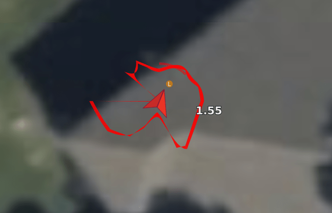

# Запобігання зіткненням (Collision Prevention)

_Collision Prevention_ може бути використано для автоматичного сповільнення і зупинки транспортного засобу, перш ніж він потрапить в перешкоду.

Він може бути увімкнений для мультикоптерів у режимі [Position mode](../flight_modes_mc/position.md) і може використовувати дані датчиків з бортового комп'ютера-компаньйона, бортових далекомірів через MAVLink, далекоміра, приєднаного до польотного контролера, або будь-якої комбінації вищезазначених пристроїв.

Запобігання зіткненням може обмежити максимальну швидкість автомобіля, якщо радіус дії датчика недостатньо великий! Він також запобігає руху в тих напрямках, де немає даних з датчиків (тобто, якщо у вас немає даних з заднього датчика, ви не зможете летіти назад).

:::tip
Якщо висока швидкість польоту є критично важливою, вимкніть функцію запобігання зіткненням, коли вона не потрібна.
:::

:::tip
Переконайтеся, що у вас є датчики/дані датчиків у всіх напрямках, в яких ви хочете летіти (коли увімкнено запобігання зіткненням).
:::

## Загальний огляд

_Collision Prevention_ увімкнено на PX4 шляхом встановлення параметра мінімально допустимої відстані зближення ([CP_DIST](#CP_DIST)).

Ця функція вимагає інформації про перешкоди від зовнішньої системи (надсилається за допомогою повідомлення MAVLink [OBSTACLE_DISTANCE](https://mavlink.io/en/messages/common.html#OBSTACLE_DISTANCE)) та/або [датчика відстані](../sensor/rangefinders.md), підключеного до польотного контролера.

:::note
Для отримання інформації про об'єкти _навколо_ транспортного засобу та запобігання зіткненням з ними можна використовувати декілька датчиків. Якщо кілька джерел надають дані для _однакової_ орієнтації, система використовує дані, які повідомляють про найменшу відстань до об'єкта.
:::

Транспортний засіб обмежує максимальну швидкість, щоб сповільнитися, коли він наближається до перешкод, і припиняє рух, коли досягає мінімально допустимої дистанції. Для того, щоб відійти від перешкоди (або паралельно їй), користувач повинен наказати транспортному засобу рухатися до заданої точки, яка не наближає транспортний засіб до перешкоди. Алгоритм внесе незначні корективи в напрямок заданого значення, якщо буде визначено, що "краще" значення існує в межах фіксованого запасу по обидва боки від запитуваного заданого значення.

Користувачі отримують сповіщення через _QGroundControl_, а _Collision Prevention_ активно контролює задані значення швидкості.

Налаштування програмного забезпечення PX4 оглянуто в наступному розділі. Якщо ви використовуєте датчик відстані, підключений до вашого польотного контролера для запобігання зіткненням, його потрібно підключити та налаштувати, як описано в розділі [Датчик відстані PX4](#rangefinder). Якщо ви використовуєте комп'ютер-компаньйон для надання інформації про перешкоди, див. [Налаштування компаньйона](#companion).

## PX4 Налаштування (програмного забезпечення)

Налаштуйте запобігання зіткненням, встановивши [такі параметри](../advanced_config/parameters.md) у _QGroundControl_:

| Parameter                                                                                           | Опис                                                                                                                                                                                                                                                                                                                                                               |
| --------------------------------------------------------------------------------------------------- | ------------------------------------------------------------------------------------------------------------------------------------------------------------------------------------------------------------------------------------------------------------------------------------------------------------------------------------------------------------------ |
| [CP_DIST](../advanced_config/parameter_reference.md#CP_DIST)               | Встановіть мінімально допустиму відстань (найближчу відстань, на яку транспортний засіб може наблизитися до перешкоди). Встановіть від'ємний значення, щоб вимкнути _collision prevention_.  > **Warning** Це значення є відстанню до датчиків, а не до зовнішньої сторони вашого транспортного засобу або гвинтів. Не забудьте залишити безпечний запас! |
| [CP_DELAY](../advanced_config/parameter_reference.md#CP_DELAY)             | Встановіть затримку датчика та відстеження швидкості. Дивіться [Налаштування затримки](#delay_tuning) нижче.                                                                                                                                                                                                                                                       |
| [CP_GUIDE_ANG](../advanced_config/parameter_reference.md#CP_GUIDE_ANG)   | Встановіть кут (в обидві сторони від заданого напрямку), в межах якого транспортний засіб може відхилитися, якщо знайде менше перешкод у цьому напрямку. Дивіться [Налаштування навігації](#angle_change_tuning) нижче.                                                                                                                                            |
| [CP_GO_NO_DATA](../advanced_config/parameter_reference.md#CP_GO_NO_DATA) | Встановіть значення 1, щоб дозволити транспортному засобу рухатися в напрямках, де немає покриття датчика (за замовчуванням 0/`False`).                                                                                                                                                                                                                            |
| [MPC_POS_MODE](../advanced_config/parameter_reference.md#MPC_POS_MODE)   | Встановіть значення 0 або 3, щоб увімкнути запобігання зіткненням у режимі позиціонування (за замовчуванням - 4).                                                                                                                                                                                                                                                  |

## Опис алгоритму

Дані з усіх датчиків об'єднуються у внутрішнє представлення 36 секторів навколо транспортного засобу, кожен з яких містить або дані датчика та інформацію про час останнього спостереження, або вказівку на те, що дані для сектора відсутні. Коли транспортний засіб отримує команду рухатися в певному напрямку, перевіряються всі сектори в півкулі цього напрямку, щоб побачити, чи не наблизить цей рух транспортний засіб до будь-яких перешкод. Якщо так, то швидкість транспортного засобу буде обмежена.

Це обмеження швидкості враховує як внутрішній контур швидкості, налаштований за допомогою [MPC_XY_P](../advanced_config/parameter_reference.md#MPC_XY_P), так і [контролер оптимальної швидкості ривка](../config_mc/mc_jerk_limited_type_trajectory.md) за допомогою [MPC_JERK_MAX](../advanced_config/parameter_reference.md#MPC_JERK_MAX) та [MPC_ACC_HOR](../advanced_config/parameter_reference.md#MPC_ACC_HOR). Швидкість обмежується таким чином, щоб транспортний засіб зупинився вчасно, щоб зберегти відстань, вказану в [CP_DIST](#CP_DIST). Також враховується дальність дії датчиків для кожного сектора, що обмежує швидкість за тим же механізмом.

:::note
Якщо в певному напрямку немає даних від датчика, швидкість у цьому напрямку обмежується до 0 (щоб запобігти зіткненню з невидимими об'єктами). Якщо ви хочете вільно рухатися у напрямках без покриття датчиків, це можна увімкнути, встановивши [CP_GO_NO_DATA](#CP_GO_NO_DATA) на 1.
:::

Затримка, як у заданих значеннях швидкості відстеження транспортного засобу, так і в отриманні даних датчиків від зовнішніх джерел, орієнтовано оцінюється через параметр [CP_DELAY](#CP_DELAY). Вона має бути [налаштована](#delay_tuning) на конкретний транспортний засіб.

Якщо сектори, що прилягають до керованих секторів, є "кращими" зі значним відривом, напрямок запитуваного входу може бути змінено на кут, вказаний у [CP_GUIDE_ANG](#CP_GUIDE_ANG). Це допомагає точно налаштувати вхідні дані користувача, щоб "вести" транспортний засіб навколо перешкод, а не застрявати на них.

### Втрата даних про дальність

Якщо автопілот не отримує дані про дальність від будь-якого датчика довше, ніж 0,5 секунди, він видасть попередження _No range data received, no movement allowed_. Це змусить встановити швидкість у ху до нуля. Через 5 секунд без отримання даних транспортний засіб перейде в режим [HOLD](../flight_modes_mc/hold.md). Якщо ви хочете, щоб транспортний засіб знову міг рухатися, вам потрібно вимкнути запобігання зіткненням, або встановивши параметр [CP_DIST](#CP_DIST) на від'ємне значення, або переключившись у режим, відмінний від [Position mode](../flight_modes_mc/position.md) (наприклад, у _Altitude mode_ або _Stabilized mode_).

Якщо у вас підключено кілька датчиків і ви втратили зв'язок з одним з них, ви все одно зможете літати в полі зору (FOV) датчиків, що звітують. Дані несправного датчика втратять чинність, а область, що покривається цим датчиком, буде вважатися непокритою, тобто ви не зможете там пересуватися.

:::warning
Будьте обережні, увімкнувши [CP_GO_NO_DATA=1](#CP_GO_NO_DATA), що дозволяє апарату вилітати за межі зони покриття датчиків. Якщо ви втратите зв'язок з одним з декількох датчиків, зона, яку охоплює несправний датчик, також буде вважатися відкритою, і ви зможете пересуватися там без обмежень.
:::

### CP_DELAY Налаштування затримки

Існує два основних джерела затримки, які слід враховувати: _затримка датчика_ та _затримка відстеження заданої швидкості транспортного засобу_. Обидва джерела затримки налаштовуються за допомогою параметра [CP_DELAY](#CP_DELAY).

Затримку _ датчика_ для датчиків відстані, підключених безпосередньо до польотного контролера, можна вважати рівною 0. Для зовнішніх систем на основі зору затримка датчика може досягати 0,2 с.

Затримка _відстеження заданої швидкості_ транспортного засобу може бути виміряна шляхом польоту з максимальною швидкістю в [режимі Позиції](../flight_modes_mc/position.md), а потім виконання команди зупинки. Затримка між фактичною швидкістю та заданою швидкістю може бути виміряна з лог-файлів. Зазвичай затримка відстеження становить від 0,1 до 0,5 секунди, в залежності від розміру транспортного засобу та налаштувань.

:::tip
Якщо швидкість транспортного засобу коливається під час наближення до перешкоди (тобто вона сповільнюється, прискорюється, сповільнюється), затримка встановлена занадто великою.
:::

### CP_GUIDE_ANG Налаштування навігації

Залежно від транспортного засобу, типу середовища та навичок пілота можуть бути вимоги щодо різних рівнів керування. Встановлення параметра [CP_GUIDE_ANG](#CP_GUIDE_ANG) на значення 0 вимикає керування, внаслідок чого транспортний засіб рухається тільки в точних напрямках, які задані. Збільшення цього параметра дозволить транспортному засобу вибирати оптимальні напрямки для уникнення перешкод, що полегшує прохід через вузькі проміжки і точне збереження мінімальної відстані при об'єзді об'єктів.

Якщо цей параметр занадто малий, транспортний засіб може відчуватися "застряглим" біля перешкод, оскільки дозволено тільки рух від перешкод на мінімальній відстані. Якщо параметр занадто великий, транспортний засіб може відчуватися, як "слайд", віддаляючись від перешкод в напрямках, які не задані оператором. Згідно з тестуванням, 30 градусів - це хороший баланс, хоча різні транспортні засоби можуть мати різні вимоги.

::: info
Функція керування ніколи не направить транспортний засіб в напрямок без даних з датчика.
Якщо транспортний засіб відчуває "застряглим" з одним лише датчиком відстані, що спрямованим вперед, це, ймовірно, через те, що керування не може безпечно адаптувати напрямок через відсутність інформації.
:::

## Датчик відстані PX4

### Lanbao PSK-CM8JL65-CC5

На момент написання PX4 дозволяє використовувати датчик відстані ІК [Lanbao PSK-CM8JL65-CC5](../sensor/cm8jl65_ir_distance_sensor.md) для запобігання зіткнень "з коробки", з мінімальною додатковою конфігурацією:

- Спочатку підключіть і [налаштуйте датчик](../sensor/cm8jl65_ir_distance_sensor.md), та включіть запобігання зіткнень (як описано вище, використовуючи [CP_DIST](#CP_DIST)).
- Встановіть орієнтацію датчика, використовуючи [SENS_CM8JL65_R_0](../advanced_config/parameter_reference.md#SENS_CM8JL65_R_0).

### LightWare LiDAR SF45 Поворотний лідар

PX4 v1.14 (і пізніші версії) підтримує поворотний лідар [LightWare LiDAR SF45](https://www.lightwarelidar.com/shop/sf45-b-50-m/), який забезпечує сканування на 320 градусів.

SF45 повинен бути підключений через порт UART/серійний порт та налаштований, як описано нижче (на додачу до [налаштування запобігання зіткнень](#px4-software-setup)).

Конфігурація в програмі [LightWare Studio](https://www.lightwarelidar.com/resources-software):

- У програмі LightWare Studio активуйте сканування, встановіть кут сканування та змініть швидкість передачі даних на `921600` бод.

Налаштування PX4:

- Додайте драйвер [lightware_sf45_serial](../modules/modules_driver_distance_sensor.md#lightware-sf45-serial) у [меню конфігурації](../hardware/porting_guide_config.md#px4-menuconfig-setup):
  - У розділі **драйвери > Датчики відстані** виберіть `lightware_sf45_serial`.
  - Перекомпілюйте та завантажте на контролер польоту.
- [Встановіть наступні параметри](../advanced_config/parameters.md) через QGC:
  - [SENS_EN_SF45_CFG](../advanced_config/parameter_reference.md#SENS_EN_SF45_CFG): Встановіть для серійного порту, до якого ви підключили датчик. Переконайтеся, що GPS або телеметрія не активовані на цьому порті.
  - [SF45_ORIENT_CFG](../advanced_config/parameter_reference.md#SF45_ORIENT_CFG): Встановіть орієнтацію датчика (вгору чи вниз)
  - [SF45_UPDATE_CFG](../advanced_config/parameter_reference.md#SF45_UPDATE_CFG): Встановіть частоту оновлення
  - [SF45_YAW_CFG](../advanced_config/parameter_reference.md#SF45_YAW_CFG): Встановіть орієнтацію руху

У QGroundControl ви повинні бачити повідомлення [OBSTACLE_DISTANCE](https://mavlink.io/en/messages/common.html#OBSTACLE_DISTANCE) в [консолі MAVLink](../debug/mavlink_shell.md#qgroundcontrol-mavlink-console), якщо запобігання зіткнень налаштовано правильно та активовано.

Налаштування перешкод в QGC буде виглядати так:

### Підтримка далекоміра

Інші датчики можуть бути активовані, але це вимагає модифікації коду драйвера для встановлення орієнтації датчика та поля зору.

- Підключіть і налаштуйте датчик відстані на певному порту (див. документацію для конкретного датчика [sensor-specific docs](../sensor/rangefinders.md)) та активуйте запобігання зіткнень, використовуючи параметр [CP_DIST](#CP_DIST).
- Модифікуйте драйвер для встановлення орієнтації. Це слід робити, наслідуючи параметр `SENS_CM8JL65_R_0` (хоча ви також можете захардкодити орієнтацію у файлі _module.yaml_ датчика на щось подібне до `sf0x start -d ${SERIAL_DEV} -R 25` - де 25 відповідає `ROTATION_DOWNWARD_FACING`).
- Modify the driver to set the _field of view_ in the distance sensor UORB topic (`distance_sensor_s.h_fov`).

:::tip
You can see the required modifications from the [feature PR](https://github.com/PX4/PX4-Autopilot/pull/12179). Please contribute back your changes!
:::

## Налаштування комп'ютера компаньйона

Якщо використовується компаньйонний комп'ютер або зовнішній датчик, він повинен постачати потік повідомлень [OBSTACLE_DISTANCE](https://mavlink.io/en/messages/common.html#OBSTACLE_DISTANCE), які повинні відображати час і місце виявлення перешкод.

Мінімальна частота, з якою _повинні_ надсилатися повідомлення, залежить від швидкості руху транспортного засобу - при вищих частотах транспортному засобу буде довше часу на реакцію на виявлені перешкоди.

::: info Початкове тестування системи використовувало транспортний засіб, який рухався зі швидкістю 4 м/с, і повідомлення `OBSTACLE_DISTANCE` надсилалися з частотою 10 Гц (максимальна частота, підтримувана системою комп'ютерного зору). Система може добре працювати при значно вищих швидкостях і менших частотах оновлення відстані.
:::

Протестоване компаньйонне програмне забезпечення - це _локальний планувальник_ з репозиторію [PX4/PX4-Avoidance](https://github.com/PX4/PX4-Avoidance). Для отримання додаткової інформації щодо налаштування апаратного та програмного забезпечення дивіться: [PX4/PX4-Avoidance > Запуск на апаратному забезпеченні](https://github.com/PX4/PX4-Avoidance#run-on-hardware).

<!-- hardware platform used for testing not readily available, so have removed -->

Апаратне та програмне забезпечення повинно бути налаштоване згідно з інструкціями у репозиторії [PX4/PX4-Avoidance](https://github.com/PX4/PX4-Avoidance). Щоб надсилати повідомлення `OBSTACLE_DISTANCE`, вам потрібно використовувати інструмент rqt_reconfigure та встановити параметр `send_obstacles_fcu` на true.

## Встановлення Gazebo

_Запобігання зіткненням_ також можна протестувати за допомогою Gazebo. Інструкції з налаштування див. у розділі [PX4/PX4-Avoidance](https://github.com/PX4/PX4-Avoidance).

<!-- PR companion collision prevention (initial): https://github.com/PX4/PX4-Autopilot/pull/10785 -->
<!-- PR for FC sensor collision prevention: https://github.com/PX4/PX4-Autopilot/pull/12179 -->
