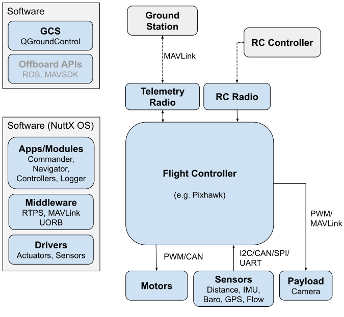
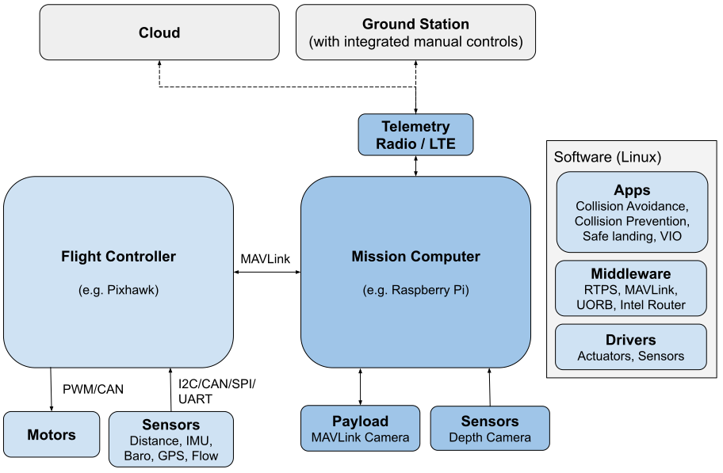

# Архітектура системи PX4

Нижче наведено огляд апаратного та програмного забезпечення на PX4 для двох "типових" систем PX4; перша має лише польотний контролер, а друга має польотний контролер і супутній комп'ютер (також відомий як "комп'ютер політних завдань").

:::info
The [PX4 Architectural Overview](../concept/architecture.md) provides information about the flight stack and middleware.
Offboard APIs are covered in [ROS](../ros/index.md) and [MAVSDK](https://mavsdk.mavlink.io/main/en/).
:::

## Лише польотний контролер

На діаграмі нижче показано загальний огляд типової "простої" системи PX4 на основі польотного контролера.

<!-- Source for drawing: https://docs.google.com/drawings/d/1_2n43WrbkWTs1kz0w0avVEeebJbfTj5SSqvCmvSOBdU/edit -->

Апаратне забезпечення складається з

- [Flight controller](../flight_controller/index.md) (running the PX4 flight stack). Часто включає внутрішні ІВП, компас та барометр.
- [Motor ESCs](../peripherals/esc_motors.md) connected to [PWM outputs](../peripherals/pwm_escs_and_servo.md), [DroneCAN](../dronecan/escs.md) (DroneCAN allows two-way communication, not single direction as shown) or some other bus.
- Sensors ([GPS](../gps_compass/index.md), [compass](../gps_compass/index.md), distance sensors, barometers, optical flow, barometers, ADSB transponders, etc.) connected via I2C, SPI, CAN, UART etc.
- [Camera](../camera/index.md) or other payload. Камери можуть бути підключені до ШІМ виходів або за допомогою MAVLink.
- [Telemetry radios](../telemetry/index.md) for connecting to a ground station computer/software.
- [RC Control System](../getting_started/rc_transmitter_receiver.md) for manual control

Ліва частина діаграми показує набір програмного забезпечення, що по горизонталі (приблизно) вирівняно згідно з апаратними частинами діаграми.

- The ground station computer typically runs [QGroundControl](../getting_started/px4_basic_concepts.md#qgc) (or some other ground station software).
  It may also run robotics software like [MAVSDK](https://mavsdk.mavlink.io/) or [ROS](../ros/index.md).
- The PX4 flight stack running on the flight controller includes [drivers](../modules/modules_driver.md), [comms modules](../modules/modules_communication.md), [controllers](../modules/modules_controller.md), [estimators](../modules/modules_controller.md) and other [middleware and system modules](../modules/modules_main.md).

## Польотний контролер та супутній комп'ютер

На діаграмі показано систему PX4, яка включає як політний контролер, так і супутній комп'ютер (тут згадується як "комп'ютер політного завдання").

<!-- source for drawing: https://docs.google.com/drawings/d/1zFtvA_B-BmfmxFmAd-XIvAZ-jRqOydj0aBtqSolBcqI/edit -->

The flight controller runs the normal PX4 flight stack, while a companion computer provides advanced features that utilise [computer vision](../computer_vision/index.md).
The two systems are connected using a fast serial or IP link, and typically communicate using the [MAVLink protocol](https://mavlink.io/en/).
Communications with the ground stations and the cloud are usually routed via the companion computer (e.g. using the [MAVLink Router](https://github.com/mavlink-router/mavlink-router) (from Intel)).

PX4 systems typically run a Linux OS on the companion computer.
Linux є набагато кращою платформою для "загальної" розробки програмного забезпечення, ніж NuttX; у Linux багато розробників і вже написано багато корисного програмного забезпечення (наприклад для комп'ютерного бачення, зв'язку, інтеграції з хмарою, апаратні драйвери).
Супутні комп'ютери іноді працюють на Android з тієї ж причини.

:::info
The diagram shows a cloud or ground station connection via LTE, an approach that has been used a number of PX4-based systems.
PX4 не надає програмного забезпечення для LTE та/або хмарної інтеграції (це потребує додаткової розробки).
:::
