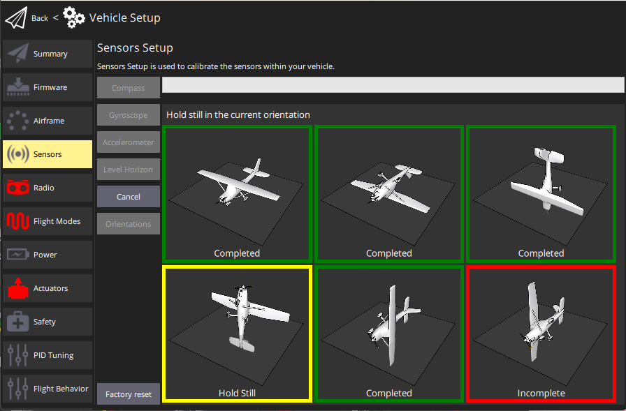

# Калібрування акселерометра

Акселерометр повинен бути калібрований при першому використанні або якщо змінився орієнтація контролера польоту. Інакше йому не потрібно перекалібруватися (крім можливо взимку, якщо регулятор польоту не був [термічно калібрований](../advanced_config/sensor_thermal_calibration.md) на заводі).

:::info
Погана калібрування акселерометра, як правило, виявляється під час передпольотних перевірок та повідомлень про відмову в узброєнні (попередження QGC зазвичай стосуються "високого зміщення акселерометра" та "помилок перевірки на відповідність").
:::

:::tip
Це схоже на [калібрування компасу](../config/compass.md), за винятком того, що ви тримаєте автомобіль нерухомим (замість обертання) в кожному положенні.
:::

## Виконання калібрування

_QGroundControl_ буде керувати вами, щоб розмістити та утримувати ваш транспортний засіб в різних орієнтаціях (вас попередять, коли переміщуватися між позиціями).

Калібрування включає наступні кроки:

1. Запустіть _QGroundControl_ та підключіть транспортний засіб.
1. Виберіть **іконку "Q" >  Налаштування транспортного засобу >  Датчики** (бічна панель), щоб відкрити _Налаштування датчиків_.
1. Натисніть кнопку датчика **Акселерометр**.

   

   :::info Ви вже повинні були встановити [Орієнтацію автопілота](../config/flight_controller_orientation.md). Якщо ні, ви також можете встановити це тут.
:::

1. Клацніть **OK**, щоб розпочати калібрування.
1. Розмістіть автомобіль, як вказано на _зображеннях_ на екрані. Після виклику (орієнтаційне зображення стає жовтим) тримайте транспортний засіб нерухомо. Після завершення калібрування для поточного орієнтації пов'язане зображення на екрані стане зеленим.

   :::info
Калібрування використовує алгоритм найменших квадратів 'fit', який не вимагає від вас мати "ідеальні" орієнтації під кутом 90 градусів.
За умови, що кожна вісь спрямована в основному вгору і вниз у певний момент у послідовності калібрування, а транспортний засіб утримується нерухомо, точна орієнтація не має значення.
:::

   

1. Повторіть процес калібрування для всіх орієнтацій автомобіля.

Після калібрування автомобіля у всіх положеннях _QGroundControl_ відобразить _Калібрування завершено_ (всі зображення орієнтації будуть відображені зеленим кольором, а панель прогресу буде заповнена повністю). Ви можете потім перейти до наступного сенсора.

## Подальша інформація

- [ QGroundControl Посібник користувача > Датчики](https://docs.qgroundcontrol.com/master/en/qgc-user-guide/setup_view/sensors_px4.html#accelerometer)
- [PX4 Setup Video - @1m46s](https://youtu.be/91VGmdSlbo4?t=1m46s) (Youtube)
