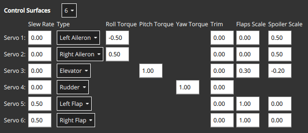
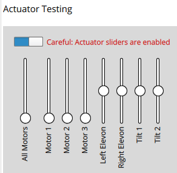
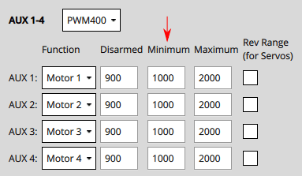

# Конфігурація та тестування приводу

<Badge type="tip" text="PX4 v1.14" />

Перегляд _Налаштування приводів_ використовується для налаштування конкретної геометрії транспортного засобу, призначення приводів і двигунів виходам контролера польоту та перевірки реакції приводу та двигуна.

## Загальний огляд

Відкрийте перегляд у _QGroundControl_ тут: **"Q" (меню програми) > Налаштування автомобіля > Актуатори** (вкладка). Елементи, що відображаються, залежать від [вибраного кадру](../config/airframe.md), а вихідні дані відображаються за замовчуванням, як показано в [Посиланні на планер](../airframes/airframe_reference.md).

Вид має три розділи:

- [Геометрія](#geometry): налаштуйте геометрію [вибраного планера](../config/airframe.md). Це включає кількість, положення та властивості [двигунів](#motor-geometry), а також кількість і властивості [керуючих поверхонь](#control-surfaces-geometry) і [сервоприводів нахилу двигуна](#motor-tilt-servo-geometry).
- [Виходи приводів](#actuator-outputs): призначте двигуни, поверхні керування та інші приводи певному виходу.
- [Тестування приводу](#actuator-testing): перевірте, чи двигуни та приводи рухаються в очікуваному напрямку/швидкості.

Можливо, у квадрокоптера буде екран налаштувань, схожий на показаний нижче. Це визначає чотиримоторний коптер з геометрією X. Він відображає 4 двигуни на виходи AUX1 до AUX4 та вказує, що вони підключені до регуляторів швидкості DShot1200 ESC. Також він відображає виходи PWM400 AUX для керування парашутом та стійками посадки.


::: info За замовчуванням відображаються лише найпоширеніші налаштування. Установіть прапорець **Додатково** у верхньому правому куті, щоб відобразити всі налаштування.
:::

## Геометрія

Розділ геометрії використовується для встановлення будь-яких конфігурованих параметрів, пов’язаних із геометрією, для вибраного [планера](../config/airframe.md). Це включає кількість і положення [двигунів](#motor-geometry), а також кількість, функції та властивості [керуючих поверхонь](#control-surfaces-geometry). Для конвертопланів VTOL також включатиме кількість і властивості [сервоприводів нахилу](#motor-tilt-servo-geometry)

::: info Інтерфейс користувача налаштовано для вибраного планера:

- Відображаються лише _конфігуровані_ поля для вибраного типу планера; поля, які не можна налаштувати для планера, приховані.
- Діаграма положення двигуна наразі відображається лише для рам мультикоптера.
:::

### Геометрія двигунів

Розділ геометрії двигунів дозволяє вам встановити кількість двигунів, відносне положення та інші властивості кожного двигуна.

Більшість властивостей двигуна застосовуються до всіх рамок. Деякі властивості застосовуються до певних рамок. Наприклад, `Tilted by` і `axis` актуальні лише для транспортних засобів [Tiltrotor VTOL](#motor-geometry-vtol-tiltrotor) і [Standard VTOL](#motor-geometry-standard-vtol) відповідно.

Конфігурація геометрії для повітряних рамок мультікоптерів надає діаграму, яка показує відносні позиції по вісі x та y для кожного з двигунів. Див. [Airframe Reference](../airframes/airframe_reference.md) для загального розуміння позицій двигунів для інших рамок.

Основні концепції геометрії та конфігурація для ряду різних фреймів наведені в наступних розділах.

#### Мотор геометрія: Мультикоптер

На зображенні нижче показано налаштування геометрії для рамки квадрокоптера з і без розширеними налаштуваннями.


Спочатку параметр випадаючого списку **Двигуни** дозволяє вибрати кількість двигунів (4 для вищезазначеного прикладу).

Для кожного двигуна ви можете встановити:

- `Позиція X`: [Позиція X](#motor-position-coordinate-system), у метрах.
- `Позиція Y`: [Позиція Y](#motor-position-coordinate-system), у метрах.
- `Позиція Z`: [Z-position](#motor-position-coordinate-system), у метрах.
- (Advanced) `Напрямок проти годинникової стрілки`: Прапорець, що вказує на те, що двигун обертається проти годинникової стрілки (зніміть прапорець для обертання за годинниковою стрілкою).
- (Розширений) `Бідирекційний`: Прапорець, що вказує, що двигун є [бідирекційним](#bidirectional-motors)
- (Розширено) `Коефіцієнт нахилу`: Див. розділ [Геометрія керованих поверхонь](#control-surfaces-geometry) для отримання додаткової інформації

:::info Позиції `X`, `Y`, `Z` в [FRD координатній системі](#motor-position-coordinate-system) відносно _центру ваги_. Зверніть увагу, що це може не збігатися з позицією контролера польоту!
:::

#### Геометрія двигуна: VTOL Quadrotor Tailsitter

Геометрія двигуна для [Вертикального зльоту Quad Tailsitter](../airframes/airframe_reference.md#vtol-tailsitter) показана нижче (підхід до налаштування інших вертикальних зльотних транспортних засобів буде подібним).

Двигуни мають ті ж поля конфігурації, що й для [геометрії мультикоптера](#motor-geometry-multicopter).


#### Геометрія двигуна: VTOL Tiltrotor

Геометрія двигуна для [Загального квадроплана VTOL з креновими роторами](../airframes/airframe_reference.md#vtol_vtol_tiltrotor_generic_quadplane_vtol_tiltrotor) показана нижче (підхід до налаштування інших [VTOL кренових роторів](../airframes/airframe_reference.md#vtol_vtol_tiltrotor_generic_quadplane_vtol_tiltrotor) буде схожим).


- `Нахилений на`: Супутній сервопривід, що використовується для нахилу двигуна. Властивості цього серводвигуна визначаються в [Геометрії серводвигуна нахилу двигуна](#motor-tilt-servo-geometry).

#### Геометрія двигуна: стандартний VTOL

Геометрія двигуна для [Загального стандартного Вертикального зльоту](../airframes/airframe_reference.md#vtol_standard_vtol_generic_standard_vtol) показана нижче (підхід до налаштування інших "Стандартних Вертикальних зльотів" буде подібним).


Двигуни мають більшість тих самих полів конфігурації, що й для [геометрії багтропа](#motor-geometry-multicopter). Є додаткове поле для позначення напрямку, в якому рухається двигун транспортного засобу (для стандартного ВТОЛ, гвинти для утримання у повітрі зазвичай встановлені "вгору", а тяговий двигун встановлений "вперед").

- `Вісь`: Один з `Вгору`, `Вниз`, `Вперед`, `Назад`, `Ліворуч`, `Праворуч`, `Користувацький`
  - Якщо вибрано `Custom`, то інтерфейс користувача відображає три додаткові поля для встановлення орієнтації двигуна.

#### Геометрія двигуна: Інші транспортні засоби

Інші типи транспортних засобів визначать відповідну геометрію двигуна для свого типу рами. Ще раз ці двигуни, як правило, матимуть ті ж самі властивості, що й показано вище.

Наприклад, у літального апарата з фіксованим крилом може бути лише один тяговий двигун, тоді як ровер з диференційним керуванням матиме двигун для керування швидкістю і для керування керуванням.

#### Система координат положення двигуна

Система координат для позицій двигуна - FRD (у тілі), де вісь X вказує вперед, вісь Y - праворуч, а вісь Z - вниз.

Походження - **це центр тяжіння (COG) ** транспортного засобу. Можливо, це може **НЕ БУТИ** тим самим положенням, що й автопілот.


#### Двосторонні мотори

Деякі транспортні засоби можуть використовувати двонаправлені двигуни (тобто двигуни, які підтримують обертання у обох напрямках). Наприклад, земляні транспортні засоби, які хочуть рухатися вперед і назад, або літальні апарати типу VTOL, які мають двигуни-тягунці, які можуть обертатися у будь-якому напрямку.

Якщо використовуються двонаправлені двигуни, переконайтеся, що для цих двигунів вибрано прапорець "Реверсивний" **Reversible** (цей прапорець відображається як "розширена" опція).


Зверніть увагу, що вам також потрібно переконатися, що регулятор швидкості (ESC), пов'язаний з двунаправленими двигунами, налаштований відповідним чином (наприклад, увімкнення режиму 3D для регуляторів швидкості DShot, що можна здійснити за допомогою команд DShot [DShot commands](../peripherals/dshot.md#commands)).

### Геометрія поверхонь керування

Розділ поверхонь керування на панелі геометрії дозволяє встановити кількість і типи поверхонь керування, які присутні на транспортному засобі. У деяких випадках вам також може знадобитися встановити значення обрізки і швидкості переміщення. Для більш досвідчених користувачів також доступна можливість налаштувати масштаби кочення, рулювання та тангажу (зазвичай значення за замовчуванням є прийнятними і цього не потрібно). Нижче показаний "приклад" розділу поверхонь керування для транспортного засобу з двома елеронами. Зауважте, що елерони впливають тільки на кочення, тому поля тангажу та рулювання вимкнені.


:::info За замовчуванням відображаються лише найпоширеніші налаштування. Виберіть прапорець **Додаткові** в правому верхньому куті вікна, щоб відобразити всі налаштування.
:::

Кроки наступні:

- `Керуючі поверхні`: Кількість керуючих поверхонь (встановіть це спочатку!)
- `Тип`: Тип кожної керуючої поверхні: `Лівий елерон`, `Правий елерон`, `Елеватор`, `Руль`, `Лівий елевон`, `Правий елевон`, `Ліва V-хвістка`, `Права V-хвістка`, `Лівий флап`, `Правий флап`, `Повітряні гальма`, `Користувацькі`.
- `Крутний момент по крену`: Ефективність приводу навколо осі крену (нормалізована: -1 до 1). [Загалом ви повинні використовувати значення актуатора за замовчуванням](#actuator-roll-pitch-and-yaw-scaling).
- `Крутний момент по тангажу`: Ефективність приводу навколо осі тангажу (нормалізована: -1 до 1). [Загалом ви повинні використовувати значення актуатора за замовчуванням](#actuator-roll-pitch-and-yaw-scaling).
- `Крутний момент по курсу`: Ефективність приводу навколо осі курсу (нормалізована: -1 до 1). [Загалом ви повинні використовувати значення актуатора за замовчуванням](#actuator-roll-pitch-and-yaw-scaling).
- `Обрізка`: Зміщення, додане до приводу, щоб він був в центрі без вводу. Це може бути визначено методом проб і помилок.
- (Розширено) `Швидкість нахилу`: Мінімальний час, дозволений для сигналу двигуна/сервопривода для проходження повного діапазону виходу, в секундах.
  - Параметр обмежує швидкість зміни приводу (якщо не вказано, то обмеження швидкості не застосовується). Призначено для приводів, які можуть пошкодитися, якщо вони рухаються занадто швидко — наприклад, приводи нахилу на повітряному судні VTOL з можливістю повороту.
  - Наприклад, значення 2.0 означає, що двигун/сервопривід не буде командуватися рухатися від 0 до 1 зі швидкістю, яка завершить операцію менш ніж за 2 секунди (у випадку реверсивних двигунів діапазон -1 до 1).
- (Розширено) `Масштаб закривання`: На скільки цей привод відхиляється в "повній конфігурації закрил" \[0, 1\] (див. [Конфігурацію масштабу закривання та масштабу спойлера](#flap-scale-and-spoiler-scale-configuration) нижче). Може бути використаний для налаштування аеродинамічної поверхні як закрилок або для компенсації обертового моменту, що виникає через головні закрилки.
- (Розширено) `Масштаб спойлера`: На скільки цей привод відхиляється в "повній конфігурації спойлера" \[0, 1\] (див. [Конфігурацію масштабу закривання та масштабу спойлера](#flap-scale-and-spoiler-scale-configuration) нижче). Може бути використаний для налаштування аеродинамічної поверхні як закрилок або для компенсації обертового моменту, що виникає через головні закрилки.
- (Тільки VTOL) `Заблокуйте керуючі поверхні у режимі гвинтокрилування`:
  - `Ввімкнено`: Більшість транспортних засобів не використовують керуючі поверхні у режимі утримання на місці. Використовуйте цей параметр, щоб заблокувати їх, щоб вони не впливали на динаміку транспортного засобу.
  - `Вимкнено`: Встановіть це для транспортних засобів, які використовують керуючі поверхні у режимі утримання на місці, такі як двокрильний вертольот (який використовує елерони для кочення та розвороту). Також воно повинно бути встановлено для транспортних засобів, які використовують поверхні керування для забезпечення додаткової стабілізації в режимі утримання на місці при русі зі швидкістю або при сильному вітрі.

#### Конфігурація масштабу закрилка та спойлера

"Керування флапами" та "керування спойлерами" - це аеродинамічні конфігурації, які можуть керуватися вручну пілотом (наприклад, за допомогою RC) або встановлюватися автоматично контролером. Наприклад, пілот або система посадки можуть ввести "керування спойлерами", щоб зменшити швидкість повітря перед посадкою.

Конфігурації є _абстрактним_ способом, за допомогою якого контролер повідомляє розподілювачу, наскільки він має налаштувати аеродинамічні властивості крил відносно конфігурації «повні закрилки» або «повний спойлер» (між `[ 0,1]`, де "1" означає повний діапазон). Потім алокатор використовує будь-які доступні поверхні керування для досягнення вимаганої конфігурації: зазвичай флапи, елерони та кормові поверхні.

Налаштування масштабу флапів `flap scale` та спойлерів `spoiler scale` у користувальницькому інтерфейсі актуатора інформує алокатор, наскільки елерони, елеватори, флапи, спойлери та інші поверхні керування сприяють вимаганому значенню "керування флапами" і/або "керування спойлерами". Зокрема, вони показують, на скільки кожна поверхня керування повинна бути відхиленою, коли контролер вимагає "повних флапів" або "повного спойлера".

У наступному прикладі транспортний засіб має два елерона, один елеватор, один руль і дві флапи як поверхні керування:



- Флапи мають обидва масштаби флапів `Flap Scale`, встановлені на 1, що означає, що вони будуть повністю відхилені при керуванні флапами на рівні 1. Також вони мають швидкість переміщення 0,5/с, що означає, що їм знадобиться 2 секунди, щоб повністю відхилити їх (швидкість переміщення флапів, як правило, рекомендується, щоб зменшити перешкоди, які створює їх рух).
- Елерони в основному призначені для забезпечення керованого крутного моменту. Вони також мають масштаби спойлерів `Spoiler Scale`, встановлені на 0,5, і додатково будуть відхилені вгору на 50%, якщо контролер вимагає повну конфігурацію спойлера. Таким чином, відхилення елеронів - це сума (асиметричного) відхилення для крутного моменту, плюс (симетричне) відхилення для вказаної точки спойлера.
- Елеватор в основному призначений для забезпечення крутного моменту по тангажу. Він також має ненульні значення в полях масштабу флапів `Flap Scale` та спойлерів `Spoiler Scale`. Це відхилення елеватора, яке додається для компенсації моментів по тангажу, створених дією поверхні флапів та спойлерів. У цьому випадку елеватор буде відхилений на 0,3 вгору при повному розгортанні флапів для компенсації моменту, спрямованого вниз, який викликано дією флапів.

#### Масштабування крену, кута та повороту приводу

:::info
Для більшості конструкцій аеросуден вихідні значення для кожного типу керуючої поверхні не повинні змінюватися.
:::

Значення `Масштабу кочення`, `Масштабу тангажу` та `Масштабу риштування` вказують на нормалізовану ефективність приводу навколо відповідної вісі.

Настройка значень є темою низького / рівня / продвинутої складності і, як правило, потрібна лише при налаштуванні зв'язаних поверхонь керування (наприклад, елерон, який контролює як кочення, так і тангаж). У цьому випадку важливо знати наступне:

- Числа, які вводяться, безпосередньо вводяться в матрицю розподілу, яка потім інвертується для отримання сигналів керування від вибраних моментів (нормалізованих).
- Збільшення масштабу зменшить _reduce_ відхилення поверхонь керування (оскільки він інвертується).

<!-- For more information see: []() (PX4 Dev Summit, 2022) -->

#### Конвенція про відхилення поверхні керування

Діаграма нижче показує конвенцію для відхилень:


Підсумовуючи:

- **Горизонтальні керуючі поверхні:** Вгору рух означає позитивне відхилення. Містить елерони, тощо
- **Вертикальні керуючі поверхні:** Праворуч рух є позитивним відхиленням. Містить кермо тощо.
- **Змішані керуючі поверхні:** Вгору/праворуч рух є позитивним (як вище). Включає в себе V-Tail тощо.

<!-- Also see this comment: https://github.com/PX4/PX4-Autopilot/blob/96b03040491e727752751c0e0beed87f0966e6d4/src/modules/control_allocator/module.yaml#L492 -->

### Геометрія сервоприводу нахилу двигуна

[Літальні апарати VTOL](../frames_vtol/tiltrotor.md) з кільцевими роторами можуть нахиляти свої двигуни для переходу між вертикальним польотом і польотом вперед. Цей розділ визначає властивості сервоприводів з відхиленням. Ці значення відображаються на конкретні двигуни в геометрії двигуна для тільтротора.

Наведений нижче приклад показує налаштування серводвигуна для [геометрії мотора тілтротора, показаної вище](../config/actuators.md#motor-geometry-vtol-tiltrotor).


Допустимі значення, які можна встановити:

- `Сервоприводи нахилу`: Кількість сервоприводів (похилих моторів).
- `Кут при мінімальному нахилі`: [Максимальний кут нахилу](#tilt-servo-coordinate-system) в градусах, відносно вісі z.
- `Кут у максимальному куті`: [Мінімальний кут нахилу](#tilt-servo-coordinate-system) у градусах, відносно осі z-осі.
- `Напрямок нахилу`: `` (додатний х напрямок) або `до інструкцій справа від` (позитивний напрямок y).
- `Використовуйте для контролю`: [Сервопривід нахилу використовується для крен/тангажу](#tilt-servos-for-yaw-pitch-control)
  - `Жоден`: Контроль крутного моменту не використовується.
  - `Крен`: Сервоприводи, що використовуються для керування креном.
  - `Крен`: Сервоприводи, які використовуються для керування креном.
  - `Як рульове і крен`: Сервоприводи нахилу використовуються для контролю як рульового, так і крену.

#### Система координат сервопривода нахилу

Система координат для кутів нахилу вітрокрила показана нижче. Орієнтація для кутів нахилу - пряме вгору (0 градусів). Кут нахилу вперед або праворуч від автомобіля є позитивним, а в напрямку назад або ліворуч - негативним.


`Кут при мінімальному нахилі` та `Кут при максимальному нахилі` вказують на діапазон руху серводвигуна нахилу. Мінімальний нахил - це менше _числове значення_ (не абсолютне) двох кутів.

Якщо максимальні/мінімальні вектори нахилу **P<sub>0</sub>** та **P<sub>1</sub>**, як показано вище, обидва кути нахилу є позитивними, але **θ<sub>0</sub>** менший:

- `Кут при мінімальному нахилі` = **θ<sub>0</sub>**
- `Кут при максимальному нахилі` = **θ<sub>1</sub>**

:::info Якщо діаграма була відображена дзеркально, так що **P<sub>0</sub>** та **P<sub>1</sub>** нахилялися в -x, -y квадрант, тоді обидва кути нахилу були б від'ємними. Тому що **θ<sub>1</sub>** буде більш від'ємним (меншим) ніж **θ<sub>0</sub>**, він буде `Кут при мінімальному нахилі`.

Аналогічно, сервопривід, який рухається:

- між вертикальним і впереднім положеннями буде мати `min=0` і `max=90`.
- симетрично на 45 градусів навколо вертикального положення матиме `min=-45` та `max=45`
- між вертикальним і назад положеннями буде мати `min=-90` і `max=0`.
:::

`Напрямок нахилу` вказує, чи нахиляється сервопривід у площині до `Передньої` або `Правої` частини транспортного засобу. На діаграмі це буде представлено **α**, яке може приймати лише значення 0 (вперед) або 90 (праворуч).

#### Сервоприводи для крену/тангажу

Сервоприводи нахилу можуть надавати крутний момент на одній або декількох осях, які можуть бути використані для розвороту або крена транспортного засобу:

- Yaw зазвичай налаштовується таким чином, хоча на транспортних засобах з чотирма або більше двигунами часто використовуються двигуни.
- Крен керується в основному за допомогою різниці тяги двигунів. Керування за допомогою сервоприводів нахилу корисне на повітряних конструкціях, які не можуть використовувати диференційний тягу, наприклад, [Бікоптер](https://www.youtube.com/watch?v=hfss7nCN40A).

Чи ця функція використовується, налаштовується в параметрі `Використовувати для управління`.

## Виводи приводу

Розділ _Виводи приводу_ використовується для призначення моторів, сервоприводів поверхні керування та інших приводів, які використовуються конкретною рамою, до фізичних виводів на контролері польоту та для встановлення параметрів для цих виводів.


Для кожної підтримуваної вихідної шини, підключеної до керуючого контролера польоту, відображаються окремі вкладки: PWM MAIN (вихід дошки вводу/виводу), PWM AUX (вихід дошки FMU), UAVCAN.

Двигуни та приводи (які називаються "[функціями](#output-functions)") можуть бути призначені для будь-якого фізичного виводу на будь-якій з наявних шин.

:::info
PWM AUX виходи вважаються бажаними для керування двигунами над PWM MAIN виходами (вони мають меншу затримку).
:::

Вихідні PWM групуються на основі груп апаратних таймерів. Це означає, що всі виходи в одній групі повинні працювати за одним протоколом з однаковою швидкістю (наприклад, сигнал ШІМ на частоті 400 Гц для всіх виходів в одній групі). Тому неможливо відобразити Серводвигун та Двигун в одній вихідній групі, оскільки вони зазвичай працюють на різних швидкостях.

Вкладка PWM AUX має виходи CAP, які, як правило, використовуються як [вхід знімка/спуску камери](../camera/fc_connected_camera.md#trigger-configuration). Однак ви можете відобразити виводи CAP на інші функції виводу, і інші AUX виводи можуть бути використані як вхід для захоплення / спрацювання камери.

:::info
Налаштування захоплення камери / Тригер вхід потребує перезавантаження для набуття чинності
:::

Ви повинні призначити функції виходам, які відповідають вашій фізичній з'єднаності моторів та сервоприводів, і використовувати розділ [Тестування приводів](#actuator-testing), описаний нижче, для визначення відповідних значень параметрів виходу. Ці кроки охоплені в [Вихідному призначенні та конфігурації](#output-assignment-and-configuration).

### Функції виводу

Функції виводу використовуються для відображення "логічних функцій" конструкції повітряного каркасу, таких як `Мотор 1` або `Шасі`, на фізичні виводи, наприклад, вивідний пін FMU 2. Це дозволяє легко використовувати певний вихідний контакт для майже будь-якої мети.

Деякі функції є актуальними лише для певних кадрів або типів виведення, і не будуть запропоновані на інших.

Функції включають:

- `Відключено`: Виводу не призначено жодної функції.
- `Constant_Min`: Вивід постійного мінімального значення (-1).
- `Constant_Max`: Вивід встановлюється на постійне максимальне значення (+1).
- `Motor 1` до `Motor 12`: На виході вказано двигун. Відображаються тільки двигуни, дозволені для авіаконструкції.
- `Servo 1` - `Servo 8`: вихід сервоприводу. Ці об'єкти отримують конкретне значення на основі конструкції, таке як "серводвигун нахилу", "лівий елерон".
- `Периферійний за допомогою набору приводів 1` до `Периферійний за допомогою набору приводів 6`: [Загальний контроль виконавчого пристрою з MAVLink](../payloads/generic_actuator_control.md#generic-actuator-control-with-mavlink).
- `Шасі`: Вивід - це шасі.
- `Парашут`: Вихід - це парашут. Мінімальне значення надсилається у звичайному режимі, а максимальне - при спрацьовуванні захисту від збоїв.
- `RC Roll`: Вихід - це вихідний рол з RC ([RC_MAP_ROLL](../advanced_config/parameter_reference.md#RC_MAP_ROLL) відображає канал RC на цей вихід). Потік RC вимикача зіставляється з виходом за допомогою .
- `RC Pitch`: Вихід - це паспортний крок від RC ([RC_MAP_PITCH](../advanced_config/parameter_reference.md#RC_MAP_PITCH) відображає канал RC на цей вихід).
- `RC Throttle`: Output is passthrough throttle from RC ([RC_MAP_THROTTLE](../advanced_config/parameter_reference.md#RC_MAP_THROTTLE) maps an RC channel to this output).
- `RC Yaw`: Вихід - це розворот від RC ([RC_MAP_YAW](../advanced_config/parameter_reference.md#RC_MAP_YAW) відображає канал RC на цей вихід).
- `RC Flaps`: Вихід - це закрилки з RC ([RC_MAP_FLAPS](../advanced_config/parameter_reference.md#RC_MAP_FLAPS) відображає канал RC на цей вихід).
- `RC AUXn` до `RC AUX1`: Виводи, які використовуються для [довільних навантажень, спрацьованих через RC-передавання](../payloads/generic_actuator_control.md#generic-actuator-control-with-rc).
- `Gimbal Roll`: Вихід контролює відвід Gimbal.
- `Gimbal Pitch`: Вихід контролює крок Gimbal.
- `Gimbal Yaw`: Output controls Gimbal yaw.

Наведені функції можуть бути застосовані тільки до виходів FMU:

- `Camera_Trigger`: Вихід для запуску камери. Увімкнено, коли [`TRIG_MODE==0`](../advanced_config/parameter_reference.md#TRIG_MODE). Налаштовано через параметри `TRIG_*`.
- `Camera_Capture`: Вхід для отримання сповіщення про захоплення зображення. Увімкнено, коли [CAM_CAP_FBACK==0](../advanced_config/parameter_reference.md#CAM_CAP_FBACK). Налаштовано через параметри `CAM_CAP_*`.
- `PPS_Input`: Захоплення вводу імпульсів на секунду. Використовується для синхронізації GPS. Увімкнено, коли [`PPS_CAP_ENABLE==0`](../advanced_config/parameter_reference.md#PPS_CAP_ENABLE)

:::info Цей список є правильним у PX4 v1.13. Функції визначені у джерелі за посиланням на [/src/lib/mixer_module/output_functions.yaml](https://github.com/PX4/PX4-Autopilot/blob/release/1.15/src/lib/mixer_module/output_functions.yaml).
:::

## Тестування актуаторів

Секція _Тестування приводів_ у нижньому правому куті надає повзунки, які можна використовувати для тестування (та визначення) налаштувань приводу та двигуна. Для кожного виводу, визначеного в розділі [Виводи приводу](#actuator-outputs), надається повзунок. Наведений нижче приклад слайдера показує розділ для типової повітряної конструкції VTOL Tiltrotor.



Розділ має перемикач **Увімкнути слайдери**, який необхідно перемкнути перед використанням слайдерів. Повзунки можуть живити двигуни/сервоприводи в повному діапазоні їх руху, а також «прив’язувати» до вимкненого та мінімального положень.

:::info Після перемикання перемикача **Увімкнути слайдери**, приводи/мотори не будуть робити нічого, доки відповідний слайдер не буде _переміщений_. Це функція безпеки, що запобігає раптовим рухам двигуна після увімкнення перемикача.
:::

Повзунки можуть бути використані для перевірки наступного:

1. Приводи (мотори, керуючі поверхні тощо) призначені для очікуваного виводу.
1. Двигуни не обертаються, коли досягнуто значення виводу ШШІ `роззброєно`
1. Двигуни ледь, але надійно запускаються на `мінімальному` значенні вихідного сигналу ШІМ.
1. Двигуни дають **позитивну тягу** в очікуваному напрямку
1. Поверхні керування знаходяться в правильному положенні очікування для вихідного значення `знято з охорони`
1. Поверхні керування знаходяться в правильному положенні очікування для вихідного значення [знято з охорони](#control-surface-deflection-convention)
1. Моторні сервоприводи належним чином знаходяться в позиції покою для вихідного значення `disarmed`
1. Сервоприводи нахилу двигуна рухаються в напрямку, визначеному в [Конвенції про сервоприводи нахилу](#tilt-servo-coordinate-system)

## Призначення та конфігурація виходу

Виведення призначені для функцій та налаштовуються в розділі [Виведення приводу](#actuator-outputs), тоді як регулятори [Тестування приводу](#actuator-testing) зазвичай використовуються для визначення відповідних значень конфігурації, які слід ввести:

- Транспортні засоби MC, які мають підключені двигуни до виходів ШШІ, можуть використовувати кнопку [Ідентифікувати &  Призначити Двигуни](#multicopter-pwm-motor-assignment) для виконання призначення двигунів "пів-автоматично".
- Виведення призначення обох двигунів та приводів може бути виконано / перевірено за допомогою слайдерів (див. [Призначення виведення (вручну)](#output-assignment-manual)).
- Роззброєний, мінімальні та максимальні налаштування для всіх виходів також можуть бути визначені за допомогою слайдерів. Це показано як частина [Конфігурація двигуна](#motor-configuration), [Налаштування поверхні керування](#control-surface-setup), [Налаштування сервопривода нахилу](#tilt-servo-setup)

### PWM багатокоптера: Призначення двигуна

Ви можете використовувати кнопку **Ідентифікувати та Призначити Двигуни** для призначення двигунів на виходи ШІМ з використанням напівавтоматизованого процесу.

:::info Це найлегший спосіб призначення двигунів, але наразі підтримується лише для двигунів на **багокоптерних транспортних засобах**, які підключені до виходів ШШП (виходи UAVCAN та інші типи рамок не підтримують цю функцію). On other frames you can follow the instructions in [Output Assignment (Manual)](#output-assignment-manual).
:::

:::warning
Видаліть гвинти з моторів перед призначенням виходів або будь-якими випробуваннями.
:::


Коли ви натискаєте кнопку, QGC відправляє команду до двигуна, що призводить до його обертання. Щоб призначити цей двигун виводу, просто виберіть відповідний двигун, який відображається на екрані. QGC потім автоматично обере наступний двигун для вас для призначення, і так далі.

Інструкції:

1. Налаштуйте геометрію двигуна, щоб вона відповідала двигунам на вашій рамі.
1. Виберіть вкладку PWM, на якій ви хочете призначити двигуни.
1. Натисніть кнопку **Визначити & призначити двигуни**.
1. Один двигун почне обертатися (натисніть **Обертати двигун знову**, якщо він зупиниться занадто швидко, щоб зауважити.)

   Виберіть відповідний двигун в розділі геометрії.

   

1. Після призначення всіх двигунів інструмент встановить правильне відображення двигунів для виходів, а потім вийде.

### Вивід призначення (ручний)

:::warning
Видаліть гвинти з моторів перед призначенням виходів або будь-якими випробуваннями.
:::

Виходи приводів для обох двигунів та сервоприводів можна _вручну_ призначити за допомогою повзунків у розділі [Тестування приводів](#actuator-testing).

Для призначення приводу:

1. Спочатку призначте функції виходам, які, на вашу думку, _ймовірно_, є правильними в розділі _Вихідні пристрої_.
1. Перемкніть перемикач **Увімкнути слайдери** у розділі _Тестування приводів_.
1. Перемістіть повзунок для приводу, який ви хочете перевірити:
   - Двигуни повинні бути переведені в положення мінімального тяги.
   - Сервоприводи повинні бути переміщені близько до середнього положення.
1. Перевірте, який привод рухається на транспортному засобі. Це повинно відповідати позиціям приводів для вашої геометрії (посилання на [довідник по конструкції повітряних суден](../airframes/airframe_reference.md) показує позиції двигунів для декількох стандартних конструкцій повітряних суден).
   - Якщо правильний привод рухається, перейдіть до наступного кроку.
   - Якщо неправильний привод рухається, поміняйте призначення виводу.
   - Якщо нічого не рухається, то збільште регулятор наполовину діапазону, потім вище, якщо потрібно. Якщо після цього нічого не рухається, вихід може бути не підключений, можливо, двигун не живиться або вихід може бути неправильно налаштований. Вам потрібно буде вирішити проблему (можливо, спробуйте інші виходи виконавчих пристроїв, щоб побачити, чи "щось" рухається).
1. Поверніть слайдер у положення "роззброєно" (донизу для двигунів, по центру для сервоприводів).
1. Повторити для всіх приводів

### Конфігурація двигуна

:::info Якщо використовуєте PWM або OneShot ESC, спочатку слід виконати [калібрування ESC](../advanced_config/esc_calibration.md) (ця тема також охоплює конфігурацію PWM-специфічних двигунів).

[DShot](../peripherals/dshot.md) ESCs не потребують налаштування меж команд, а лише напрямок обертання.
:::

:::warning
Видаліть пропелери!
:::

Конфігурація двигуна встановлює вихідні значення так, що двигуни:

- не обертайтеся, коли роззброєні (при значенні виводу ШШІ `роззброєно`).
- ледь, але надійно запускати на `мінімальному` значенні вихідного сигналу ШІМ.
- мають _найнижче_ `максимальне` вихідне значення ШІМ, яке обертає двигун із _найвищою_ швидкістю.
- дати **позитивний тягу** в очікуваному напрямку.

Для кожного двигуна:

1. Тягніть слайдер мотора вниз, щоб він защелкнувся унизу. У цій позиції двигун встановлений на значення виводів `disarmed`.
   - Перевірте, що двигун не обертається в цьому положенні.
   - Якщо двигун крутиться, зменште відповідне значення ШІМ `disarmed` в розділі [Виводи виконавчих пристроїв](#actuator-outputs) до рівня, при якому він все ще крутиться.
2. Повільно переміщуйте повзунок вгору, доки він не защелкнеться в положенні _мінімум_. У цій позиції двигун встановлено на виходи значення `мінімальне`.

   - Перевірте, чи двигун обертається дуже повільно в цьому положенні.
   - Якщо двигун не обертається або обертається занадто швидко, вам потрібно налаштувати відповідне мінімальне значення ШІМ `minimum` в [Виводах приводів](#actuator-outputs) так, щоб двигуни ледве оберталися.

        :::info
Для виходу DShot це не потрібно.

:::

3. Збільште значення слайдера до рівня, на якому ви можете перевірити, що двигун обертається в правильному напрямку і що він надасть позитивний тяговий потік в очікуваному напрямку.

   - Очікувана напрямок тяги може відрізнятися в залежності від типу транспортного засобу. Наприклад, у багатороторних літаках тяга завжди повинна вказувати вгору, тоді як у повітряному судні з фіксованим крилом тяга буде тягти судно вперед.
   - Для VTOL тяга повинна вказувати вгору, коли Сервопривід нахилу перебуває під кутом 0 градусів, як визначено у [Конвенції про Сервопривід нахилу](#tilt-servo-coordinate-system). Тестування [Крен-сервопривіду](#tilt-servo-setup) також описано нижче.
   - Якщо тяга спрямована в неправильному напрямку, можливо, вам потрібно [перевернути мотори](#reversing-motors).

4. Збільште значення слайдера до максимального значення, щоб двигун швидко обертався. Зменшіть значення `максимального` виходу ШІМ вище за типове значення. Прослухайте тон моторів, коли ви збільшуєте значення малими (25us) інкрементами. "Оптимальне" максимальне значення - це значення, при якому ви востаннє почули зміну тона.

### Налаштування поверхонь керування

Спочатку встановіть _частоту кадрів_ для сервоприводів, які використовуються в кожній групі виводів. Зазвичай це встановлюється на максимальне значення, підтримуване вашим серводвигуном. Нижче ми покажемо, як ви можете встановити його на PWM50 (найбільш поширене значення).


:::info Вам майже точно знадобиться змінити частоту пульса зі значенням за замовчуванням 400 Гц, оскільки підтримка рідко зустрічається (якщо не підтримується, сервопривід зазвичай видаватиме "дивний" шум). Якщо ви використовуєте сервоприводи PWM, PWM50 є набагато поширенішим. Якщо _дійсно_ потрібен високовольтний сервопривід, DShot пропонує кращу вартість.
:::

Для кожної з поверхонь керування:

1. Встановіть значення `Disarmed`, щоб поверхні залишалися в нейтральному положенні під час роззброєння. Зазвичай це становить близько `1500` для PWM сервоприводів.
2. Перемістіть повзунок для поверхні вверх (позитивна команда) та переконайтеся, що він рухається в напрямку, визначеному в [Конвенції керуючої поверхнею](#control-surface-deflection-convention).
   - Якщо поверхня керування рухається в протилежному напрямку, клацніть на прапорець `Rev Range`, щоб змінити діапазон.
3. Перемістіть повзунок ще раз у середину та перевірте, чи вирівняні керуючі поверхні в нейтральному положенні крила

   - Якщо воно не вирівняно, ви можете встановити значення **Trim** для поверхні керування. :::info Це робиться в налаштуванні `Trim` панелі Geometry, зазвичай методом "спроба і помилка". 
:::

   - Після встановлення обрізки для поверхні керування перемістіть його ковзачок від центру, відпустіть, а потім поверніть у відключений (середній) положення. Підтвердіть, що поверхня знаходиться в нейтральному положенні.

     ```

     ```

:::info Ще один спосіб протестувати без використання слайдерів - це встановити параметр [`COM_PREARM_MODE`](../advanced_config/parameter_reference.md#COM_PREARM_MODE) на `Always`:

- Це дозволить керувати сервоприводами навіть коли транспортний засіб відброньований, і постійно застосовуватиме налаштування обрізки до керуючих поверхонь
- Ви можете спробувати встановити різні значення для обрізки та перевірити вирівнювання, а потім вибрати значення, з яким ви будете задоволені.
:::

### Налаштування серводвигуна нахилу

Спочатку встановіть _частоту кадрів_ для сервоприводів, які використовуються в кожній групі виводів. Зазвичай це встановлюється на максимальне значення, підтримуване вашим серводвигуном. Нижче воно встановлено на PWM50 (найбільш поширене значення). Зверніть увагу, що ця частина налаштування є такою ж, як і для поверхонь керування вище.


Для кожного з сервоприводів нахилу:

1. Встановіть значення `Disarmed` (наприклад, `1000` або `2000` для PWM Servos), щоб сервопривід був розташований в очікуваному напрямку при _роззброєнні_.
2. Розмістіть регулятор для сервоприводу в найнижчому положенні, і переконайтеся, що збільшення позитивного значення вказуватиме на `Кут при мінімальному нахилі` (визначено в розділі Геометрія).

   

3. Розмістіть регулятор для сервоприводу в найвищому положенні, і переконайтеся, що позитивне зусилля двигуна вказуватиме на `Кут при максимальному нахилі` (як визначено в розділі Геометрія).

### Інші примітки

- Якщо використовується кнопка безпеки, її потрібно натиснути перед тим, як буде дозволено проводити випробування приводу.
- Вимикач вимкнення все ще може бути використаний для негайного зупинення двигунів.
- Сервоприводи фактично не рухаються, поки не буде змінено відповідний слайдер.
- Параметр [COM_MOT_TEST_EN](../advanced_config/parameter_reference.md#COM_MOT_TEST_EN) може бути використаний для повного вимкнення тестування приводів.
- На оболонці, [actuator_test](../modules/modules_command.md#actuator-test) також може бути використаний для тестування приводу.
- VTOLs автоматично вимикатимуть двигуни, що спрямовані вгору, під час **польоту з фіксованим крилом**:
  - Стандартний VTOL: Двигуни, визначені як багатокоптерні двигуни, будуть вимкнені
  - Tiltrotors : Двигуни, які не мають пов'язаного сервоприводу нахилу, вимкнуться
  - Tailsitters не вимикають жодних двигунів у польоті з фіксованим крилом

### Реверсивні мотори

Двигуни повинні обертатися в напрямку, визначеному в налаштованій геометрії (прапорці "**Напрям CCW**"). Якщо будь-які двигуни не обертаються в правильному напрямку, їх необхідно перевернути.

Є декілька варіантів:

- Якщо ESC налаштовані як [DShot](../peripherals/dshot.md), ви можете назавжди змінити напрямок через інтерфейс користувача. Кнопки **Встановити напрямок обертання** відображаються нижче слайдерів приводів (якщо використовуються мотори DShot). Ці викидають діалогове вікно, в якому ви вибираєте мотор, для якого хочете застосувати напрямок.

  

  Зверніть увагу, що поточного напрямку не можна запитати, тому вам може знадобитися спробувати обидві опції.

- Поміняйте місцями 2 з 3 кабелів двигуна (не має значення які саме).

  :::info
Якщо мотори не підключені за допомогою булет-конекторів, потрібно провести перепайку (це одна з причин, серед інших, чому варто віддавати перевагу DShot ESCs).
:::
