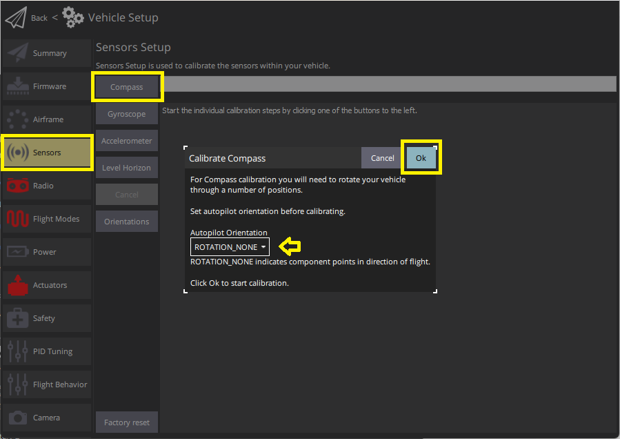
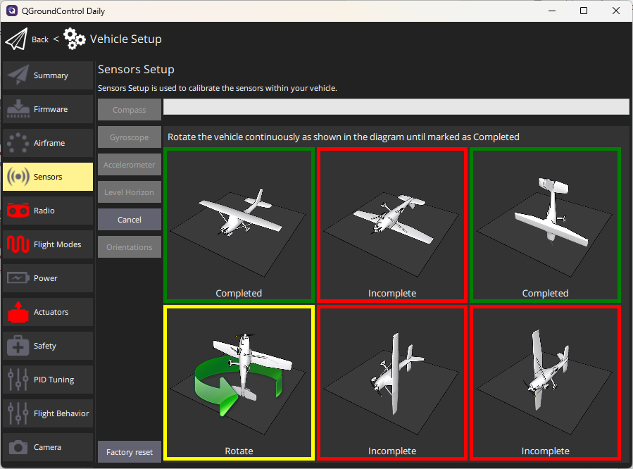

# Калібрування компасу

Процес калібрування компаса налаштовує всі підключені внутрішні та зовнішні [магнітометри](../gps_compass/index.md). _QGroundControl_ допоможе вам розташувати транспортний засіб у кількох фіксованих орієнтаціях та обертати транспортний засіб навколо вказаної вісі.

:::info Калібрування компасу також автоматично визначає орієнтацію компасу ([за замовчуванням](../advanced_config/parameter_reference.md#SENS_MAG_AUTOROT)). Якщо ви маєте [встановлений компас](../assembly/mount_gps_compass.md#compass-orientation) під нестандартним кутом, вам потрібно [вручну встановити орієнтацію компаса](../config/flight_controller_orientation.md#setting-the-compass-orientation) перед калібруванням.
:::

## Загальний огляд

Вам потрібно буде калібрувати ваш компас при першому використанні, і можливо, вам доведеться повторно калібрувати його, якщо транспортний засіб коли-небудь викладений на дуже сильне магнітне поле, або якщо він використовується в області з аномальними магнітними характеристиками.

:::tip
Індикація поганого компасу включає в себе мультикоп кругообігу під час наведення, туалет (обхід при збільшенні радіуса/вітальні, завжди постійна висота, що веде до польоту) або прямує поза стежкою при спробі підійти прямо. _QGroundControl_ також повинно повідомляти про помилку `сенсори магнітного поля неузгоджені`.
:::

Доступні два типи калібрування компаса:

1. [Завершити](#complete-calibration): Ця калібрування потрібна після встановлення автопілота на повітряну раму вперше або коли конфігурація транспортного засобу змінилася значно. Воно компенсує впливи твердого та м'якого заліза, оцінюючи зміщення та коефіцієнт масштабу для кожної вісі.
1. [Часткова](#partial-quick-calibration) ("Швидка калібрування"): Цю калібрування можна виконати як регулярну процедуру при підготовці транспортного засобу до польоту, після зміни корисного навантаження або просто коли компас здається неточним. Цей тип калібрування лише оцінює зміщення для компенсації ефекту твердого заліза.

## Виконання калібрування

### Передумови

Перед початком калібрування:

1. Виберіть місце подалеку від великих металевих об'єктів або магнітних полів. :::tip
Метал часом не завжди очевидний! Уникайте калібрування на верхній частині офісного столу (часто містять металеві пластины) або поруч з транспортним засобом.
Калібрування може бути навіть уражено, якщо ви стоїте на бетонній плиті з нерівномірним розподілом арматури.
:::
1. Підключайтесь за допомогою телеметричного радіо, а не через USB, якщо це взагалі можливо. USB потенційно може викликати значне магнітне втручання.
1. Якщо використовується зовнішній компас (або комбінований модуль GPS/компас), переконайтеся, що він [встановлений](../assembly/mount_gps_compass.md) якомога далі від інших електронних пристроїв для зменшення магнітних перешкод, і в _підтримуваному положенні_.

### Повне калібрування

Калібрування включає наступні кроки:

1. Запустіть _QGroundControl_ та підключіть транспортний засіб.
1. Виберіть **іконку "Q" > Налаштування транспортного засобу > Датчики** (бічна панель), щоб відкрити _Налаштування датчиків_.
1. Натисніть кнопку датчика **Compass**.

   

   :::info Ви вже повинні були встановити [Орієнтацію автопілота](../config/flight_controller_orientation.md). Якщо ні, ви також можете встановити це тут.
:::

1. Клацніть **Ok**, щоб розпочати калібрування.
1. Розмістіть транспортний засіб у будь-якому з показаних червоних орієнтацій (неповний) та утримуйте його нерухомим. Після запиту (орієнтаційне зображення стає жовтим) обертайте транспортний засіб навколо вказаної вісі в одному або обох напрямках. Після завершення калібрування для поточного орієнтації пов'язане зображення на екрані стане зеленим.

   

1. Повторіть процес калібрування для всіх орієнтацій автомобіля.

Після калібрування автомобіля у всіх положеннях _QGroundControl_ відобразить _Калібрування завершено_ (всі зображення орієнтації будуть відображені зеленим кольором, а панель прогресу буде заповнена повністю). Ви можете потім перейти до наступного сенсора.

### Часткова "Швидка" Калібрування

Ця калібровка схожа на відому калібровку компасу у вигляді восьмірки, виконану на смартфоні:

1. Утримуйте транспортний засіб перед собою та випадковим чином виконуйте часткові обертання по всіх його осях. 2-3 коливань на кут близько 30 градусів у кожному напрямку зазвичай достатньо.
1. Зачекайте, поки оцінка заголовку стабілізується, і перевірте, що компас вказує в правильному напрямку (це може зайняти кілька секунд).

Примітки:

- Немає можливості початку/зупинки для цього типу калібрування (алгоритм працює безперервно, коли транспортний засіб роззброєний).
- Калібрування негайно застосовується до даних (перезавантаження не потрібно), але зберігається в параметрах калібрування лише після відброшення транспортного засобу (калібрування втрачається, якщо між калібруванням і вимкненням не виконана послідовність увімкнення/вимкнення).
- Амплітуда та швидкість часткових обертань, виконаних на кроці 1, можуть впливати на якість калібрування. Найчастіше вище зазначені поради виявляються досить ефективними.

## Верифікація

Після завершення калібрування перевірте, щоб індикатор напрямку та напрямок стрілки на карті були стабільними і відповідали орієнтації транспортного засобу при його повороті, наприклад, на головні сторони.

## Додаткова калібрування/конфігурація

Вищезазначений процес автоматично виявить, [встановить обертання за замовчуванням](../advanced_config/parameter_reference.md#SENS_MAG_AUTOROT), калібрувати та встановлювати пріоритети для всіх підключених магнітометрів.

Додаткова конфігурація компаса, як правило, не повинна бути потрібною.

:::info
Усі зовнішні компаси за замовчуванням мають однаковий пріоритет, який вище, ніж пріоритет, який мають всі внутрішні компаси.
:::

### Вимкнути Компас

Як вже зазначено вище, як правило, додаткова конфігурація не потрібна.

Зазначимо, розробники можуть вимкнути внутрішні компаси за потреби, використовуючи параметри компасу. Ці мають префікс [CAL*MAGx*](../advanced_config/parameter_reference.md#CAL_MAG0_ID) (де `x=0-3`).

Щоб вимкнути внутрішній компас:

- Використовуйте [CAL_MAGn_ROT](../advanced_config/parameter_reference.md#CAL_MAG0_ROT), щоб визначити, які компаси є внутрішніми. Компас є внутрішнім, якщо `CAL_MAGn_ROT==1`.
- Потім використовуйте [CAL_MAGx_PRIO](../advanced_config/parameter_reference.md#CAL_MAG0_PRIO) для вимкнення компасу. Це також може бути використано для зміни відносного пріоритету компаса.

## Відлагодження

Сирові порівняльні дані для магнітометрів (фактично, для всіх сенсорів) можуть бути збережені, встановивши [SDLOG_MODE=1](../advanced_config/parameter_reference.md#SDLOG_MODE) та [SDLOG_PROFILE=64](../advanced_config/parameter_reference.md#SDLOG_PROFILE). Див. [Логування](../dev_log/logging.md) для отримання додаткової інформації.

## Детальна інформація

- [Периферійні пристрої > GPS & Компас](../gps_compass/index.md)
- [Основна збірка](../assembly/index.md) (інструкції з налаштування для кожного контролера польоту)
- [Компенсація енергії компасу](../advanced_config/compass_power_compensation.md) (Розширена конфігурація)
- [QGroundControl Посібник користувача > Датчики](https://docs.qgroundcontrol.com/master/en/qgc-user-guide/setup_view/sensors_px4.html#compass)
- [Відео налаштування PX4 - @2m38s](https://youtu.be/91VGmdSlbo4?t=2m38s) (Youtube)
