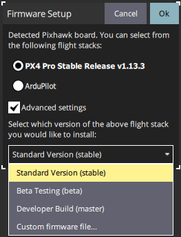

# Завантаження прошивки

_QGroundControl_ **десктоп** версії можуть бути використані для встановлення прошивки PX4 на плати керування польотом серії [Pixhawk](../getting_started/flight_controller_selection.md).

:::warning
**Перед початком встановлення прошивки** всі USB-підключення до транспортного засобу повинні бути _відключені_ (як прямі, так і через телеметричне радіо). Транспортний засіб _не повинен_ бути приводжений в рух від акумулятора.
:::

## Встановити стабільну PX4

В цілому, ви повинні використовувати останню версію _випущену_ версії PX4, для того, щоб отримати користь від виправлень помилок і отримати найновіші та найліпші функції.

:::tip
Ця версія встановлена за замовчуванням.
:::

Щоб встановити PX4:

1. Запустіть _QGroundControl_ та підключіть транспортний засіб.
1. Виберіть піктограму **"Q" > Налаштування програми > Firmware** (бічна панель), щоб відкрити _Налаштування прошивки_.

   

1. Підключіть польотний контролер безпосередньо до вашого комп'ютера через USB.

   ::::info
Підключайтеся безпосередньо до живого USB-порту на вашому пристрої (не підключайте через USB-хаб).
:::

1. Виберіть опцію **PX4 Pro Stable Release vX.x.x**, щоб встановити останню стабільну версію PX4 _для вашого контролера польоту_ (автоматично виявлено).

   

1. Натисніть кнопку **OK**, щоб розпочати оновлення.

   Прошивка потім пройде кілька етапів оновлення (завантаження нової прошивки, видалення старої прошивки тощо). Кожен крок виводиться на екран та загальний прогрес відображається на панелі прогресу.

   

   Після завершення завантаження прошивки пристрій/транспортний засіб перезавантажиться та встановить з'єднання знову.

:::tip
Якщо _QGroundControl_ встановлює ціль FMUv2 (див. консоль під час встановлення) і у вас є новіша плата, вам може знадобитися [оновити завантажувальник](#bootloader), щоб мати доступ до всієї пам'яті на вашому контролері польоту.
:::

Далі вам потрібно буде вказати [корпус повітряного судна](../config/airframe.md) (а потім сенсори, радіо тощо)

## Встановлення PX4 Main, Beta або Custom Firmware

Щоб встановити іншу версію PX4:

1. Підключіть транспортний засіб, як показано вище, та виберіть **PX4 Pro Stable Release vX.x.x**. 
1. Перевірте **Розширені налаштування** та виберіть версію зі списку випадаючих значень:
   - **Стандартна версія (стабільна):** Версія за умовчанням (тобто не потрібно використовувати розширені налаштування для встановлення цього!)
   - **Тестування бета-версії (бета):** Бета/кандидатське випуск. Лише доступно, коли готується новий реліз.
   - **Сбірка для розробників (master):** Остання сбірка PX4/PX4-Autopilot _головної_ гілки.
   - **Файл спеціалізованого програмного забезпечення...:** Файл спеціалізованого програмного забезпечення (наприклад, [який ви побудували локально](../dev_setup/building_px4.md)). Якщо ви виберете це, вам доведеться вибрати власну прошивку з файлової системи на наступному кроці.

Оновлення прошивки потім продовжується, як і раніше.

## Оновлення завантажувача

Апаратне забезпечення Pixhawk зазвичай має відповідну версію завантажувача.

Якщо оновлення може знадобитися - це новіші дошки Pixhawk, які встановлюють прошивку FMUv2. Якщо _QGroundControl_ встановлює ціль FMUv2 (див. консоль під час встановлення), і у вас є новіша плата, вам може знадобитися оновити завантажувальник, щоб мати доступ до всієї пам'яті на вашому контролері польоту.

Ви можете оновити його, дотримуючись інструкцій у [Оновлення завантажувача >  Оновлення завантажувача FMUv2](../advanced_config/bootloader_update.md#fmuv2-bootloader-update).

## Детальна інформація

- [QGroundControl User Guide > Firmware](https://docs.qgroundcontrol.com/master/en/qgc-user-guide/setup_view/firmware.html).
- [Відео налаштування PX4](https://youtu.be/91VGmdSlbo4) (Youtube)
