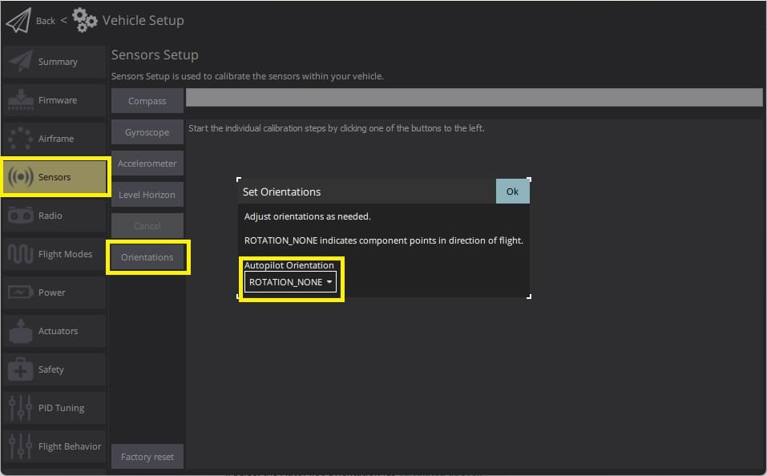
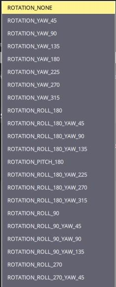

# Орієнтація політного контролера/датчика

За замовчуванням плату управління польотом та зовнішні компаси (якщо вони є) повинні бути розміщені на верхній стороні рами, орієнтовані так, щоб стрілка вказувала вперед транспортного засобу. Якщо плата або будь-які зовнішні компаси встановлені в іншому положенні, вам потрібно буде налаштувати це в програмному забезпеченні.

## Обчислення Орієнтації

Зміщення ROLL, PITCH та/або YAW контролера польоту обчислюються відносно транспортного засобу навколо передньої (x), правої (y), внизу (z) вісей.

Вісі, навколо яких обертається, залишаються тими самими з одного кроку обертання до наступного. Таким чином, рамка для виконання обертання залишається нерухомою. Це також відомо як _зовнішнє обертання_.

Наприклад, транспортні засоби, показані нижче, мають обертання навколо вісі z (тобто лише руляція), що відповідає: `ROTATION_NONE`, `ROTATION_YAW_90`, `ROTATION_YAW_180`, `ROTATION_YAW_270`.

:::info Для набору фюзеляжу VTOL Tailsitter встановіть орієнтацію літака відповідно до його конфігурації з багатьма гвинтами (тобто відносно літака під час зльоту, зависання, посадки) для всіх калібрувань датчиків.

Вісь зазвичай відноситься до орієнтації транспортного засобу під час стабільного прямого польоту. Для отримання додаткової інформації дивіться [Основні поняття](../getting_started/px4_basic_concepts.md#heading-and-directions).
:::

## Налаштування орієнтації контролера польоту

Щоб встановити орієнтацію:

1. Запустіть _QGroundControl_ та підключіть транспортний засіб.
1. Виберіть **іконку "Q" > Налаштування транспортного засобу > Датчики** (бічна панель), щоб відкрити _Налаштування датчиків_.
1. Виберіть кнопку **Орієнтації**.

   

1. Виберіть **Орієнтацію Автопілота** (як [обчислено вище](#calculating-orientation)).

   

1. Натисніть **OK**.

:::info Ви можете використовувати [Калібрування горизонту рівня](../config/level_horizon_calibration.md) для компенсації невеликих відхилень в орієнтації контролера та вирівнювання горизонту у виді польоту.
:::

## Встановлення Орієнтації компаса

PX4 автоматично виявить орієнтацію компасу як частину [калібрування компасу](../config/compass.md) ([за замовчуванням](../advanced_config/parameter_reference.md#SENS_MAG_AUTOROT)) для будь-якої з [стандартних орієнтацій MAVLink](https://mavlink.io/en/messages/common.html#MAV_SENSOR_ORIENTATION) (вертикально та вперед, або будь-який кратний 45° зміщення в будь-якій вісі).

:::info Ви можете підтвердити, що автоматичне виявлення працює, подивившись на параметри [CAL_MAGn_ROT](../advanced_config/parameter_reference.md#CAL_MAG0_ROT).
:::

Якщо було використано нестандартну орієнтацію, вам потрібно задати параметри [CAL_MAGx_ROLL](../advanced_config/parameter_reference.md#CAL_MAG0_ROLL), [CAL_MAGx_PITCH](../advanced_config/parameter_reference.md#CAL_MAG0_PITCH) та [CAL_MAGx_YAW](../advanced_config/parameter_reference.md#CAL_MAG0_YAW) для кожного компасу на кути, які були використані.

Це автоматично встановить [CAL_MAGn_ROT](../advanced_config/parameter_reference.md#CAL_MAG0_ROT) на "власний кут Ейлера" та запобігає автоматичну калібрування для вибраного компасу (навіть якщо встановлено [SENS_MAG_AUTOROT](../advanced_config/parameter_reference.md#SENS_MAG_AUTOROT)).

## Детальна інформація

- [Розширена настройка орієнтації](../advanced_config/advanced_flight_controller_orientation_leveling.md) (лише для досвідчених користувачів).
- [Посібник користувача з QGroundControl > Датчики](https://docs.qgroundcontrol.com/master/en/qgc-user-guide/setup_view/sensors_px4.html#flight_controller_orientation)
