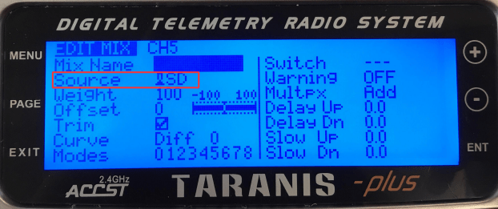

# Налаштування режиму польоту

Ця тема пояснює, як зробити карту [режимів польоту](../getting_started/px4_basic_concepts.md#flight-modes) та інших функцій на вашому радіопульті передачі.

:::tip
Для налаштування режимів польоту вам вже потрібно мати:
- [Налаштоване радіо](../config/radio.md)
- [Налаштуйте ваш передавач](#rc-transmitter-setup) для кодування фізичних позицій ваших перемикачів режиму в один канал. Ми надаємо приклади для популярного *Taranis* передавача [нижче](#taranis-setup-3-way-switch-configuration-for-single-channel-mode) (перевірте вашу документацію, якщо ви використовуєте інший передавач). :::

## Які режими польоту та перемикачі я повинен встановити?

Режими польоту надають різні типи *польоту з пілотом-автопілотом* та *повністю автономний польот*. Ви можете встановити будь-який (або жоден) з режимів польоту [доступних для вашого транспортного засобу](../flight_modes/index.md#flight-modes).

Більшість користувачів повинні встановити наступні режими та функції, оскільки вони роблять літак більш легким та безпечним у польоті:

- **Режим позиції** — Найлегший і найбезпечніший режим для ручного польоту.
- **Режим повернення** — Повернення до позиції вильоту безпечним шляхом та посадка.
- (тільки VTOL) **Перемикач переходу VTOL** — Перемикання між фіксованим крилом та багатокоптерною конфігурацією польоту на повітряних транспортних засобах VTOL.

Також звичайно відображати перемикачі на:

- **Режим місії** — Цей режим виконує попередньо запрограмовану місію, відправлену наземною станцією керування.
-  [Вимикач аварійного вимкнення](../config/safety.md#kill-switch) - Негайно зупиняє всі вихідні сигнали двигуна (літак розбиватиметься, що в деяких випадках може бути більш бажаним, ніж дозволити йому продовжувати польот).

## Вибір режиму польоту

PX4 дозволяє вам вказати канал "режиму" та вибрати до 6 режимів польоту, які будуть активовані на основі значення ШШІ каналу. Ви також можете окремо вказати канали для відображення режиму аварійного вимкнення, режиму повернення до старту та режиму польоту за межами.

Для налаштування вибору режиму польоту з одним каналом:

1. Запустіть *QGroundControl* та підключіть транспортний засіб.
1. Увімкніть ваш передавач RC.
1. Виберіть **іконку "Q" >   Налаштування транспортного засобу >   Режими польоту** (бічна панель), щоб відкрити _Налаштування режимів польоту_.

   

1. Вкажіть Налаштування *Режиму польоту*:
   * Виберіть канал режиму (**Режим каналу**) (вище показано як Канал 5, але це залежить від конфігурації вашого передавача).
   * Перемістіть перемикач передавача (або перемикачі), які ви налаштували для вибору режиму, через доступні позиції. Режим слоту, який відповідає поточному положенню перемикача, буде підсвічений (вище цього - *Режим польоту 1*). :::info
Поки ви можете встановити режими польоту в будь-якому з 6 слотів, тільки канали, які відображені на позиціях перемикачів, будуть підсвічені/використовуватися.
:::
   * Виберіть режим польоту, який ви хочете активувати для кожного положення перемикача.
1. Вкажіть *налаштування перемикача*:
   * Виберіть канали, які ви хочете відобразити на конкретні дії - наприклад: *Режим повернення*, *Вимикач вимкнення*, *Оффбордний* режим і т.д. (якщо у вас є запасні перемикачі та канали на вашому передавачі).

1. Перевірте, що режими відображаються на правильні перемикачі передавача:
   * Перевірте *Монітор каналу*, щоб підтвердити, що очікуваний канал змінюється кожним перемикачем.
   * У свою чергу виберіть кожен режим перемикання на передавача, і перевірте, чи активований бажаний режим польоту (текст стає жовтим на *QGroundControl* для активного режиму).

Усі значення автоматично зберігаються після зміни.

## Налаштування радіопередавача

Цей розділ містить невелику кількість можливих налаштувань для таранісу. QGroundControl _може_ мати [інформацію щодо налаштування для інших передавачів тут](https://docs.qgroundcontrol.com/master/en/qgc-user-guide/setup_view/flight_modes.html#transmitter-setup).

### Налаштування Taranis: Конфігурація перемикача 3-х позицій для одноканального режиму

Якщо вам потрібно підтримувати вибір лише між двома або трьома режимами, то ви можете відобразити режими на позиції одного 3-позиційного перемикача. Нижче ми показуємо, як зіставити перемикач "SD" Taranis 3-way з каналом 5.

:::info У цьому прикладі показано, як налаштувати популярний передавач *FrSky Taranis*. Налаштування передавача буде відрізнятися на інших передавачах. :::

Відкрийте інтерфейс Taranis UI **MIXER** і прокрутіть вниз до **CH5**, як показано нижче:

Натисніть **ENT(ER)**, щоб відредагувати конфігурацію **CH5**, а потім змініть **Джерело** на кнопку *SD*.

Ось і все! Канал 5 тепер виведе 3 різні значення ШІМ для трьох різних позицій перемикача **SD**.

Конфігурація *QGroundControl* потім виконується як описано в попередньому розділі.

### Налаштування Taranis: Конфігурація багато перемикачів для одноканального режиму

Більшість передавачів не мають перемикачів на 6 позицій, тому якщо вам потрібно мати можливість підтримувати більше режимів, ніж кількість доступних позицій перемикачів (до 6), то вам доведеться представляти їх за допомогою кількох перемикачів. Зазвичай це робиться шляхом кодування позицій перемикача 2- та 3-позицій в один канал, так що кожна позиція перемикача призводить до різного значення ШІМ.

На FrSky Taranis цей процес включає в себе призначення "логічного перемикача" для кожної комбінації положень двох реальних перемикачів. Кожний логічний перемикач потім призначається для різних значень ШІМ на тому ж каналі.

Відео нижче показує, як це робиться з передавачем *FrSky Taranis*.<!-- \[youtube\](https://youtu.be/scqO7vbH2jo) Video has gone private and is no longer available --><!-- @\[youtube\](https://youtu.be/BNzeVGD8IZI?t=427) - video showing how to set the QGC side - at about 7mins and 3 secs -->@[youtube](https://youtu.be/TFEjEQZqdVA)

Конфігурація *QGroundControl* потім виконується [як описано вище](#flight-mode-selection).

## Детальна інформація

* [Огляд режимів польоту](../flight_modes/index.md)
* [QGroundControl > Режими польотів](https://docs.qgroundcontrol.com/master/en/qgc-user-guide/setup_view/flight_modes.html#px4-pro-flight-mode-setup)
* [Відео налаштування PX4 - @6m53s](https://youtu.be/91VGmdSlbo4?t=6m53s) (Youtube)
* [Параметри радіоперемикача](../advanced_config/parameter_reference.md#radio-switches) - Можна використовувати для встановлення відображень через параметри
