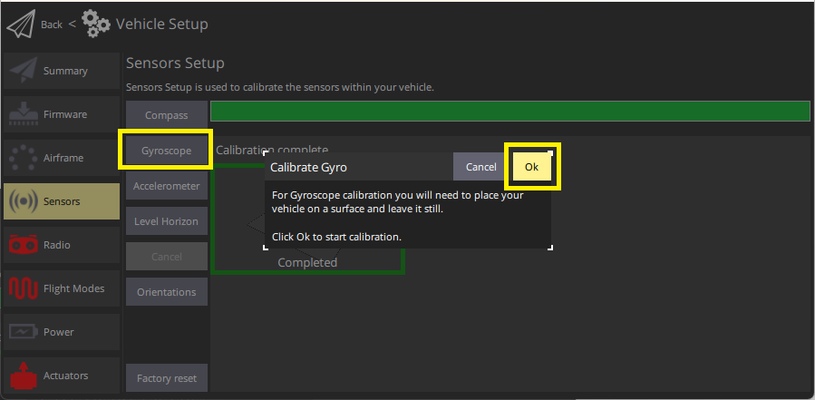
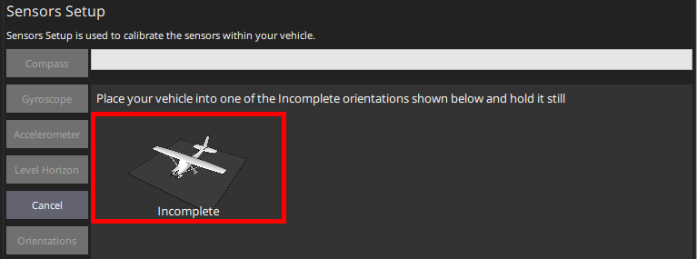
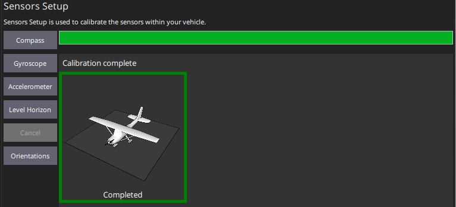

# Калібрування гіроскопа

_QGroundControl_ настановить вас розмістити транспортний засіб на рівній поверхні та утримувати його нерухомим.

## Виконання калібрування

Калібрування включає наступні кроки:

1. Запустіть _QGroundControl_ та підключіть транспортний засіб.
1. Виберіть **іконку "Q" > Налаштування транспортного засобу > Датчики** (бічна панель), щоб відкрити _Налаштування датчиків_.
1. Натисніть кнопку датчика  **Gyroscope** .

   

1. Розмістіть транспортний засіб на поверхні та залиште його нерухомим.
1. Клацніть **Ok**, щоб розпочати калібрування.

   Смуга у верхній частині показує прогрес:

   

1. Коли завершиться, _QGroundControl_ відображатиме смугу прогресу _Калібрування завершено_ 

:::info Якщо ви перемістите транспортний засіб, _QGroundControl_ автоматично перезапустить калібрування гіроскопа.
:::

## Подальша інформація

- [Посібник користувача з QGroundControl > Гіроскоп](https://docs.qgroundcontrol.com/master/en/qgc-user-guide/setup_view/sensors_px4.html#gyroscope)
