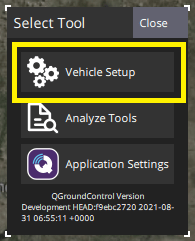

# Стандартні налаштування

У цьому розділі описано загальну конфігурацію програмного забезпечення та калібрування, необхідні для більшості пристроїв PX4.

Спочатку потрібно [ завантажити прошивку і вибрати каркас/тип вашого апарату](#firmware-vehicle-selection). Більшість інших кроків можна виконувати у довільному порядку, за винятком [налаштування](#tuning), яке має бути виконано в кінці.

## Попередні вимоги

Перед початком роботи вам слід [завантажити QGroundControl](http://qgroundcontrol.com/downloads/) і встановити його на ваш **робочий** комп'ютер. Потім відкрийте меню програми QGC (піктограма "Q" у верхньому лівому куті) і виберіть **Vehicle Setup** у спливаючому вікні _Select Tool_:

## Етапи конфігурації

### Вибір прошивки/апарату

- [Завантаження прошивки](../config/firmware.md)
- [Вибір апарату (каркасу)](../config/airframe.md)

### Налаштування двигуна/приводу

- [Калібрування ESC (плати контролю двигунів)](../advanced_config/esc_calibration.md)
- [Конфігурація та тестування приводу](../config/actuators.md)

### Калібрування датчика

- [Орієнтація сенсорів](../config/flight_controller_orientation.md)
- [Компас](../config/compass.md)
- [Гіроскоп](../config/gyroscope.md)
- [Акселерометр](../config/accelerometer.md)
- [Рівень горизонту](../config/level_horizon_calibration.md)
- Швидкість польоту (тільки для літаків / VTOL)

::: info Налаштування для цих та інших сенсорів знаходиться в [Апаратне забезпечення та налаштування сенсорів](../sensor/index.md).
:::

### Налаштування ручного керування

Радіоуправління:

- [Налаштування радіоконтролера (РК)](../config/radio.md)
- [Налаштування режиму польоту](../config/flight_mode.md)

Джойстик/Ґеймпад

- [Налаштування джойстика](../config/joystick.md)

### Налаштування безпеки

- [Battery Estimation Tuning](../config/battery.md) (requires [Power Module](../power_module/index.md))
- [Конфігурація безпеки (запобіжники)](../config/safety.md)

### Тюнінг

- [Autotune](../config/autotune.md) (Рекомендовано для апаратів та платформ, які підтримують цю функцію)

## Відеоінструкція

[youtube](https://youtu.be/91VGmdSlbo4)

@Якщо вам потрібна допомога з конфігурацією, ви можете звернутися за допомогою на форумі підтримки [QGroundControl](https://discuss.px4.io//c/qgroundcontrol/qgroundcontrol-usage).

## Підтримка

Якщо вам потрібна допомога з конфігурацією, ви можете звернутися за допомогою на форумі підтримки [QGroundControl](https://discuss.px4.io//c/qgroundcontrol/qgroundcontrol-usage).

## Дивіться також

- [QGroundControl > Налаштування](https://docs.qgroundcontrol.com/master/en/qgc-user-guide/setup_view/setup_view.html)
- [Периферія контролера польоту](../peripherals/README.md) - налаштування конкретних датчиків, опціональних датчиків, актуаторів тощо.
- [Розширена конфігурація](../advanced_config/README.md) - заводське калібрування/OEM, налаштування додаткових функцій, менш поширені конфігурації.
- Конфігурація/налаштування, що залежать від апарату:

  - [Конфігурація/налаштування мультикоптера](../config_mc/index.md)
  - [Конфігурація/налаштування гелікоптера](../config_heli/index.md)
  - [Конфігурація/налаштування літака (з нерухомим крилом)](../config_fw/index.md)
  - [Конфігурація/налаштування VTOL](../config_vtol/index.md)
