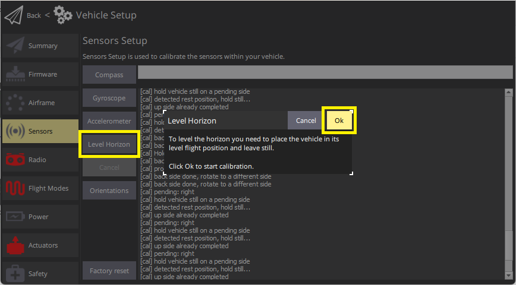

# Калібрування рівня горизонту

Ви можете використовувати _Калібрування горизонту рівня_ для компенсації невеликих відхилень в орієнтації контролера та вирівнювання горизонту у виді польоту _QGroundControl_ (синій зверху і зелений знизу).

:::tip
Виконання цього калібрування рекомендується лише у випадку, якщо орієнтація автопілота відкрито не відповідає вказаній орієнтації, або якщо є постійне відхилення під час польоту в режимах польоту, які не контролюють позицію.
:::

## Виконання калібрування

Вирівняти горизонт:

1. Запустіть _QGroundControl_ та підключіть транспортний засіб.
1. Виберіть піктограму **Шестерня** (Налаштування транспортного засобу) на верхній панелі і потім **Датчики** у бічній панелі.
1. Натисніть кнопку **Горизонт рівня**.  :::info Ви повинні вже встановити [Орієнтацію автопілота](../config/flight_controller_orientation.md). Якщо ні, ви також можете встановити це тут.
:::
1. Помістіть транспортний засіб на рівну відстань на рівній поверхні:

   - Для літаків це положення під час рівнопланового польоту (літаки мають тенденцію трохи підняти свої крила!)
   - Для коптерів це позиція утримання.

1. Натисніть **OK**, щоб розпочати процес калібрування.
1. Зачекайте, доки завершиться процес калібрування.

## Перевірка

Перевірте, що штучний горизонт, відображений у виді польоту, має показник посередині, коли транспортний засіб розміщений на рівній поверхні.

## Додаткова інформація

- [Розширена настройка орієнтації](../advanced_config/advanced_flight_controller_orientation_leveling.md) (лише для досвідчених користувачів).
- [QGroundControl Посібник користувача > Датчики](https://docs.qgroundcontrol.com/master/en/qgc-user-guide/setup_view/sensors_px4.html#level-horizon)
- [Відео налаштування PX4 "Гіроскоп" - @1m14s](https://youtu.be/91VGmdSlbo4?t=1m14s) (Youtube)
