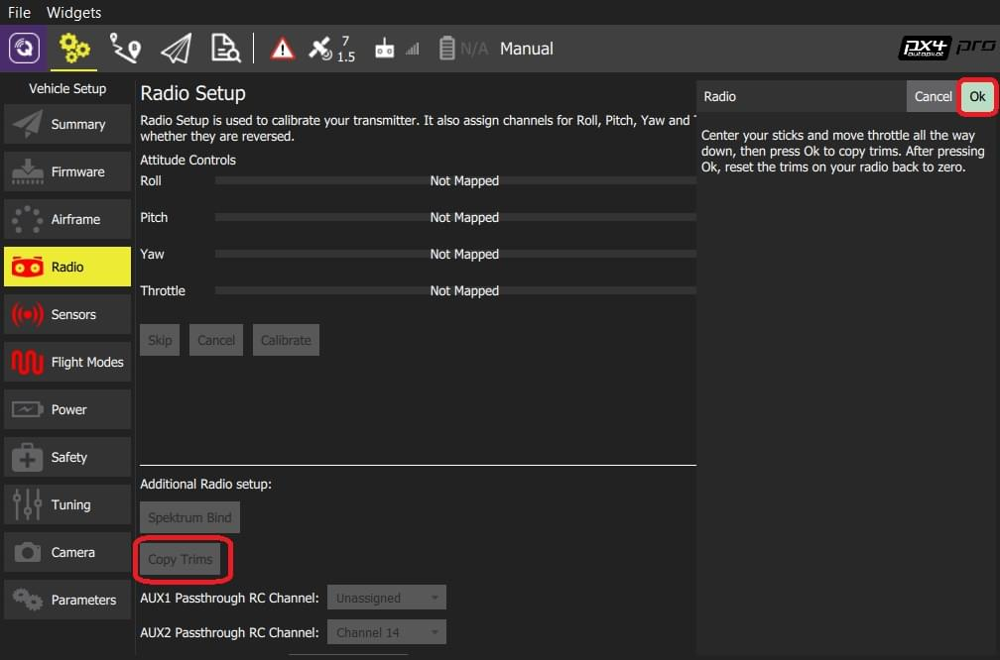

# Налаштування радіомодулів (RC)

Екран _Налаштування радіо_ використовується для налаштування відображення основних палиць керування атитудою вашого пульта керування RC (крен, тангаж, розворот, газ) на канали, та калібрування мінімальних, максимальних, обрізок та зворотніх налаштувань для всіх інших контролерів передавача / каналів RC.

:::info Можна використовувати [Джойстик](../config/joystick.md) замість RC для керування вручну. Параметр [COM_RC_IN_MODE](../advanced_config/parameter_reference.md#COM_RC_IN_MODE) [може бути встановлено](../advanced_config/parameters.md) для визначення, які види ручних контролерів увімкнені.
:::

## Прив'язка приймача

Щоб калібрувати радіосистему, слід підключити отримувач і передавач. Процес прив'язки пари передавача та приймача залежить від апаратного забезпечення (дивіться посібник користувача для інструкцій).

:::info Якщо ви використовуєте приймач _Spektrum_, ви можете встановити його у режим прив'язки за допомогою _QGroundControl_, як показано [нижче](#spectrum-bind).
:::

:::info Якщо ви використовуєте приймач _FrSky_, ви можете зв'язати його з передавачем, дотримуючись інструкцій [тут](https://www.youtube.com/watch?v=1IYg5mQdLVI).
:::

## Виявлення втрат RC

PX4 потрібно здати виявити, коли сигнал від пульта дистанційного керування був втрачено, щоб мати можливість прийняти [відповідні заходи безпеки](../config/safety.md#manual-control-loss-failsafe).

У RC приймачів є різні способи визначення втрати сигналу:

- Відсутній вивід (автоматично виявляється PX4)
- Виводиться низький рівень газу (можна налаштувати PX4 для виявлення цього).
- Виведіть останній отриманий сигнал (_не може бути виявлений PX4_, оскільки він виглядає як дійсний вхід).

Якщо ваш приймач RC не підтримує вихід сигналу при втраті RC, вам потрібно налаштувати його на встановлення газу в низьке положення, і встановити відповідне значення в [RC_FAILS_THR](../advanced_config/parameter_reference.md#RC_FAILS_THR).

Шлях до цього полягає в тому, щоб встановити обрізку пульта керування RC та палицю газу якомога нижче, і використовувати отримане значення ШШІ у PX4 та приймачі (прочитайте посібник з приймача, щоб визначити, як встановити значення втрат RC). Потім скиньте регулятор тримача педалі назад до його нормального положення. Цей процес забезпечує, що втрата RC значення знаходиться нижче мінімального значення, виведеного приймачем у нормальній роботі.

:::info
Не використовуйте приймач, який не може підтримувати один з двох підтримуваних методів виявлення втрат RC!
:::

## Виконання калібрування

Процес калібрування простий - вас попросять рухати палицями у певному порядку, який показаний на діаграмі передавача у верхньому правому куті екрана.

Для калібрування радіо:

1. Увімкніть ваш передавач RC.
1. Запустіть _QGroundControl_ та підключіть транспортний засіб.
1. Виберіть піктограму **Шестерня** (Налаштування транспортного засобу) на верхній панелі і потім **Radio** у бічній панелі.
1. Натисніть **OK**, щоб розпочати калібрування.

   

1. Встановіть радіокнопку [режим передавача](../getting_started/rc_transmitter_receiver.md#transmitter_modes), який відповідає вашому передавачу (це забезпечує, що _QGroundControl_ відображає правильне положення палиць, які вам слід дотримуватися під час калібрування).

   

1. Перемістіть палички в позиції, зазначені в тексті (і на зображенні передавача). Натисніть **Далі**, коли палички будуть у позиції. Повторіть для всіх позицій.
1. Коли вас попросять, перемістіть всі інші перемикачі та регулятори через їх повний діапазон (ви зможете спостерігати, як вони рухаються на _Моніторі каналу_).

1. Натисніть **Далі**, щоб зберегти налаштування.

Калібрування радіо демонструється у відео [налаштування автопілота](https://youtu.be/91VGmdSlbo4?t=4m30s) тут (youtube).

## Додаткове налаштування радіо

Крім калібрування ваших керуючих палиць та інших керувань передавачем, на цьому екрані є кілька додаткових параметрів налаштування радіо, які ви можете знайти корисними.

### Спектральний зв'язок

Щоб калібрувати радіосистему, слід підключити отримувач і передавач. Якщо у вас є приймач _Spektrum_, ви можете перевести його в режим _зв'язку_, використовуючи _QGroundControl_, як показано нижче (це може бути особливо корисним, якщо у вас немає легкого фізичного доступу до приймача на вашому транспортному засобі).

Для з'єднання передавача/приймача Spektrum:

1. Виберіть кнопку **Spektrum Bind**
1. Виберіть радіокнопку для вашого отримувача
1. Натисніть **OK**

   

1. Увімкніть ваш передавач Spektrum, утримуючи кнопку зв'язку.

### Копіювати обрізки

Цей параметр використовується для копіювання налаштувань ручного обрізання з вашого радіопередавача, щоб їх можна було автоматично застосовувати в автопілоті. Після цього вам потрібно буде видалити вручну встановлені обрізки.

:::info Налаштування обрізання використовуються для налаштування кочення, тангажу, ришту так, що коли ви центруєте палиці на пульті керування, ви отримуєте стабільний або рівний польот (у режимі стабілізованого польоту). Деякі пультів RC надають ручки обрізки, які дозволяють вам надати зміщення для значення, відправленого пультом RC для кожного положення палиці. Налаштування **Копіювання обрізів** тут переміщує зсуви у автопілот.
:::

Для копіювання обрізів:

1. Виберіть **Копіювати обрізки**.
1. Вирівняйте свої палиці і повністю опустіть ручку газу.
1. Натисніть **OK**.

   

1. Скиньте обрізки на вашому передавачі назад до нуля.

### Канали AUX Passthrough

Канали AUX passthrough дозволяють вам керувати довільними додатковими апаратними засобами з вашого передавача (наприклад, захват).

Для використання каналів AUX пропуску:

1. Відобразіть до 2 керувань передавачем на окремі канали.
1. Вкажіть ці канали для відображення на портах AUX1 та AUX2 відповідно, як показано нижче. Значення зберігаються на транспортний засіб, як тільки вони встановлені.

   

Контролер польоту передасть незмінені значення з вказаних каналів з AUX1/AUX2 до підключених сервоприводів/реле, які керують вашим обладнанням.

### Налаштування параметрів каналів

Налаштування каналів дозволяють вам відображати регулятор налаштування передавача на параметр (щоб ви могли динамічно змінювати параметр з вашого передавача).

:::tip
Ця функція надається для налаштування PID в польоті вручну: [Посібник з налаштування PID для багатокоптерів](../config_mc/pid_tuning_guide_multicopter.md), [Посібник з налаштування PID для фіксованих крил](../config_fw/pid_tuning_guide_fixedwing.md).
:::

Канали, які використовуються для налаштування параметрів, призначені у налаштуванні _Радіо_ (ось тут!), тоді як відображення кожного налаштувального каналу на його пов'язаний параметр визначено в _Редакторі параметрів_.

Для налаштування каналів налаштування:

1. Відобразіть до 3 керувань передавачем (регулятори або слайдери) на окремі канали.
1. Виберіть відображення _Ідентифікатора налаштування PARAM_ на радіочастотні канали, використовуючи списки вибору. Значення зберігаються на транспортний засіб, як тільки вони встановлені.

   

Для відображення каналу налаштування PARAM на параметр:

1. Відкрийте бічну панель **Параметри**.
1. Виберіть параметр для відображення на вашому передавачі (це відкриє _Редактор параметрів_).
1. Перевірте прапорець **Розширені налаштування**.
1. Клацніть кнопку **Встановити RC на Param...** (це викличе спливаюче діалогове вікно, відображене нижче)

   

1. Виберіть канал налаштування для відображення (1, 2 або 3) зі списку вибору _Ідентифікатора налаштування параметрів_.
1. Натисніть **OK**, щоб закрити діалогове вікно.
1. Натисніть **Зберегти**, щоб зберегти всі зміни та закрити _Редактор параметрів_.

:::tip
Ви можете очистити всі відображення параметрів/налаштувань каналів, вибравши меню **Інструменти > Очистити RC до Параметр** у верхньому правому куті екрану _Параметри_.
:::

## Подальша інформація

- [QGroundControl  >  Радіо керування](https://docs.qgroundcontrol.com/master/en/qgc-user-guide/setup_view/radio.html)
- [Відео налаштування PX4 - @4m30s](https://youtu.be/91VGmdSlbo4?t=4m30s) (Youtube)
- [Вибір RC системи](../getting_started/rc_transmitter_receiver.md) - Оберіть сумісну RC систему.
