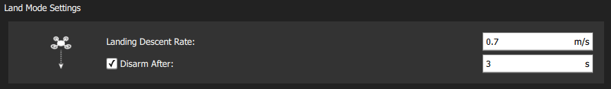

# Конфігурація безпеки (аварійні режими)

PX4 має кілька функцій безпеки для захисту та відновлення вашого транспортного засобу в разі виникнення проблем:

- _Аварійні режими_ дозволяють вам визначати зони та умови, за яких ви можете безпечно літати, і [дію](#failsafe-actions), яка буде виконана, якщо спрацює аварійний режим (наприклад, посадка, утримання позиції або повернення до вказаної точки). Найважливіші налаштування аварійних режимів конфігуруються на сторінці [Налаштування безпеки](#qgroundcontrol-safety-setup) в _QGroundControl_. Інші потрібно налаштовувати через [параметри](#other-safety-settings).
- [Перемикачі безпеки](#emergency-switches) на пульті дистанційного керування можуть використовуватися для негайного зупинення двигунів або повернення транспортного засобу у випадку проблеми.

## Дії аварійного режиму

Коли спрацьовує аварійний режим, типова поведінка (для більшості аварійних режимів) полягає в тому, що він входить у режим утримання протягом [COM_FAIL_ACT_T](../advanced_config/parameter_reference.md#COM_FAIL_ACT_T) секунд перед виконанням відповідної дії аварійного режиму. Це дає користувачу час помітити, що відбувається, і перевизначити аварійний режим, якщо це необхідно. У більшості випадків це можна зробити, використовуючи RC або GCS для перемикання режимів (зверніть увагу, що під час утримання аварійного режиму переміщення пультів RC не спричиняє перезапуску).

Нижче наведений список всіх дій аварійного режиму, впорядкованих за зростанням серйозності. Зверніть увагу, що різні типи аварійного режиму можуть не підтримувати всі ці дії.

| Дія                                                        | Опис                                                                                                                                                                                                                                                                                                                                                                           |
| ---------------------------------------------------------- | ------------------------------------------------------------------------------------------------------------------------------------------------------------------------------------------------------------------------------------------------------------------------------------------------------------------------------------------------------------------------------ |
| Немає/вимкнено                    | Немає дій Система аварійного відключення буде ігноруватися.                                                                                                                                                                                                                                                                                                                    |
| Застереження                      | Буде відправлено попереджувальне повідомлення (тобто до _QGroundControl_).                                                                                                                                                                                                                                                                                                     |
| Режим утримання                   | Транспортний засіб увійде у режим [Утримання (MC)](../flight_modes_mc/hold.md) або [Утримання (FW)](../flight_modes_fw/hold.md) та буде зависати або обертатися по колу відповідно. Літальні апарати VTOL будуть утримуватися відповідно до їх поточного режиму (MC/FW).                                                                                                       |
| [Режим повернення][return]        | Транспортний засіб увійде в режим _Повернення_. Поведінка повернення може бути встановлена в [Налаштування повернення додому](#return-mode-settings) (нижче).                                                                                                                                                                                                                  |
| Режими посадки                    | Транспортний засіб увійде в режим [Посадка (MC)](../flight_modes_mc/land.md) або [Посадка (FW)](../flight_modes_fw/land.md) та приземлиться. Спочатку VTOL перейде в режим MC.                                                                                                                                                                                                 |
| Знешкоджування                    | Зупиняє мотори негайно.                                                                                                                                                                                                                                                                                                                                                        |
| [Припинення польоту][flight_term] | Вимикає всі контролери та встановлює всі вихідні PWM значення на їхні значення аварійної безпеки (наприклад, [PWM_MAIN_FAILn][pwm_main_failn], [PWM_AUX_FAILn][pwm_main_failn]). Захисні виходи можуть бути використані для розгортання парашута, шасі або виконання іншої операції. Для літального апарату це може дозволити вам плавно спустити апарат у безпечне місце. |

Якщо спрацьовують декілька запобіжників, вживається більш сувора дія. Наприклад, якщо втрачені як RC, так і GPS, і втрата керування вручну встановлена в режим [Повернутися](#act_return), а втрата зв'язку з GCS встановлена в режим [Посадка](#act_land), виконується Посадка.

:::tip
Точна поведінка при спрацюванні різних захисних механізмів може бути протестована за допомогою [Симуляції Машини Стану Захисного Відключення](safety_simulation.md).
:::

## Налаштування безпеки QGroundControl

Сторінка налаштувань безпеки в _QGroundControl_ доступна за допомогою кліку на значок _QGroundControl_, вибору **Налаштування транспортного засобу**, а потім **Безпека** у бічній панелі. Це включає найважливіші налаштування аварійного режиму (батарея, втрата RC тощо) та налаштування спрацьованих дій _Повернення_ та _Посадка_.

### Аварійний режим в разі низького рівня заряду батареї

Аварійний режим при низькому заряді батареї спрацьовує, коли ємність батареї падає нижче одного (або кількох) значень рівня попередження.

Найпоширеніша конфігурація полягає в встановленні значень та дій, як описано вище (з `Попередження > Аварійний режим > Екстрена ситуація`). З такою конфігурацією аварійний режим спочатку викличе попередження, потім повернення, і, нарешті, посадку, якщо ємність впаде нижче відповідних рівнів.

Також можливо встановити _Дію аварійного режиму_ на попередження, повернення або посадку, коли досягнуто [Рівень аварійного режиму батареї](#BAT_CRIT_THR).

Налаштування та вибрані параметри показані нижче.

| Налаштування                                                          | Параметр                                                                       | Опис                                                                                                                                                                                                                         |
| --------------------------------------------------------------------- | ------------------------------------------------------------------------------ | ---------------------------------------------------------------------------------------------------------------------------------------------------------------------------------------------------------------------------- |
| Моделювання відмовостійкості                                          | [COM_LOW_BAT_ACT](../advanced_config/parameter_reference.md#COM_LOW_BAT_ACT) | Попередження, Повернення або Посадка, коли ємність падає нижче [рівня аварійного рівня акумулятора](#BAT_CRIT_THR), АБО Попередження, потім повернення, потім посадка на основі кожного з нижченаведених рівнів налаштувань. |
| Рівень попередження про низький заряд акумулятора                     | [BAT_LOW_THR](../advanced_config/parameter_reference.md#BAT_LOW_THR)         | Відсоткова ємність для попереджень (або інших дій).                                                                                                                                                                          |
| Надійний рівень заряду акумулятора становить | [BAT_CRIT_THR](../advanced_config/parameter_reference.md#BAT_CRIT_THR)       | Відсоткова ємність для дії Повернення (або інших дій, якщо вибрано одну дію).                                                                                                                                                |
| Критичний рівень батареї                                              | [BAT_EMERGEN_THR](../advanced_config/parameter_reference.md#BAT_EMERGEN_THR) | Відсоткова ємність для спрацьовування дії Land (негайно).                                                                                                                                                                    |

### Аварійний режим втрати ручного керування

Система автоматичного відключення керування може бути активована, якщо втрачено зв'язок з [передавачем RC](../getting_started/rc_transmitter_receiver.md) або [джойстиком](../config/joystick.md), і немає резервного варіанту. Якщо використовується [передавач RC](../getting_started/rc_transmitter_receiver.md), це спрацьовує, якщо втрачено зв'язок передавача [RC](../getting_started/rc_transmitter_receiver.md#set-signal-loss-behaviour). Якщо використовується [джойстики](../config/joystick.md), підключені через даний зв'язок MAVLink, це спрацьовує, якщо джойстики відключені або зв'язок даних втрачено.

:::info PX4 та приймач також можуть потребувати налаштування для виявлення втрати RC: _Radio Setup > Виявлення Втрати RC_.
:::

Інтерфейс безпеки QGCroundControl дозволяє вам встановити [дії аварійного режиму](#failsafe-actions) та [таймаут втрати RC](#COM_RC_LOSS_T). Користувачі, які хочуть вимкнути аварійний режим втрати зв'язку RC в конкретних автоматичних режимах (місія, утримання, офлайн), можуть зробити це, використовуючи параметр [COM_RCL_EXCEPT](#COM_RCL_EXCEPT).

Нижче наведено додаткові (і базові) налаштування параметрів.

| Параметр                                                                                               | Налаштування                                     | Опис                                                                                                                                                                                                                                                                                                                                                                                                                                             |
| ------------------------------------------------------------------------------------------------------ | ------------------------------------------------ | ------------------------------------------------------------------------------------------------------------------------------------------------------------------------------------------------------------------------------------------------------------------------------------------------------------------------------------------------------------------------------------------------------------------------------------------------ |
| [COM_RC_LOSS_T](../advanced_config/parameter_reference.md#COM_RC_LOSS_T)    | Аварійний режим втрати ручного керування Timeout | Час після отримання останньої встановленої точки від вибраного джерела керування вручну, після якого керування вважається втраченим. Це повинно бути коротким, оскільки транспортний засіб продовжуватиме літати за старими налаштуваннями керування вручну, поки не спрацює таймаут.                                                                                                                                                            |
| [COM_FAIL_ACT_T](../advanced_config/parameter_reference.md#COM_FAIL_ACT_T)  | Затримка відмови від дії                         | Затримка в секундах між виникненням умови аварійного режиму (`COM_RC_LOSS_T`) та аварійною дією (RTL, Land, Hold). У цьому стані транспортний засіб очікує в режимі утримання на повторне підключення джерела керування вручну. Це може бути встановлено довше для довгих польотів, щоб втрата інтермітентного з'єднання не викликала негайного виклику аварійного режиму. Це може бути рівним нулю, щоб аварійний запобіжник спрацював негайно. |
| [NAV_RCL_ACT](../advanced_config/parameter_reference.md#NAV_RCL_ACT)       | Дії аварійного режиму                            | Вимкнути, Блукати, Повернутися, Приземлитися, Роззброїти, Завершити.                                                                                                                                                                                                                                                                                                                                                                             |
| [COM_RCL_EXCEPT](../advanced_config/parameter_reference.md#COM_RCL_EXCEPT) | Виключення втрат RC                              | Встановіть режими, в яких втрата керування вручну ігнорується: Місія, Утримання, Offboard.                                                                                                                                                                                                                                                                                                                                                       |

### Втрата каналу зв'язку Failsafe

Збій втрати втрати даних посилання (при переході через телеметрію (підключення до наземної станції) втрачено.

Налаштування та вибрані параметри показані нижче.

| Налаштування                   | Параметр                                                                   | Опис                                                                  |
| ------------------------------ | -------------------------------------------------------------------------- | --------------------------------------------------------------------- |
| Тайм-аут втрати каналу зв'язку | [COM_DL_LOSS_T](../advanced_config/parameter_reference.md#COM_DL_LOSS_T) | Час після втрати з'єднання з даними перед тим, як спрацює запобіжник. |
| Дії аварійного режиму          | [NAV_DLL_ACT](../advanced_config/parameter_reference.md#NAV_DLL_ACT)     | Вимкнути, Hold mode, Return mode, Land mode, Роззброїти, Завершити.   |

### Аварійний режим "обмеження зони політів"

Аварійний режим "обмеження зони політів" спрацьовує, коли дрон перетинає "віртуальний" периметр. У найпростішій формі периметр налаштовується як циліндр, центрований навколо домашньої позиції. Якщо транспортний засіб виходить за межі радіуса або вище вказаної висоти, спрацьовує вказана _Дія аварійного режиму_.

:::tip PX4 окремо підтримує більш складні геофенси з багатьма довільними полігональними та круговими областями включення та виключення: [Політ > Геофенс](../flying/geofence.md).
:::

Налаштування та базові [параметри геозони](../advanced_config/parameter_reference.md#geofence) показані нижче.

| Налаштування            | Параметр                                                                       | Опис                                                            |
| ----------------------- | ------------------------------------------------------------------------------ | --------------------------------------------------------------- |
| Дії у випадку порушення | [GF_ACTION](../advanced_config/parameter_reference.md#GF_ACTION)               | None, Warning, Hold mode, Return mode, Terminate, Land.         |
| Максимальний радіус     | [GF_MAX_HOR_DIST](../advanced_config/parameter_reference.md#GF_MAX_HOR_DIST) | Horizontal radius of geofence cylinder. Geofence disabled if 0. |
| Макс. висота            | [GF_MAX_VER_DIST](../advanced_config/parameter_reference.md#GF_MAX_VER_DIST) | Height of geofence cylinder. Geofence disabled if 0.            |

:::info Встановлення `GF_ACTION` на terminate призведе до знищення транспортного засобу в разі порушення огорожі. Через вбудовану небезпеку ця функція вимкнена за допомогою [CBRK_FLIGHTTERM](#CBRK_FLIGHTTERM), яку потрібно скинути на 0, щоб дійсно вимкнути систему.
:::

Також застосовуються наступні налаштування, але вони не відображаються в інтерфейсі QGC.

| Налаштування                                                     | Параметр                                                                     | Опис                                                                                                                                                                     |
| ---------------------------------------------------------------- | ---------------------------------------------------------------------------- | ------------------------------------------------------------------------------------------------------------------------------------------------------------------------ |
| Geofence source                        | [GF_SOURCE](../advanced_config/parameter_reference.md#GF_SOURCE)             | Встановіть, чи джерело позиції є оціненою глобальною позицією або прямо з пристрою GPS.                                                                                  |
| Preemptive geofence triggering         | [GF_PREDICT](../advanced_config/parameter_reference.md#GF_PREDICT)           | (Експериментальний) Спрацьовувати геозону, якщо поточний рух транспортного засобу передбачає спрацьовування порушення (замість пізнього спрацьовування після порушення). |
| Circuit breaker for flight termination | [CBRK_FLIGHTTERM](../advanced_config/parameter_reference.md#CBRK_FLIGHTTERM) | Увімкнення/вимкнення дії припинення польоту (за замовчуванням вимкнено).                                                                                                 |

### Return Mode Settings

<!-- Propose replace section by a summary and links - return mode is complicated -->

_Повернення_ - це поширена [дія аварійного захисту](#failsafe-actions), яка включає [режим Повернення](../flight_modes/return.md) для повернення транспортного засобу до домашньої позиції. Цей розділ показує, як встановити поведінку землі/кругової розвідки після повернення.

Налаштування та базові параметри показані нижче:

| Налаштування                                | Параметр                                                                       | Опис                                                                                                                       |
| ------------------------------------------- | ------------------------------------------------------------------------------ | -------------------------------------------------------------------------------------------------------------------------- |
| Climb to altitude | [RTL_RETURN_ALT](../advanced_config/parameter_reference.md#RTL_RETURN_ALT)   | Транспортний засіб піднімається до цієї мінімальної висоти (якщо вона нижче) для повернення польоту.                       |
| Return behaviour                            |                                                                                | Список вибору _Повернення потім_: Земля, Кружляти і не сідати, або Кружляти і сісти після вказаного часу.                  |
| Loiter Altitude   | [RTL_DESCEND_ALT](../advanced_config/parameter_reference.md#RTL_DESCEND_ALT) | Якщо вибрано повернення з блуканням, ви також можете вказати висоту, на якій транспортний засіб утримується.               |
| Loiter Time       | [RTL_LAND_DELAY](../advanced_config/parameter_reference.md#RTL_LAND_DELAY)   | Якщо вибрано повернення з блуканням, тоді посадка, ви також можете вказати, як довго транспортний засіб буде утримуватися. |

:::info Поведінка повернення визначається за допомогою [RTL_LAND_DELAY](../advanced_config/parameter_reference.md#RTL_LAND_DELAY). Якщо від'ємно, транспортний засіб відразу приземлиться. Додаткову інформацію можна знайти в режимі [Повернення](../flight_modes/return.md).
:::

### Налаштування режиму землі

_Земля на поточній позиції_ є загальною [дією аварійного режиму](#failsafe-actions) (особливо для мультикоптерів), яка включає режим [Посадка](../flight_modes_mc/land.md). Цей розділ показує, як контролювати час та умови автоматичного розблокування транспортного засобу після посадки. Для багатоциліндрових літаків (тільки) ви можете додатково встановити швидкість спуску.

Налаштування та базові параметри показані нижче:

| Налаштування                   | Параметр                                                                       | Опис                                                                                                                                                 |
| ------------------------------ | ------------------------------------------------------------------------------ | ---------------------------------------------------------------------------------------------------------------------------------------------------- |
| Disarm After                   | [COM_DISARM_LAND](../advanced_config/parameter_reference.md#COM_DISARM_LAND) | Виберіть прапорець, щоб вказати, що транспортний засіб роззброїться після посадки. Значення повинно бути ненульовим, але може бути частиною секунди. |
| Landing Descent Rate (MC only) | [MPC_LAND_SPEED](../advanced_config/parameter_reference.md#MPC_LAND_SPEED)   | Швидкість спуску.                                                                                                                                    |

## Інші налаштування аварійного режиму

У цьому розділі міститься інформація про налаштування аварійних режимів, які не можуть бути сконфігуровані через сторінку [Налаштування безпеки](#qgroundcontrol-safety-setup) в _QGroundControl_.

### Аварійний режим втрати позиції (GPS)

Відключення позиції _втрати безпеки_ спрацьовує, якщо якість оцінки позиції PX4 падає нижче прийнятних рівнів (це може бути спричинено втратою GPS) під час режиму, який вимагає прийнятної оцінки позиції.

Дія невдачі контролюється за допомогою [COM_POSCTL_NAVL](../advanced_config/parameter_reference.md#COM_POSCTL_NAVL), залежно від того, чи припускається наявність керування RC (та інформації про висоту):

- `0`: Віддалений керування доступний. Перемкніться в режим _режиму висоти_, якщо є оцінка висоти, в іншому випадку _режим стабілізації_.
- `1`: Віддалений керування _не_ доступний. Перемкніться в режим _режиму спуску_, якщо є оцінка висоти, в іншому випадку введіть припинення польоту. _Режим спуску_ - це режим посадки, який не потребує оцінки позиції.

Літаки з фіксованими крилами та ВПП у фіксованому польоті додатково мають параметр ([FW_GPSF_LT](../advanced_config/parameter_reference.md#FW_GPSF_LT)), що визначає, як довго вони будуть чекати (обертаючись з постійним кутом крену ([FW_GPSF_R](../advanced_config/parameter_reference.md#FW_GPSF_R)) на поточній висоті), якщо втратили позицію, перед спробою посадки. Якщо VTOLs налаштовані на перехід у режим утримання для посадки ([NAV_FORCE_VT](../advanced_config/parameter_reference.md#NAV_FORCE_VT)), то вони спочатку перейдуть у цей режим, а потім опустяться.

Відповідні параметри для всіх транспортних засобів наведено нижче.

| Параметр                                                                                                   | Опис                                                                                                                                   |
| ---------------------------------------------------------------------------------------------------------- | -------------------------------------------------------------------------------------------------------------------------------------- |
| [COM_POS_FS_DELAY](../advanced_config/parameter_reference.md#COM_POS_FS_DELAY) | Затримка після втрати позиції перед спрацюванням аварійного режиму.                                                                    |
| [COM_POSCTL_NAVL](../advanced_config/parameter_reference.md#COM_POSCTL_NAVL)   | Відповідь на втрату навігації контролю позиції під час місії. Значення: 0 - припускати використання RC, 1 - Припустити відсутність RC. |

Параметри, які впливають лише на повітряні судна з фіксованим крилом:

| Параметр                                                                                       | Опис                                                                                                                    |
| ---------------------------------------------------------------------------------------------- | ----------------------------------------------------------------------------------------------------------------------- |
| [FW_GPSF_LT](../advanced_config/parameter_reference.md#FW_GPSF_LT) | Час простою (очікування відновлення GPS перед посадкою або припиненням польоту). Установіть значення 0 для відключення. |
| [FW_GPSF_R](../advanced_config/parameter_reference.md#FW_GPSF_R)   | Фіксований кут крену/кочення під час кілочення.                                                                         |

### Аварійний режим втрати управління з пульта

_Offboard Loss Failsafe_ спрацьовує, якщо втрачено зв'язок з платформою під час управління Offboard. Можна вказати різні дії аварійного режиму в залежності від наявності зв'язку з RC.

Відповідні параметри наведено нижче:

| Параметр                                                                     | Опис                                                                                                                           |
| ---------------------------------------------------------------------------- | ------------------------------------------------------------------------------------------------------------------------------ |
| [COM_OF_LOSS_T](../advanced_config/parameter_reference.md#COM_OF_LOSS_T)   | Затримка після втрати зовнішнього з'єднання перед спрацюванням запобіжника.                                                    |
| [COM_OBL_RC_ACT](../advanced_config/parameter_reference.md#COM_OBL_RC_ACT) | Запобіжна дія, якщо RC доступний: Режим позиції, Режим висоти, Ручний режим, Режим повернення, Режим посадки, Режим утримання. |

### Перевірки можливості місії

Здійснюється ряд перевірок, щоб забезпечити, що місію можна розпочати лише у випадку, якщо вона _реалізовна_. Наприклад, перевірки забезпечують, що перший пункт маршруту не занадто віддалений, і що маршрут місії не конфліктує з жодними геозахистами.

Оскільки ці не є строго кажучи "запобіжними заходами", вони документовані у [Режим місії (FW) > Перевірка можливості виконання місії](../flight_modes_fw/mission.md#mission-feasibility-checks) та [Режим місії (MC) > Перевірка можливості виконання місії](../flight_modes_mc/mission.md#mission-feasibility-checks).

### Аварійний режим уникнення трафіку

Аварійний режим уникнення трафіку дозволяє PX4 реагувати на дані від транспондерів (наприклад, від [ADS-B транспондерів](../advanced_features/traffic_avoidance_adsb.md)) під час місій.

Відповідні параметри наведено нижче:

| Параметр                                                                       | Опис                                                                                       |
| ------------------------------------------------------------------------------ | ------------------------------------------------------------------------------------------ |
| [NAV_TRAFF_AVOID](../advanced_config/parameter_reference.md#NAV_TRAFF_AVOID) | Встановіть дію аварійного режиму: Вимкнено, Попередження, Режим повернення, Режим посадки. |

### Запобіжник Quad-chute

Аварійний режим для випадку, коли БЛА типу VTOL більше не може летіти у режимі фіксованого крила, наприклад, через відмову тягового мотора, датчика швидкості повітря або керованої поверхні. Якщо спрацьовує аварійний режим, транспортний засіб негайно перейде у режим багтороторного літання і виконає дію, визначену у параметрі [COM_QC_ACT](#COM_QC_ACT).

:::info Quad-chute також може бути спрацьована відправленням повідомлення MAVLINK [MAV_CMD_DO_VTOL_TRANSITION](https://mavlink.io/en/messages/common.html#MAV_CMD_DO_VTOL_TRANSITION) з параметром `param2`, встановленим на `1`.
:::

Параметри, які контролюють те, коли спрацює квадро-шнур, перераховані в таблиці нижче.

| Параметр                                                                                                     | Опис                                                                                                                                                                                                                                                                                                                                                                                                                                                                                                                                                                                                                                                                                                                                                                                                                              |
| ------------------------------------------------------------------------------------------------------------ | --------------------------------------------------------------------------------------------------------------------------------------------------------------------------------------------------------------------------------------------------------------------------------------------------------------------------------------------------------------------------------------------------------------------------------------------------------------------------------------------------------------------------------------------------------------------------------------------------------------------------------------------------------------------------------------------------------------------------------------------------------------------------------------------------------------------------------- |
| [COM_QC_ACT](../advanced_config/parameter_reference.md#COM_QC_ACT)               | Дія чотирьох канатів після переходу на польот на багатокоптер. Може бути встановлено на: [Попередження](#act_warn), [Повернення](#act_return), [Посадка](#act_land), [Утримання](#act_hold).                                                                                                                                                                                                                                                                                                                                                                                                                                                                                                                                                                                                                                      |
| [VT_FW_QC_HMAX](../advanced_config/parameter_reference.md#VT_FW_QC_HMAX)         | Максимальна висота квадрокута, нижче якої не спрацьовує аварійний відпуск квадрокута. Це запобігає швидкому спуску квадрокутника на велику висоту, що може розрядити батарею (і саме це може спричинити крах). Висота є відносною до землі, дому або місцевого походження (за вподобанням, в залежності від доступності).                                                                                                                                                                                                                                                                                                                                                                                                                                                                                                         |
| [VT_QC_ALT_LOSS](../advanced_config/parameter_reference.md#VT_QC_ALT_LOSS)       | Поріг висоти аварійного спуску з чотирма парашутами.  У режимах керування висотою, таких як [Режим утримання](../flight_modes_fw/hold.md), [Режим позиції](../flight_modes_fw/position.md), [Режим висоти](../flight_modes_fw/altitude.md), або [Режим місії](../flight_modes_fw/mission.md), транспортний засіб повинен відстежувати свою поточну "командовану" висотну точку встановлення. Запускається аварійний парашут у випадку, якщо транспортний засіб падає надто далеко нижче заданої точки (на величину, визначену в цьому параметрі).  Зверніть увагу, що аварійний парашут запускається лише у випадку, якщо транспортний засіб постійно втрачає висоту нижче заданої точки; він не запускається, якщо задана точка висоти зростає швидше, ніж може рухатися транспортний засіб. |
| [VT_QC_T_ALT_LOSS](../advanced_config/parameter_reference.md#VT_QC_T_ALT_LOSS) | Поріг втрати висоти для спрацьовування квадропарашута під час переходу VTOL до польоту на фіксованому крилі. Quad-chute спрацьовує, якщо транспортний засіб падає на таку висоту нижче своєї початкової висоти перед завершенням переходу.                                                                                                                                                                                                                                                                                                                                                                                                                                                                                                                                                                                        |
| [VT_FW_MIN_ALT](../advanced_config/parameter_reference.md#VT_FW_MIN_ALT)         | Мінімальна висота над домашнім місцем для польотів на фіксованих крилах. Коли висота падає нижче цієї величини під час польоту на фіксованому крилі, тригерується квадрокупол.                                                                                                                                                                                                                                                                                                                                                                                                                                                                                                                                                                                                                                                    |
| [VT_FW_QC_R](../advanced_config/parameter_reference.md#VT_FW_QC_R)               | Абсолютний поріг обертання для спрацьовування квадро-шнура в режимі FW.                                                                                                                                                                                                                                                                                                                                                                                                                                                                                                                                                                                                                                                                                                                                                           |
| [VT_FW_QC_P](../advanced_config/parameter_reference.md#VT_FW_QC_P)               | Абсолютний поріг чутливості для виклику квадро-шлюзу у режимі FW.                                                                                                                                                                                                                                                                                                                                                                                                                                                                                                                                                                                                                                                                                                                                                                 |

## Виявлення відмов

Детектор відмов дозволяє автомобілю вжити захисних заходів, якщо він несподівано перевертається, або якщо йому повідомлено зовнішньою системою виявлення відмов.

Під час **польоту**, детектор відмов може бути використаний для спрацювання [припинення польоту](../advanced_config/flight_termination.md), якщо відбулися умови відмови, що може запустити [парашут](../peripherals/parachute.md) або виконати іншу дію.

:::info Виявлення відмови під час польоту за замовчуванням вимкнено (увімкніть, встановивши параметр: [CBRK_FLIGHTTERM=0](#CBRK_FLIGHTTERM)).
:::

Під час **зльоту** детектор відмов [тригер атитюди](#attitude-trigger) викликає дію [вимкнення](#act_disarm), якщо транспортний засіб перекочується (вимкнення вимикає двигуни, але, на відміну від припинення польоту, не запускає парашут або виконує інші дії при відмові). Зверніть увагу, що ця перевірка _завжди увімкнена при зльоті_, незалежно від параметра `CBRK_FLIGHTTERM`.

Детектор відмов активний для всіх типів транспортних засобів і режимів, за винятком тих, де передбачається, що транспортний засіб _очікується_ робити оберти (тобто [Режим Acro (MC)](../flight_modes_mc/altitude.md), [Режим Acro (FW)](../flight_modes_fw/altitude.md) та [Ручний (FW)](../flight_modes_fw/manual.md)).

### Тригер висоти

Детектор відмов може бути налаштований на спрацьовування, якщо стан автомобіля перевищує попередньо визначені значення крена та кочення протягом певного часу.

Відповідні параметри наведено нижче:

| Параметр                                                                                               | Опис                                                                                                                              |
| ------------------------------------------------------------------------------------------------------ | --------------------------------------------------------------------------------------------------------------------------------- |
| [CBRK_FLIGHTTERM](../advanced_config/parameter_reference.md#CBRK_FLIGHTTERM) | Вимикач відключення польоту. Скасуйте з 121212 (типово), щоб увімкнути завершення польоту через виявлення відмови або втрату FMU. |
| [FD_FAIL_P](../advanced_config/parameter_reference.md#FD_FAIL_P)           | Максимальний допустимий кут нахилу (в градусах).                                                                                  |
| [FD_FAIL_R](../advanced_config/parameter_reference.md#FD_FAIL_R)           | Максимальний допустимий кут крену (в градусах).                                                                                   |
| [FD_FAIL_P_TTRI](../advanced_config/parameter_reference.md#FD_FAIL_P_TTRI) | Час перевищення [FD_FAIL_P](#FD_FAIL_P) для виявлення відмов (за замовчуванням 0,3 с).                                          |
| [FD_FAIL_R_TTRI](../advanced_config/parameter_reference.md#FD_FAIL_R_TTRI) | Час, щоб перевищити [FD_FAIL_R](#FD_FAIL_R) для виявлення відмов (типово 0.3 с).                                                |

### Зовнішня автоматична система тригерування (ATS)

Якщо [виявник відмов](#failure-detector) [увімкнено](#CBRK_FLIGHTTERM), його також може спрацювати зовнішня система ATS. Зовнішня система тригера повинна бути підключена до порту керування польотом AUX5 (або MAIN5 на платах, які не мають додаткових портів), і налаштовується за допомогою наведених нижче параметрів.

:::info Зовнішній ATS потрібен згідно з [ASTM F3322-18](https://webstore.ansi.org/Standards/ASTM/ASTMF332218). Один приклад пристрою ATS - це [FruityChutes Sentinel Automatic Trigger System](https://fruitychutes.com/uav_rpv_drone_recovery_parachutes/sentinel-automatic-trigger-system.htm).
:::

| Параметр                                                                                                 | Опис                                                                                                                                                                              |
| -------------------------------------------------------------------------------------------------------- | --------------------------------------------------------------------------------------------------------------------------------------------------------------------------------- |
| [FD_EXT_ATS_EN](../advanced_config/parameter_reference.md#FD_EXT_ATS_EN)     | Увімкніть введення ШІМ на AUX5 або MAIN5 (в залежності від плати) для активації аварійного режиму зовнішньою автоматичною системою спрацювання (ATS). За замовчуванням: Вимкнено. |
| [FD_EXT_ATS_TRIG](../advanced_config/parameter_reference.md#FD_EXT_ATS_TRIG) | Поріг ШІМ для зовнішньої системи автоматичного спрацювання аварійного режиму. Значення за замовчуванням: 1900 мс.                                                                 |

## Перемикачі екстренного виклику

Пультові перемикачі можуть бути налаштовані (як частина налаштувань _QGroundControl_ [Режиму польоту](../config/flight_mode.md)) для того, щоб ви могли швидко вжити корекційних дій у разі проблеми або екстренної ситуації; наприклад, для зупинки всіх моторів або активації режиму [Повернення](#return-switch).

Цей розділ перелічує доступні аварійні вимикачі.

### Перемикач вимкнення

Кнопка "вимкнення" негайно припиняє всі виходи мотора (і, якщо транспортний засіб у повітрі, він почне падати)! Мотори будуть перезапускатися, якщо перемикач буде повернуто назад протягом 5 секунд. Після 5 секунд транспортний засіб автоматично вимкнеться; вам потрібно буде знову ввімкнути його для запуску моторів.

### Перемикач увімкнення/вимкнення

Перемикач увімкнення / вимкнення є _прямим замінником_ для типового механізму увімкнення / вимкнення на палиці (та виконує ту ж функцію: переконується, що перед запуском / зупинкою двигунів є умисний крок). Це може бути використано замість механізму за замовчуванням через те, що:

- Про перевагу перемикача над палицею.
- Це допомагає уникнути випадкового спрацьовування озброєння/роззброєння у повітрі за певним рухом палиці.
- Немає затримки (він реагує миттєво).

Перемикач увімкнення/вимкнення негайно вимикає (зупиняє) мотори для тих [режимів польоту](../flight_modes/README.md#flight-modes), які _підтримують вимикання в повітрі_. Це включає:

- _Ручний режим_
- _Acro mode_
- _Стабілізований_

Для режимів, які не підтримують вимикання в повітрі, перемикач ігнорується під час польоту, але може бути використаний після виявлення посадки. Це включає режим позиціонування та автономні режими (наприклад, місію, посадку і т. д.).

:::note
Часові обмеження автоматичного вимкнення (наприклад, через параметр [COM_DISARM_LAND](#COM_DISARM_LAND)) незалежні від перемикача увімкнення/вимкнення - іншими словами, навіть якщо перемикач увімкнений, часові обмеження все одно працюватимуть.
:::

<!--
**Note** This can also be done by [manually setting](../advanced_config/parameters.md) the [RC_MAP_ARM_SW](../advanced_config/parameter_reference.md#RC_MAP_ARM_SW) parameter to the corresponding switch RC channel.
  If the switch positions are reversed, change the sign of the parameter [RC_ARMSWITCH_TH](../advanced_config/parameter_reference.md#RC_ARMSWITCH_TH) (or also change its value to alter the threshold value).
-->

### Перемикач повернення

Повернення перемикач може бути використаний для негайного ввімкнення режиму [Повернення](../flight_modes/return.md).

## Інші налаштування безпеки

### Таймаути автоматичного вимкнення

Ви можете встановити таймаути для автоматичного вимкнення транспортного засобу, якщо він занадто повільно збирається на зліт і/або після посадки (вимкнення транспортного засобу вимикає живлення моторів, тому пропелери не будуть обертатися).

Відповідні параметри наведено нижче:

| Параметр                                                                                                   | Опис                                                       |
| ---------------------------------------------------------------------------------------------------------- | ---------------------------------------------------------- |
| [COM_DISARM_LAND](../advanced_config/parameter_reference.md#COM_DISARM_LAND)   | Timeout for auto-disarm after landing.                     |
| [COM_DISARM_PRFLT](../advanced_config/parameter_reference.md#COM_DISARM_PRFLT) | Timeout for auto disarm if vehicle is too slow to takeoff. |

## Додаткова інформація

- [Посібник користувача з QGroundControl > Налаштування безпеки](https://docs.qgroundcontrol.com/master/en/qgc-user-guide/setup_view/safety.html)

[flight_term]: ../advanced_config/flight_termination.md
[return]: ../flight_modes/return.md
[pwm_main_failn]: ../advanced_config/parameter_reference.md#PWM_MAIN_FAIL1
[pwm_main_failn]: ../advanced_config/parameter_reference.md#PWM_MAIN_FAIL1
