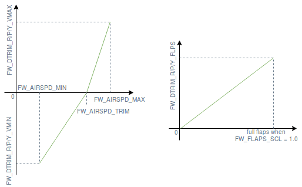

# Fixed-Wing Trimming Guide

Стрічки використовуються для калібрування керуючих поверхонь в умовах обрізання (відносна швидкість повітря, густина повітря, кут атаки, конфігурація літака тощо). Правильно обрізаний літак, що летить в умовах обтримування, буде утримувати свою позицію без потреби в будь-яких керувальних сигналах від пілота або стабілізуючого комп'ютера.

Загальна авіація, комерційні та великі безпілотні літаки налаштовують свої керуючі поверхні за допомогою [трім-вкладок](https://en.wikipedia.org/wiki/Trim_tab), тоді як малі БПЛА просто додають зсув до виконавчого пристрою керуючої поверхні.

Розділ [Базове вирізання](#basic-trimming) пояснює призначення кожного параметра вирізання та як знайти правильне значення. Розділ [Розширене вирівнювання](#advanced-trimming) представляє параметри, які можуть бути встановлені для автоматичного налаштування вирівнювання на основі виміряної швидкості повітря та позиції закрилок.

## Основна обрізка

Існують кілька параметрів, які оператор може бажати використовувати для належного обрізання літака з фіксованим крилом. Огляд цих параметрів та їх використання показано нижче:

- [RCx_TRIM](../advanced_config/parameter_reference.md#RC1_TRIM) applies trim to the signal received from the RC transmitter. These parameters are set automatically during [RC calibration](../config/radio.md).
- [CA_SV_CSx_TRIM](../advanced_config/parameter_reference.md#CA_SV_CS0_TRIM) applies trim to a control surfaces channel. These are used to finely align the control surfaces to default angles before flying.
- [FW_PSP_OFF](../advanced_config/parameter_reference.md#FW_PSP_OFF) applies an offset to the pitch setpoint. This is used to set the angle of attack at which your aircraft needs to fly at cruise speed.
- [FW_AIRSPD_TRIM](../advanced_config/parameter_reference.md#FW_AIRSPD_TRIM) is used by the rate controllers to scale their output depending on the measured airspeed. See [Airspeed Scaling](../flight_stack/controller_diagrams.md#airspeed-scaling) for more details.
- [TRIM_ROLL](../advanced_config/parameter_reference.md#TRIM_ROLL), [TRIM_PITCH](../advanced_config/parameter_reference.md#TRIM_PITCH) and [TRIM_YAW](../advanced_config/parameter_reference.md#TRIM_YAW) apply trim to the control signals _before_ mixing. For example, if you have two servos for the elevator, `TRIM_PITCH` applies trim to both of them. These are used when your control surfaces are aligned but the aircraft pitches/rolls/yaws up/down/left/right during manual (not stabilized) flight or if the control signal has a constant offset during stabilized flight.

The correct order to set the above parameters is:

1. Обріжте сервоприводи, фізично налаштувавши довжини зв'язок, якщо це можливо, і відрегулюйте, обрізавши канали ШІМ (використовуйте `PWM_MAIN/AUX_TRIMx`) на верстаті, щоб належним чином встановити керуючі поверхні у їх теоретичне положення.
1. Літайте в стабілізованому режимі з крейсерською швидкістю та встановіть зміщення заданої точки вхідного кута атаки (`FW_PSP_OFF`) на бажаний кут атаки. Необхідний кут атаки при крейсерській швидкості відповідає куту крена, який потрібно літаку летіти, щоб утримати постійну висоту під час польоту з вирівняним крилом. Якщо ви використовуєте датчик швидкості повітря, також встановіть правильну крейсерську швидкість (`FW_AIRSPD_TRIM`).
1. Подивіться на керування приводом у файлі журналу (завантажте його на [Flight Review](https://logs.px4.io) та перевірте графік керування приводом (_Actuator Controls_) на приклад) та встановіть трансцендентний кут (`TRIM_PITCH`). Встановіть це значення на середнє зміщення сигналу тану під час польоту на рівні крила.

Крок 3 можна виконати перед кроком 2, якщо ви не хочете дивитися на журнал або якщо вам зручно керувати літаком вручну. Потім ви можете обрізати свій пульт (за допомогою перемикачів обрізки) та повідомити значення для `TRIM_PITCH` (і видалити обрізки з вашого передавача) або оновити `TRIM_PITCH` безпосередньо під час польоту через телеметрію та QGC.

## Розширений обрізка

Оскільки знижувальний момент крену, викликаний асиметричним повітряним профілем, збільшується разом із швидкістю повітря та коли висунуті закрилки, літак потребує повторного налаштування відповідно до поточно виміряної швидкості повітря та положення закрилків. Для цієї мети можна визначити білінійну криву функції швидкості повітря та функції інкременту тримання кута за допомогою параметрів стану закріплення (див. рисунок нижче):

- [FW_DTRIM\_\[R/P/Y\]\_\[VMIN/VMAX\]](../advanced_config/parameter_reference.md#FW_DTRIM_R_VMIN) це значення обрізки крена/тангажу/рискання, додане до `TRIM_ROLL/PITCH/YAW` при мінімальній/максимальній швидкості повітря (визначеною за допомогою [FW_AIRSPD_MIN](../advanced_config/parameter_reference.md#FW_AIRSPD_MIN) та [FW_AIRSPD_MAX](../advanced_config/parameter_reference.md#FW_AIRSPD_MAX)).
- [CA_SV_CSx_FLAP](../advanced_config/parameter_reference.md#CA_SV_CS0_FLAP) та [CA_SV_CSx_SPOIL](../advanced_config/parameter_reference.md#CA_SV_CS0_SPOIL) - це значення обрізки, які застосовуються до цих керуючих поверхонь, якщо закрилки або спойлери повністю випущені, відповідно.

<!-- The drawing is on draw.io: https://drive.google.com/file/d/15AbscUF1kRdWMh8ONcCRu6QBwGbqVGfl/view?usp=sharing
Request access from dev team. -->

Ідеально симетрична конструкція фюзеляжу вимагала б лише інкрементів відкалібрування крена, але оскільки реальний фюзеляж ніколи не є ідеально симетричним, інкременти відкалібрування крена та курсу іноді також потрібні.
