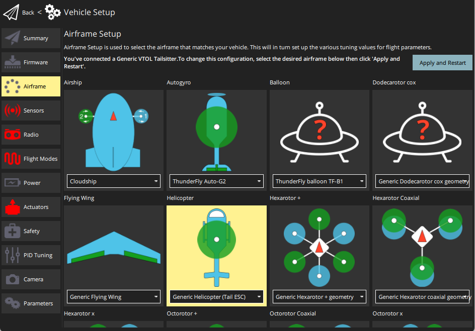
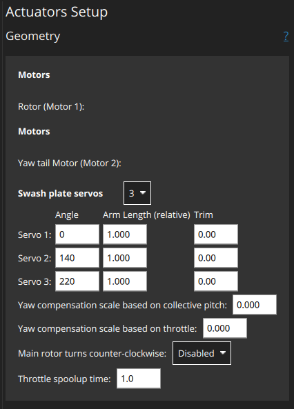
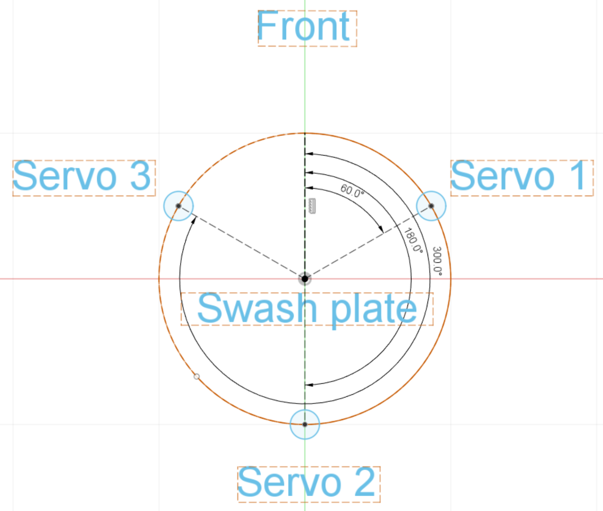

# Конфігурація гелікоптера

Цей розділ містить теми, пов’язані з конфігурацією та налаштуванням [гелікоптера](../frames_helicopter/README.md).

## Підтримувані конфігурації

Підтримувані конфігурації вертольоту:

- Однокрил з одним основним ротором, який керується планкою крена за допомогою до 4 сервоприводів планки крена і механічно роз'єднаний хвостовий ротор, що приводиться в рух за допомогою ESC.
- Однокрил з одним основним ротором, керований планкою крена за допомогою до 4 сервоприводів планки крена і механічно зв'язаний хвостовий ротор, керований сервоприводом.

Підтримувані польотні операції/функції:

- Те саме, що і мультикоптер.
- На момент написання статті автономні/керовані тривимірні польоти з негативною тягою неможливі.

## Установка

Щоб налаштувати та сконфігурувати гелікоптер:

1. Виберіть [планер](../config/airframe.md) гелікоптера в QGroundControl. At time of writing there is only _Generic Helicopter (Tail ESC)_ in the Helicopter group. This will configure the helicopter frame with a mechanically uncoupled tail ([CA_AIRFRAME](../advanced_config/parameter_reference.md#CA_AIRFRAME): `10: Helicopter (tail ESC)`).

   

   ::: info There is no separate airframe for the helicopter with tail servo. To select this configuration, set the parameter [CA_AIRFRAME](../advanced_config/parameter_reference.md#CA_AIRFRAME) to _Helicopter (tail Servo)_. The actuator configuration screen will then change to support this frame type.
:::

1. Configure helicopter actuator geometry in **Vehicle Setup > Actuators**.

   ::: info Actuator setup and testing is covered for most frames in [Actuators](../config/actuators.md). While that is referenced below, this is the main topic for helicopter setup information.
:::

   The geometry for a [Generic Helicopter - with Tail ESC](../airframes/airframe_reference.md#copter_helicopter_generic_helicopter_%28tail_esc%29) is shown below.

   

   Мотори не мають геометрії, що налаштовується:

   - `Rotor (Motor 1)`: The main rotor
   - `Yaw tail motor (Motor 2)`: The tail rotor

   Swash plate servos: `3` | `4` <!-- 4 provides additional stability -->

   Для кожного набору сервоприводів:

   - `Angle`: Годинниковий кут в градусах на колі планки керування, на якому кріпиться важіль сервопривода, починаючи з `0`, що вказує вперед. Приклад для типової настройки, де три сервопривода керують планкою рівномірно розподіленою по колу (360° / 3 =) по 120° кожен, що призводить до наступних кутів:

     | #       | Кут  |
     | ------- | ---- |
     | Servo 1 | 60°  |
     | Servo 2 | 180° |
     | Servo 3 | 300° |

     

   - `Arm Length (relative to each other)`: Radius from the swash plate center (top view). A shorter arm means the same servo motion moves the plate more. This allows the autopilot to compensate.
   - `Trim`: Offset individual servo positions. This is only needed in rare case when the swash plate is not level even though all servos are centered.

   Additional settings:

   - `Yaw compensation scale based on collective pitch`: How much yaw is feed forward compensated based on the current collective pitch.
   - `Main rotor turns counter-clockwise`: `Disabled` (clockwise rotation) | `Enabled`
   - `Throttle spoolup time`: Set value (in seconds) greater than the achievable minimum motor spool up time. A larger value may improve user experience.

1. Remove the rotor blades and propellers
1. Assign motors and servos to outputs and test (also in [Actuator configuration](../config/actuators.md)):

   1. Assign the [motors and servos to the outputs](../config/actuators.md#actuator-outputs).
   1. Power the vehicle with a battery and use the [actuator testing sliders](../config/actuators.md#actuator-testing) to validate correct servo and motor assignment and direction.

1. Using an RC in [Acro mode](../flight_modes_mc/acro.md), verify the correct movement of the swash-plate. With most airframes you need to see the following:

   - Moving the roll stick to the right should tilt the swash-plate to the right.
   - Moving the pitch stick forward should tilt the swash-plate forward.

   In case your airframe requires any phase lag angle offset this can simply be added to all swash-plate servo angles. Refer to the manufacturer's documentation for your airframe.

1. Arm the vehicle and check the main rotor spins up slowly. Adjust the throttle spoolup time as needed using the parameter [COM_SPOOLUP_TIME](../advanced_config/parameter_reference.md#COM_SPOOLUP_TIME). You can also adjust the throttle curve with the parameters [CA_HELI_THR_Cx](../advanced_config/parameter_reference.md#CA_HELI_THR_C0). The default is constant, maximum throttle (suitable for most setups).
1. Disarm again and power off.
1. Put the rotor blades on and power the vehicle.
1. Configure the collective pitch curve using the parameters [CA_HELI_PITCH_Cx](../advanced_config/parameter_reference.md#CA_HELI_PITCH_C0). Set the minimum and maximum according to the minimum and maximum blade angles you want. Make sure the minimum is low enough so the vehicle can still descend. Instead start off with a too low value. The default is slightly negative for that reason and should be a good starting point.

## Вдосконалення

Після завершення попередніх кроків ви готові до озброєння з встановленими лопатями.

Спочатку налаштуйте контролер швидкості [rate controller](#rate-controller) та компенсацію курсу [yaw compensation](#yaw-compensation), як показано в наступних розділах (це специфічно для вертольотів).

Потім налаштування контролера орієнтації, швидкості та позиції виконується так само, [як і для мультикоптерів](../config_mc/README.md).

Зверніть увагу, що автоматичне налаштування не підтримується/не тестується (на момент написання).

### Компенсація повороту

Оскільки компенсація крутного моменту повороту має вирішальне значення для стабільного зависання вертольота, спочатку потрібно виконати грубу конфігурацію. Для точного налаштування цей розділ можна переглянути, коли контролер швидкості запрацює належним чином.

Найважливіше встановіть напрямок обертання вашого основного ротора, який за замовчуванням є за годинниковою стрілкою, якщо дивитися згори планера. Якщо ваш обертається проти годинникової стрілки, встановіть [CA_HELI_YAW_CCW](../advanced_config/parameter_reference.md#CA_HELI_YAW_CCW) на 1.

Існують два параметри для компенсації курсу для колективу та керування газом головного ротора: [CA_HELI_YAW_CP_S](../advanced_config/parameter_reference.md#CA_HELI_YAW_CP_S) [CA_HELI_YAW_TH_S](../advanced_config/parameter_reference.md#CA_HELI_YAW_TH_S)

Потрібне від'ємне значення, коли позитивний тяговий зусилля хвостового ротора обертає транспортний засіб у протилежному напрямку від напрямку обертання головного ротора.

### Контролер швидкості

Контролер швидкості слід налаштовувати в режимі [Acro](../flight_modes_mc/acro.md), але це також можна зробити в режимі [Stabilized](../flight_modes_mc/manual_stabilized.md), якщо ви не можете літати в режимі Acro.

1. Почніть з вимкнених коефіцієнтів контролера швидкості та лише невеликим зворотнім зв'язком передбачуваної відповіді:

   ```sh
   param set MC_ROLLRATE_P 0
   param set MC_ROLLRATE_I 0
   param set MC_ROLLRATE_D 0
   param set MC_ROLLRATE_FF 0.1
   param set MC_PITCHRATE_P 0
   param set MC_PITCHRATE_I 0
   param set MC_PITCHRATE_D 0
   param set MC_PITCHRATE_FF 0.1
   ```

2. Підніміться повільно і зробіть кілька рухів рулями. Використовуйте інтерфейс настройки QGC, щоб перевірити відповідь:

   

   Збільшуйте коефіцієнти передбачуваної відповіді на кочення та тангаж [MC_ROLLRATE_FF](../advanced_config/parameter_reference.md#MC_ROLLRATE_FF), [MC_PITCHRATE_FF](../advanced_config/parameter_reference.md#MC_PITCHRATE_FF) до тих пір, поки відповідь не досягне цільового значення при поданні крокового входу.

3. Потім увімкніть посилення PID. Почніть із таких значень:

   - [MC_ROLLRATE_P](../advanced_config/parameter_reference.md#MC_ROLLRATE_P), [MC_PITCHRATE_P](../advanced_config/parameter_reference.md#MC_PITCHRATE_P) чверть від значення, яке ви виявили працює добре як відповідне передбачуване значення в попередньому кроці. `P = FF / 4`

   ```sh
   param set MC_ROLLRATE_I 0.2
   param set MC_PITCHRATE_I 0.2
   param set MC_ROLLRATE_D 0.001
   param set MC_PITCHRATE_D 0.001
   ```

   Потім за потреби збільшуйте посилення `P` і `D`, доки він не буде добре відстежуватися. Очікується, що підсилення `P` буде значно меншим, ніж підсилення `FF`.
