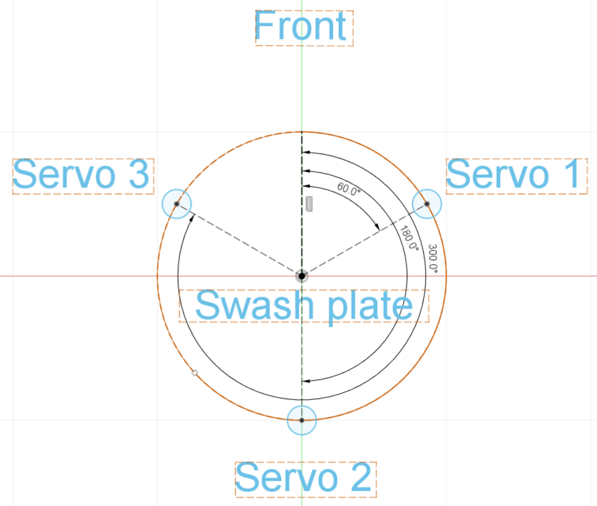

# Конфігурація гелікоптера

Цей розділ містить теми, пов’язані з конфігурацією та налаштуванням [гелікоптера](../frames_helicopter/README.md).

## Підтримувані конфігурації

Підтримувані конфігурації вертольоту:

- Однокрил з одним основним ротором, який керується планкою крена за допомогою до 4 сервоприводів планки крена і механічно роз'єднаний хвостовий ротор, що приводиться в рух за допомогою ESC.
- Однокрил з одним основним ротором, керований планкою крена за допомогою до 4 сервоприводів планки крена і механічно зв'язаний хвостовий ротор, керований сервоприводом.

Підтримувані польотні операції/функції:

- Те саме, що і мультикоптер.
- На момент написання статті автономні/керовані тривимірні польоти з негативною тягою неможливі.

## Установка

Щоб налаштувати та сконфігурувати гелікоптер:

1. Виберіть [планер](../config/airframe.md) гелікоптера в QGroundControl. На момент написання є лише _загальний гелікоптер (з хвостовим ЕСП/Tail ESC)_ в групі гелікоптерів. Це призведе до налаштування рами вертольота з механічно від’єднаним хвостом ([CA_AIRFRAME](../advanced_config/parameter_reference.md#CA_AIRFRAME): `10: Вертоліт (хвостовий ESC/tail ESC)`).

   

   ::: info Немає окремого конструкційного типу для гелікоптера з хвостовим сервоприводом. Щоб вибрати цю конфігурацію, встановіть параметр [CA_AIRFRAME](../advanced_config/parameter_reference.md#CA_AIRFRAME) на _Гелікоптер (з хвостовим сервоприводом/tail Servo)_. Потім екран конфігурації приводу зміниться для підтримки цього типу рами.
:::

1. Налаштуйте геометрію приводу вертольота в **Налаштування пристрою> Актуатори**.

   ::: info Налаштування та тестування приводу описано для більшості рам у розділі [Actuators/Приводи](../config/actuators.md). Хоча це згадується нижче, це основна тема для інформації про налаштування гелікоптера.
:::

   Геометрія для [Звичайного вертольота - з хвостовою ESC](../airframes/airframe_reference.md#copter_helicopter_generic_helicopter_%28tail_esc%29) показана нижче.

   

   Мотори не мають геометрії, що налаштовується:

   - `Ротор (Двигун 1)`: Головний ротор
   - `Рульовий мотор кормового руху (Двигун 2)`: Хвостовий ротор

   Сервоприводи кронштейна рушія:`3` | `4` <!-- 4 provides additional stability -->

   Для кожного набору сервоприводів:

   - `Angle`: Годинниковий кут в градусах на колі планки керування, на якому кріпиться важіль сервопривода, починаючи з `0`, що вказує вперед. Приклад для типової настройки, де три сервопривода керують планкою рівномірно розподіленою по колу (360° / 3 =) по 120° кожен, що призводить до наступних кутів:

     | #       | Кут  |
     | ------- | ---- |
     | Servo 1 | 60°  |
     | Servo 2 | 180° |
     | Servo 3 | 300° |

     

   - `Довжина плеча (відносно один до одного)`: Радіус від центру кронштейна рушія (вигляд зверху). Коротше плече означає, що та ж сама рух сервопривода зміщує плиту більше. Це дозволяє отримати компенсацію автопілоту.
   - `Калібрування`: Зміщення позицій окремих сервоприводів. Це потрібно лише у випадках, коли кронштейн рушія не рівний, навіть якщо всі сервоприводи налаштовані в центр.

   Додаткові налаштування:

   - `Масштаб компенсації курсової стійкості` на основі загального кута наклона: Наскільки компенсована курсова стійкість на основі поточного загального кута наклона.
   - `Головний ротор обертається проти годинникової стрілки`: `Вимкнено` (обертання за годинниковою стрілкою) | `Увімкнено`
   - `Час прискорення газу`: Встановіть значення (в секундах), більше ніж досяжний мінімальний час прискорення двигуна. Більше значення може поліпшити зручність користувача.

1. Видаліть лопаті ротора та пропелери
1. Призначте двигуни та сервоприводи для виведення та перевірте (також у [конфігурації приводу](../config/actuators.md)):

   1. Призначте [двигуни та сервоприводи для виведення](../config/actuators.md#actuator-outputs).
   1. Ввімкніть транспортний засіб за допомогою батареї та скористайтеся [елементами керування тестуванням приводів](../config/actuators.md#actuator-testing), щоб перевірити правильне призначення та напрямок роботи сервоприводів та двигунів.

1. Використовуючи пульт дистанційного керування в [режимі Acro](../flight_modes_mc/acro.md), перевірте правильність руху перекидної пластини. Для більшості планерів вам потрібно побачити наступне:

   - Переміщення ручки крена вправо повинно нахиляти кронштейн рушія вправо.
   - Переміщення ручки крена вперед повинно нахиляти кронштейн рушія вперед.

   У разі, якщо ваша конструкція вимагає будь-якого зміщення кута фазового запізнення, це можна просто додати до всіх кутів кронштейна рушія. Зверніться до документації виробника вашої конструкції.

1. Увімкніть транспортний засіб і перевірте, що головний ротор починає повільно обертатися. Змініть час прискорення газу за потреби за допомогою параметра [COM_SPOOLUP_TIME](../advanced_config/parameter_reference.md#COM_SPOOLUP_TIME). Ви також можете налаштувати криву газу за допомогою параметрів [CA_HELI_THR_Cx](../advanced_config/parameter_reference.md#CA_HELI_THR_C0). За замовчуванням встановлено постійний, максимальний газ (підходить для більшості налаштувань).
1. Знову вимкніть зброювання і вимкніть живлення.
1. Встановіть лопаті ротора і включіть живлення транспортного засобу.
1. Налаштуйте криву колективного кута за допомогою параметрів [CA_HELI_PITCH_Cx](../advanced_config/parameter_reference.md#CA_HELI_PITCH_C0). Встановіть мінімум і максимум відповідно до мінімального і максимального кутів лопатей, які вам потрібно. Переконайтеся, що мінімум достатньо низький, щоб транспортний засіб все ще міг опускатися. Замість цього, почніть з надто низького значення. За цю причину за замовчуванням встановлено трохи негативне значення і повинно бути гарною вихідною точкою.

## Вдосконалення

Після завершення попередніх кроків ви готові до озброєння з встановленими лопатями.

Спочатку налаштуйте контролер швидкості [rate controller](#rate-controller) та компенсацію курсу [yaw compensation](#yaw-compensation), як показано в наступних розділах (це специфічно для вертольотів).

Потім налаштування контролера орієнтації, швидкості та позиції виконується так само, [як і для мультикоптерів](../config_mc/README.md).

Зверніть увагу, що автоматичне налаштування не підтримується/не тестується (на момент написання).

### Компенсація повороту

Оскільки компенсація крутного моменту повороту має вирішальне значення для стабільного зависання вертольота, спочатку потрібно виконати грубу конфігурацію. Для точного налаштування цей розділ можна переглянути, коли контролер швидкості запрацює належним чином.

Найважливіше встановіть напрямок обертання вашого основного ротора, який за замовчуванням є за годинниковою стрілкою, якщо дивитися згори планера. Якщо ваш обертається проти годинникової стрілки, встановіть [CA_HELI_YAW_CCW](../advanced_config/parameter_reference.md#CA_HELI_YAW_CCW) на 1.

Існують два параметри для компенсації курсу для колективу та керування газом головного ротора: [CA_HELI_YAW_CP_S](../advanced_config/parameter_reference.md#CA_HELI_YAW_CP_S) [CA_HELI_YAW_TH_S](../advanced_config/parameter_reference.md#CA_HELI_YAW_TH_S)

Потрібне від'ємне значення, коли позитивний тяговий зусилля хвостового ротора обертає транспортний засіб у протилежному напрямку від напрямку обертання головного ротора.

### Контролер швидкості

Контролер швидкості слід налаштовувати в режимі [Acro](../flight_modes_mc/acro.md), але це також можна зробити в режимі [Stabilized](../flight_modes_mc/manual_stabilized.md), якщо ви не можете літати в режимі Acro.

1. Почніть з вимкнених коефіцієнтів контролера швидкості та лише невеликим зворотнім зв'язком передбачуваної відповіді:

   ```sh
   param set MC_ROLLRATE_P 0
   param set MC_ROLLRATE_I 0
   param set MC_ROLLRATE_D 0
   param set MC_ROLLRATE_FF 0.1
   param set MC_PITCHRATE_P 0
   param set MC_PITCHRATE_I 0
   param set MC_PITCHRATE_D 0
   param set MC_PITCHRATE_FF 0.1
   ```

2. Підніміться повільно і зробіть кілька рухів рулями. Використовуйте інтерфейс настройки QGC, щоб перевірити відповідь:

   

   Збільшуйте коефіцієнти передбачуваної відповіді на кочення та тангаж [MC_ROLLRATE_FF](../advanced_config/parameter_reference.md#MC_ROLLRATE_FF), [MC_PITCHRATE_FF](../advanced_config/parameter_reference.md#MC_PITCHRATE_FF) до тих пір, поки відповідь не досягне цільового значення при поданні крокового входу.

3. Потім увімкніть посилення PID. Почніть із таких значень:

   - [MC_ROLLRATE_P](../advanced_config/parameter_reference.md#MC_ROLLRATE_P), [MC_PITCHRATE_P](../advanced_config/parameter_reference.md#MC_PITCHRATE_P) чверть від значення, яке ви виявили працює добре як відповідне передбачуване значення в попередньому кроці. `P = FF / 4`

   ```sh
   param set MC_ROLLRATE_I 0.2
   param set MC_PITCHRATE_I 0.2
   param set MC_ROLLRATE_D 0.001
   param set MC_PITCHRATE_D 0.001
   ```

   Потім за потреби збільшуйте посилення `P` і `D`, доки він не буде добре відстежуватися. Очікується, що підсилення `P` буде значно меншим, ніж підсилення `FF`.
