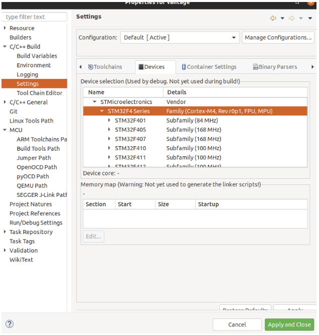
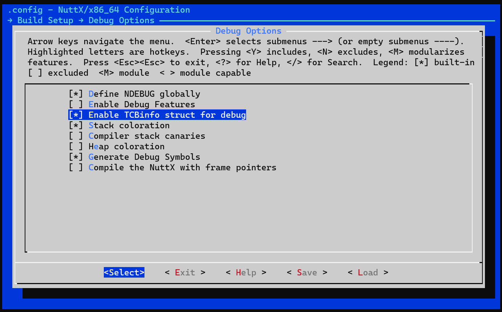
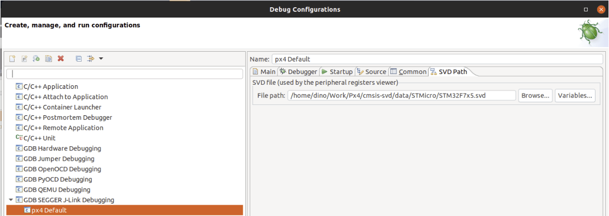

# Налагодження з Eclipse та J-Link

Ця тема пояснює, як налаштувати та використовувати [MCU Eclipse](https://gnu-mcu-eclipse.github.io/) з адаптером _Segger Jlink_ для налагодження PX4, що працює на NuttX (наприклад, плати серії Pixhawk).

## Необхідне обладнання

- [J-Link EDU Mini](https://www.segger.com/products/debug-probes/j-link/models/j-link-edu-mini/)
- Адаптер для підключення Segger JLink до контролера польоту [Порту відлагодження SWD](../debug/swd_debug.md) (порт відлагодження).
- Мікро USB кабель

## Встановлення

### PX4

Налаштуйте PX4, дотримуючись звичайних вказівок:

- [Налаштуйте середовище розробника/інструментальний набір PX4](../dev_setup/dev_env.md) для вашої платформи (наприклад, для Linux дивиться: [Середовище розробки на Ubuntu LTS / Debian Linux](../dev_setup/dev_env_linux_ubuntu.md)).
- [Завантажте PX4](../dev_setup/building_px4.md) та за потреби перезберіть його в командному рядку.

### Eclipse

Встановлення _Eclipse_:

1. Завантажте [Eclipse CDT для розробників на C/C++](https://github.com/gnu-mcu-eclipse/org.eclipse.epp.packages/releases/) (MCU GitHub).
1. Розпакуйте папку Eclipse та скопіюйте її куди завгодно (немає потреби запускати будь-які сценарії установки).
1. Запустіть _Eclipse_ та виберіть місце для вашої початкової робочої області.

### Інструменти Segger Jlink

Для встановлення інструментів _Segger Jlink_:

1. Завантажте та запустіть [Пакунок програмного забезпечення та документації J-Link](https://www.segger.com/downloads/jlink/#J-LinkSoftwareAndDocumentationPack) для вашої ОС (доступні пакети для Windows та Linux).
   - У Linux інструменти встановлюються у **/usr/bin**.

Для отримання додаткової інформації див. : [https://gnu-mcu-eclipse.github.io/debug/jlink/install/](https://gnu-mcu-eclipse.github.io/debug/jlink/install/).

## Перше використання

1. Підключіть _Segger JLink_ до комп'ютера-хоста та [порту відлагодження контролера польоту](../debug/swd_debug.md) (через адаптер).
1. Увімкніть модульний політний контролер.
1. Запустіть _Eclipse_.
1. Додайте джерело вибравши **File > Import > C/C++ > Існуючий код як проект** та натисніть **Next**.
1. Вказати шлях до папки **PX4-Autopilot** та дати йому ім'я, потім виберіть _ARM Cross GCC_ у _Toolchain for Indexer Settings_ та натисніть на **Finish**. Імпорт триває деякий час. Дочекайтеся його завершення.
1. Встановіть налаштування MCU: клацніть правою кнопкою миші на проект верхнього рівня в досліднику проектів, виберіть _Properties_, а потім під MCU виберіть _SEGGER J-Link Path_. Встановіть його, як показано на знімку екрану нижче. 
1. Пакети з оновленнями:

   - Клацніть на маленьку іконку у верхньому правому куті під назвою _Open Perspective_ та відкрийте перспективу _Packs_. 
   - Клацніть кнопку **update all**.

     :::tip
Це займає ДУЖЕ БАГАТО ЧАСУ (10 хвилин).
Ігноруйте всі помилки про відсутні пакети.
:::

     

   - Пристрої STM32Fxx знаходяться в папці Keil, встановлюються правою кнопкою миші та вибором **install** на відповідний пристрій для F4 та F7.

1. Налаштування конфігурації налагодження для цілі:

   - Натисніть правою кнопкою миші на проекті _Settings_ (menu: **C/C++ Build > Settings**)
   - Виберіть вкладку _Devices_, розділ _Devices_ (Не _Boards_).
   - Знайдіть FMU чіп, який ви хочете налагодити.

   

1. Виберіть налаштування відладки за допомогою невеликого випадаючого списку поруч із символом багу: 
1. Потім виберіть _GDB SEGGER J-Link Debugging_ і потім кнопку **New config** у верхньому лівому куті. 
1. Налаштування конфігурації збірки:

   - Дайте йому назву та встановіть _C/C++ Application_ до відповідного **.elf** файлу.
   - Виберіть _Disable Auto build_

     ::: інформація
Пам'ятайте, що ви повинні побудувати ціль з командного рядка перед початком сеансу налагодження.
:::

   

1. Вкладки _Debugger_ та _Startup_ не повинні потребувати будь-яких змін (просто перевірте ваші налаштування за знімками екрану нижче)

    

## Відлагодження з урахуванням завдань SEGGER

Відладка, яка враховує задачі (також відома як [відлагодження, яке враховує потоки](https://www.segger.com/products/debug-probes/j-link/tools/j-link-gdb-server/thread-aware-debugging/)), дозволяє вам показати контекст усіх запущених потоків/задач замість лише стеку поточної задачі. Це досить корисно, оскільки PX4 має тенденцію запускати виконання багато різних завдань.

Для активації цієї функції в Eclipse:

1. Спочатку вам потрібно увімкнути `CONFIG_DEBUG_TCBINFO` у конфігурації NuttX для вашої збірки (щоб викрити зсуви TCB).

   - Відкрийте термінал у кореневій теці вихідного коду PX4-Autopilot
   - У терміналі відкрийте `menuconfig` використовуючи відповідну ціль make для збірки. Це виглядатиме приблизно так:

     ```sh
     make px4_fmu-v5_default boardguiconfig
     ```

     (Див. [PX4 Menuconfig Setup](../hardware/porting_guide_config.md#px4-menuconfig-setup) для отримання додаткової інформації) щодо використання засобів конфігурації).

   - Переконайтеся, що параметр _Enable TCBinfo struct for debug_ вибраний, як показано: 

1. Скомпілюйте бібліотеку **jlink-nuttx.so** в терміналі, виконавши наступну команду в терміналі: `make jlink-nuttx`
1. Змініть Eclipse, щоб використовувати цю бібліотеку. В конфігурації _J-Link GDB Server Setup_ оновіть **Other options**, щоб включити `-rtos /home/<PX4 path>/Tools/jlink-nuttx.so`, як показано нижче.

   

1. Під час запуску налагоджувача ви повинні побачити зараз декілька потоків замість одного:

   

## Вирішення проблем

### Цільовий процесор відсутній в Package Manager

Якщо цільовий ЦП не відображається в package manager, вам може знадобитися ці крок для запуску відображення реєстру.

:::порада
Це, як правило, не повинно траплятися (але повідомляжться про такі випадки при підключенні до контролера STM F7).
:::

Додавання відсутніх файлів SVD для _Peripheral View_:

1. Дізнайтеся, де MCU Eclipse зберігає свої пакети (**Preferences > C/C++ > MCU Packages**):

   

2. Завантажте відсутні пакети з: http://www.keil.com/dd2/Pack/
3. Відкрийте завантажений пакет за допомогою інструменту для розпакування, та витягніть файли **.SVD** з: **/CMSIS/SVD**.
4. Виберіть потрібний файл **.SVD** у: **Debug Options > GDB SEGGER JLink Debugging > SVD Path**

   
