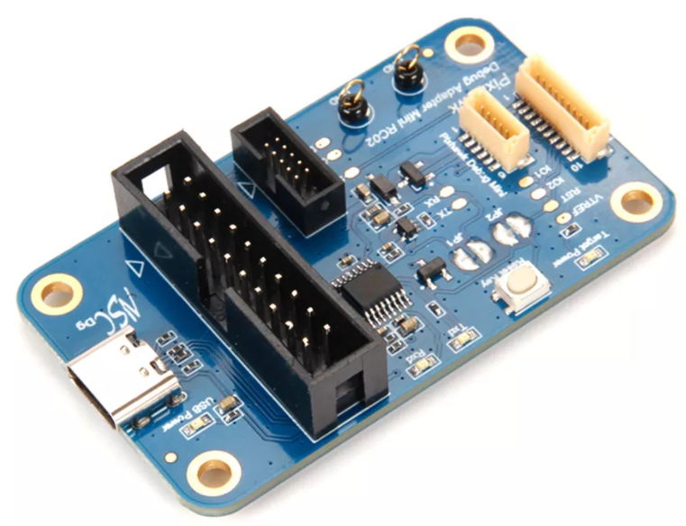
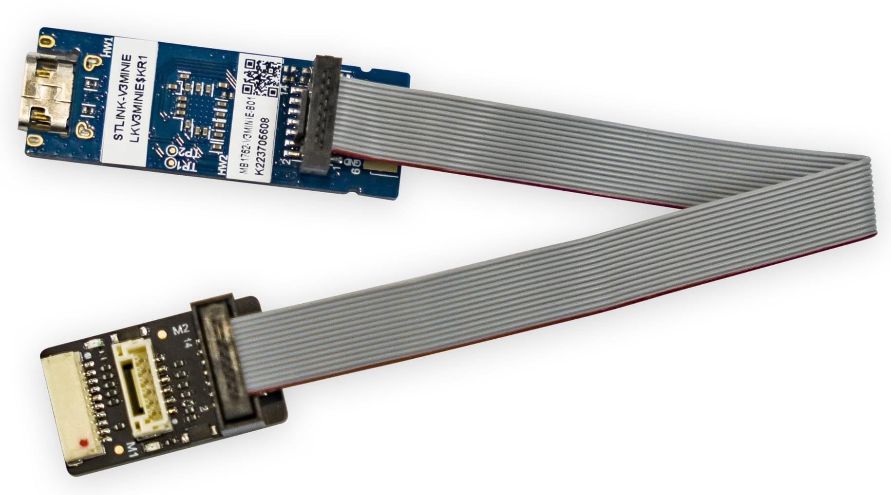

# Порт відладки SWD

PX4 працює на мікроконтролерах ARM Cortex-M, які містять спеціалізований апаратний засіб для інтерактивного налагодження через інтерфейс [_Serial Wire Debug (SWD)_][swd] та неінвазивного профілювання та трасування високої пропускної здатності через інтерфейси [_Serial Wire Ouput (SWO)_][itm] та [_TRACE_ pins][etm].

Інтерфейс відладки SWD дозволяє прямий, низькорівневий, апаратний доступ до процесора мікроконтролера та периферійних пристроїв, тому він не залежить від будь-якого програмного забезпечення на пристрої. Отже, його можна використовувати для налагодження завантажувальних програм та операційних систем, таких як NuttX.

## Налагодження сигналів

Чотири сигнали необхідні для відлагодження (в жирному шрифті), а решту лише рекомендується.

| Назва       | Тип    | Опис                                                                                      |
|:----------- |:------ |:----------------------------------------------------------------------------------------- |
| **GND**     | Power  | Shared potential, common ground.                                                          |
| **VREF**    | Power  | The target reference voltage allows the debug probe to use level shifters on the signals. |
| **SWDIO**   | I/O    | Serial Wire Debug data pin.                                                               |
| **SWCLK**   | Input  | Serial Wire Debug clock pin.                                                              |
| nRST        | Input  | The reset pin is optional (n = active low).                                               |
| SWO         | Output | Single wire trace asynchronous data out can output ITM and DWT data.                      |
| TRACECK     | Output | Trace clock for parallel bus.                                                             |
| TRACED[0-3] | Output | Trace synchronous data bus with 1, 2, or 4 bits.                                          |

Пін скидання апаратного забезпечення є необов'язковим, оскільки більшість пристроїв також можуть бути скинуті через лінії SWD. Однак швидке скидання пристрою за допомогою кнопки може бути великим плюсом для розробки.

SWO-пін може випромінювати дані профілювання в реальному часі з наносекундним відмітками часу, тому настійно рекомендується мати доступ до нього для відлагодження.

Піни TRACE потребують спеціалізованих засобів відлагодження для роботи з високою пропускною здатністю та наступним декодуванням потоку даних. Зазвичай вони недоступні і зазвичай використовуються лише для відлагодження дуже конкретних питань з часом.

## Порти налагодження автопілота

Контролери польоту зазвичай надають один засіб налагодження, який використовує як інтерфейс [SWD](#debug-signals), так і [Системну консоль](system_console).

[Стандарти роз'ємів Pixhawk](#pixhawk-standard-debug-ports) визначають порт, який повинен бути використаний в кожній версії FMU. Однак є ще багато плат, які використовують різні роз'єми або конектори, тому ми рекомендуємо вам перевірити [документацію для вашого автопілота](../flight_controller/index.md), щоб підтвердити розташування порту та роз'єму.

Місцезнаходження порту налагодження та роз'єми для підмножини автопілотів зв'язані нижче:

| Автопілот                                                                           | Відладочний порт                                                                                                                                                        |
|:----------------------------------------------------------------------------------- |:----------------------------------------------------------------------------------------------------------------------------------------------------------------------- |
| Holybro Pixhawk 6X-RT (FMUv6X-RT)                                                   | [Порти відладки Pixhawk Full](#pixhawk-debug-full)                                                                                                                      |
| Holybro Pixhawk 6X (FMUv6x)                                                         | [Порти відладки Pixhawk Full](#pixhawk-debug-full)                                                                                                                      |
| Holybro Pixhawk 5X (FMUv5x)                                                         | [Порти відладки Pixhawk Full](#pixhawk-debug-full)                                                                                                                      |
| [Holybro Durandal](../flight_controller/durandal.md#debug-port)                     | [Pixhawk Debug Mini](#pixhawk-debug-mini)                                                                                                                               |
| [Holybro Kakute F7](../flight_controller/kakutef7.md#debug-port)                    | Solder pads                                                                                                                                                             |
| [Holybro Pixhawk 4 Mini](../flight_controller/pixhawk4_mini.md#debug-port) (FMUv5)  | [Pixhawk Debug Mini](#pixhawk-debug-mini)                                                                                                                               |
| [Holybro Pixhawk 4](../flight_controller/pixhawk4.md#debug_port) (FMUv5)            | [Pixhawk Debug Mini](#pixhawk-debug-mini)                                                                                                                               |
| [Drotek Pixhawk 3 Pro](../flight_controller/pixhawk3_pro.md#debug-port) (FMU-v4pro) | [Pixhawk Debug Mini](#pixhawk-debug-mini)                                                                                                                               |
| [CUAV V5+](../flight_controller/cuav_v5_plus.md#debug-port)                         | 6-pin JST GH Digikey: [BM06B-GHS-TBT(LF)(SN)(N)][bm06b-ghs-tbt(lf)(sn)(n)] (vertical mount), [SM06B-GHS-TBT(LF)(SN)(N)][sm06b-ghs-tbt(lf)(sn)(n)] (side mount) |
| [CUAV V5nano](../flight_controller/cuav_v5_nano.md#debug_port)                      | 6-pin JST GH Digikey: [BM06B-GHS-TBT(LF)(SN)(N)][bm06b-ghs-tbt(lf)(sn)(n)] (vertical mount), [SM06B-GHS-TBT(LF)(SN)(N)][sm06b-ghs-tbt(lf)(sn)(n)] (side mount) |
| [3DR Pixhawk](../flight_controller/pixhawk.md#swd-port)                             | ARM 10-pin JTAG Connector (also used for FMUv2 boards including: _mRo Pixhawk_, _HobbyKing HKPilot32_).                                                                 |

## Pixhawk Connector Standard Debug Ports

Проект Pixhawk визначив стандартну схему виводів та тип роз'єму для різних випусків Pixhawk FMU:

:::tip
Перевірте свою [конкретну дошку](#port-information), щоб підтвердити використаний порт.
:::

| FMU Version | Pixhawk Version                                                 | Debug Port                                |
|:----------- |:--------------------------------------------------------------- |:----------------------------------------- |
| FMUv2       | [Pixhawk / Pixhawk 1](../flight_controller/pixhawk.md#swd-port) | 10 pin ARM Debug                          |
| FMUv3       | Pixhawk 2                                                       | 6 pin SUR Debug                           |
| FMUv4       | Pixhawk 3                                                       | [Pixhawk Debug Mini](#pixhawk-debug-mini) |
| FMUv5       | Pixhawk 4 FMUv5                                                 | [Pixhawk Debug Mini](#pixhawk-debug-mini) |
| FMUv5X      | Pixhawk 5X                                                      | [Pixhawk Debug Full](#pixhawk-debug-full) |
| FMUv6       | Pixhawk 6                                                       | [Pixhawk Debug Full](#pixhawk-debug-full) |
| FMUv6X      | Pixhawk 6X                                                      | [Pixhawk Debug Full](#pixhawk-debug-full) |
| FMUv6X-RT   | Pixhawk 6X-RT                                                   | [Pixhawk Debug Full](#pixhawk-debug-full) |

:::info
Єдині FMU та версії Pixhawk (тільки) сумісні після FMUv5X.
:::

### Pixhawk Debug Mini

[Стандарт роз'ємів Pixhawk](https://github.com/pixhawk/Pixhawk-Standards/blob/master/DS-009%20Pixhawk%20Connector%20Standard.pdf) визначає _Pixhawk Debug Mini_, _6-контактний роз'єм SH Debug Port_, який надає доступ до обох контактів SWD та [System Console](system_console).

Це використовується в FMUv4 та FMUv5.

Схема виводів показана нижче (виводи, необхідні для налагодження, виділені жирним шрифтом):

| Пін | Сигнал     |
| ---:|:---------- |
|   1 | **VREF**   |
|   2 | Console TX |
|   3 | Console RX |
|   4 | **SWDIO**  |
|   5 | **SWDCLK** |
|   6 | **GND**    |

The debug port definition includes the following solder pads (on board next to connector):

| Pad | Signal | Voltage |
| ---:|:------ |:------- |
|   1 | nRST   | +3.3V   |
|   2 | GPIO1  | +3.3V   |
|   3 | GPIO2  | +3.3V   |

Роз'єм - _6-pin JST SH_ - номер Digikey: [BM06B-SRSS-TBT(LF)(SN)](https://www.digikey.com/products/en?keywords=455-2875-1-ND) (вертикальний монтаж), [SM06B-SRSS-TBT(LF)(SN)](https://www.digikey.com/products/en?keywords=455-1806-1-ND) (бічний монтаж).

Ви можете підключитися до порту налагодження за допомогою [кабелю, подібного до цього](https://www.digikey.com/products/en?keywords=A06SR06SR30K152A).

### Порти відладки Pixhawk Full

[Стандарт роз'ємів Pixhawk](https://github.com/pixhawk/Pixhawk-Standards/blob/master/DS-009%20Pixhawk%20Connector%20Standard.pdf) визначає _Pixhawk Debug Full_, _10-контактний роз'єм SH Debug Port_, який надає доступ до обох контактів SWD та [System Console](system_console). Це в основному переміщує паяльні подушки з боку [Pixhawk Debug Mini](#pixhawk-debug-mini) в роз'єм, а також додає контакт SWO.

Цей порт вказаний для використання в FMUv5x, FMUv6, FMUv6x.

Схема виводів показана нижче (виводи, необхідні для налагодження, виділені жирним шрифтом):

| Пін | Сигнал     |
| ---:|:---------- |
|   1 | **VREF**   |
|   2 | Console TX |
|   3 | Console RX |
|   4 | **SWDIO**  |
|   5 | **SWDCLK** |
|   6 | SWO        |
|   7 | GPIO1      |
|   8 | GPIO2      |
|   9 | nRST       |
|  10 | **GND**    |

Піни GPIO1/2 є вільними пінами, які можуть бути використані для генерації сигналів у програмному забезпеченні для аналізу часу з логічним аналізатором.

Роз'єм - _10-pin JST SH_ - номер Digikey: [BM10B-SRSS-TB(LF)(SN)](https://www.digikey.com/products/en?keywords=455-1796-2-ND) (вертикальний монтаж) або [SM10B-SRSS-TB(LF)(SN)](https://www.digikey.com/products/en?keywords=455-1810-2-ND) (бічний монтаж).

Ви можете підключитися до порту налагодження за допомогою [кабелю, подібного до цього](https://www.digikey.com/products/en?keywords=A10SR10SR30K203A).

<!-- FIXME: better to have image showing proper connections for SWD+SWO -->

## Зонди налагодження для апаратного забезпечення PX4

Контролери польоту зазвичай надають [один засіб налагодження](#autopilot-debug-ports), який використовує як інтерфейс [SWD](#debug-signals), так і [Системну консоль](system_console).

Є кілька зондів відлагодження, які були перевірені та підтримуються для підключення до одного або обох цих інтерфейсів:

- [SEGGER J-Link](../debug/probe_jlink.md): комерційний зонд, без вбудованої послідовної консолі, потребує адаптера.
- [Чорна магія зондування](../debug/probe_bmp.md): інтегрований сервер GDB та послідовна консоль, потребує адаптер.
- [STLink](../debug/probe_stlink): найкраща вартість, інтегрована послідовна консоль, адаптер повинен бути паяним.
- [MCU-Link](../debug/probe_mculink): найкраща вартість, інтегрована послідовна консоль, потребує адаптер.

An adapter to connect to the debug port may come with your flight controller or debug probe. Other options are given below.

## Debug Adapters

### Holybro Pixhawk Debug Adapter

The [Holybro Pixhawk Debug Adapter](https://holybro.com/products/pixhawk-debug-adapter) is _highly recommended_ when debugging controllers that use one of the Pixhawk-standard debug connectors.

It is the easiest way to connect:

- Flight controllers that use either the [Pixhawk Debug Full](#pixhawk-debug-full) (10-pin SH) or [Pixhawk Debug Mini](#pixhawk-debug-mini) (6-pin SH) debug port.
- SWD debug probes that support the 10-pin ARM compatible interface standard used by the [Segger JLink EDU mini](../debug/probe_jlink.md) or 20-pin compatible with the Segger JLink or STLink.

### CUAV C-ADB Pixhawk Debug Adapter

The [CUAV C-ADB Secondary Development Pixhawk Flight Controller Debug Adapter](https://store.cuav.net/shop/cuav-c-adb/) comes with an [STLinkv3-MINIE Debug Probe](../debug/probe_stlink.md).

This has a ports for connecting to the [Pixhawk Debug Full](#pixhawk-debug-full) (10-pin SH) and CUAV-standard DSU interface (but not the [Pixhawk Debug Mini](../debug/swd_debug.md#pixhawk-debug-mini) (6-pin SH)).

The M2 connector on the adaptor is 14-pin CN4 STDC14 (see the [STLinkv3-MINIE User Manual](https://www.st.com/resource/en/user_manual/um2910-stlinkv3minie-debuggerprogrammer-tiny-probe-for-stm32-microcontrollers-stmicroelectronics.pdf) for more information). The cable used to connect the M2 and the STLinkv3-MINIE comes with the adaptor.

### Debug Probe Adapters

Some SWD [debug probes](#debug-probes) come with adapters/cables for connecting to common Pixhawk [debug ports](#debug-ports). Probes that are known to come with connectors are listed below:

- [DroneCode Probe](../debug/probe_bmp.md#dronecode-probe): comes with a connector for attaching to the [Pixhawk Debug Mini](#pixhawk-debug-mini)

### Board-specific Adapters

Some manufacturers provide cables to make it easy to connect the SWD interface and [System Console](../debug/system_console).

- [CUAV V5nano](../flight_controller/cuav_v5_nano.md#debug_port) and [CUAV V5+](../flight_controller/cuav_v5_plus.md#debug-port) include this debug cable:

### Custom Cables

You can also create custom cables for connecting to different boards or probes:

- Connect `SWDIO`, `SWCLK` and `GND` pins on the debug probe to the corresponding pins on the debug port.
- Connect the VREF pin, if supported by the debug probe.
- Connect the remaining pins, if present.

See the [STLinkv3-MINIE](probe_stlink) for a guide on how to solder a custom cable.

:::tip
Where possible, we highly recommend that you create or obtain an adapter board rather than custom cables for connecting to SWD/JTAG debuggers and computers.
This reduces the risk or poor wiring contributing to debugging problems, and has the benefit that adapters usually provide a common interface for connecting to multiple popular flight controller boards.
:::

<!-- Reference links used above -->

[swd]: https://developer.arm.com/documentation/ihi0031/a/The-Serial-Wire-Debug-Port--SW-DP-
[itm]: https://developer.arm.com/documentation/ddi0403/d/Appendices/Debug-ITM-and-DWT-Packet-Protocol?lang=en
[etm]: https://developer.arm.com/documentation/ihi0064/latest/
[bm06b-ghs-tbt(lf)(sn)(n)]: https://www.digikey.com/products/en?keywords=455-1582-1-ND
[sm06b-ghs-tbt(lf)(sn)(n)]: https://www.digikey.com/products/en?keywords=455-1568-1-ND
