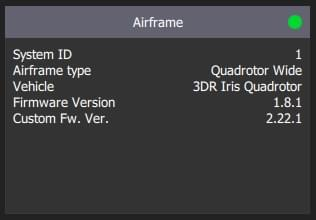

# Збірка програмного забезпечення PX4

Збірку прошивки PX4 для цільових апаратних платформ та симуляції можна здійснити з вихідного коду в консолі або в IDE.

Вам потрібно зібрати PX4 для того, щоб використовувати [симулятори](../simulation/README.md), або якщо ви хочете модифікувати PX4 і створити свою збірку. Якщо ви просто хочете спробувати PX4 на реальному обладнанні, тоді [завантажте попередньо зібрані бінарні файли](../config/firmware.md) за допомогою QGroundControl (не потрібно виконувати ці інструкції).

Перед виконанням цих інструкцій вам слід встановити [Інструментарій розробника](../dev_setup/dev_env.md) для вашої операційної системи та цільової апаратної платформи. Якщо у вас виникли проблеми після виконання цих кроків, див. розділ [Усунення проблем](#troubleshooting) нижче.
:::

## Завантаження вихідного коду PX4

Вихідний код PX4 зберігається на Github в репозиторії [PX4/PX4-Autopilot](https://github.com/PX4/PX4-Autopilot).

To get the _very latest_ (`main` branch) version onto your computer, enter the following command into a terminal:

```sh
git clone https://github.com/PX4/PX4-Autopilot.git --recursive
```

Note that you may already have done this when installing the [Developer Toolchain](../dev_setup/dev_env.md)

::: info This is all you need to do in order to get the latest code. За потреби ви також можете [отримати вихідний код певного релізу](../contribute/git_examples.md#get-a-specific-release). [Приклади GIT](../contribute/git_examples.md) пропонують значно більше інформації про роботу з релізами та внеску у PX4.
:::

## First Build (Using a Simulator)

Спочатку ми зберемо цільову платформу симуляції з використанням консольного середовища. Це дозволяє нам перевірити налаштування системи перед її запуском на реальному обладнанні та IDE.

Navigate into the **PX4-Autopilot** directory. Depending on your operating system you will have installed either [Gazebo SITL](../sim_gazebo_gz/index.md) or [Gazebo Classic SITL](../sim_gazebo_classic/index.md) (if you don't know which you can try both).

:::: tabs

::: tab Gazebo Start [Gazebo SITL](../sim_gazebo_gz/index.md) using the following command:

```sh
make px4_sitl gz_x500
```

:::

::: tab Gazebo-Classic Start [Gazebo SITL](../sim_gazebo_gz/index.md) using the following command:

```sh
make px4_sitl gazebo-classic
```

:::

::::

This will bring up the PX4 console:


:::note
Можливо, ще знадобиться запустити _QGroundControl_ перед тим, як рушити далі, оскільки стандартне налаштування PX4 вимагає наявність звʼязку з наземним оператором перед злетом. Його можна завантажити [звідси](https://docs.qgroundcontrol.com/master/en/getting_started/download_and_install.html).
:::

The drone can be flown by typing the following command (as shown in the console above):

```sh
pxh> commander takeoff
```

The vehicle will take off and you'll see this in the simulator UI:

:::: tabs

::: tab Gazebo 
:::

::: tab Gazebo-Classic 
:::

::::

Дрон можна приземлити, набравши `commander land`. Зупинити симуляцію можна через клавіатурну комбінацію  **CTRL+C** (або через введення `shutdown`).

Симуляція польоту з управлінням з боку наземного оператора є ближчою до реального запуску дрону. В польоті (режимі зльоту) натисніть на місце розташування на карті та пересуньте (увімкніть) повзунковий перемикач. Це перемістить літальний засіб.


## Плати на основі NuttX / Pixhawk

### Збірка під NuttX

Щоб зібрати прошивку для плат на основі NuttX або Pixhawk, перейдіть в директорію **PX4-Autopilot** та запустіть `make` з відповідними параметрами для вашої плати.

Наприклад, збірка для плат на основі [Pixhawk 4](../flight_controller/pixhawk4.md) запускається наступною командою:

```sh
cd PX4-Autopilot
make px4_fmu-v5_default
```

Успішне виконання виведе в консолі приблизно наступне в кінці:

```sh
-- Build files have been written to: /home/youruser/src/PX4-Autopilot/build/px4_fmu-v4_default
[954/954] Creating /home/youruser/src/PX4-Autopilot/build/px4_fmu-v4_default/px4_fmu-v4_default.px4
```

Перша частина параметру збірки `px4_fmu-v4` вказує на програмне та апаратне забезпечення цільового контролера польоту. Суфікс, у цьому випадку  - `_default`, вказує на _конфігурацію прошивки_, наприклад, підтримку або відсутність певних функцій.

:::note
Суфікс `_default` вказувати не обовʼязково. Наприклад, вказування `px4_fmu-v5` чи `px4_fmu-v5_default` приведе до збірки тієї самої прошивки.
:::

У наведеному нижче списку показано команди збірки для плат [Pixhawk standard](../flight_controller/autopilot_pixhawk_standard.md):

- [Holybro Pixhawk 6X-RT (FMUv6X)](../flight_controller/pixhawk6x-rt.md): `make px4_fmu-v6xrt_default`
- [Holybro Pixhawk 6X (FMUv6X)](../flight_controller/pixhawk6x.md): `make px4_fmu-v6x_default`
- [Holybro Pixhawk 6C (FMUv6C)](../flight_controller/pixhawk6c.md): `make px4_fmu-v6c_default`
- [Holybro Pixhawk 6C Mini (FMUv6C)](../flight_controller/pixhawk6c_mini.md): `make px4_fmu-v6c_default`
- [Holybro Pix32 v6 (FMUv6C)](../flight_controller/holybro_pix32_v6.md): `make px4_fmu-v6c_default`
- [Holybro Pixhawk 5X (FMUv5X)](../flight_controller/pixhawk5x.md): `make px4_fmu-v5x_default`
- [Pixhawk 4 (FMUv5)](../flight_controller/pixhawk4.md): `make px4_fmu-v5_default`
- [Pixhawk 4 Mini (FMUv5)](../flight_controller/pixhawk4_mini.md): `make px4_fmu-v5_default`
- [CUAV V5+ (FMUv5)](../flight_controller/cuav_v5_plus.md): `make px4_fmu-v5_default`
- [CUAV V5 nano (FMUv5)](../flight_controller/cuav_v5_nano.md): `make px4_fmu-v5_default`
- [Pixracer (FMUv4)](../flight_controller/pixracer.md): `make px4_fmu-v4_default`
- [Pixhawk 3 Pro](../flight_controller/pixhawk3_pro.md): `make px4_fmu-v4pro_default`
- [Pixhawk Mini](../flight_controller/pixhawk_mini.md): `make px4_fmu-v3_default`
- [Pixhawk 2 (Cube Black) (FMUv3)](../flight_controller/pixhawk-2.md): `make px4_fmu-v3_default`
- [mRo Pixhawk (FMUv3)](../flight_controller/mro_pixhawk.md): `make px4_fmu-v3_default` (підтримка до 2MB флеш-памʼяті)
- [Holybro pix32 (FMUv2)](../flight_controller/holybro_pix32.md): `make px4_fmu-v2_default`
- [Pixfalcon (FMUv2)](../flight_controller/pixfalcon.md): `make px4_fmu-v2_default`
- [Dropix (FMUv2)](../flight_controller/dropix.md): `make px4_fmu-v2_default`
- [Pixhawk 1 (FMUv2)](../flight_controller/pixhawk.md): `make px4_fmu-v2_default`

:::warning
Для збірки прошивки для цієї плати вам **необхідно** використовувати саме ту версію GCC, яка підтримується (наприклад, ту саму, що використовується у [CI/docker](../test_and_ci/docker.md)), або вилучити ці модулі зі збірки. Збірка прошивки за допомогою компілятора GCC, який не підтримується може зазнати невдачі, оскільки обсяг памʼяті, який займає PX4, близький до ліміту пам'яті плати в 1 МБ.
:::

- Pixhawk 1 з 2 Мб флеш-памʼяті: ` make px4_fmu-v3_default`

Команди збірки для польотних контролерів з NuttX на основі плат відмінних від Pixhawk (та всіх інших плат) надаються в документації для окремих [плат польотних контролерів](../flight_controller/README.md).

### Завантаження прошивки (Прошивка плати)

Додайте `upload` до команд make для завантаження скомпільованого двійкового файлу в апаратне забезпечення автопілоту через USB. Наприклад

```sh
make px4_fmu-v4_default upload
```

Успішне виконання виведе в консолі приблизно наступне:

```sh
Erase : [======================] 100.0%
Програма: [==================100.0%
Перевірка : [================================] 100.0%
Перезавантаження .

[100%] Built target upload
```

## Інші плати

Команди збірки для інших плат надані на [сторінках плат відповідних польотних контролерів](../flight_controller/README.md) (зазвичай під заголовком _Збірка прошивки_).

Список усіх конфігурацій й цілей можна викликати командою:

```sh
make list_config_targets
```

## Компіляція в графічному IDE

[VSCode](../dev_setup/vscode.md) офіційно підтримується (і рекомендується) в якості IDE для PX4-розробки. VSCode просто налаштувати та може використатися для компіляції PX4 як для симуляцій так і для апаратних середовищ.

## Усунення проблем

### Загальні помилки збірки

Більшість проблем при збірці спричинені залежними гілками коду які не збігаються або не до кінця очищеним середовищем збірки. Усунути такі помилки можна через оновлення цих гілок або командою  `distclean`

```sh
git submodule update --recursive
make distclean
```

### Прошивка переповнена на XXX байт

Помилка ` region 'flash' overflowed by XXXX bytes ` вказує на те, що обсяг прошивки перевищує обсяг доступної памʼяті для цільової платформи. Така помилка найчастіше виникає при виконанні команди `make px4_fmu-v2_default`, де обсяг памʼяті обмежений 1 МБ.

При збірці _vanilla_ майстер-гілки (тобто "чистої" майстер-гілки), найімовірнішою причиною виникнення помилки є використання непідтримуваної версії GCC. У такому випадку встановіть версію, зазначену в [Інструментарій розробника](../dev_setup/dev_env.md).

При збірці своєї гілки є ймовірність, що ви збільшили розмір прошивки вище ліміту 1 МБ. В цьому випадку вам доведеться видалити всі не потрібні при цій збірці модулі та драйвера.

### macOS: Помилка "надто багато відкритих файлів"

MacOS дозволяє тримати за замовчуванням відкритими не більше 256 файлів в усіх запущених процесах. При збірці PX4 відкривається велика кількість файлів, тож може статися перевищення цього ліміту.

У ланцюжку збірки (build toolchain) зʼявиться повідомлення `Надто багато відкритих файлів`, як показано нижче:

```sh
/usr/local/Cellar/gcc-arm-none-eabi/20171218/bin/../lib/gcc/arm-none-eabi/7.2.1/../../../../arm-none-eabi/bin/ld: cannot find NuttX/nuttx/fs/libfs.a: Too many open files
```

Рішення полягає в збільшенні максимально дозволеної кількості відкритих файлів (наприклад, до 300). В macOS це можна зробити в _Terminal_ для кожного сеансу:

- Запустіть цей скрипт [Tools/mac_set_ulimit.sh](https://github.com/PX4/PX4-Autopilot/blob/release/1.15/Tools/mac_set_ulimit.sh) або
- Введіть наступну команду:

  ```sh
  ulimit -S -n 300
  ```

### macOS Catalina: Складнощі при використанні cmake

При роботі в macOS Catalina 10.15.1 можуть виникнути складнощі при збірці симулятору за допомогою _cmake_. Якщо у вас виникли проблеми на цій платформі, спробуйте виконати наступну команду в терміналі:

```sh
xcode-select --install
sudo ln -s /Library/Developer/CommandLineTools/SDKs/MacOSX.sdk/usr/include/* /usr/local/include/
```

### Ubuntu 18.04: Помилки компіляції пов'язані з arm_none_eabi_gcc

Проблеми збірки пов'язані з `arm_none_eabi_gcc` можуть бути спричинені некоректною установкою інструментарію g++. Ви можете перевірити чи це так, перевіряючи чи є відсутні залежності:

```sh
arm-none-eabi-gcc --version
arm-none-eabi-g++ --version
arm-none-eabi-gdb --version
arm-none-eabi-size --version
```

Приклад виводу bash з відсутніми залежностями:

```sh
arm-none-eabi-gdb --version
arm-none-eabi-gdb: command not found
```

Це можна виправити видаливши та [перевстановивши компілятор](https://askubuntu.com/questions/1243252/how-to-install-arm-none-eabi-gdb-on-ubuntu-20-04-lts-focal-fossa).

### Ubuntu 18.04: "Visual Studio Code не може спостерігати за змінами в коді у великому робочому середовищі

Дивіться [Visual Studio Code IDE (VSCode) > Усунення проблем](../dev_setup/vscode.md#troubleshooting).

### Не вдалося імпортувати пакети Python

Помилки "Failed to import" при виконанні команди `make px4_sitl jmavsim` вказує, що деякі пакети Python не встановлені (де очікується).

```sh
Failed to import jinja2: No module named 'jinja2'
You may need to install it using:
    pip3 install --user jinja2
```

Якщо ці залежності вже встановлені, це може бути тому, що на комп'ютері є декілька версій Python (наприклад Python 2.7.16, Python 3.8.3) і модуль не існує в версії, яка використовується в інструментарії збірки.

Ви зможете виправити це явним чином встановивши залежності як показано:

```sh
pip3 install --user pyserial empty toml numpy pandas jinja2 pyyaml pyros-genmsg packaging
```

## Цілі збірки PX4

Попередні розділи показали як ви можете запустити _make_, щоб зібрати ряд різних цілей, запустити симулятори, використати IDE і т. ін. Цей розділ показує як параметри _make_ побудовані та як знайти доступний вибір варіантів.

Повний синтаксис для виклику _make_ з певними налаштуваннями та файлом ініціалізації:

```sh
make [VENDOR_][MODEL][_VARIANT] [VIEWER_MODEL_DEBUGGER_WORLD]
```

**VENDOR_MODEL_VARIANT**: (також відома як `CONFIGURATION_TARGET`)

- **VENDOR:** Виробник плати: `px4`, `aerotenna`, `airmind`, `atlflight`, `auav`, `beaglebone`, `intel`, `nxp` тощо. Назва виробника для плат серій Pixhawk - `px4`.
- **MODEL:** _Модель плати_: `sitl`, `fmu-v2`, `fmu-v3`, `fmu-v4`, `fmu-v5`, `navio2` тощо.
- **VARIANT:** Вказує на певні налаштування: наприклад `bootloader`, `cyphal`, що містять компоненти, яких не має в `default` налаштуванні. Найчастіше це саме `default`, тому може бути опущене.

:::tip
Ви можете отримати список _всіх_ доступних параметрів `CONFIGURATION_TARGET` використавши наступну команду:

```sh
make list_config_targets
```

:::

**VIEWER_MODEL_DEBUGGER_WORLD:**

- **VIEWER:** Це симуляція ("оглядач") яку потрібно запустити та з'єднатися з: `gz`, `gazebo`, `jmavsim`, `none` <!-- , ?airsim -->

:::tip
`none` можна використовувати для запуску PX4 так очікування симуляції (jmavsim, Gazebo, Gazebo Classic або іншої симуляції). Наприклад `make px4_sitl none_iris` запустить PX4 без симуляції (але з планером iris).
:::

- **MODEL:** Модель _засобу_ (наприклад `iris` (_default_), `rover`, `tailsitter` тощо), яка буде завантажена симуляцією. Змінна середовища `PX4_SIM_MODEL` буде встановлена в обрану модель, яка потім використовується в [скрипті запуску](../simulation/README.md#startup-scripts) для вибору відповідних параметрів.
- **DEBUGGER:** Налагоджувач який буде використано: `none` (_default_), `ide`, `gdb`, `lldb`, `ddd`, `valgrind`, `callgrind`. Для додаткової інформації дивіться [Налагодження симуляції](../debug/simulation_debugging.md).
- **WORLD:** (тільки для Gazebo Classic). Встановити світ ([PX4-Autopilot/Tools/simulation/gazebo-classic/sitl_gazebo-classic/worlds](https://github.com/PX4/PX4-SITL_gazebo-classic/tree/main/worlds)), який завантажити. За замовчуванням це [empty.world](https://github.com/PX4/PX4-SITL_gazebo-classic/blob/main/worlds/empty.world). Для отримання додаткової інформації див. [Gazebo Classic > Завантаження певного світу](../sim_gazebo_classic/README.md#loading-a-specific-world).

:::tip
Ви можете отримати список _всіх_ доступних параметрів `VIEWER_MODEL_DEBUGGER_WORLD` використавши наступну команду:

```sh
make px4_sitl list_vmd_make_targets
```

:::

::: info

- Більшість значень у `CONFIGURATION_TARGET` та `VIEWER_MODEL_DEBUGGER` мають значення за замовчуванням і тому є необов'язковими. Наприклад, `gazebo-classic` еквівалентна `gazebo-classic_iris` або `gazebo-classic_iris_none`.
- Ви можете використати три підкреслювання, якщо хочете вказати значення за замовчуванням між двома іншими налаштуваннями. Наприклад, `gazebo-classic___gdb` еквівалентно `gazebo-classic_iris_gdb`.
- Ви можете використати значення `none` для `VIEWER_MODEL_DEBUGGER` для запуску PX4 та очікування симуляції. Наприклад запустити PX4 з `make px4_sitl_default none` та jMAVSim за допомогою `./Tools/simulation/jmavsim/jmavsim_run.sh -l`.

:::

Параметри `VENDOR_MODEL_VARIANT` відображаються на певні файли налаштувань _px4board_ у вихідному коду PX4 в директорії [/boards](https://github.com/PX4/PX4-Autopilot/tree/main/boards). Зокрема `VENDOR_MODEL_VARIANT` відповідає файлу **boards/VENDOR/MODEL/VARIANT.px4board** (наприклад `px4_fmu-v5_default` відповідає [boards/px4/fmu-v5/default.px4board](https://github.com/PX4/PX4-Autopilot/blob/release/1.15/boards/px4/fmu-v5/default.px4board)).

Додаткові цілі збірки обговорюються в відповідних розділах:

- `bloaty_compare_master`: [Профілювання розміру бінарного файлу](../debug/binary_size_profiling.md)
- ...

## Версія прошивки та git теги

_Версія прошивки_ та _Користувацька версія прошивки_ публікується за допомогою повідомлення MAVLink [AUTOPILOT_VERSION](https://mavlink.io/en/messages/common.html#AUTOPILOT_VERSION) та показується в панелі планера _QGroundControl_ **Налаштування > Огляд**:



Вони беруться під час збірки з поточного _тегу git_ вашого репозиторію. Тег git повинно бути відформатовано як `<PX4-version>-<vendor-version>` (наприклад тег у малюнку вище встановлений у `v1.8.1-2.22.1`).

:::warning
Якщо ви використовуєте інший формат git тегів, інформацію про версії може бути показано неналежним чином.
:::
