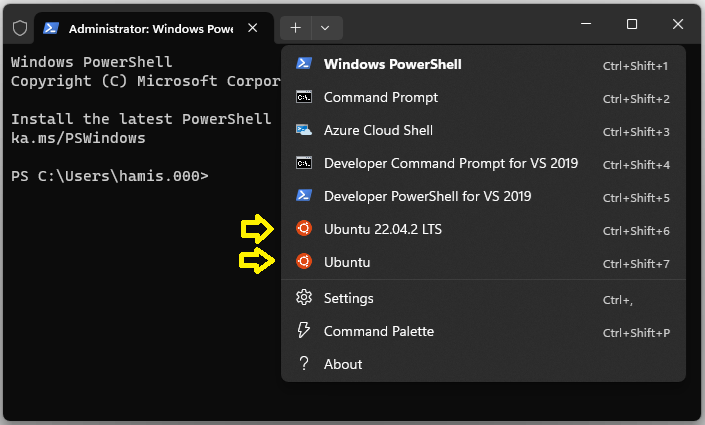

# Середовище розробки Windows (засноване на WSL2)

Наступні інструкції пояснюють як налаштувати середовище розробки PX4 на Windows 10 або 11, запущене на Ubuntu Linux у [WSL2](https://docs.microsoft.com/en-us/windows/wsl/about).

Це середовище може бути використане для збірки PX4 для:

- [Pixhawk та іншого апаратного забезпечення на основі NuttX](../dev_setup/building_px4.md#nuttx-pixhawk-based-boards)
- [Симуляції Gazebo](../sim_gazebo_gz/README.md)
- [Симуляції Gazebo Classic](../sim_gazebo_classic/README.md)
- [Симуляції jMAVSim](../sim_jmavsim/README.md)

:::tip
Ця установка підтримується командою розробників PX4.
Середовище в теорії має бути здатне збирати будь-яку ціль збірки, яку можна зібрати на Ubuntu.
Список вище - ті цілі, що були перевірені.
:::

## Загальний огляд

[Windows Subsystem для Linux](https://docs.microsoft.com/en-us/windows/wsl/about) ([WSL2](https://docs.microsoft.com/en-us/windows/wsl/compare-versions)) дозволяє користувачам встановлювати й запускати [середовище розробки Ubuntu](../dev_setup/dev_env_linux_ubuntu.md) на Windows, _майже_ так само як би його запустили на комп'ютері Linux.

В цьому середовищі розробники можуть:

- Зібрати в оболонці WSL будь-який симулятор або цільову апаратну платформу, яка підтримується [середовищем розробки Ubuntu](../dev_setup/dev_env_linux_ubuntu.md). (Ubuntu є платформою розробки PX4, яка підтримується та протестована найкраще).
- Налагоджувати код в [Visual Studio Code](dev_env_windows_wsl.md#visual-studio-code-integration) запущений на Windows.
- Спостерігати за _симуляцією_, яка запущена в WSL використовуючи _QGroundControl для Linux_. QGC для Linux автоматично під'єднується до симуляції.

_QGroundControl для Windows_ необхідна додатково, якщо потрібно:

- [Поновлення прошивки](#flash-a-flight-control-board) на реальному рухомому засобі.
- Спостерігати за справжнім засобом. Зауважте, що також можна спостерігати за симуляцією, але потрібно вручну [під'єднатися до симуляції, що запущена у WSL](#qgroundcontrol-on-windows).

:::note
Підключення до USB пристрою з WSL не підтримується, тому неможливо поновити прошивку за допомогою параметру [`upload`](../dev_setup/building_px4.md#uploading-firmware-flashing-the-board) під час збірки у командній оболонці, або з _QGroundControl для Linux_.
:::

:::note
Цей підхід схожий на встановлення PX4 на _власну_ віртуальну машину, як описано в [інструментарії на VM Windows](../dev_setup/dev_env_windows_vm.md). Перевага WSL2 полягає в тому, що її віртуальна машина глибоко інтегрована в Windows, керується системою та оптимізована для ефективності.
:::

## Встановлення

### Встановлення WSL2

Щоб встановити WSL2 з Ubuntu на новій установці Windows 10 або 11:

1. Переконайтеся, що функція віртуалізації увімкнена в BIOS вашого комп'ютера. Зазвичай її називають "Virtualization Technology", "Intel VT-x" чи "AMD-V" відповідно.
1. Відкрийте _cmd.exe_ від імені адміністратора. Це можна зробити натиснувши кнопку "Пуск", надрукувати `cmd`, натиснути правою кнопкою миші на пункті _Command prompt_ та обрати **Run as administrator**.
1. Виконайте наступні команди для встановлення WSL2 та певної версії Ubuntu:

   - Версія за замовчуванням (Ubuntu 22.04):

     ```sh
     wsl --install
     ```

   - Ubuntu 20.04 ([Симуляція Gazebo-Classic](../sim_gazebo_classic/README.md))

     ```sh
     wsl --install -d Ubuntu-20.04
     ```

   - Ubuntu 22.04 ([Симуляція Gazebo](../sim_gazebo_gz/README.md))

     ```sh
     wsl --install -d Ubuntu-22.04
     ```

:::note
Ви також можете встановити[Ubuntu 20.04](https://www.microsoft.com/store/productId/9MTTCL66CPXJ) та [Ubuntu 22.04](https://www.microsoft.com/store/productId/9PN20MSR04DW) з магазину застосунків, який дозволяє видалити програму за допомогою звичайної функції Windows Додати/Видалити: ::

1. WSL запитає про ім'я користувача та пароль для встановлення Ubuntu. Запишіть ці облікові дані, оскільки вони знадобляться пізніше!

Тепер командний рядок є терміналом в нововстановленому середовищі Ubuntu.

### Відкриття оболонки WSL

Всі операції для встановлення та збірки PX4 повинні бути виконані в оболонці WSL (можна використати ту саму оболонку в якій встановлювалася WSL2 або відкрити нову).

Якщо ви використовуєте [Windows Terminal](https://learn.microsoft.com/en-us/windows/terminal/install) ви можете відкрити консоль у встановленому WSL середовищі, як показано, та вийти з нього, закривши вкладку.



Щоб відкрити оболонку WSL за допомогою командного рядка:

1. Відкрийте командний рядок:

   - Натисніть кнопку Windows **Пуск**.
   - Введіть `cmd` і натисніть **Enter**, щоб відкрити консоль.

1. Щоб запустити WSL і отримати доступ до WSL оболонки, виконайте команду:

   ```sh
   wsl -d <distribution_name>
   ```

   Наприклад:

   ```sh
   wsl -d Ubuntu
   ```

   ```sh
   wsl -d Ubuntu-20.04
   ```

   Якщо у вас тільки одна версія Ubuntu, ви можете просто використати `wsl`.

Введіть наступні команди, щоб спочатку закрити WSL оболонку, а потім завершити WSL:

```sh
exit
wsl -d <distribution_name> --shutdown
```

Як варіант, після введення `exit` можна просто закрити консоль.

### Встановлення інструментарію PX4

Далі ми завантажуємо вихідний код PX4 у середовищі WSL2 і використовуємо звичайний _скрипт встановлювання для Ubuntu_ для налаштування середовища розробника. Це встановить інструментарій для симуляції Gazebo Classic, JMAVSim та апаратного забезпечення Pixhawk/NuttX.

Щоб встановити інструментарій розробки:

1. [Відкрийте оболонку WSL2](#opening-a-wsl-shell) (якщо вона ще відкрита, ви можете використати ту саму що для встановлення WSL2).
1. Виконайте команду `cd ~` для переходу в домашню директорію WSL для подальших кроків.

   :::warning
Це важливо!
Якщо ви працюєте за межами файлової системи WSL, то ви стикнетесь з такими проблемами, як дуже повільне виконання та помилки прав доступу/дозволів.
:::

1. Завантажте вихідний код PX4 за допомогою `git` (вже встановлений у WSL2):

   ```sh
   git clone https://github.com/PX4/PX4-Autopilot.git --recursive
   ```

:::note
Скрипти налаштування середовища у вихідному коді зазвичай працюють для останніх релізів PX4. Якщо ви працюєте зі старішою версією PX4, то може знадобитися [отримати вихідний код для конкретного релізу](../contribute/git_examples.md#get-a-specific-release).
:::

1. Запустіть скрипт встановлення **ubuntu.sh** і зробіть вибір у будь-яких підказках по ходу виконання скрипту:

   ```sh
   bash ./PX4-Autopilot/Tools/setup/ubuntu.sh
   ```

:::note
Це встановить інструменти для збірки PX4 для Pixhawk, Gazebo Classic та JMAVSim:

   - Також можна використовувати опції `--no-nuttx` та `--no-sim-tools`, щоб пропустити встановлення інструментів для NuttX та/або симуляції.
   - Інші цілі збірки Linux не перевірені (ви можете спробувати їх, ввівши відповідні команди у [середовищі розробки Ubuntu](../dev_setup/dev_env_linux_ubuntu.md) в оболонці WSL).
:::

1. Перезапустіть "комп'ютер WSL" після завершення скрипту (вийти з оболонки, вимкнути WSL та перезапустити WSL):

   ```sh
   exit
   wsl --shutdown
   wsl
   ```

1. Перейдіть в репозиторій PX4 в домашній директорії WSL:

   ```sh
   cd ~/PX4-Autopilot
   ```

1. Зберіть ціль PX4 SITL та перевірте середовище:

   ```sh
   make px4_sitl
   ```

Для додаткових варіантів збірки дивіться [Збірка програмного забезпечення PX4](../dev_setup/building_px4.md).

## Інтеграція з Visual Studio Code

VS Code на Windows добре інтегрований з WSL.

Для налаштування інтеграції:

1. [Завантажте](https://code.visualstudio.com/) і встановіть Visual Studio Code (VS Code) на Windows.
2. Відкрийте _VS Code_.
3. Встановіть розширення під назвою [Remote - WSL](https://marketplace.visualstudio.com/items?itemName=ms-vscode-remote.remote-wsl) (з магазину)
4. [Відкрийте оболонку WSL](#opening-a-wsl-shell)
5. У WSL оболонці перейдіть у директорію PX4:

   ```sh
   cd ~/PX4-Autopilot
   ```

6. В оболонці WSL запустіть VS Code:

   ```sh
   code .
   ```

   Це відкриє IDE повністю інтегроване в WSL оболонку.

   Переконайтеся, що ви завжди відкриваєте PX4 репозиторій у режимі Remote WSL.

7. Наступного разу, коли ви захочете розробляти у WSL2, ви легко зможете відкрити його знову в режимі Remote WSL, обравши **Open Recent** (як показано нижче). Це запустить WSL.

   

   Зверніть увагу, що IP-адреса віртуальної машини WSL буде змінена, так що ви не зможете контролювати симуляцію з QGC для Windows (ви все ще можете використовувати QGC для Linux)

## QGroundControl

Для підключення до запущеної симуляції, ви можете запустити QGroundControl або в WSL або у Windows. Якщо вам потрібно [завантажити у плату керування польотом](#flash-a-flight-control-board) нову прошивку, ви можете зробити це лише у QGroundControl для Windows.

### QGroundControl у WSL

Найпростіший спосіб налаштувати та використовувати QGroundControl - це завантажити версію для Linux у WSL.

Це можна зробити з оболонки WSL.

1. У браузері перейдіть в [розділ завантажень для Ubuntu](https://docs.qgroundcontrol.com/master/en/getting_started/download_and_install.html#ubuntu) QGC
1. Клацніть правою кнопкою миші на посилання **QGroundControl.AppImage**  та виберіть "Копіювати адресу посилання". Це буде щось на зразок _https://d176td9ibe4jno.cloudfront.net/builds/master/QGroundControl.AppImage_
1. [Відкрийте оболонку WSL](#opening-a-wsl-shell) і введіть наступні команди щоб завантажити AppImage та зробити його виконуваним (замінить URL до AppImage, де зазначено):

   ```sh
   cd ~
   wget <the_copied_AppImage_URL>
   chmod +x QGroundControl.AppImage
   ```

1. Запустіть QGroundControl:

   ```sh
   ./QGroundControl.AppImage
   ```

QGroundControl запуститься та автоматично приєднається до запущеної симуляції, що дозволить вам спостерігати та контролювати ваші рухомі засоби.

Ви не зможете використовувати його для встановлення прошивки PX4, оскільки WSL не надає доступу до послідовних пристроїв.

### QGroundcontrol на Windows

Install [QGroundControl on Windows](https://docs.qgroundcontrol.com/master/en/getting_started/download_and_install.html#windows) if you want to be able to update hardware with firmware created within PX4.

These steps describe how you can connect to the simulation running in the WSL:

1. [Open a WSL shell](#opening-a-wsl-shell)
2. Check the IP address of the WSL virtual machine by running the command `ip addr | grep eth0`:

   ```sh
   $ ip addr | grep eth0

   6: eth0: <BROADCAST,MULTICAST,UP,LOWER_UP> mtu 1500 qdisc mq state UP group default qlen 1000
       inet 172.18.46.131/20 brd 172.18.47.255 scope global eth0
   ```

   Copy the first part of the `eth0` interface `inet` address to the clipboard. In this case: `172.18.46.131`.

3. In QGC go to **Q > Application Settings > Comm Links**
4. Add a UDP Link called "WSL" to port `18570` of the IP address copied above.
5. Save it and connect to it.

:::note
You will have to update the WSL comm link in QGC every time WSL restarts (because it gets a dynamic IP address).
:::

## Flash a Flight Control Board

Flashing a custom built PX4 binary has to be done using [QGroundControl for Windows](#qgroundcontrol-on-windows) since WSL2 does not natively offer direct access to serial devices like Pixhawk boards.

Do the following steps to flash your custom binary built in WSL:

1. If you haven't already build the binary in WSL e.g. with a [WSL shell](dev_env_windows_wsl.md#opening-a-wsl-shell) and by running:

   ```sh
   cd ~/PX4-Autopilot
   make px4_fmu-v5
   ```

   Note: Use the correct target for your board. "px4_fmu-v5" can be used for a Pixhawk 4 board.

1. Detach the USB cable of your Pixhawk board from the computer if it was plugged.
1. Open QGC.
1. In QGC go to **Q > Vehicle Setup > Firmware**
1. Plug your pixhawk board via USB
1. Once connected select "PX4 Flight Stack", check "Advanced settings" and choose "Custom firmware file ..." from the drop down below.
1. Continue and select the firmware binary you just built before. In the open dialog look for the "Linux" location with the penguin icon in the left pane. It's usually all the way at the bottom. Choose the file in the path: `Ubuntu\home\{your WSL user name}\PX4-Autopilot\build\{your build target}\{your build target}.px4`

   :::note
You can add the folder to the favourites to access it quickly next time.
:::

1. Start the flashing.

## Troubleshooting

If you have any problems with your setup, check the current [Microsoft WSL installation documentation](https://learn.microsoft.com/en-us/windows/wsl/install).

We also recommend that you have the latest Windows GPU drivers installed and also install a recent version of [kisak mesa](https://launchpad.net/~kisak/+archive/ubuntu/kisak-mesa) in your Ubuntu environment so that most OpenGL features get emulated:

```sh
sudo add-apt-repository ppa:kisak/kisak-mesa
sudo apt update
sudo apt upgrade
```
